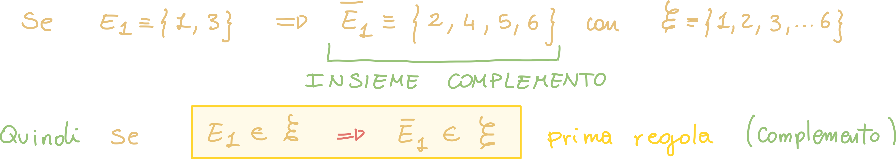
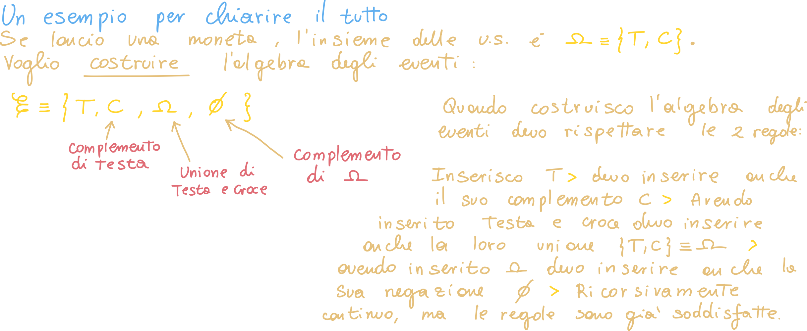

# Teoria della probabilità

Per comprendere la teoria della probabilità possiamo iniziare proprio con un **esperimento aleatorio**, ovvero il **lancio della moneta**:

Quando lanciamo una moneta non è possibile in al cun modo prevedere il risultato, perchè ogni evento non dipende dal risultato precedente. In questo tipo di esperimento abbiamo **2 possibili risultati**: *Testa o Croce*.

Allo stesso modo, quando lanciamo un dato abbiamo **6 possibili risultati**: *{1, 2, 3, 4, 5, 6}*.

## Insieme delle uscite sperimentali finito

L'insieme di tutte le **uscite sperimentali possibili** viene detto **Spazio dei campioni**, e si indica con **omega**:

- Per la moneta: Ω = {T, C}

- Per il dado: Ω = {1, 2, 3, 4, 5, 6}

## Insieme delle uscite sperimentali infinito

Non è detto che omega sia sempre **finito**: supponiamo di lanciare una moneta **finchè non si ottiene testa**; in questo caso quali saranno le **uscite sperimentali**?

In questo caso Ω è un **insieme infinito**, perchè possiamo avere anche infinite uscite, che si traduce in: "esce sempre croce". 
Questo tipo di infinito è un "infinito particolare": se consideriamo l'insieme dei numeri naturali N, questo è un insieme detto **numerabile**, perchè possiamo iterare sui suoi elementi **singolarmente**, anche se essi sono infiniti.

Se invece volessimo misurare, ad esempio, l'area di un foglio alla perfezione, questo non sarà possibile, perchè **tra due numeri reali ce ne sarà sempre un'altro!**

---

Gli insiemi **numerabili** (finiti o infiniti) vengono detti **discreti**; quando un insieme non è numerabile, esso è **continuo.**

## Gli eventi

**Un evento è un sottoinsieme di omega**; in altre parole, esso è un insieme di esiti (uscite) che possono verificarsi a seguito di un esperimento aleatorio.

Se consideriamo come esperimento il <u>lancio del dado</u>, tutte le uscite sperimentali saranno: Ω = {1, 2, 3, 4, 5, 6}.

Un possibile **evento** di questo esperimento è E1 = {1} oppure E2 = {4}, questi vengono detti **eventi elementari**, perchè sono composti da una singola uscita sperimentale.

Possiamo anche creare degli eventi composti da più uscite: E3 = {1, 3}; se lanciamo un dado ed esce '3', allora l'evento E3 sarà verificato.

## Costruzione del sistema della teoria della probabilità

Dobbiamo costruire il sistema della teoria della probabilità, è importante dare una struttura ben precisa ad ogni elemento; ad esempio, dobbiamo fare in modo che **l'operazione di negazione o complemento** applicata ad esempio ad un evento, dia come risultato tutti gli elementi di omega **meno quelli dell'evento**:

### Regola del complemento

### Regola dell'unione

Se due eventi appartengono alla stessa algebra degli eventi, anche la loro unione appartiene all'algebra degli eventi:

**Facciamo un esempio:**

