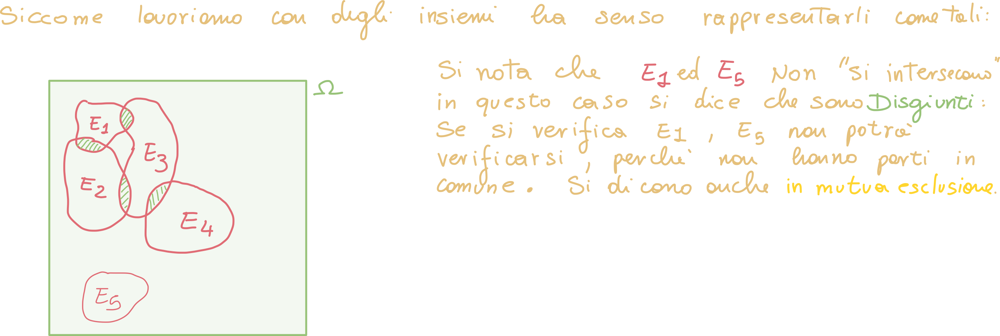
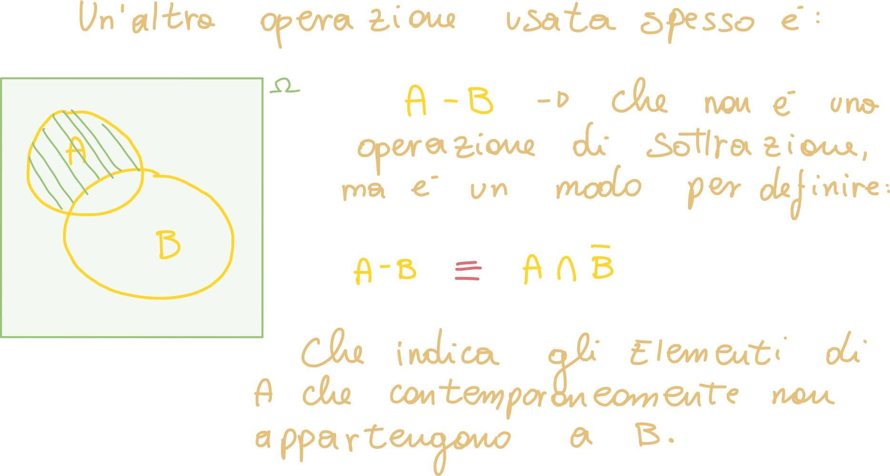
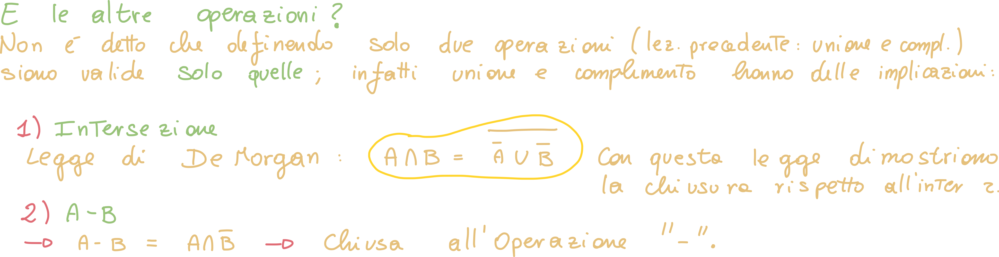
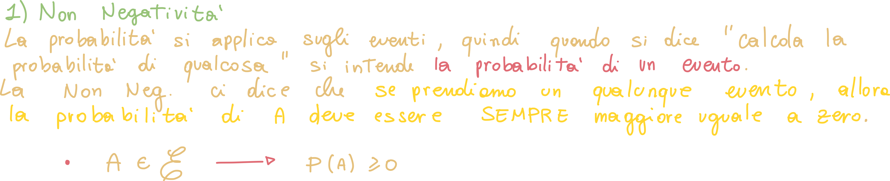
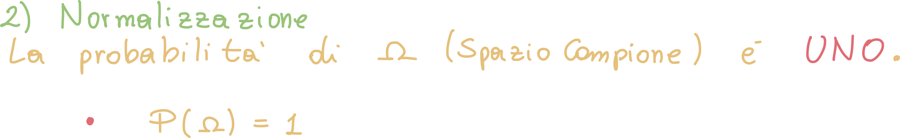
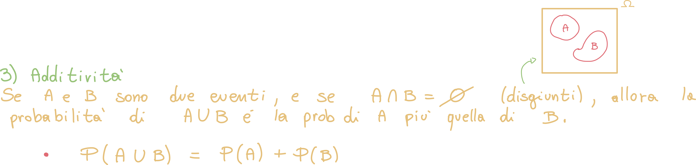
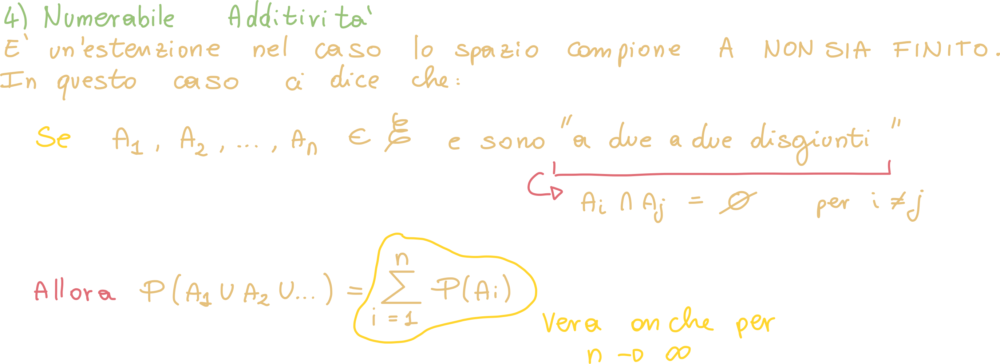

#   Operazioni sulla probabilità

## Operazioni sugli insiemi

Possiamo effettuare delle operazioni sugli eventi; siccome li rappresentiamo come degli insiemi, potremo effettuare tutte le operazioni insiemistiche anche sulla probabilità:

## A - B

Come eseguiamo l'operazione A - B?

## Altre operazioni

Possiamo derivare le restanti operazioni dalla negazione e dalla "sottrazione":

# Assiomi di Kolmogorov

Gli assiomi di Kolmogorov sono un **insieme di 3 regole** che **stabiliscono le fondamenta della probabilità**:

## Non negatività

La probabilità di un evento **deve essere SEMPRE maggiore o uguale a zero**, per cui non può essere negativo.

## Normalizzazione

La seconda regola ci da nuovamente informazioni su come dovrebbe essere il valore della probabilità di un evento; in particolare questa regola ci dice che **la probabilità di un evento non può essere maggiore di uno**.

Un evento che ha probabilità 1 è detto **evento certo**, solitamente questo evento coincide con omega, siccome tutti gli altri eventi sono sottoinsiemi di esso.

## Additività

Questa regola ci dice che se degli eventi E1, E2, En sono **disgiunti a due a due**, ovvero **non hanno elementi in comune**, allora la **probabilità dell'unione degli eventi** è la **somma** delle probabilità individuali degli eventi:

Possiamo **estendere questo ragionamento** ad n eventi:

