# Eventi indipendenti

Due eventi sono **indipendenti** se il verificarsi del primo evento **non condiziona** il varificarsi del secondo evento. 

## Come verificare l'indipendenza di due eventi

Se la **probabilità dell'intersezione** tra due eventi è uguale al **prodotto delle singole probabilità degli eventi** allora i due eventi sono indipendenti.

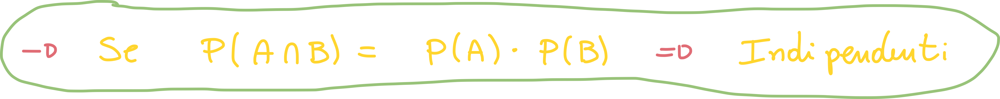

# Probabilità condizionata

Sulla scia di quanto detto nella sezione precedente, la probabilità condizionata tra due eventi (A condizionato a B) è la **probabilità che si verifichi B dopo che si è verificato A**:

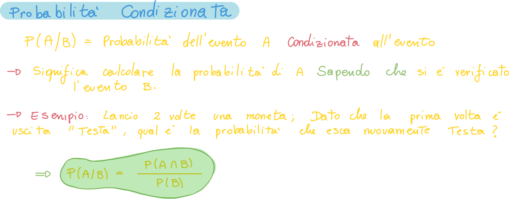

## Cosa succede se i due eventi sono disgiunti?

Se proviamo a calcolare che si verifichi l'evento A dopo che si è verificato B, ed i due eventi sono disgiunti, possiamo scrivere A intersecato B come la probabilità di A per quella di B, e quindi:

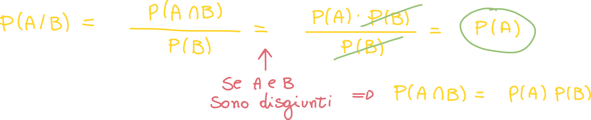

## Esempio di probabilità condizionata: lancio di due dadi

Consideriamo il lancio di due dadi ed i due eventi E1 ed E2:

Dobbiamo verificare che i due eventi siano indipendenti; dobbiamo quindi verificare che la probabilità dell'intersezione dei due eventi è uguale al prodotto delle due probabilità:

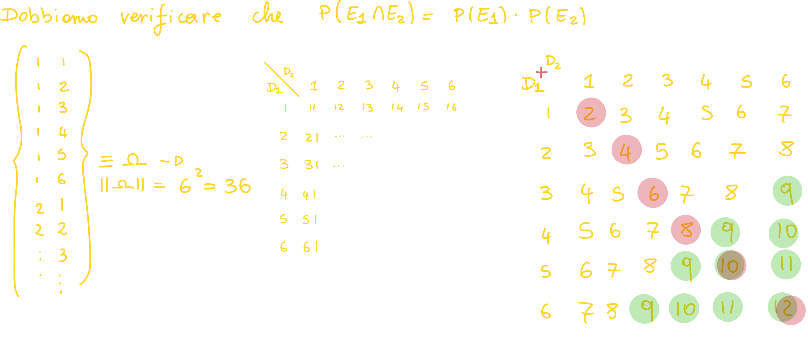

A questo punto ci basta calcolare la probabilità di A e B, siccome le uscite sono equiprobabili il calcolo è semplice:

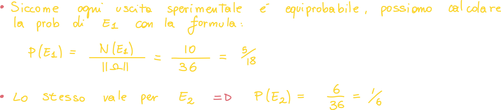

L'intersezione tra i due eventi equivale a calcolare la probabilità dell'evento: {"La somma dei risultati è maggiore di otto ed i due risultati sono uguali"}

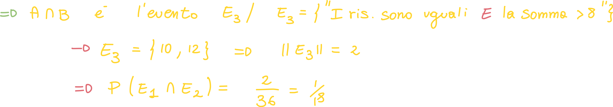

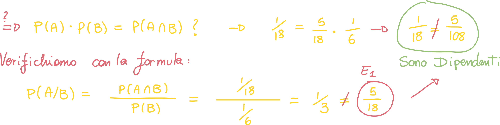

## Esempio di probabilità condizionata: Sottoinsiemi

Proviamo a calcolare la probabilità che avvenga B dopo che è avvenuto A, con la precondizione che B è un sottoinsieme di A:

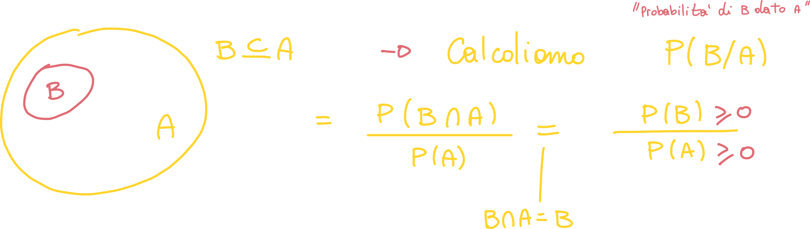

Sappiamo che la probabilità di omega è 1, siccome B è contenuto in A che è contenuto in omega, sappiamo che la probabilità di B è **minore** della probabilità di A:

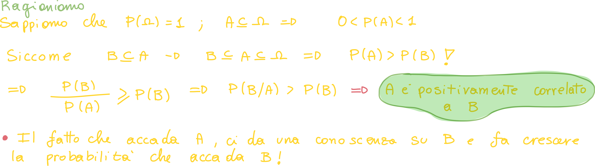

## Esempio di probabilità condizionata: evento certo

Se prendiamo l'esempio precedente e proviamo a calcolare l'opposto, sappiamo che la probabilità che avvenga A dopo che è avvenuto B è certa!

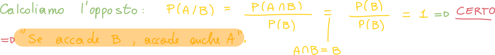

# Probabilità composta - Legge di Bayes

La legge della probabilità composta ci dice **come calcolare la probabilità dell'intersezione degli eventi A e B**, ovvero la **probabilità che entrambi gli eventi si verifichino contemporaneamente**; procediamo per step:

## Step 1 - Regola della moltiplicazione

Ci scriviamo la probabilità dell'intersezione come la probabilità condizionata degli eventi moltiplicata per la probabilità del secondo evento:

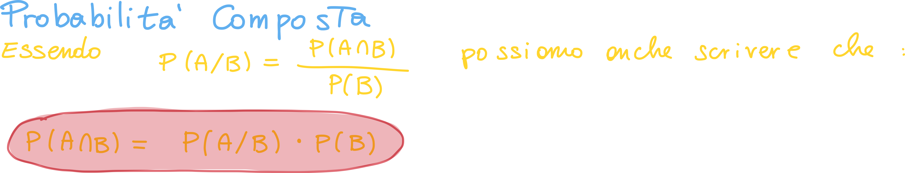

Questa regola è nota come **legge della moltiplicazione**, che ci dice come scrivere l'intersezione tra due eventi.

## Step 2

Possiamo fare lo stesso ragionamento al contrario:

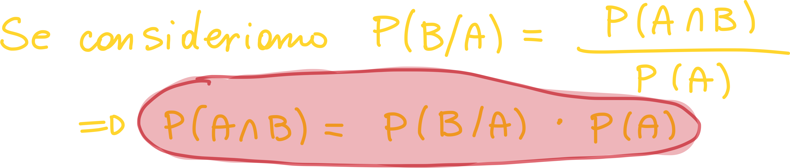

## Step 3: mettiamo tutto insieme

Mettendo insieme quello che abbiamo scoperto finora, possiamo scrivere la probabilità dell'intersezione tra A e B nei seguenti modi:

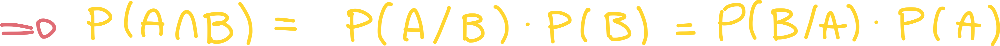

Se ci isoliamo la **probabilità di A dato B**, otteniamo la **legge di Bayes per la probabilità composta**:

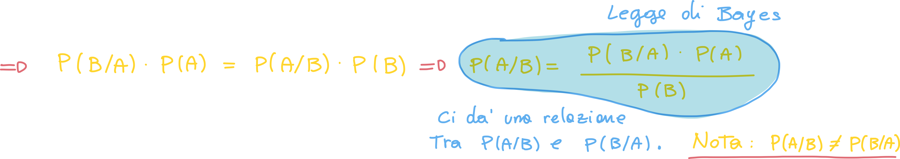

