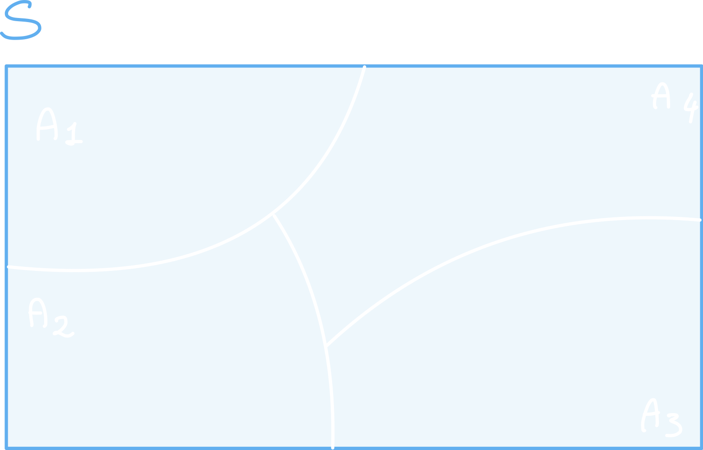
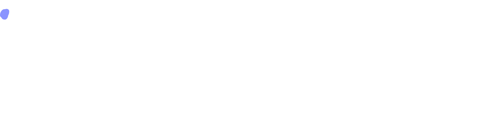
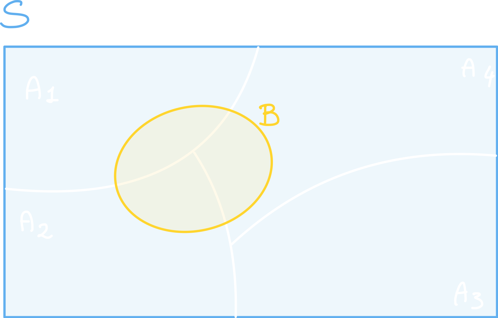
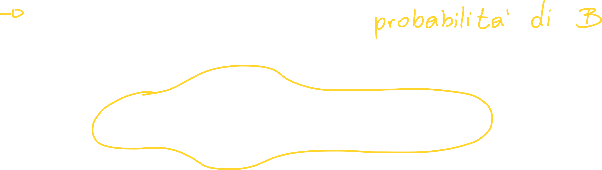
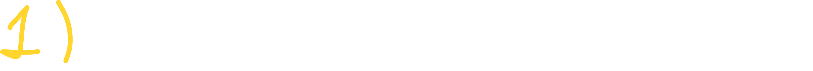
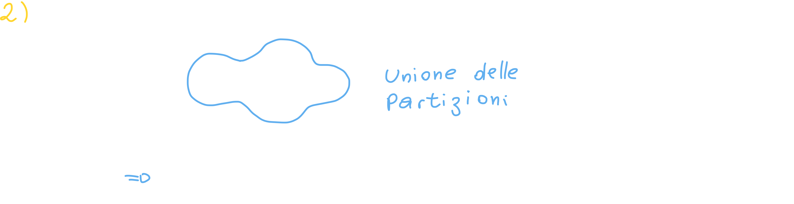
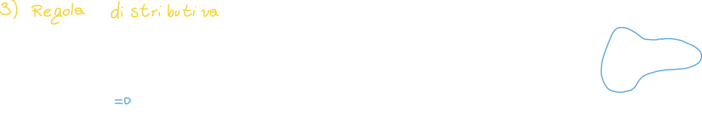
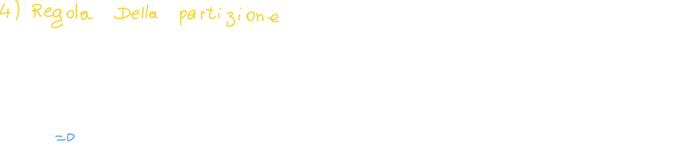
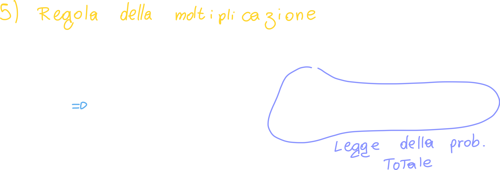

# Teorema della probabilità totale

[TOC]

Questo teorema ci **permette di calcolare la probabilità di un evento composto da più *sottoeventi* o *sottogruppi***. Questa tecnica è molto utile nel momento in cui dobbiamo calcolare la probabilità di un evento particolarmente difficile da calcolare direttamente; per questo motivo **scomponiamo il problema** in sottoproblemi, e ne risolviamo uno alla volta.

## Enunciazione del teorema della probabilità totale

Siano A1, A2, An **un insieme** di eventi che **partizionano** uno spazio degli eventi S e che le singole probabilità sono maggiori di zero...

Che cosa vuol dire che questi eventi <u>partizionano</u> uno spazio degli eventi??
Lo spazio degli eventi è lo spazio che **racchiude tutti** gli eventi di un esperimento; gli eventi partizionano uno spazio se si verificano queste due condizioni:

1. L'unione degli eventi ci restituisce S:
   

2. L'intersezione degli eventi è l'insieme vuoto:

   

   

Per **un evento qualsiasi B** che andiamo a "disegnare" in S...

Possiamo scrivere la probabilità del nuovo evento B come:

### Consiglio sugli esercizi

Spesso negli esercizi la risposta viene calcolata sia tramite la probabilità totale sia tramite Bayes; prima dovremo trovare la probabilità che ci interessa tramite la probabilità totale, poi scriverci la probabilità condizionata tramite Bayes.

## Dimostrazione del teorema della probabilità totale

Per dimostrare questo teorema procediamo per step:

### Step 1: asserto

Sappiamo che la probabilità di B può essere calcolata con la probabilità dell'intersezione tra B e l'insieme spazio degli eventi S:

### Step 2: Partizionamento

Abbiamo detto quando abbiamo spiegato il teorema, che lo spazio degli eventi viene **partizionato**, quindi possiamo scrivere S come **partizione**:

### Step 3: Regola distributiva

Possiamo a questo punto distribuire l'intersezione all'interno dell'operazione di unione delle partizioni:

### Step 4: Regola della partizione

Possiamo scriverci la probabilità dell'unione di due eventi come **la somma** delle singole probabilità:

### Step 5: Regola della moltiplicazione

Possiamo scriverci l'intersezione tramite la probabilità condizionata (vista nella lezione 2.03,  regola della moltiplicazione):

