## Piccolo Recap

[TOC]

Nella lezione precedente abbiamo visto una particolare funzione che si definisce a partire dalla variabile aleatoria, in particolare abbiamo definito la **funzione di distribuzione cumulativa** (CDF).
Abbiamo visto che nel caso di variabili aleatorie **discrete** (il cui alfabeto è discreto, ovvero finito o numerabile) la funzione ha sempre un andamento del tipo **Costante a tratti**:

> Insieme finito

> Insieme infinito numerabile

Queste variabili aleatorie sono caratterizzate dal fatto di avere una CDF che non è più **costante a tratti** (come nelle immagini precedenti).
Inoltre, CDF vale sempre **zero** per x --> -∞, vale sempre **uno** per x --> +∞ ed è una funzione che **non potrà mai decrescere**: questo perchè è un **cumulo di probabilità**, e visto che le probabilità sono sempre ≥ 0, non potrà mai decrescere.

## Proprietà della CDF

- Fx(-∞) = 0
- Fx(+∞) = 1
- Fx(x) è una **funzione non decrescente**
- Fx(x) = è continua **da destra**: i valori che assume sono continui da destra, mentre a sinistra può avere salti di discontinuità come abbiamo visto nei grafici precedenti:

# CDF Continua Uniforme

E' possibile definire queste CDF direttamente, senza dover passare per l'esperimento, ma esistono, sulla base di **esperimenti reali**, alcuni casi di CDF:

Questo è proprio il caso della **CDF Continua uniforme** in un certo intervallo (a,b).

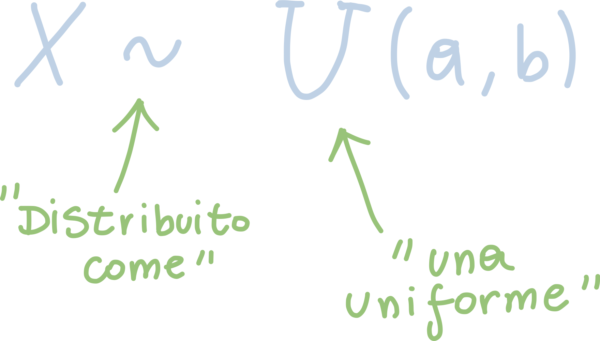

> La variabile aleatoria è uniforme nell'intervallo a -> b

Dal punto di vista grafico abbiamo:

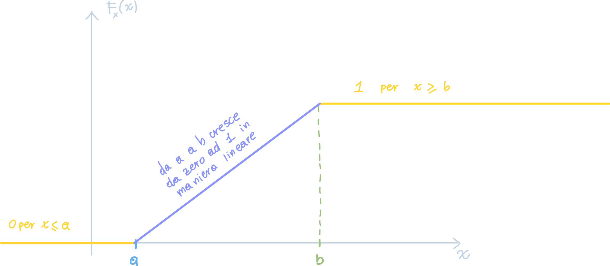

Per tradurre il tutto in formule, dobbiamo prima trovare la funzione della retta tra a e b (ovvero quella in viola):

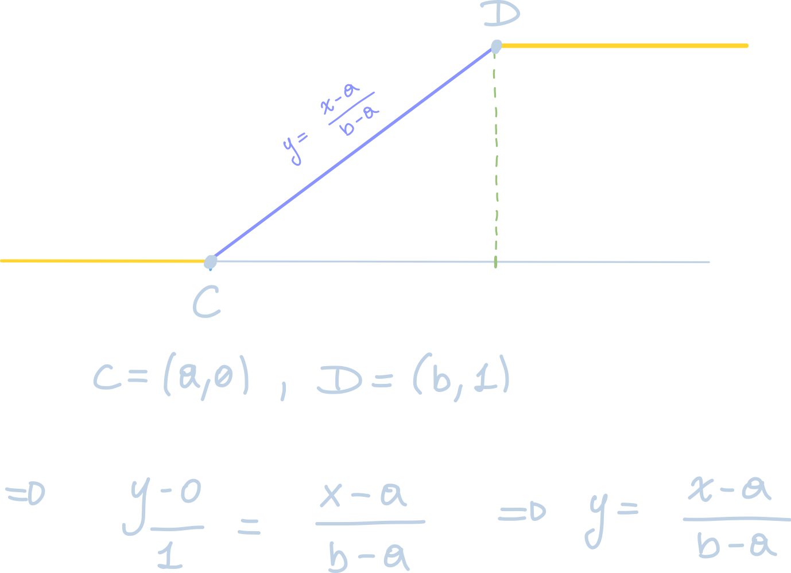

Successivamente possiamo scrivere le tre formule:

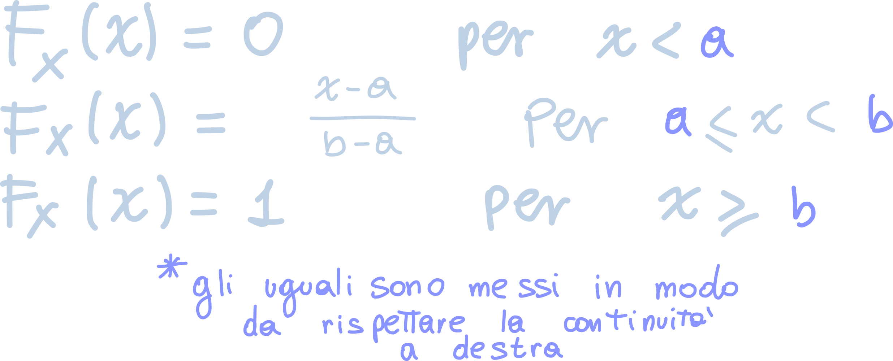

> Questo tipo di variabile aleatoria modella esperimenti in cui la probabilità di un evento non dipende dal momento in cui l'evento si verifica, ma dipende **unicamente** dalla dimensione dell'evento.

Capiamo quindi che la probabilità che si verifichi un evento (ad esempio la probabilità che un viaggiatore arrivi in un determinato momento) dipende dall'ampiezza dell'intervallo di tempo, ma non dipende dove questo intervallo di tempo è allocato!

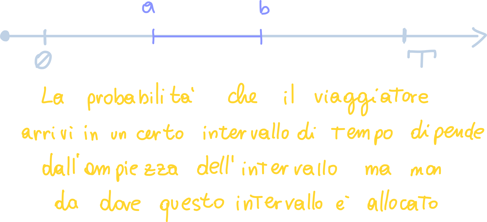

## Esperimento

Le variabili uniformi sono abbastanza comuni nel mondo reale, un esempio potrebbe essere il seguente:

Un giocatore si mette accostato ad un muro e lancia una moneta; se questa moneta tocca il muro il giocatore perde, se invece non tocca il muro, vince chi posiziona la moneta più vicino al muro.
Nel caso ipotetico in cui il giocatore getta la moneta "a caso" e questa non tocca il muro, **la distanza tra la moneta ed il muro è una variabile uniforme**.

Di variabili continue ce ne sono molte, in particolare studieremo:

- Variabile aleatoria Esponenziale
- Variabile aleatoria Gaussiana
- etc.

# Variabile Aleatoria Esponenziale

Anche in questo caso abbiamo una variabile continua dove la CDF (FX(x)) è del tipo:

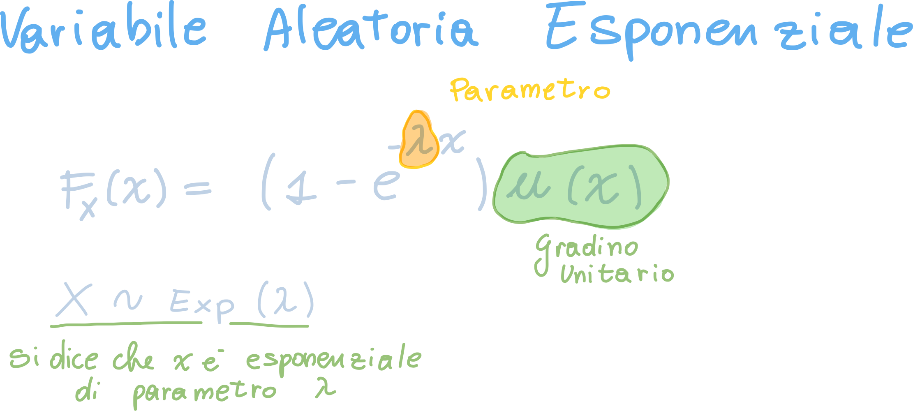

> A differenza dell'uniforme (che aveva due parametri a e b) questa variabile aleatoria ha solo un parametro

Ora, se tracciamo il grafico di e-x otteniamo il seguente grafico; è ovvio che e-x in x0=0 vale 1.

Ci accorgiamo però, che la nostra funzione **FX(x) = (1 - e-λx) u(x)** vale **zero** in  x0=0, mentre vale **uno** per x --> ∞ :

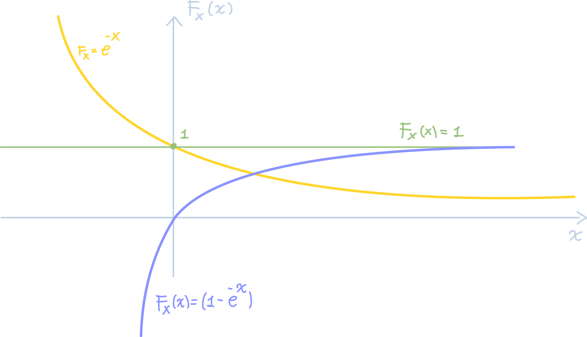

Inoltre, il pezzo `u(x)` fa sì che si debba moltiplicare la funzione per `1` quando x è maggiore di zero, e per `0 `quando la funzione è minore di zero.

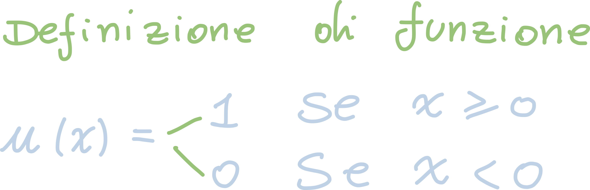

Otteniamo quindi il grafico:

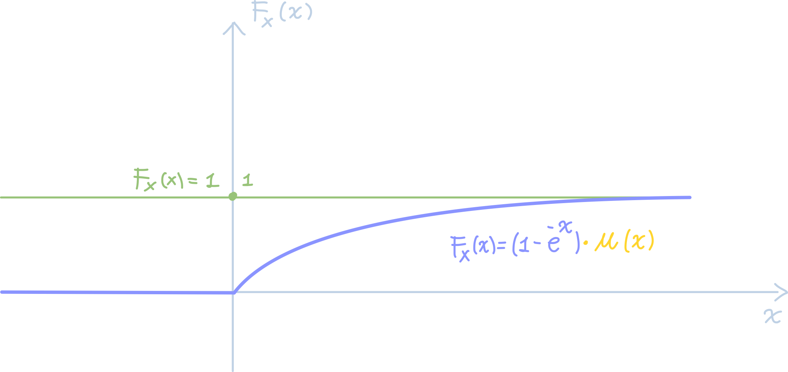

Valgono quindi le **Proprietà costitutive della CDF**

- FX(x) = 0 in (- ∞, 0)
- FX(x) = 1 per x -> +∞
- FX(x) è **non decrescente**

Ogni funzione che **rispetta** queste 3 proprietà **è legittimamente una CDF**.

---

Andiamo a definire altre due funzioni; mentre la CDF è definibile allo stesso modo sia per variabili aleatorie discrete che continue. Di queste due nuove funzioni invece, una fa riferimento alle variabili discrete, e l'altra a quelle continue.

# PMF Della variabile aleatoria Binomiale

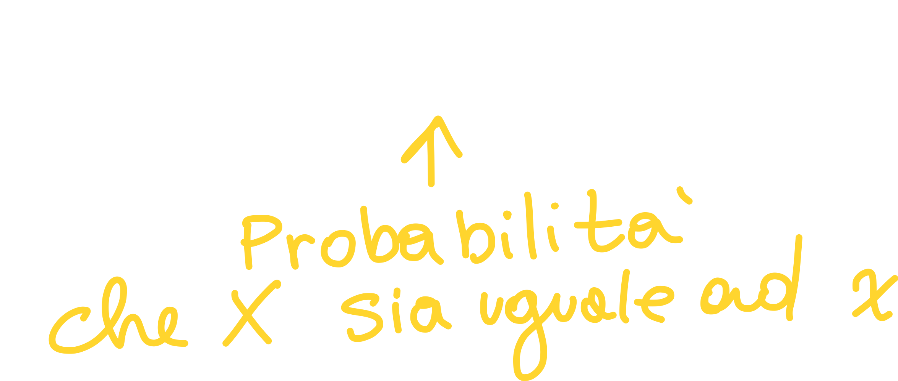

Ed è la probabilità che la X (variabile aleatoria) assuma uno dei valori del suo alfabeto (x, ovvero i valori che la variabile aleatoria può assumere); nel caso del lancio del dado è definita per i valori Ω={1, 2, 3, 4, 5, 6}. 

Nel caso del lancio del dado inoltre, tutti i valori hanno la stessa probabilità di verificarsi, ma non è questo l'unico caso!

## Variabile aleatoria Binomiale (aka Conteggio dei successi di Bernoulli)

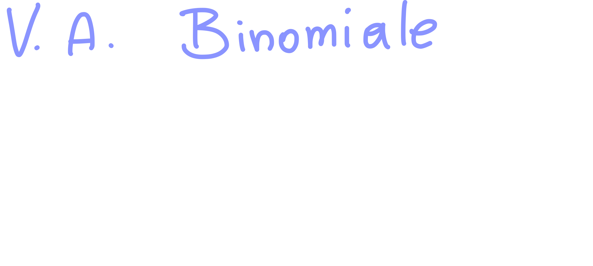

Supponiamo di lanciare una moneta per `N` volte; definiamo come `successo` il caso in cui l'uscita è testa, mentre come `insuccesso` il caso in cui l'uscita sia croce. Una volta svolto l'esperimento, costruiamo una variabile aleatoria che assume come valore il numero di volte che ci è uscito testa, ad esempio:

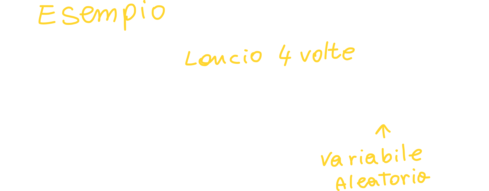

> Su 4 volte ci esce testa una sola volta

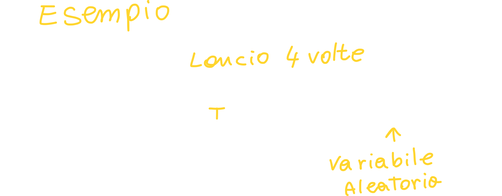

> Su 4 volte ci esce sempre testa

In quest'ultimo caso precisamente (4 teste o 4 croci su 4 lanci) ottenere 4 teste è l'unico modo di avere X = 4; è ben diverso dal caso in cui, su 4 lanci, ci interessasse avere X = 2, infatti ci sono diversi modi per ottenere che X = 2 su 4 lanci:

- {T,T,C,C}
- {T,C,T,C}
- ...

Cerchiamo di calcolare la probabilità:

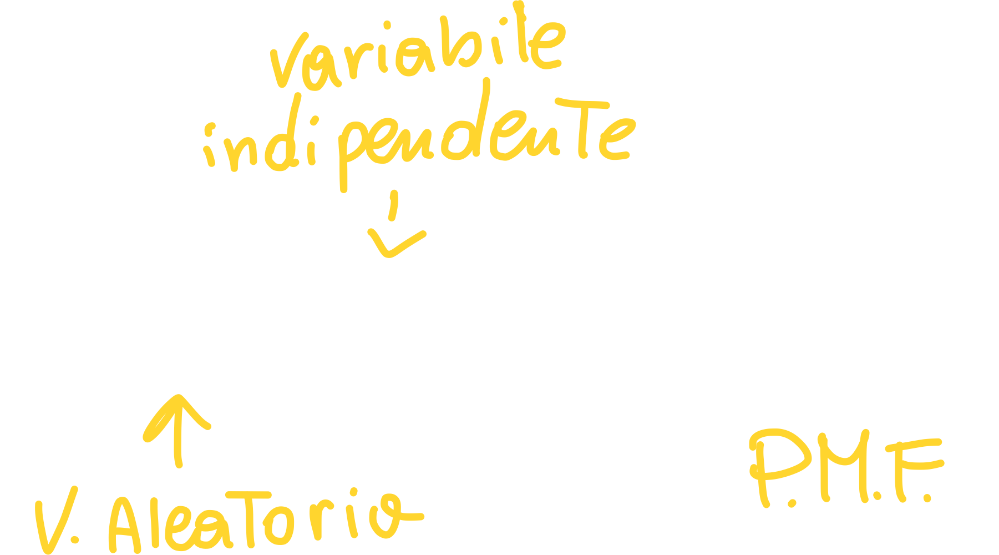

Qual è la probabilità di X = N? Ovvero qual è la probabilità di ottenere, ad esempio, 5 con 5 lanci?

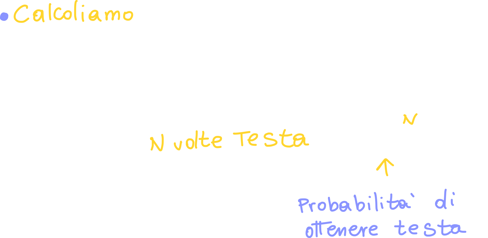

Ed invece la probabilità di ottenere testa al primo lancio e tutte croci per il resto dei lanci (N)?

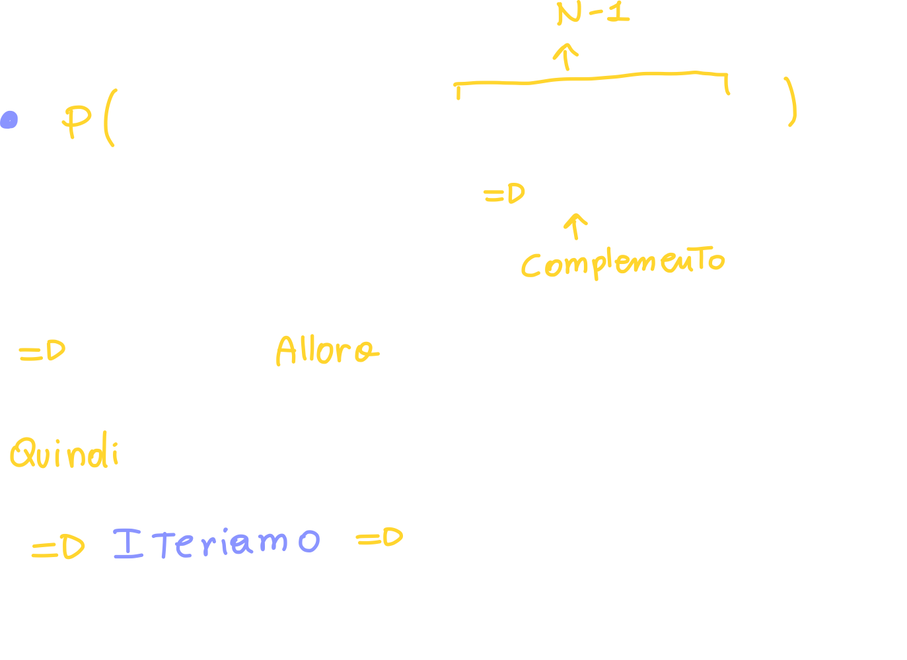

E la probabilità di avere testa ai primi due lanci e poi sempre croce?

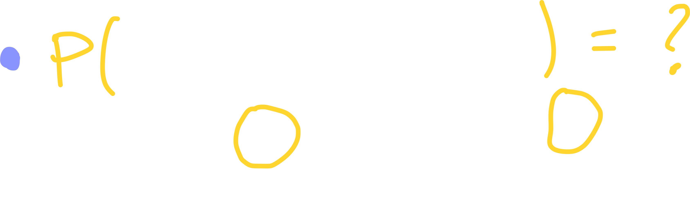

Quindi, la probabilità che **P(X = K) = pk (1 - p)N-K**

Qual è la probabilità di avere, in generale, una testa ed N-1 croci? Ovvero un successo ed N-1 insuccessi?

Capiamo bene che ci sono diversi casi possibili, perchè il nostro successo possiamo averlo al primo lancio, al secondo, al terzo... ovvero fino all'n-esimo lancio:

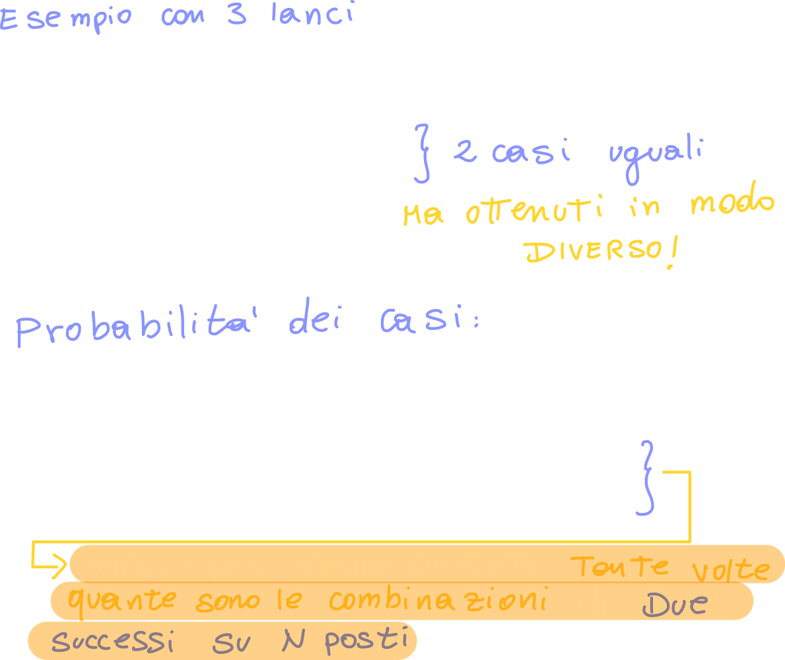

Quante sono le combinazioni?

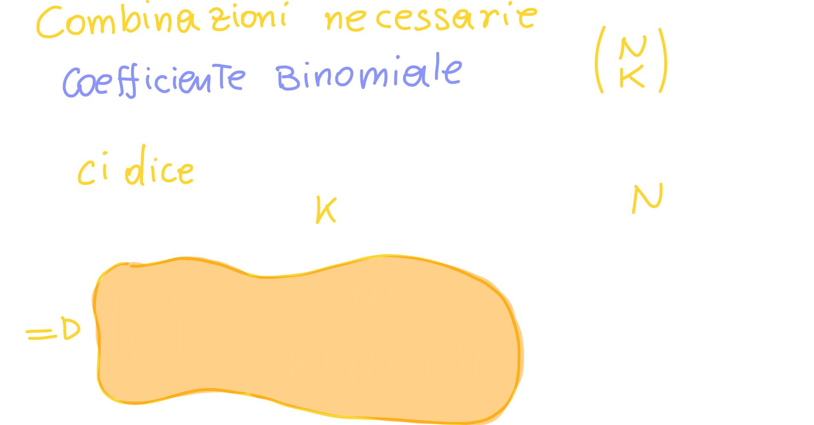

**Concludendo** come possiamo avere il **conteggio dei successi**?

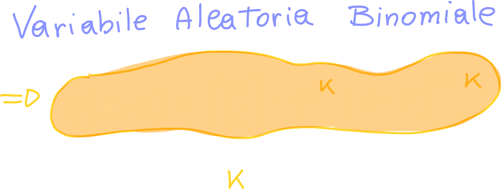

> Consideriamo k che va da zero ad N perchè possiamo avere da **zero successi** fino ad **N successi**.

---

# Variabile aleatoria di Poisson (usata in fisica)

Questa variabile aleatoria modella degli **il numero di arrivi casuali in un certo intervallo di tempo**; questa variabile è molto usata nella `teoria delle code`: se abbiamo una coda, possiamo modellare il numero di pacchetti che arrivano in una certa coda (pacchetti che vanno smaltiti/inviati).

Affinchè gli arrivi siano modellabili nel modo corretto, è necessario che valgano alcune proprietà:

- **Non possono arrivare più arrivi contemporaneamente** (devono arrivare separatamente): se siamo in una coda, due pacchetti non devono arrivare contemporaneamente.
- **Gli arrivi devono essere indipendenti**: se prendiamo due intervalli di tempo disgiunti, gli arrivi che abbiamo in certo intervallo **non dipendono / sono indipendenti** dall'altro intervallo di tempo.
- ...

Poisson ha definito la variabile aleatoria sulla base di un'equazione differenziale, che definisce le probabilità di avere un **certo numero di arrivi in un certo intervallo di tempo**

## Equazioni differenziali Stocastiche

Una volta definite le proprietà dell'evento fisico che vado a modellare (l'equazione modella il fenomeno statistico/fisico), poichè l'incognita risultante è una **funzione** ([vedi equazioni differenziali](https://github.com/follen99/Analisi/blob/main/Appunti/2.01%20-%20Equazioni%20Differenziali/Lezione%2033.pdf)) che ha delle caratteristiche di una PMF, allora la **soluzione all'equazione differenziale** è proprio la PMF (funzione).

In generale, le PMF devono **soddisfare un'equazione differenziale**, che tramite risoluzione, ci fa "trovare" la PMF stessa.

---

## PMF della distribuzione di Poisson

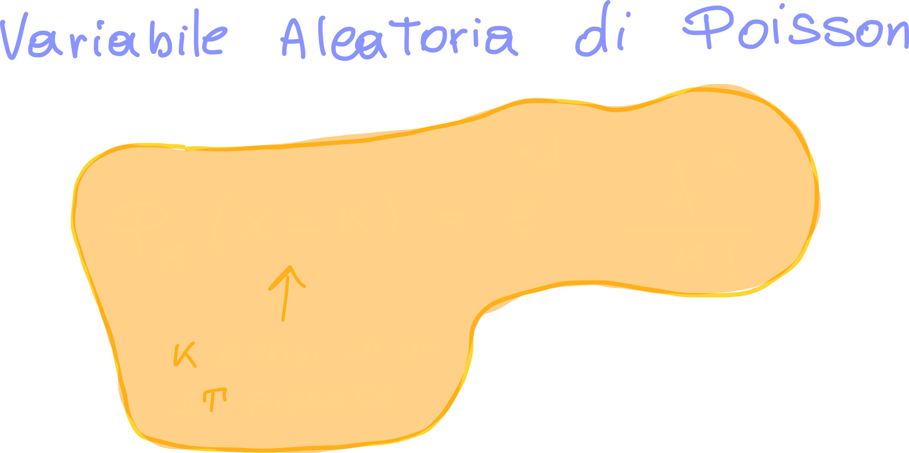

Matlab ci permette di visualizzare in modo chiaro diversi esperimenti di tipo probabilistico, tra cui le PMF, PDF; ci consente quindi di fare cose molto interessanti.

k va da 0 ad infinito, quindi i valori sull'asse delle x sono definiti per tutti i punti da 0 ad infinito.

Quando andiamo a definire una **CDF** andiamo a **cumulare** delle probabilità; quando definiamo le **PMF** non si parla di cumulazione, ma di veri e propri **salti** di probabilità (non cumulati); questo vuol dire che la forma di tutti i salti di probabilità che otteniamo nelle CDF ci dovrebbe portare ad 1 (la CDF tende ad 1).

Essendo quelli della PMF dei salti di probabilità (ogni "calcolo" ci restituisce la probabilità che x assuma valore k), la somma di tutti i "calcoli" dovrebbe proprio restituirci 1:

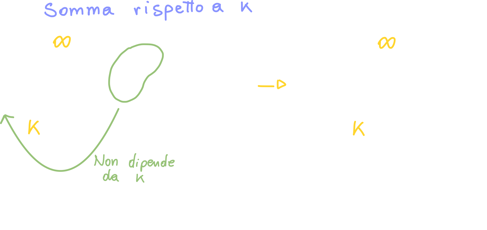

Se ricordiamo l'espansione in serie di Taylor / Mc Laurin di **ex** notiamo che corrisponde proprio a...

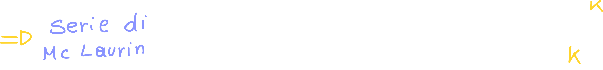

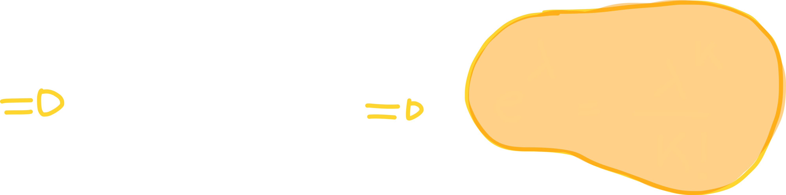

Questo ci permette di scrivere:

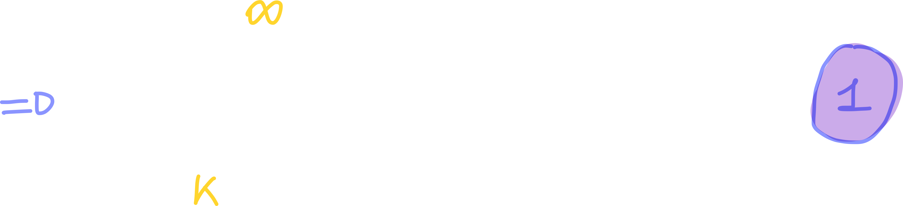

In questo modo riusciamo a dimostrare che anche in questo caso la somma di tutti i "salti" è proprio 1.

# PMF vs CDF

La differenza sostanziale tra PMF e CDF è la seguente:
Mentre **la PMF fornisce la probabilità che la variabile assuma un determinato valore**, la CDF fornisce la probabilità che la variabile assuma **un valore inferiore o uguale** al valore in questione x.

Inoltre, la PMF è una funzione che associa una probabilità per ciascun valore discreto della variabile, mentre la CDF associa la probabilità cumulativa di **tutti** i valori inferiori o uguali della variabile aleatoria.

La PMF nel punto k equivale al salto di discontinuità della CDF:

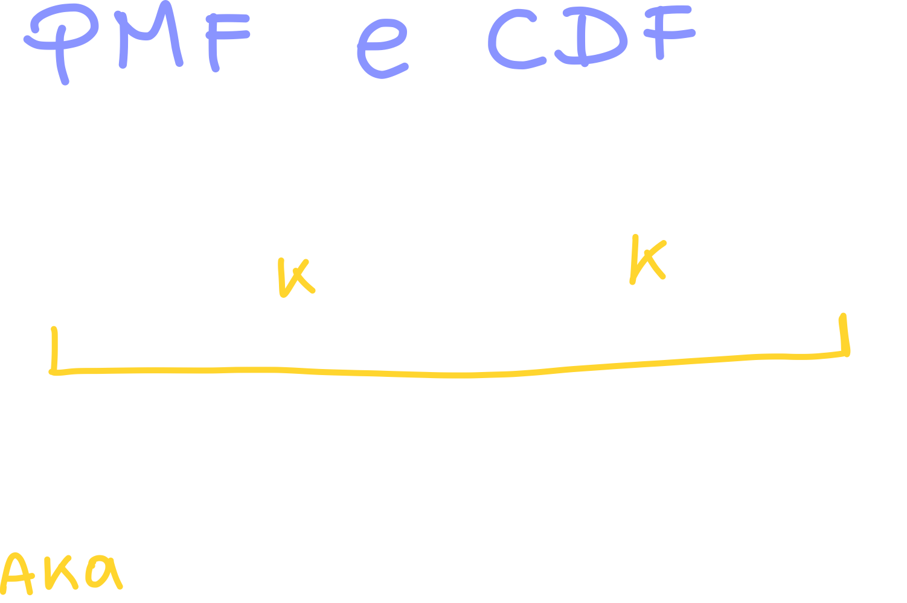

> È una sorta di **derivata discreta**; questo concetto apre le porte alla definizione di PDF, che è un qualcosa di simile applicato però **alla continuità**, e non al discreto.
>
> La PDF è definita proprio come la **derivata prima** della CDF.

Se volessimo calcolare la derivata della CDF otterremmo:

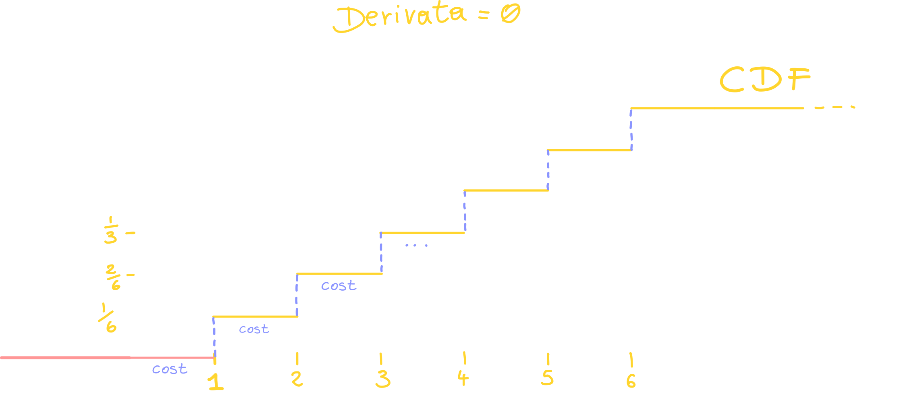

> La derivata dei segmenti **costanti** è sicuramente zero

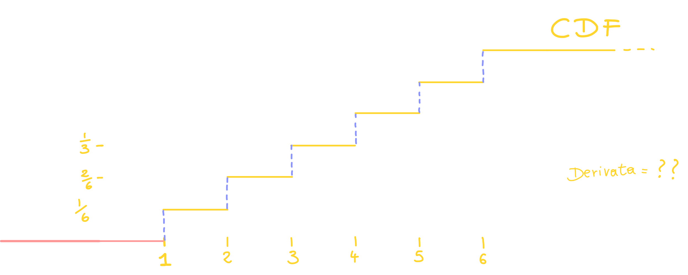

> Per quanto riguardi i punti di discontinuità la funzione non è derivabile!

**Quindi**
Derivando la CDF otterremmo una funzione che è **sempre zero**, infatti `non avrebbe molto senso`.
Se invece **deriviamo una funzione continua**, che per definizione è derivabile in tutti i suoi punti, otterremo sicuramente una derivata (sensata!) in ogni punto, che corrisponde alla **pendenza** della curva in quel punto (che ci dice molto!).

`È proprio per questo motivo che non possiamo usare la stessa definizione sia per contesti discreti che continui.` 

