# Piccolo Recap

## La variabile aleatoria

Abbiamo visto come sia possibile definire uno **spazio di probabilità**, sul quale possiamo costruire un modello matematico particolarmente utilizzato nella **pratica**, ovvero la **variabile aleatoria**.

A partire dallo spazio dei campioni Ω (in cui sono presenti diverse uscite sperimentali) possiamo definire una **funzione matematica** indicata con **X** (lettera grande):

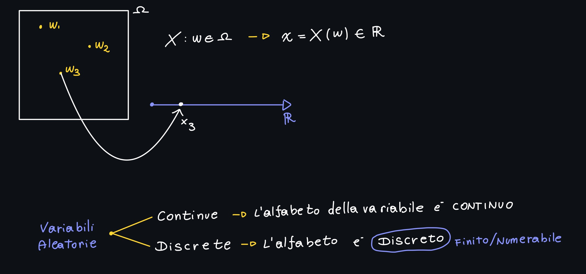

### La CDF

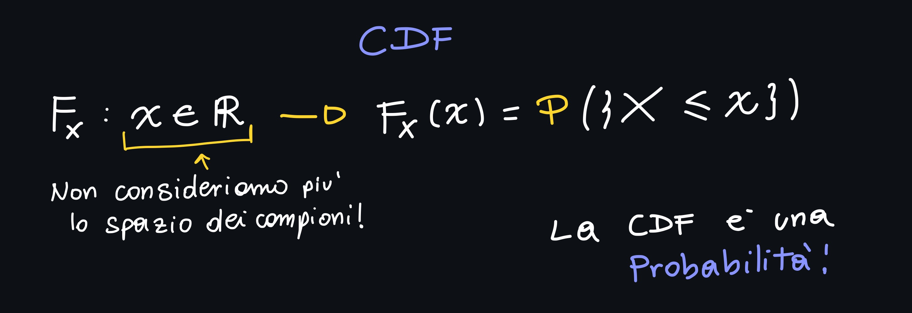

#### Proprietà Costitutive della CDF

1. FX(-‚àû) = 0
   - Se ci poniamo a -∞ a che evento corrisponde? Nessun evento -> Evento impossibile -> Probabilità 0

2. FX(+‚àû) = 1
   - Se ci poniamo a +∞ a che evento corrisponde? Corrisponde alla "somma" di tutti gli eventi -> evento certo -> P(Ω) -> probabilità 1

3. x1 < x2 -> FX(x1) ≤ FX (x1)
   - **Traduzione:** È Una funzione non decrescente

4. 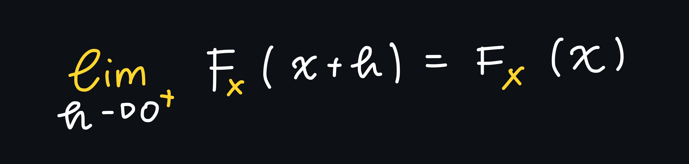
   - **"Continuità da destra"**, ovvero la funzione è sempre continua a destra di x0

Queste sono delle **proprietà necessarie e sufficienti** affinchè una **qualsiasi funzione** sia una CDF.

## Riconoscere le variabili aleatorie dalla CDF

Se, guardando il grafico della CDF di una variabile aleatoria, notiamo che la funzione è continua, sapremo automaticamente che la variabile aleatoria associata sarà una **variabile aleatoria continua** come nel seguente caso:

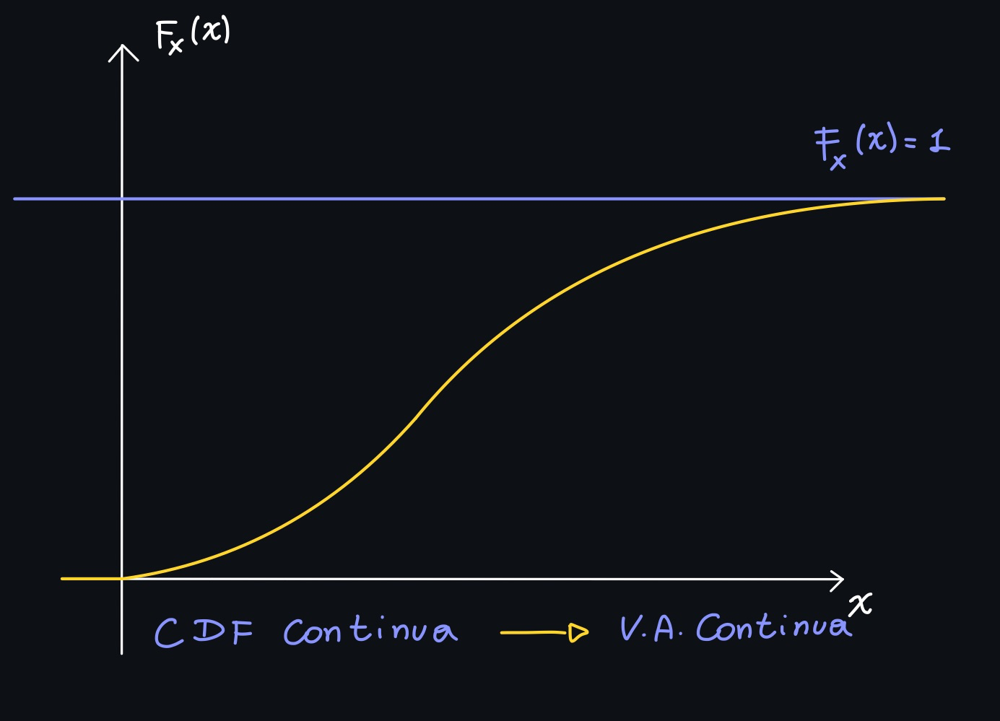

Se, guardando il grafico della CDF di una variabile aleatoria, notiamo che la funzione è continua **a tratti**, sapremo automaticamente che la variabile aleatoria associata sarà una **variabile aleatoria discreta** come nel seguente caso:

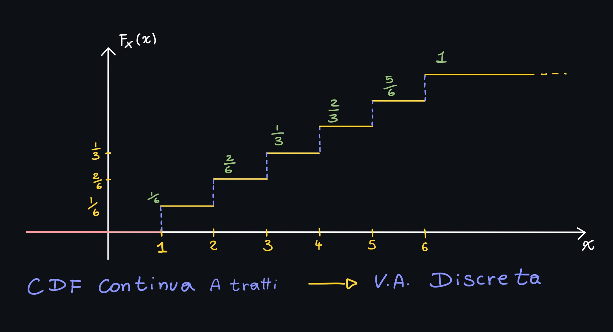

## Caratterizzazione alternativa alla CDF: la PMF (V.A. Discrete)

Detta **Funzione di "mass probability"**:

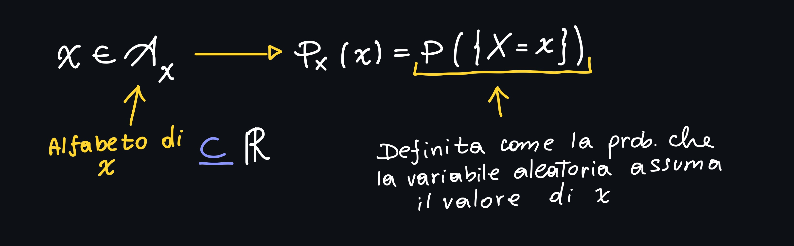

### Proprietà costitutive della PMF

1. **Non negatività**: è una funzione non negativa
   1. PX(x) ≥ 0 ∀ x ∈ Ax
2. **Normalizzazione**: La somma di tutti valori della CDF dell'alfabeto di X è pari ad 1:
   1. 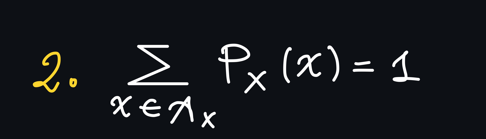

### Come calcolare la probabilità di un evento specifico?

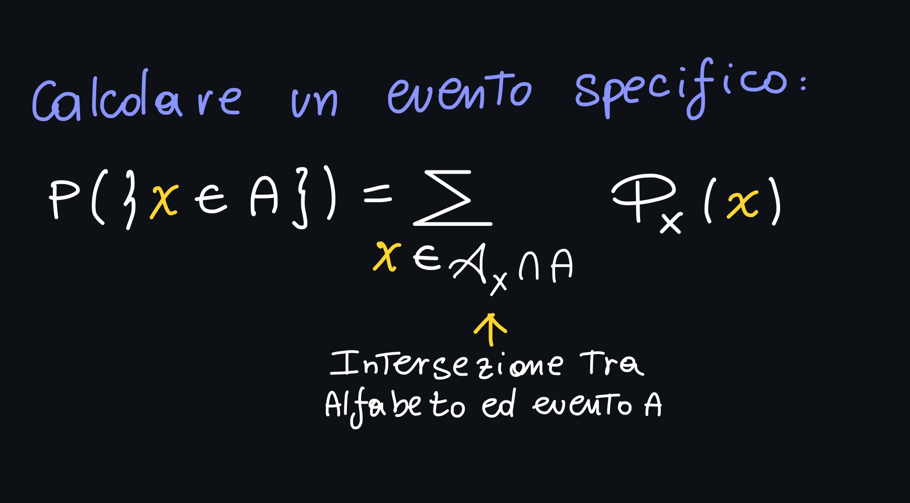

### Come ricavare la CDF dalla PMF?

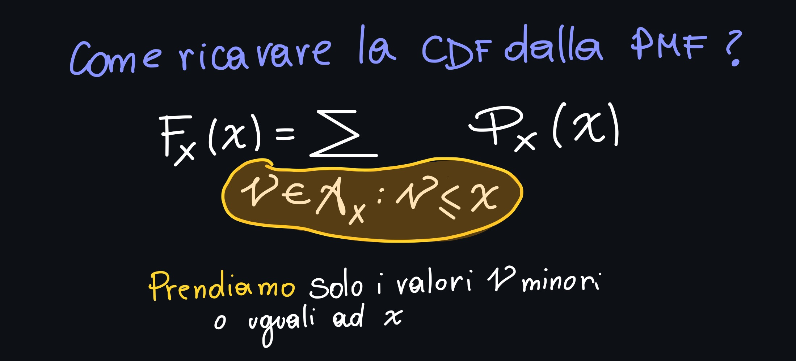

# PDF - Funzioni di Densità di probabilità

In questo caso si utilizza, per denotare la funzione, sempre la lettere f, ma in questo caso in minuscolo:

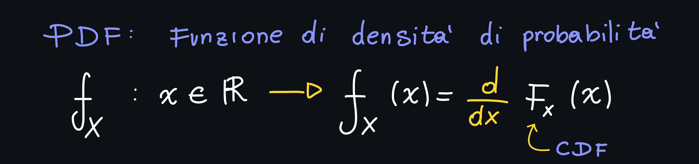

Guardando bene questa *definizione matematica* ci accorgiamo abbastanza velocemente che **non si tratta di una probabilità**; anzi, **ha le dimensioni fisiche che sono l'inverso di quelle della variabile aleatoria**:

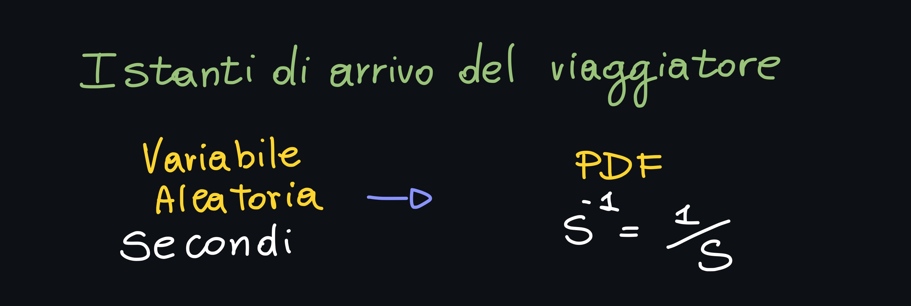

> Nell'esempio del viaggiatore, se la variabile aleatoria misura in secondi, la PDF misurerà con l'inverso dei secondi, ovvero con s-1 oppure 1/s

## Un Esempio: Temperatura in una stanza

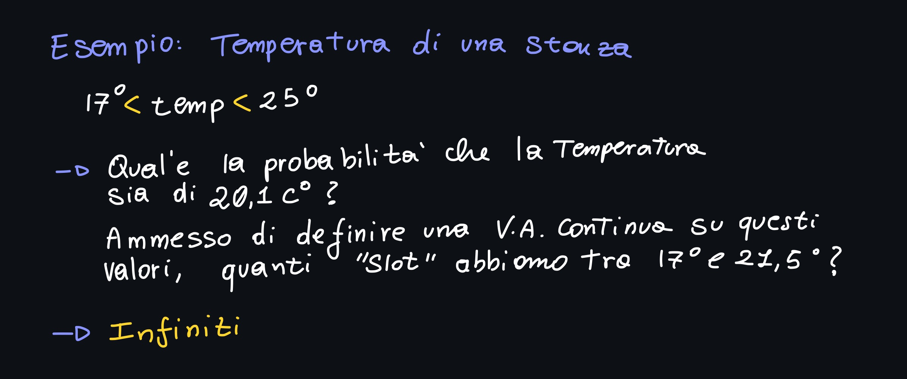

Se volessimo calcolare la probabilità con l'approccio frequentistico la potremmo calcolare come:

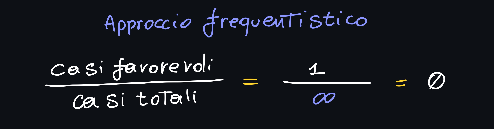

> Visto che i casi totali sono infiniti (siamo nel caso di una V.A. Continua), otteniamo che la probabilità che la stanza assuma una data temperatura è **zero**, il che è logicamente impossibile!

## Variazione di probabilità
Ha molto più senso studiare la **variazione di probabilità**.

Questo è lo stesso motivo per cui parliamo di **densità di probabilità**; infatti la **densità** è un valore che **integrato** ci restituisce la **potenza**; proviamo quindi ad integrare la PDF:

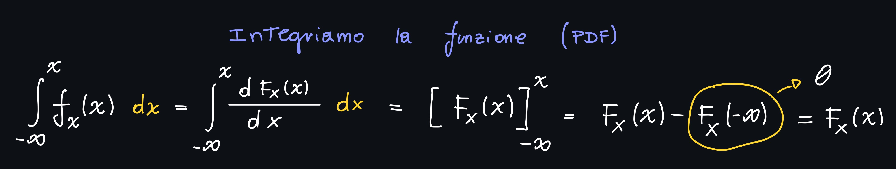

Siccome la CDF vale zero quando x tende a -‚àû, possiamo toglierla dall'eqazione, lasciandoci solo con Fx(x):

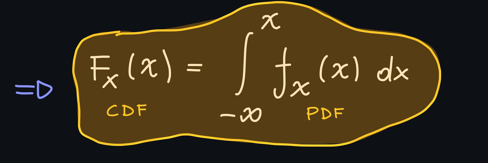

> Ne deduciamo che la CDF è semplicemente l'integrale della PDF tra -∞ ed x

Se fissiamo x0 e calcoliamo l'integrale della FX tra 0 ed x0 cosa otteniamo?

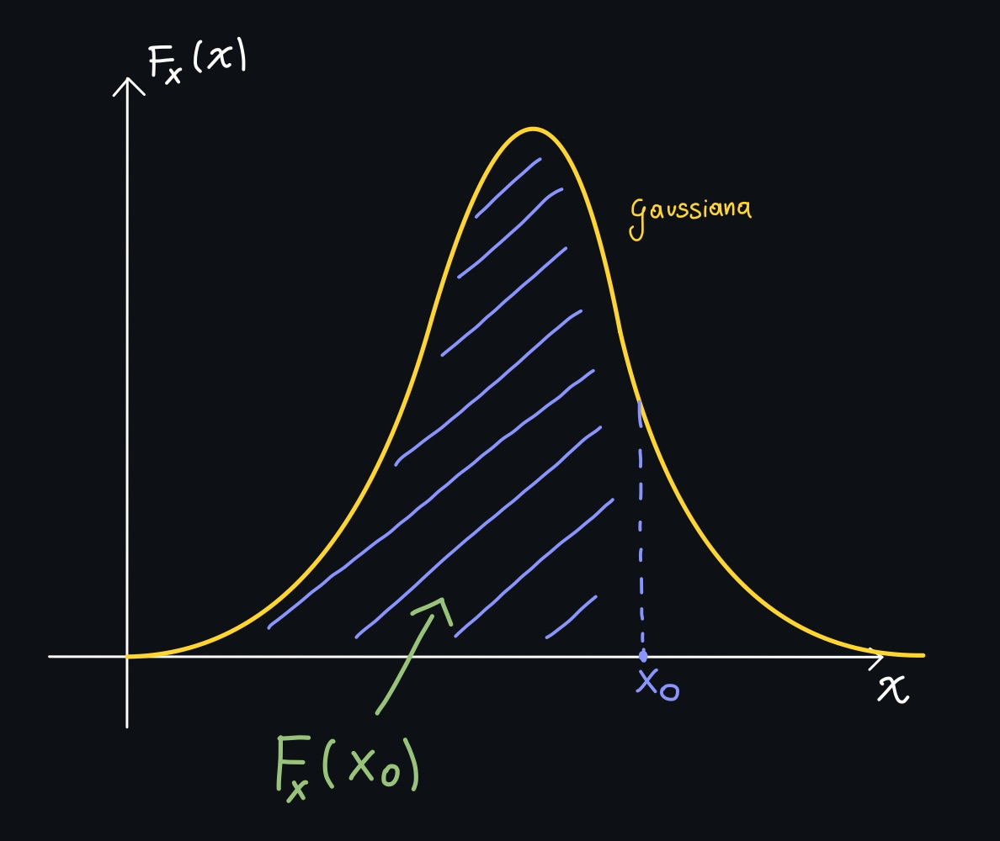

> Otteniamo la FX Valutata in x0

**Quindi?**

In pratica, una volta che abbiamo a disposizione la **PDF di una variabile aleatoria** (cosa che nella pratica accade spesso visto che sono disponibili diversi modelli riconosciuti), per calcolare la CDF ci basta **integrare la PDF**.

## Proprietà costitutive delle PDF

1. **Non negatività**
   1. **Dimostrazione:** siccome la PDF è la derivata della CDF (per  definizione), e la CDF è *non decrescente* (la derivata di una funzione crescente non può essere negativa), allora la PDF è non negativa.
2. **Normalizzazione**
   1. In questo caso non avremo una sommatoria ma un integrale:
      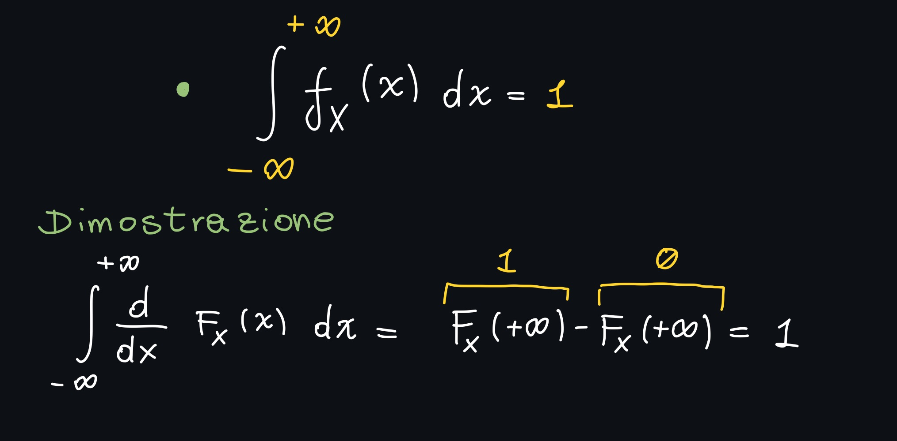
3. **Calcolo della probabilità in intervalli**
   1. 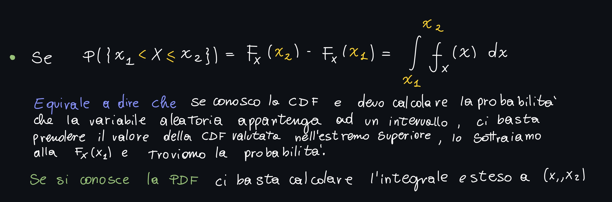
      **Dimostrazione:**
      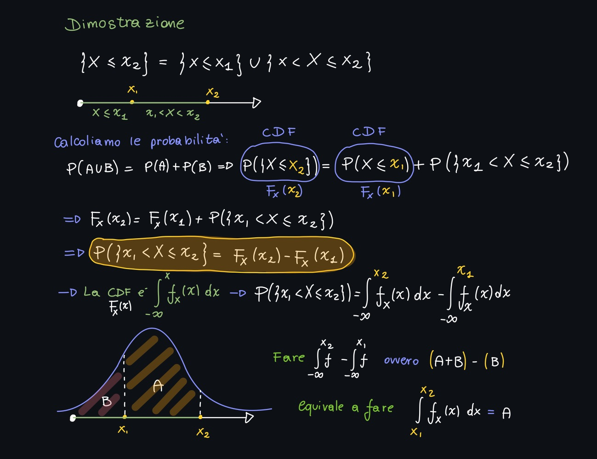

# Variabile Aleatoria di tipo Rayleigh

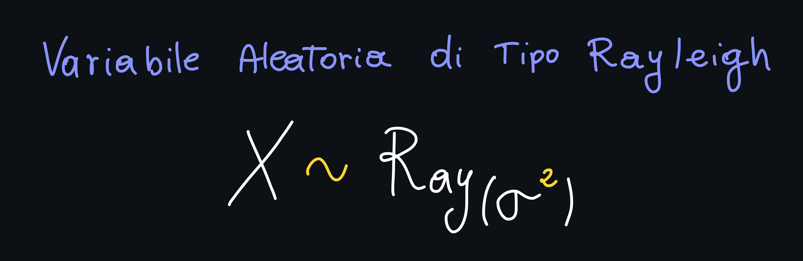

> Si legge come: "X è **distribuita** (ha una particolare distribuzione "notevole") Ray"

Una variabile aleatoria di tipo Rayleigh ha una **PDF** definita come:

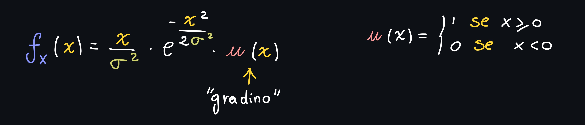

> Visto che il "gradino" ω vale 0 quando x < 0, tutta la funzione PDF non è definita per x < 0!

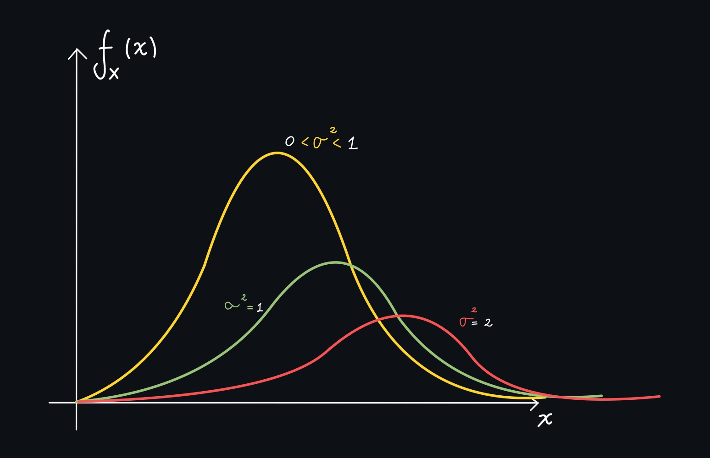

> A seconda del valore di σ2 possiamo ottenere diverse curve (tutte con la stessa forma pero!)

Le variabili aleatorie che stiamo vedendo in questa sezione del corso sono variabili aleatorie "**Notevoli**", proprio perchè **modellano** molti fenomeni naturali

## Esempio: Calcolare la CDF della variabile aleatoria di tipo Rayleigh

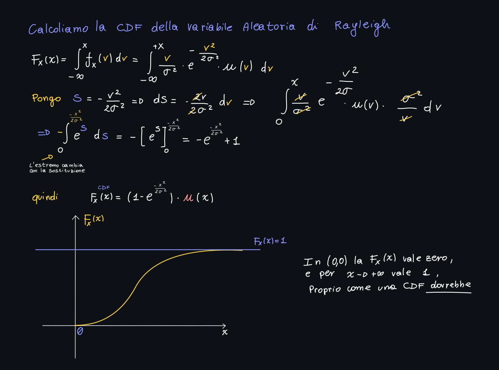

🏁1:09

# Variabile Aleatoria Uniforme

In questo caso la X si dice **distribuita** con una variabile aleatoria uniforme in **a** e **b**:

La **CDF di una variabile aleatoria uniforme** viene definita come una funzione **in pi√π intervalli**:

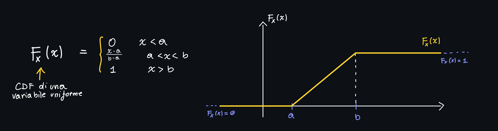

> Siccome abbiamo già definito una variabile aleatoria uniforma nelle scorse lezioni, possiamo definire la PDF a partire dalla CDF

## La PDF si calcola derivando la CDF

**Attenzione:**

- L' "**altezza**" della "curva", ovvero l'asse delle y, può **non essere 1**, infatti corrisponde ad 1/(b-a)
- L'area sottesa alla curva però, **deve sempre** essere pari ad 1!

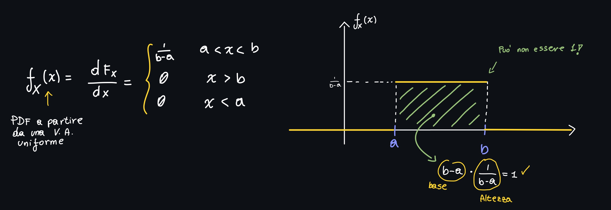

> I valori assunti dalla PDF non è detto che siano compresi tra 0 ed 1, proprio perchè abbiamo detto che **la PDF non è una probabilità!**.

Tra le proprietà costitutive della PDF ci sono la **non negatività** e la **normalizzazione**, cioè l'area sottesa alla curva (in questo caso alla funzione costante) deve essere uguale ad 1:

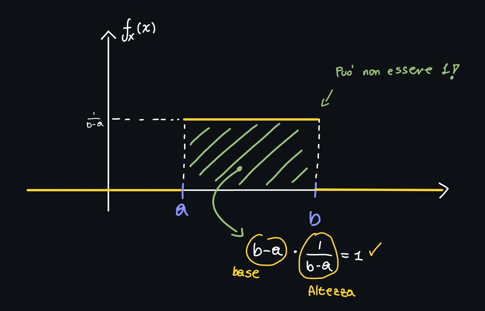

## Tiriamo le somme

Abbiamo visto due esempi:

Nella variabile **di tipo Reileigh** abbiamo definito prima la PDF e poi abbiamo ricavato la CDF;

Nel secondo esempio, abbiamo definito prima la CDF ricavandoci successivamente la PDF.

# Variabile aleatoria esponenziale

In questo caso la variabile aleatoria X è distribuita nel seguente modo:

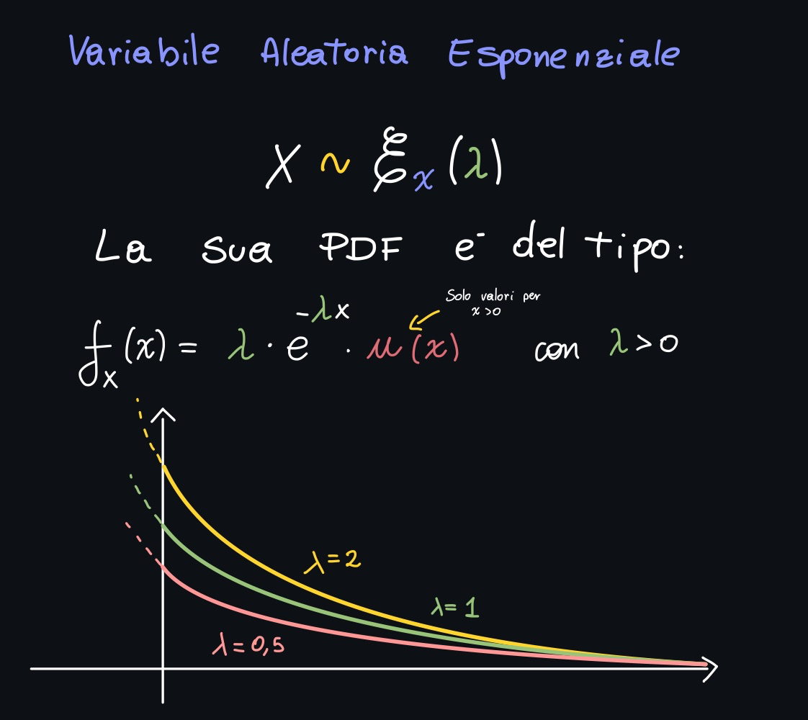

> Al variare di λ la curva varia.
>
> λ >> esponenziale accentuato
>
> λ << esponenziale appiattito

🏁1:18

## Calcoliamo la CDF integrando la PDF

Il calcolo è molto simile a quello fatto in precedenza per la **Variabile di Rayleigh**:

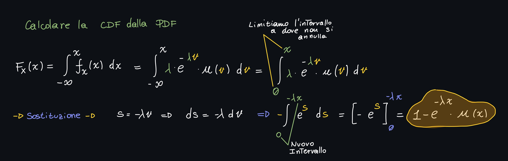

# Variabile aleatoria Gaussiana Standard
Per descrivere la Gaussiana, dobbiamo iniziare definendo una **variabile aleatoria Gaussiana Standard**:

Per indicare una Gaussiana Standard, e distinguerla da una **non standard**, invece di usare la **X**, usiamo **X0**:

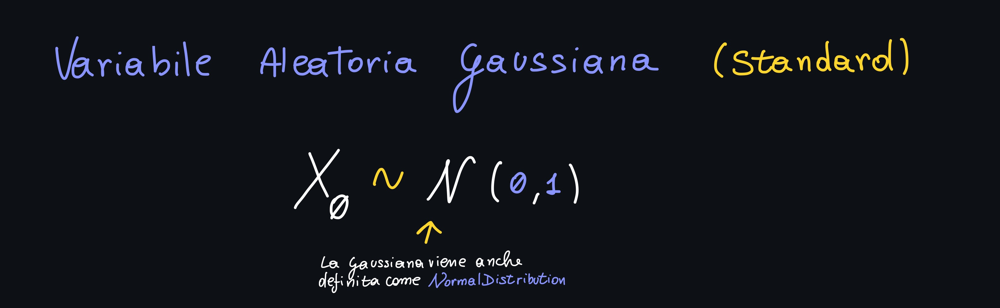

> La X0 **è distribuita ad N**; si utilizza "N" perchè la gaussiana è anche nota come **Normal Distribution**.
>
> I parametri zono **(0,1)**, perchè a differenza della <u>Gaussiana Non standard</u> questi parametri (nella Gaussiana non standard) possono essere diversi da zero ed uno.
>
> Ad ogni modo la Gaussiana Standard **ha i parametri 0,1 <u>fissati</u>**.

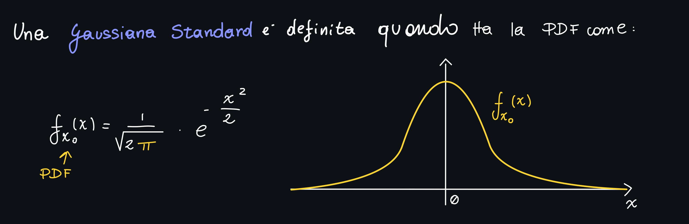

> La gaussiana Standard è:
>
> - **Centrata** in zero 
> - Forma a **campana**
> - Speculare rispetto all'asse y

**È una probabilità!** Quindi l'area sottesa a <u>tutta</u> la curva sarà uguale ad 1!

## Calcolare la CDF della V.A. Gaussiana Standard dalla sua PDF

Anche in questo caso la strada per calcolare la CDF è la stessa del calcolo delle precedenti V.A., ma in questo caso abbiamo un "problemino":

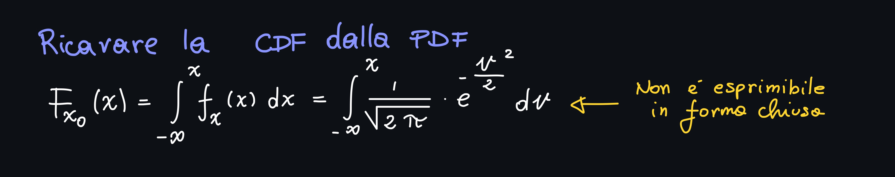

Per ovviare a questo problema, procediamo **"per via numerica"**, in particolare **si preferisce usare la Q-Function**:

# La Q - Function

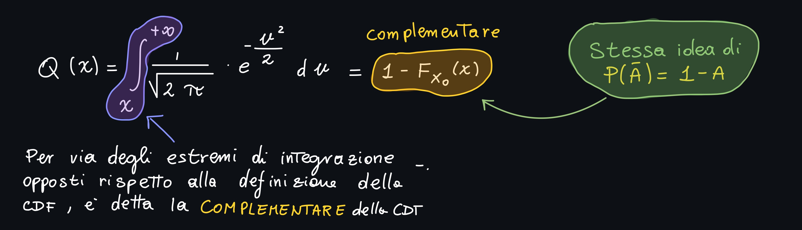

La Q-function è integrata in tutti i linguaggi di programmazione e non è altro che l'integrale tra x e +∞ della funzione vista precedentemente.

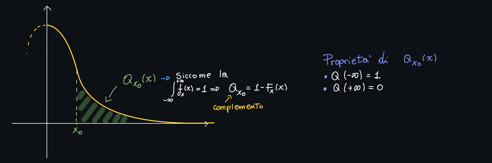

> Essendo QX0(x) la complementare di Fx valgono le proprietà elencate (deducibili ragionando)

## Proprietà della Q-function

**La Q - Function è essenzialmente la funzione complementare della PDF della Gaussiana**

### Proprietà 1 della Q - Function

> Quando x tende a +∞ il valore della Q(x) tende a zero, proprio perchè, per definizione, Q(x) è compreso tra zero ed 1
>
> Quando x tende a -∞ il valore della Q(x) tende ad 1, proprio perchè è come se "selzionassimo" **tutta** la gaussiana

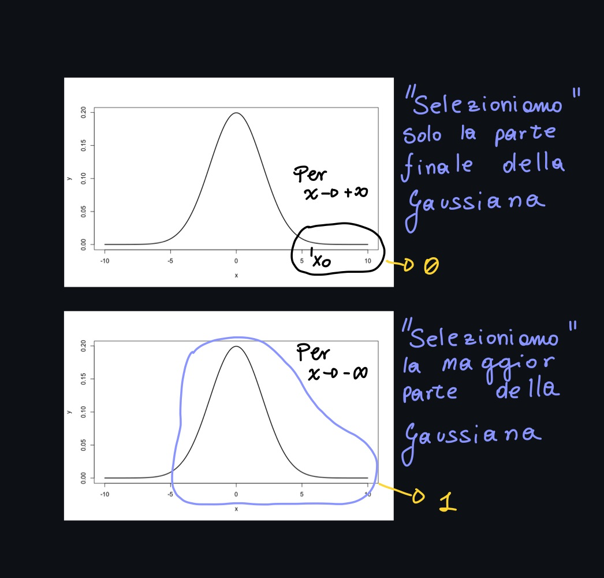

### Proprietà 2 della Q - Function

Sappiamo che la Q(x) è **decrescente**, infatti il suo grafico ce lo conferma:

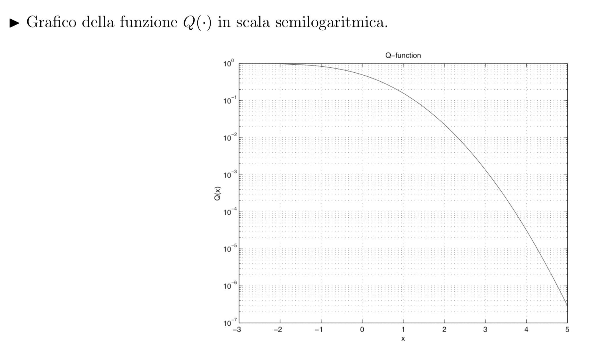

### Proprietà 3 della Q - Function

Per verificare questa proprietà ci basta calcolare ad esempio Q(-2) e verificare che sia uguale a 1-Q(2):

> Q(-2) = 0.977...

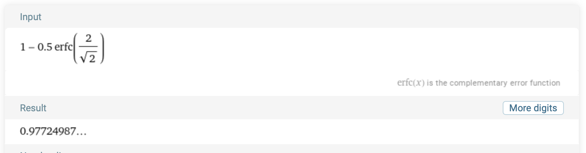

> Calcolando 1 - Q(2) otteniamo proprio Q(-2)

`Valori calcolati con WolframAlpha`

# Variabile Aleatoria Gaussiana Non Standard

A partire dalla variabile aleatoria standard è possibile definire una famiglia di variabili aleatorie **gaussiane** mediante una **trasformazione lineare della Gaussiana standard**:

> Applichiamo un fattore di scala Sigma ad X moltiplicato per X0, pi√π mu.
>
> N.B. i fattori Sigma e Mu sono gli stessi parametri visti nella definizione!
>
> I due parametri non sono altro che **la media** e **la deviazione standard**, ovvero "dove la campana è centrata" (mu) e "quanto è stretta la campana" (sigma)
>
> - σ >> campana larga
> - σ << campana stretta

## Esprimere la CDF (non standard) in termini di una CDF (standard)

La CDF **non è altro che la probabilità dell'evento**:

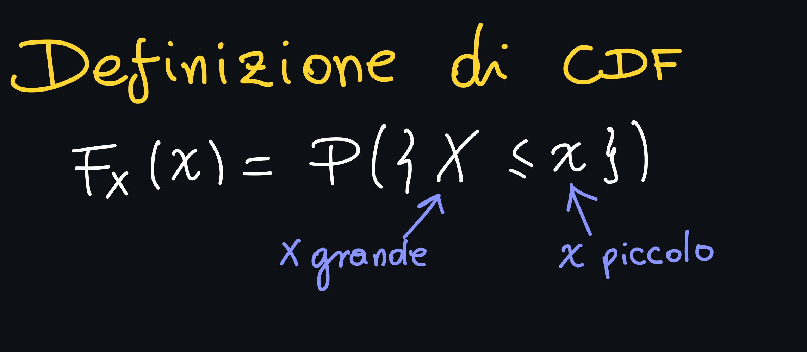

A questo punto ci basta **sostituire X all'interno della definizione:**

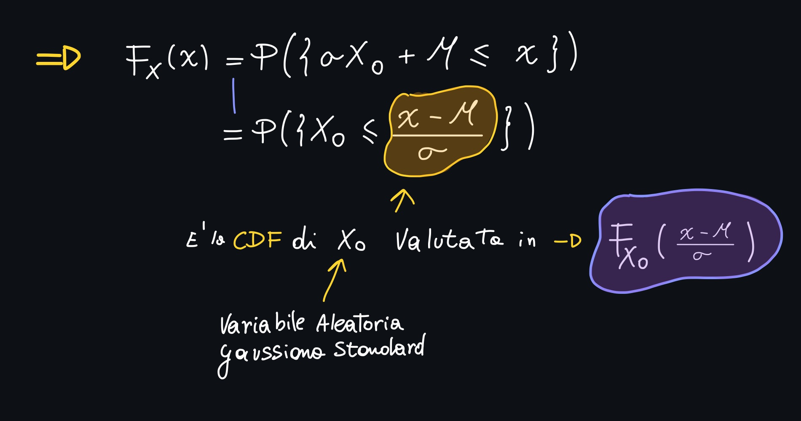

> Stiamo dicendo che la CDF di una variabile aleatoria Gaussiana **Qualsiasi** che abbia i parametri μ e σ, è esprimibile mediante **una CDF di una Gaussiana Standard valutata in (x-μ)/σ**

Il Grafico risultante è qualcosa del genere:

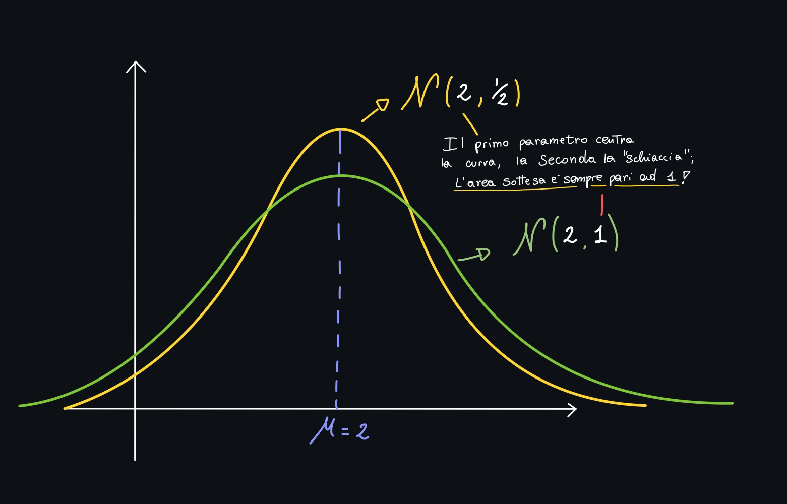

## Uno sguardo alle slides...

Alla slide 18 del file `slides_09.pdf` vediamo l'integrale della CDF della variabile aleatoria gaussiana che "non riusciamo a calcolare"; questo (come abbiamo visto) può essere risolto andando a definire la variabile **Q(x)**. 

Mediante la Q-Function, che è la complementare della CDF, riusciamo a **calcolare delle proabilità che la variabile sia compresa entro alcuni estremi** (ad esempio tra x1 ed x2).

Nella Slide *22* troviamo il grafico della funzione Q(x):

Quello che però è utile per l'esame non è il grafico, ma la Q-Function in forma tabellare:

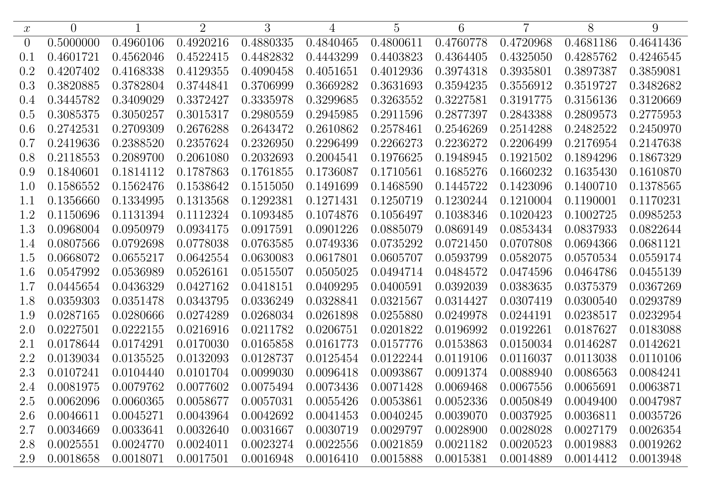

È infatti importante calcolare i valori della Q-function in maniera precisa, fino alla **seconda cifra decimale**.

### Come usare la tabella 

Vogliamo, ad esempio, calcolare la Q(2.37):

> Ci basta prendere le prime due cifre tra le righe, e l'ultima cifra tra le colonne
>
> In questo caso il valore di Q(2.37) = 0.0088940
