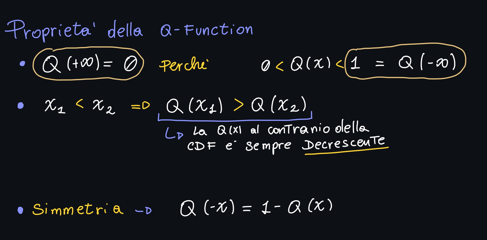
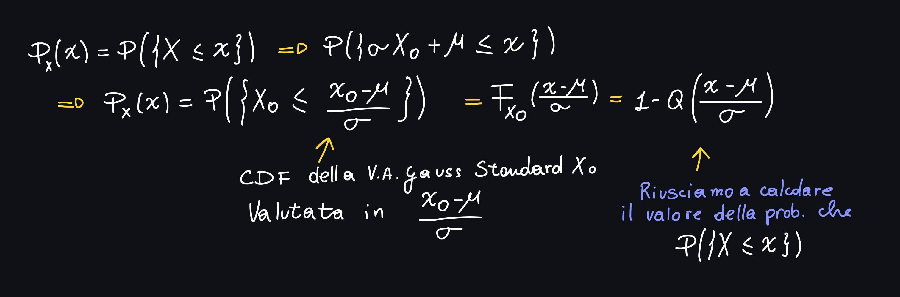
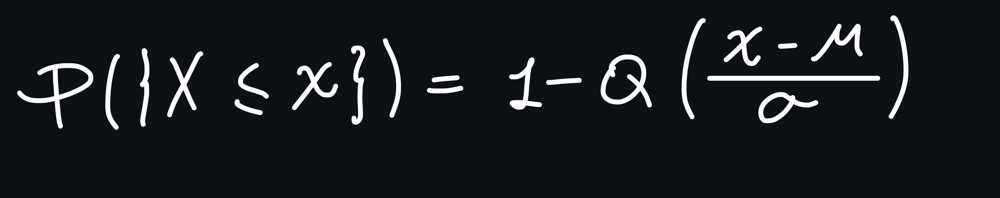
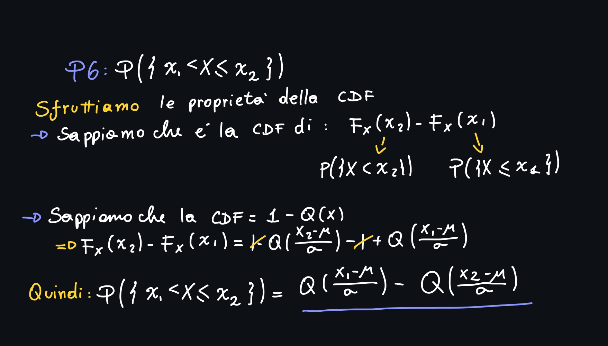

# Piccolo Recap

Nella lezione precedente abbiamo visto la **PDF** con la sua definizione; abbiamo visto come nel caso delle variabile aleatorie continue non ha senso considerare una **distribuzione come la PMF** come con le V.A. Discrete.

Abbiamo introdotto delle **Variabili Aleatorie Notevoli**, come la v.a. **di tipo Rayleigh**, **Esponenziale**, **Uniforme**, con qualche esercizio del tipo "*ricavare la PDF della v.a. Rayleigh/Exp/Uniforme dalla usa CDF*" e viceversa.

Nella parte finale della lezione abbiamo visto le **V.A. Gaussiane** (standard e non standard), ma nella lezione odierna vedremo più nello specifico proprietà e peculiarita delle Gaussiane e della **Q-Function**.

---

Una Gaussiana di tipo Standard è del tipo:

> **Attenzione**! È importante prestare attenzione al parametro σ, in quanto negli esercizi potrebbe essere fornito σ2!

Una V.A. **Gaussiana** si dice tale quando la sua PDF è della forma:

> La gaussiana Standard è centrata in zero (parametro μ)
>
> La maggior parte dell'area sottesa alla Gaussiana Standard è compresa tra -1 ed 1 (parametro σ)

Siccome la CDF è data dall'integrale da -∞ ad x della PDF, possiamo ricavarci (tramite sostituzione) la CDF senza troppi problemi.

Inoltre, notiamo come nella **definizione della PDF** affinchè una V.A. sia di tipo Gaussiana (standard) è presente il fattore moltiplicativo (1/sqrt(2π)), che è detto **integrale di Gauss.**
Questo tipo di fattore, fa sì che **l'area sottesa alla gaussiana**, ovvero **l'integrale della gaussiana da -∞ a +∞ sia pari ad uno**.

Abbiamo visto come, però, l'integrale della PDF non è esprimibile in forma chiusa; per risolvere il problema abbiamo definito la **Q-Function**:

Siccome l'integrale della PDF **deve** essere pari ad uno, vuol dire che l'integrale della PDF da  x0 a +∞ avremo:

Abbiamo visto anche delle proprietà della Q-function:

Per quanto riguarda la Gaussiana Non Standard abbiamo:

Come facciamo ad ottenere la **famiglia di variabili aleatorie Gaussiani**? La otteniamo attraverso una **trasformazione detta location scale**: La X si ottiene a partire da una v.a. Gaussiana Standard, moltiplicandola per un **fattore di scala** σ > 0 e sommando il fattore di locazione μ ∈ ℝ.

La curva, quindi si "sposta" proprio in corrispondenza di μ (centrata in μ).

La CDF della famiglia delle Gaussiane, per definizione, essendo:

# La Q-Function in depth

Nella lezione di ieri e nel recap abbiamo visto 3 delle proprietà della funzione Q, nella lezione di oggi ne introduciamo altre.

Come abbiamo appena visto nel recap, abbiamo che la probabilità che X ≤ x è:

## Prorpietà 4 della Q - Function

**Nell'atto pratico** quando vogliamo calcolare **la probabilità che la gaussiana sia minore o uguale di un numero qualsiasi x**, dobbiamo semplicemente **valutare 1-Q**.

## Proprietà 5 della Q - Function

Questa proprietà ci dice la probabilità che X sia maggiore di x:

# Proprietà 6 della Q - Function

Ci dice che se dobbiamo calcolare la probabilità che X sia compresa tra x1 ed x2, possiamo semplicemente calcolare la differenza tra la Q function calcolata in x1 ed in x2:

## Proprietà 7 della Q - Function

Ci dice la probabilità che X ricada in (-x, x):

Anche in questo caso possiamo fare il passaggio prima tramite CDF (quindi scrivere la CDF(x)-CDF(-x)):
