# Piccolo Recap

Nella lezione precedente abbiamo visto la **PDF** con la sua definizione; abbiamo visto come nel caso delle variabile aleatorie continue non ha senso considerare una **distribuzione come la PMF** come con le V.A. Discrete.

Abbiamo introdotto delle **Variabili Aleatorie Notevoli**, come la v.a. **di tipo Rayleigh**, **Esponenziale**, **Uniforme**, con qualche esercizio del tipo "*ricavare la PDF della v.a. Rayleigh/Exp/Uniforme dalla usa CDF*" e viceversa.

Nella parte finale della lezione abbiamo visto le **V.A. Gaussiane** (standard e non standard), ma nella lezione odierna vedremo più nello specifico proprietà e peculiarita delle Gaussiane e della **Q-Function**.

---

Una Gaussiana di tipo Standard è del tipo:

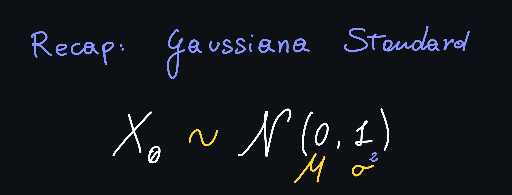

> **Attenzione**! È importante prestare attenzione al parametro σ, in quanto negli esercizi potrebbe essere fornito σ2!

Una V.A. **Gaussiana** si dice tale quando la sua PDF è della forma:

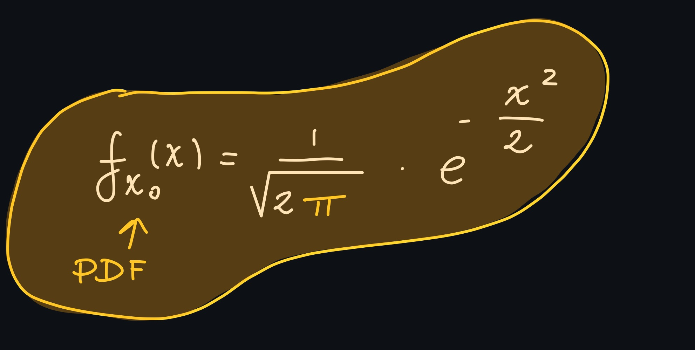

> La gaussiana Standard è centrata in zero (parametro μ)
>
> La maggior parte dell'area sottesa alla Gaussiana Standard è compresa tra -1 ed 1 (parametro σ)

Siccome la CDF è data dall'integrale da -∞ ad x della PDF, possiamo ricavarci (tramite sostituzione) la CDF senza troppi problemi.

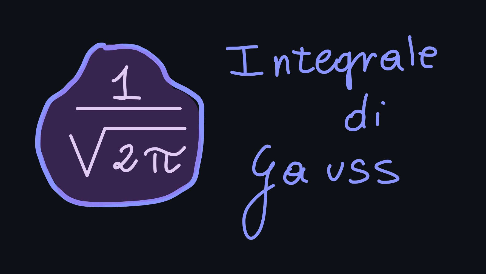

Inoltre, notiamo come nella **definizione della PDF** affinchè una V.A. sia di tipo Gaussiana (standard) è presente il fattore moltiplicativo (1/sqrt(2π)), che è detto **integrale di Gauss.**
Questo tipo di fattore, fa sì che **l'area sottesa alla gaussiana**, ovvero **l'integrale della gaussiana da -∞ a +∞ sia pari ad uno**.

Abbiamo visto come, però, l'integrale della PDF non è esprimibile in forma chiusa; per risolvere il problema abbiamo definito la **Q-Function**:

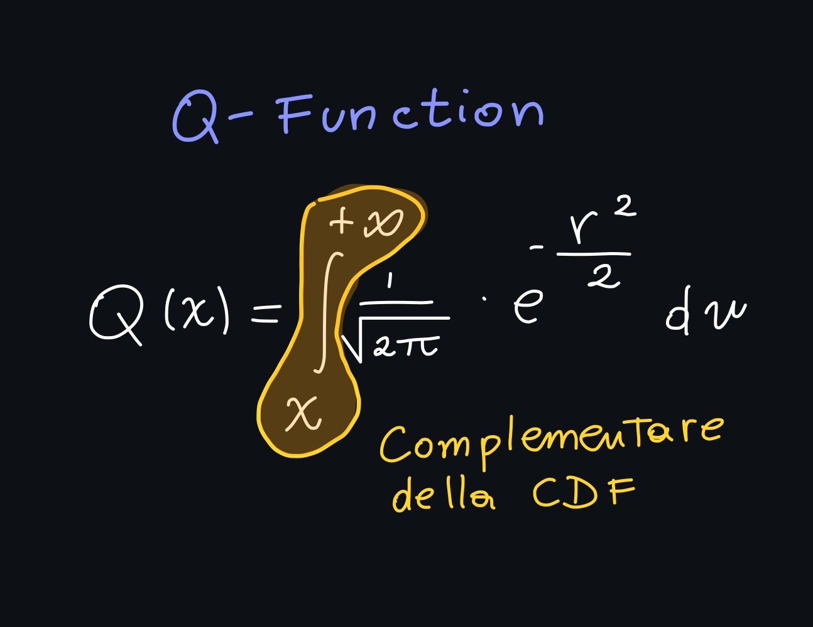

Siccome l'integrale della PDF **deve** essere pari ad uno, vuol dire che l'integrale della PDF da  x0 a +∞ avremo:

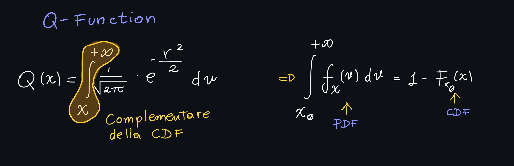

Abbiamo visto anche delle proprietà della Q-function:

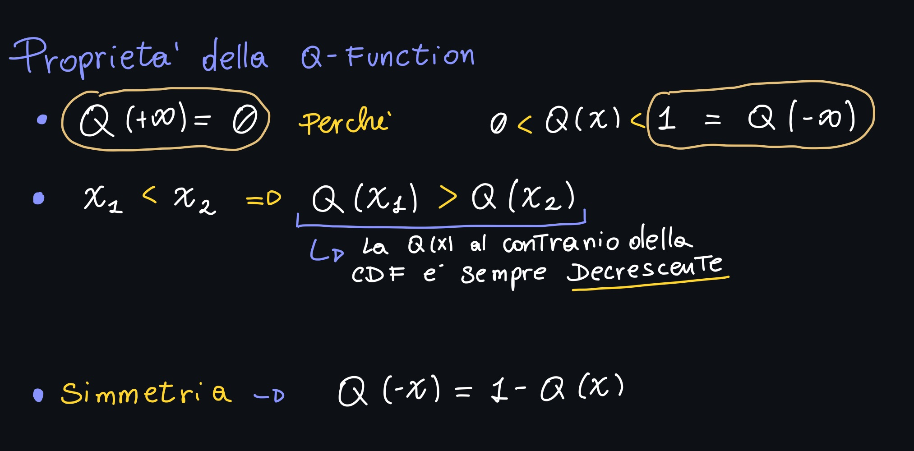

Per quanto riguarda la Gaussiana Non Standard abbiamo:

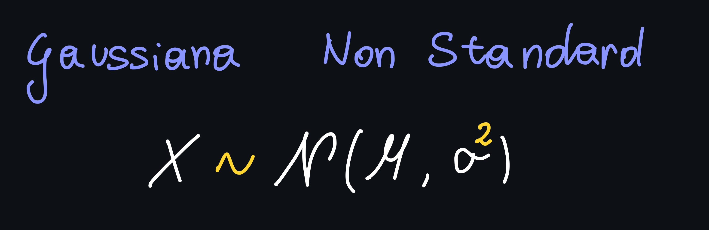

Come facciamo ad ottenere la **famiglia di variabili aleatorie Gaussiani**? La otteniamo attraverso una **trasformazione detta location scale**: La X si ottiene a partire da una v.a. Gaussiana Standard, moltiplicandola per un **fattore di scala** σ > 0 e sommando il fattore di locazione μ ∈ ℝ.

La curva, quindi si "sposta" proprio in corrispondenza di μ (centrata in μ).

La CDF della famiglia delle Gaussiane, per definizione, essendo:

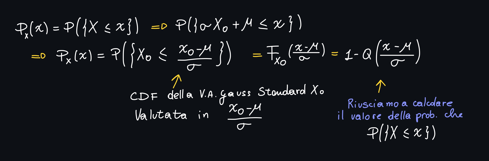

# La Q-Function in depth

Nella lezione di ieri e nel recap abbiamo visto 3 delle proprietà della funzione Q, nella lezione di oggi ne introduciamo altre.

Come abbiamo appena visto nel recap, abbiamo che la probabilità che X ≤ x è:

## Prorpietà 4 della Q - Function

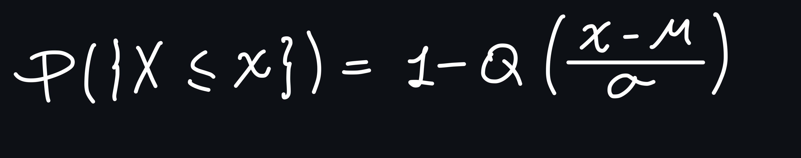

**Nell'atto pratico** quando vogliamo calcolare **la probabilità che la gaussiana sia minore o uguale di un numero qualsiasi x**, dobbiamo semplicemente **valutare 1-Q**.

## Proprietà 5 della Q - Function

Questa proprietà ci dice la probabilità che X sia maggiore di x:

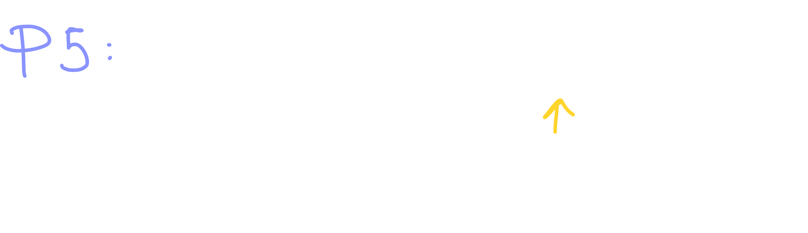

# Proprietà 6 della Q - Function

Ci dice che se dobbiamo calcolare la probabilità che X sia compresa tra x1 ed x2, possiamo semplicemente calcolare la differenza tra la Q function calcolata in x1 ed in x2:

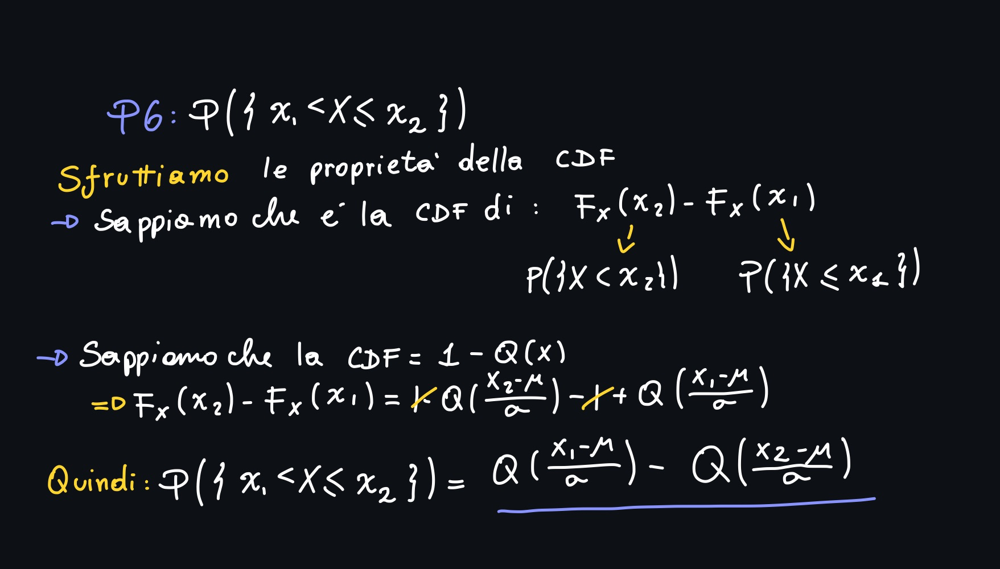

## Proprietà 7 della Q - Function

Ci dice la probabilità che X ricada in (-x, x):

Anche in questo caso possiamo fare il passaggio prima tramite CDF (quindi scrivere la CDF(x)-CDF(-x)):

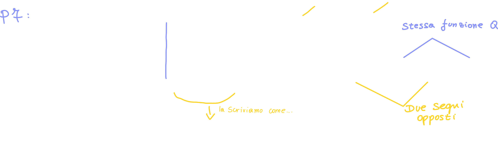

# Calcolare la PDF di una Gaussiana Non Standard

Nel caso della Gaussiana Non standard siamo partiti dalla CDF, ma non abbiamo ancora visto come esprimere la PDF della Gaussiana n.s.

Per calcolare la PDF andiamo a **derivare la CDF**:

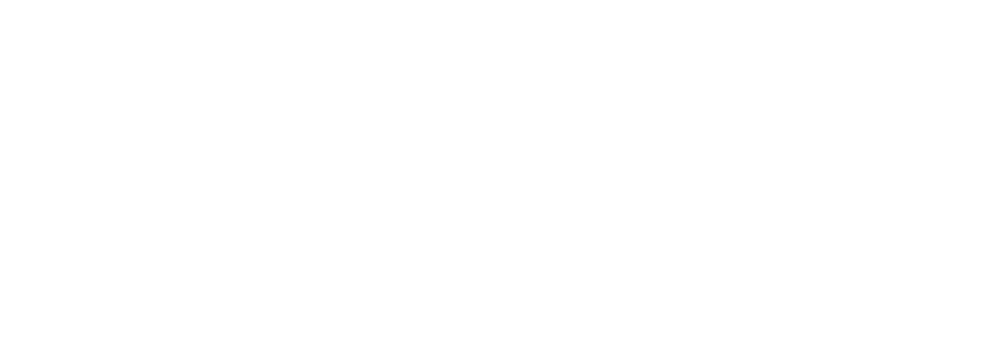

> Per prima cosa andiamo a recuperare la CDF della Gaussiana Non standard;
>
> La CDF della Gaussiana Non standard è semplicemente la CDF della Gaussiana Standard **valutata in (x-μ)/σ**.

Derivando la CDF otteniamo:

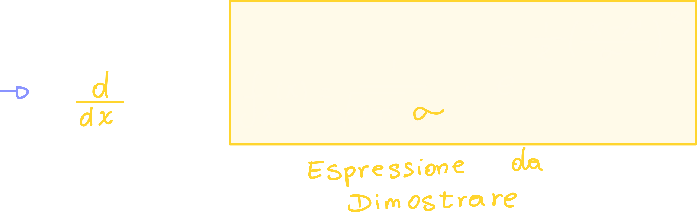

Per dimostrarla, dobbiamo derivare l'integrale (CDF); la derivata, però, corrisponde al **limite del rapporto incrementale**;

Invece di valutarla in x, la valutiamo in **x + Δx**:

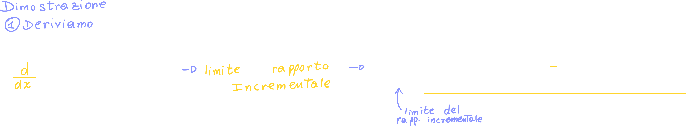

Aiutandoci graficamente osserviamo che:

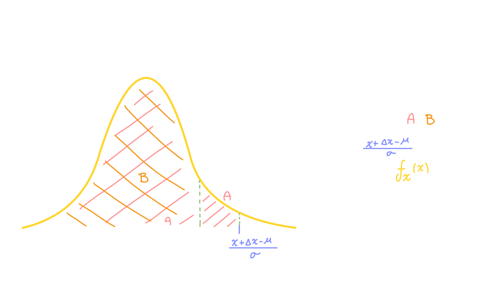

Possiamo quindi scrivere il rapporto incrementale come: 

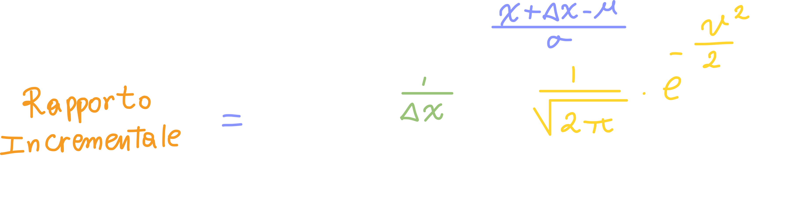

Per completare la dimostrazione dobbiamo fare un'ultimo passaggio, rispolverando il **teorema della media integrale** (teorema visto nella [lezione 31](https://github.com/follen99/Analisi-Matematica/blob/main/Appunti/1.08%20-%20Integrali/Lezione%2031.pdf) del corso di Matematica):

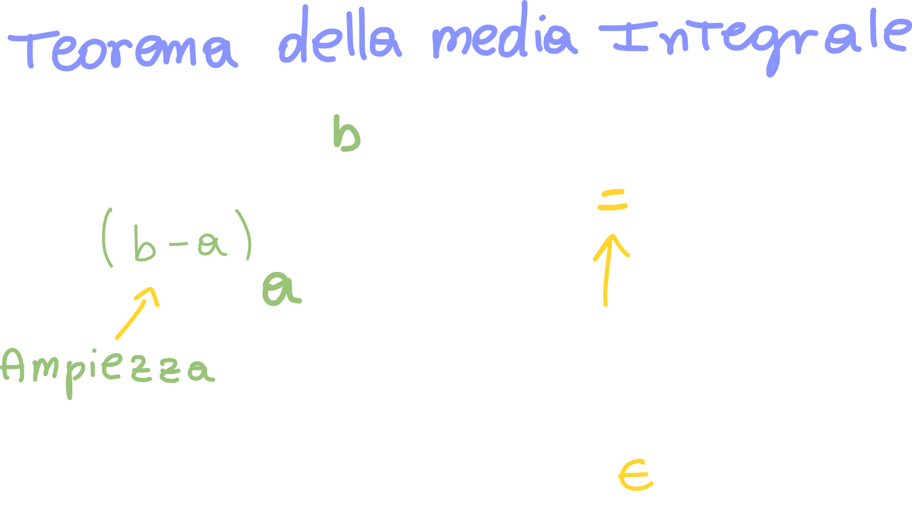

> Teorema della Media Integrale

Possimo quindi esprimere l'integrale da a -> b della nostra PDF come:

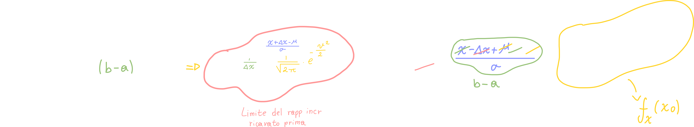

Siccome X0 **Deve** essere compreso tra [a,b] (ovvero tra i due estremi di integrazioni del rapporto incrementale), possiamo sceglierlo proprio come:

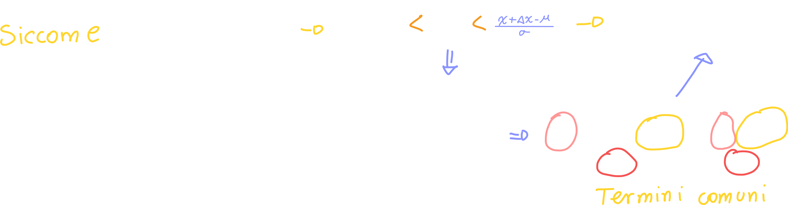

Andiamo quindi ad ottenere (sostituendo):

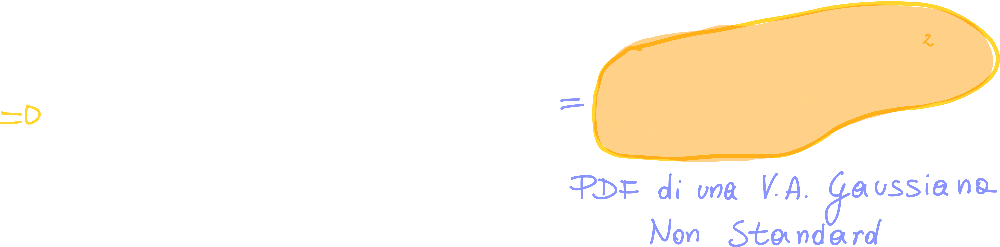

> Abbiamo così dimostrato (ed ottenuto) la PDF di una Variabile Aleatoria Gaussiana Non Standard.

## Tiriamo le somme

La PDF di una variabile aleatoria Gaussiana Non standard, differisce da quella Standard **per un σ al denominatore**, e per il fatto che nell'argomento dell'esponenziale non abbiamo più la x2/2, ma abbiamo:

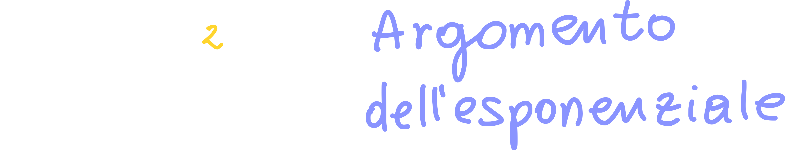

# Variabili Aleatorie di tipo Mixture

Queste variabili sono una **combinazione** di più variabili aleatorie notevoli.

Per definirle dobbiamo considerare:

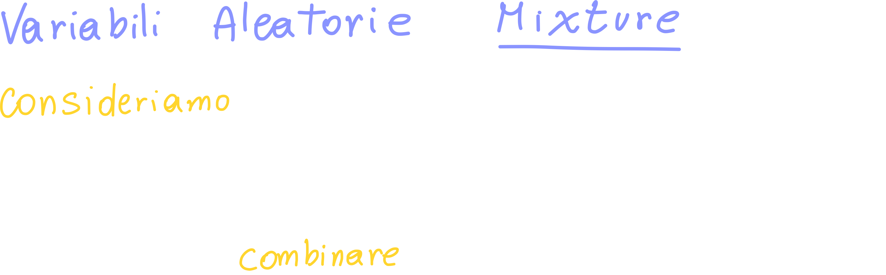

Quindi andiamo a definire una nuova PDF a parire da X1 ed X2 con una **combinazione secondo il parametro "c"**:

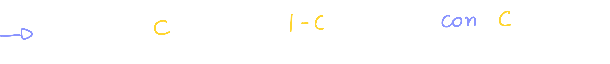

> C non è un parametro scelto a caso, ma è compreso tra 0 ed 1.

La nuova PDF (denotata con f**x**) è a tutti gli effetti una nuova PDF, ed è denotata dalla **nuova variabile X**; X si dice **variabile mixture di x1 ed x2.**

Abbiamo detto che la nuova PDF è "a tutti gli effetti una PDF". Per esserne sicuri dobbiamo controllare le sue proprietà costitutive:

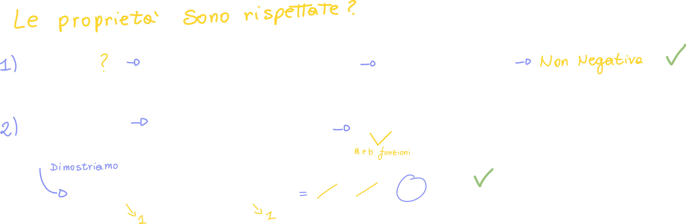

## Come si presenta la variabile di tipo Mixture ottenuta da due PDF?

La variabile Mixture è proprio la combinazione lineare delle due (o più) variabili aleatorie (PDF) iniziali:

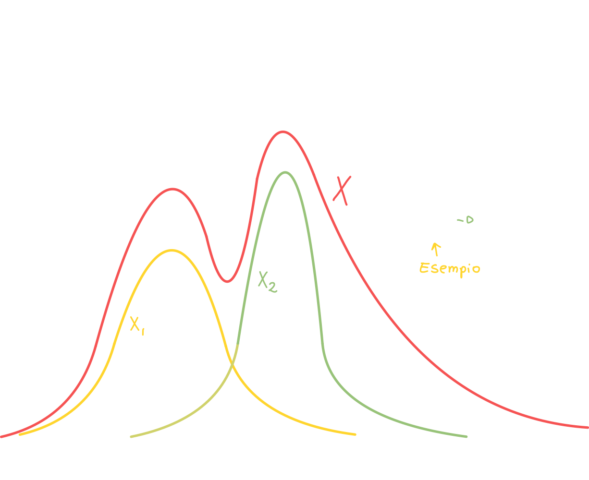

Possiamo vedere come questa variabile possa essere usata in applicazioni reali:

🏁 48:11

# Raccolta di esercizi

È possibile trovare una serie di esercizi nella lezione 2.08 che non verranno riportati nel documento MarkDown.

## Esercizio 1: Variabile Aleatoria uniforme

Consideriamo il costo di un televisore che è modellabile come una variabile **aleatoria uniforme** tra 400€ e 500€.

Calcolare la probabilità che il costo sia compreso tra 450€ e 500€.

### Risoluzione

Basta applicare le proprietà della PDF, fare il grafico della PDF, e troveremo subito la probabilità.

**Consiglio:** quando svolgiamo questi esercizi che a primo sguardo potrebbero risultare difficili da comprendere e risolvere, ci conviene tradurre la traccia in una formalizzazione:

1) La prima cosa da fare è (ad esempio) chiamare la variabile "costo", oppure "X" e dire che questa variabile è una variabile uniforme tra (in questo caso) 400 e 500.
2) Successivamente scegliamo se optare per la strada della CDF o della PDF:
   1) Nel caso della CDF la funzione non è costante, ma ci basta calcolare FX(500)-FX(450).
   2) Nel caso della PDF la funzione è costante e ci basta integrare da 450 a 500 la PDF stessa, che vale 1/b-a (il suo integrale è x).
      Quindi:
      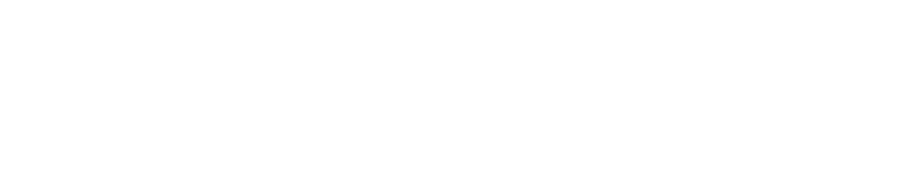
      In questo caso potevamo anche semplicemente vedere "ad occhio", infatti il grafico parla chiaro:
      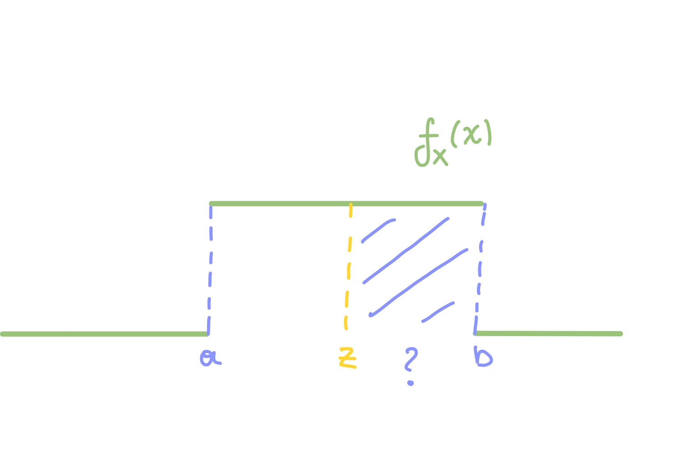

## Esercizio 2: Gaussiana Standard

Data la variabile Aleatoria Gaussiana Standard X0, calcolare le probabilità:

# Visualizzazione Di una Gaussiana con Matlab

Nella parte finale della lezione è stato mostrato come visualizzare una gaussiana con Matlab.
