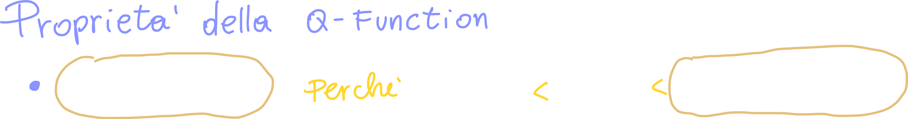
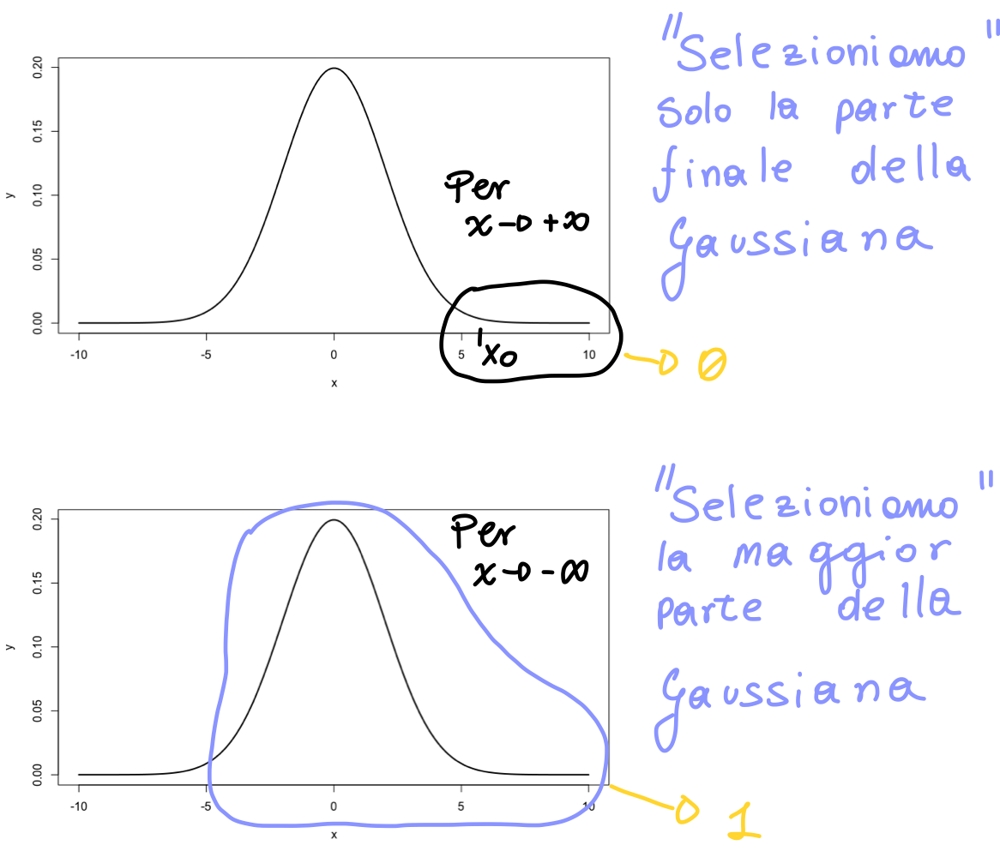
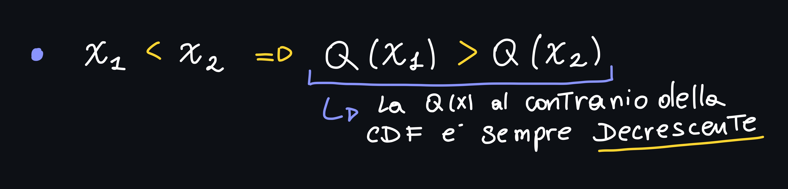
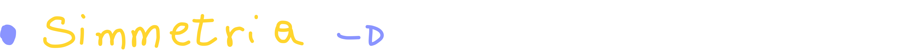
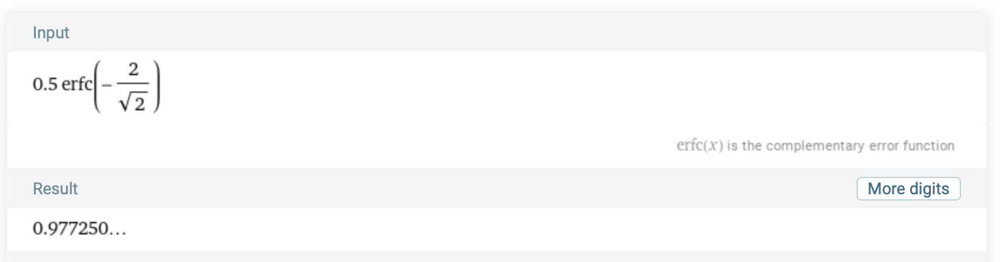
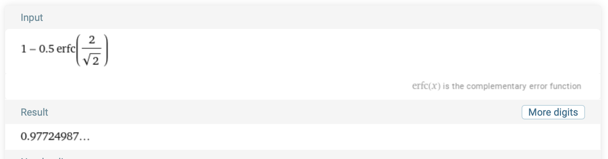
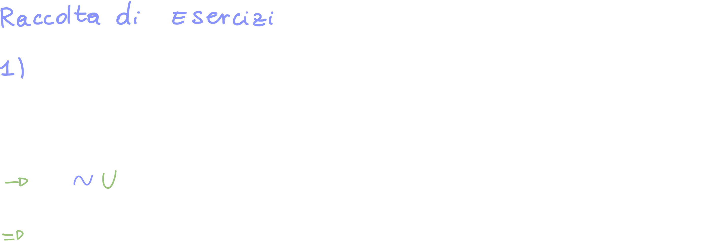
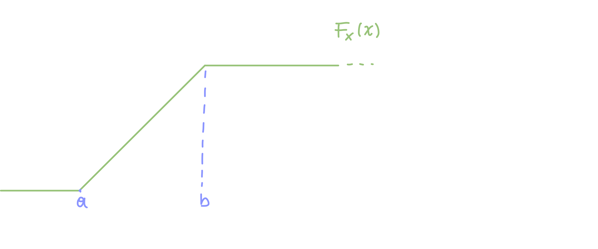
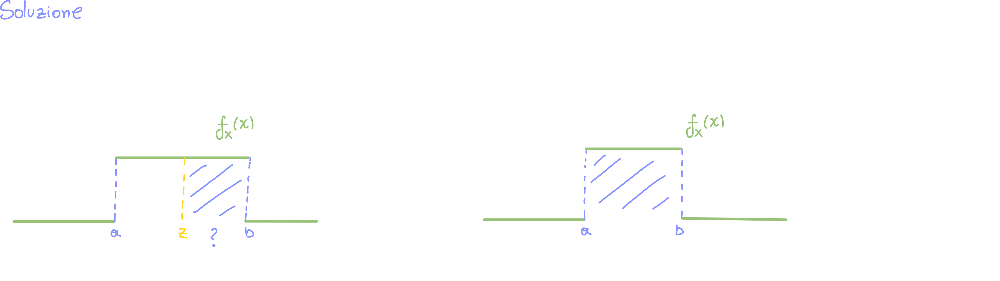

# Proprietà della Q - Function

[TOC]

## Proprietà 1 della Q - Function

> Quando x tende a +∞ il valore della Q(x) tende a zero, proprio perchè, per definizione, Q(x) è compreso tra zero ed 1
>
> Quando x tende a -∞ il valore della Q(x) tende ad 1, proprio perchè è come se "selzionassimo" **tutta** la gaussiana

## Proprietà 2 della Q - Function

Sappiamo che la Q(x) è **decrescente**, infatti il suo grafico ce lo conferma:

## Proprietà 3 della Q - Function

Per verificare questa proprietà ci basta calcolare ad esempio Q(-2) e verificare che sia uguale a 1-Q(2):

> Q(-2) = 0.977...

> Calcolando 1 - Q(2) otteniamo proprio Q(-2)

`Valori calcolati con WolframAlpha`

## Proprietà 4 della Q - Function

Come abbiamo appena visto nel recap, abbiamo che la probabilità che X ≤ x è:

**Nell'atto pratico** quando vogliamo calcolare **la probabilità che la gaussiana sia minore o uguale di un numero qualsiasi x**, dobbiamo semplicemente **valutare 1-Q**.

## Proprietà 5 della Q - Function

Questa proprietà ci dice la probabilità che X sia maggiore di x:

## Proprietà 6 della Q - Function

Ci dice che se dobbiamo calcolare la probabilità che X sia compresa tra x1 ed x2, possiamo semplicemente calcolare la differenza tra la Q function calcolata in x1 ed in x2:

## Proprietà 7 della Q - Function

Ci dice la probabilità che X ricada in (-x, x):

Anche in questo caso possiamo fare il passaggio prima tramite CDF (quindi scrivere la CDF(x)-CDF(-x)):

# Calcolare la PDF di una Gaussiana Non Standard

Nel caso della Gaussiana Non standard siamo partiti dalla CDF, ma non abbiamo ancora visto come esprimere la PDF della Gaussiana n.s.

Per calcolare la PDF andiamo a **derivare la CDF**:

> Per prima cosa andiamo a recuperare la CDF della Gaussiana Non standard;
> 
> La CDF della Gaussiana Non standard è semplicemente la CDF della Gaussiana Standard **valutata in (x-μ)/σ**.

Derivando la CDF otteniamo:

Per dimostrarla, dobbiamo derivare l'integrale (CDF); la derivata, però, corrisponde al **limite del rapporto incrementale**;

Invece di valutarla in x, la valutiamo in **x + Δx**:

Aiutandoci graficamente osserviamo che:

Possiamo quindi scrivere il rapporto incrementale come: 

Per completare la dimostrazione dobbiamo fare un'ultimo passaggio, rispolverando il **teorema della media integrale** (teorema visto nella [lezione 31](https://github.com/follen99/Analisi-Matematica/blob/main/Appunti/1.08%20-%20Integrali/Lezione%2031.pdf) del corso di Matematica):

> Teorema della Media Integrale

Possimo quindi esprimere l'integrale da a -> b della nostra PDF come:

Siccome X0 **Deve** essere compreso tra [a,b] (ovvero tra i due estremi di integrazioni del rapporto incrementale), possiamo sceglierlo proprio come:

Andiamo quindi ad ottenere (sostituendo):

> Abbiamo così dimostrato (ed ottenuto) la PDF di una Variabile Aleatoria Gaussiana Non Standard.

## Tiriamo le somme

La PDF di una variabile aleatoria Gaussiana Non standard, differisce da quella Standard **per un σ al denominatore**, e per il fatto che nell'argomento dell'esponenziale non abbiamo più la x2/2, ma abbiamo:

# Variabili Aleatorie di tipo Mixture

Queste variabili sono una **combinazione** di più variabili aleatorie notevoli.

Per definirle dobbiamo considerare:

Quindi andiamo a definire una nuova PDF a parire da X1 ed X2 con una **combinazione secondo il parametro "c"**:

> C non è un parametro scelto a caso, ma è compreso tra 0 ed 1.

La nuova PDF (denotata con f**x**) è a tutti gli effetti una nuova PDF, ed è denotata dalla **nuova variabile X**; X si dice **variabile mixture di x1 ed x2.**

Abbiamo detto che la nuova PDF è "a tutti gli effetti una PDF". Per esserne sicuri dobbiamo controllare le sue proprietà costitutive:

## Come si presenta la variabile di tipo Mixture ottenuta da due PDF?

La variabile Mixture è proprio la combinazione lineare delle due (o più) variabili aleatorie (PDF) iniziali:

Possiamo vedere come questa variabile possa essere usata in applicazioni reali:

🏁 48:11

# Raccolta di esercizi

È possibile trovare una serie di esercizi nella lezione 2.08.

## Esercizio 1: Variabile Aleatoria uniforme

Consideriamo il costo di un televisore che è modellabile come una variabile **aleatoria uniforme** tra 400€ e 500€.

Calcolare la probabilità che il costo sia compreso tra 450€ e 500€.

### Risoluzione

Basta applicare le proprietà della PDF, fare il grafico della PDF, e troveremo subito la probabilità.

**Consiglio:** quando svolgiamo questi esercizi che a primo sguardo potrebbero risultare difficili da comprendere e risolvere, ci conviene tradurre la traccia in una formalizzazione:

1) La prima cosa da fare è (ad esempio) chiamare la variabile "costo", oppure "X" e dire che questa variabile è una variabile uniforme tra (in questo caso) 400 e 500.
   
2) Successivamente scegliamo se optare per la strada della CDF o della PDF:
   1) Nel caso della CDF la funzione non è costante, ma ci basta calcolare FX(500)-FX(450).
   2) Nel caso della PDF la funzione è costante e ci basta integrare da 450 a 500 la PDF stessa, che vale 1/b-a (il suo integrale è x).
      Quindi:
      
      In questo caso potevamo anche semplicemente vedere "ad occhio", infatti il grafico parla chiaro:
      

## Esercizio 2: Gaussiana Standard

Data la variabile Aleatoria Gaussiana Standard X0, calcolare le probabilità:

# Visualizzazione Di una Gaussiana con Matlab

Nella parte finale della lezione è stato mostrato come visualizzare una gaussiana con Matlab.
