# Media Statistica: Rappresentazione sintetica delle variabili aleatorie

Introduciamo un **numero** che caratterizza la variabile aleatoria che si chiama **Media Statistica**:

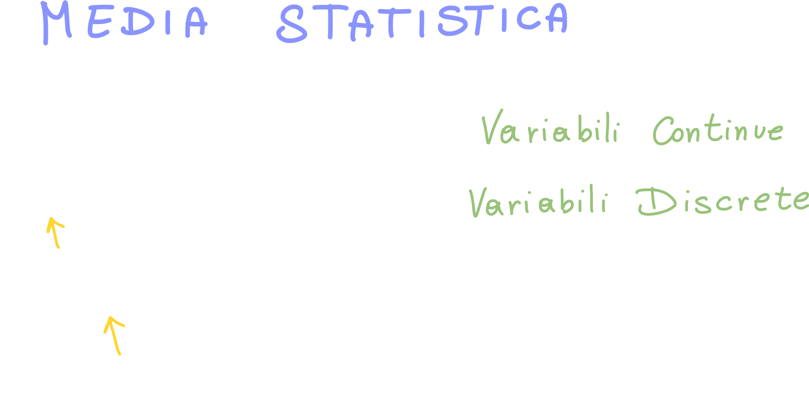

> Non Facciamo altro che prendere tutti i valori della variabile aleatoria, li **pesiamo** moltiplicandoli per la **probabilità che la variabile aleatoria assuma quel valore** (fX(x) e FX(x))

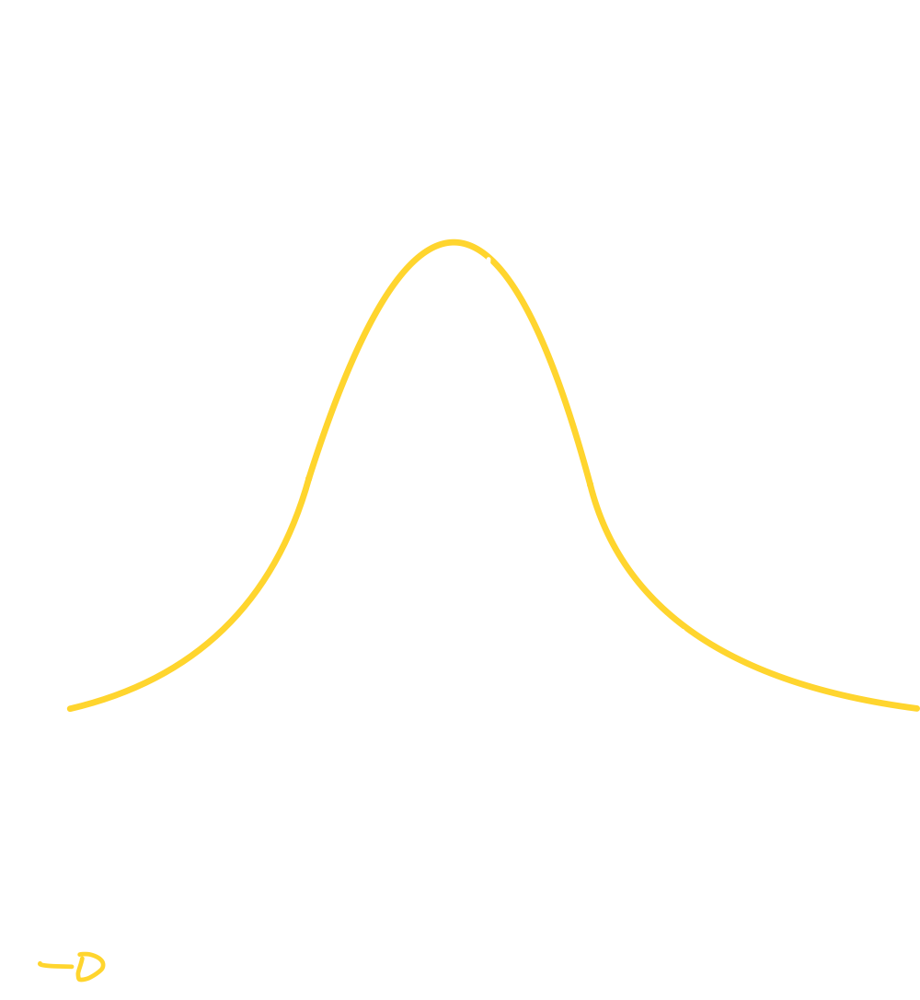

> Il "peso" è dato proprio **dalla probabilità che la x assuma proprio quel valore**.

**Perchè si chiama "media del valore atteso?"**
Essenzialmente perchè la media si concentra sui valori che sono **più probabili**!

## La media statistica confrontata a quella aritmentica (esempio discreto)

La media statistica non equivale alla media aritmetica (la media a cui siamo tutti abituati); questo perchè la media aritmetica di N valori (discreti) si calcola nel seguente modo:

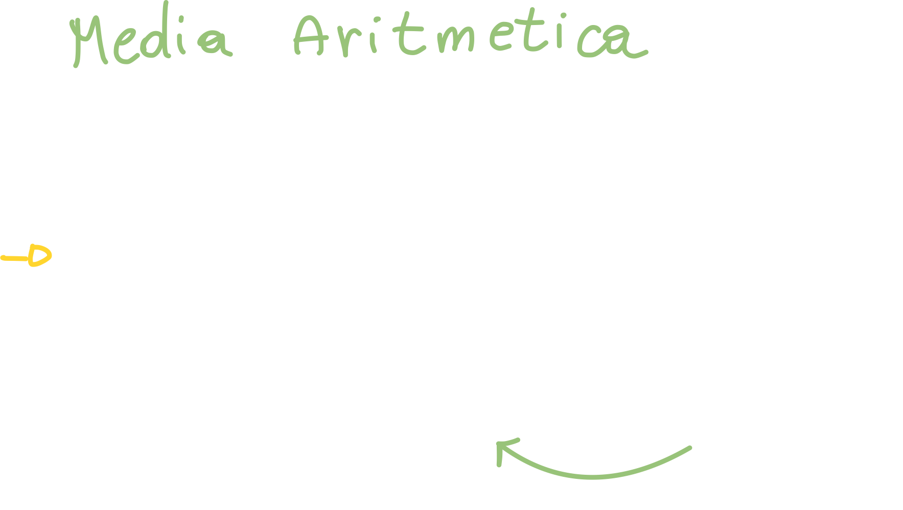

> Detto in maniera semplice: "somma di tutti i valori diviso il numero di valori".

Nella media Statistica di N valori (anche in questo caso siamo in ambito discreto) invece, abbiamo che la media viene calcolata nel seguente modo:

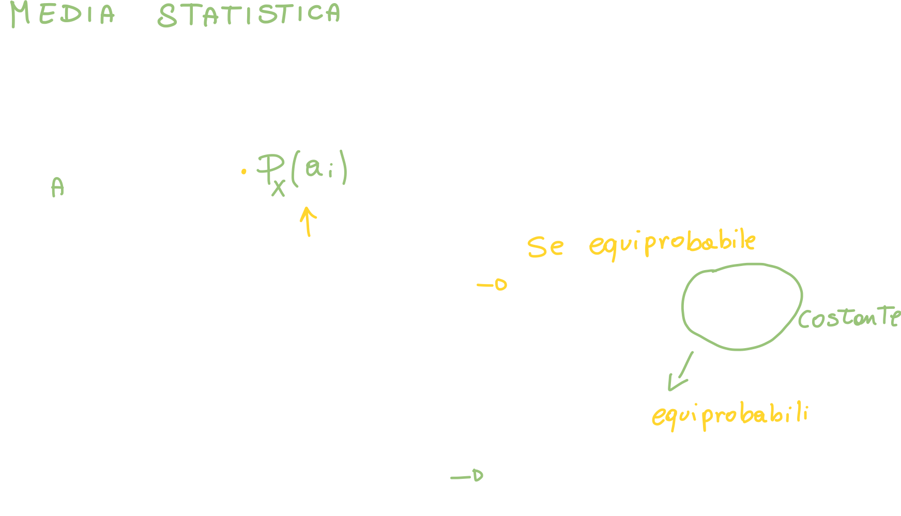

> Nel caso  in cui gli elementi sono equiprobabili, il "peso" diventa costante ed è quindi possibile portarlo fuori dalla sommatoria (o integrale nel caso continuo).

## Calcolare la media: Qualche esempio dalle varie variabili aleatorie

### Media della Variabile Bernoulliana - Esempio Variabile Discreta

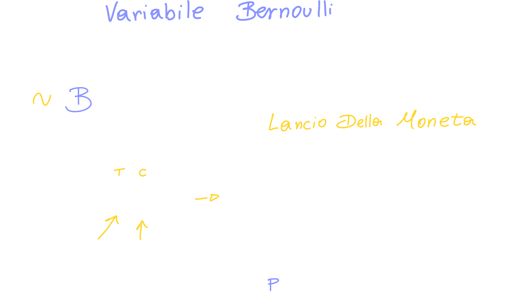

> Chiamiamo "q" la probabilità di "zero": `q = 1 - p`

Questa variabile aleatoria è di concezione molto semplice, quindi sarà altrettanto semplice calcolarne la media:

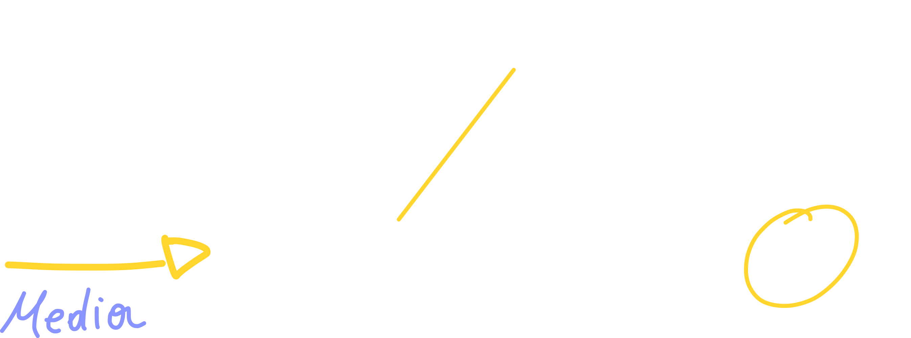

### Media della Variabile Aleatoria Esponenziale - Esempio Variabile Continua

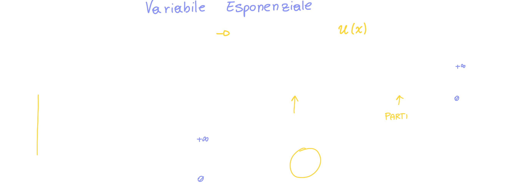

Possiamo definire la Variabile Aleatoria Esponenziale con la sua PDF, ma possiamo anche semplicemente dire che **ha una media pari ad 1/λ**

### Media della Variabile Gaussiana Standard - Esempio

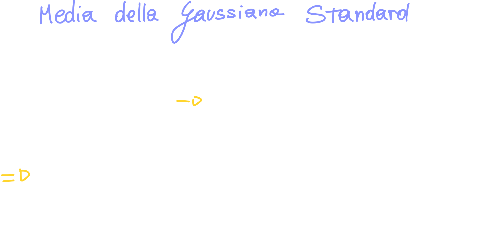

In questo caso possiamo dire fin da subito che l'integrale risulta zero perchè, se proviamo a *plottare* la funzione, ci accorgiamo immediatamente che è una funzione **pari**, il che ci dice che l'integrale di questa funzione parti da meno a più infinito, è proprio zero:

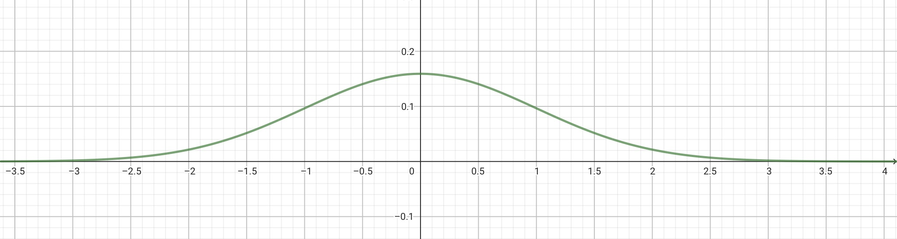

### Media della Variabile Gaussiana Non Standard - Esempio

Con la Gaussiana Non Standard ci accorgiamo di una particolarità interessante: se in quella standard abbiamo ottenuto "zero" come media, ci aspetteremo di ottenere il valore (appunto) medio anche in questo caso, che non è più fissato a 0, ma **varia a seconda di μ**!

**La media è un operatore lineare**: la media della somma è la <u>somma delle medie</u>, e la media della costante per la variabile aleatoria è uguale alla <u>costante per la media della variabile aleatoria</u>.

In altre parole μ è proprio questo il valore che assumerà la media, dimostriamolo:

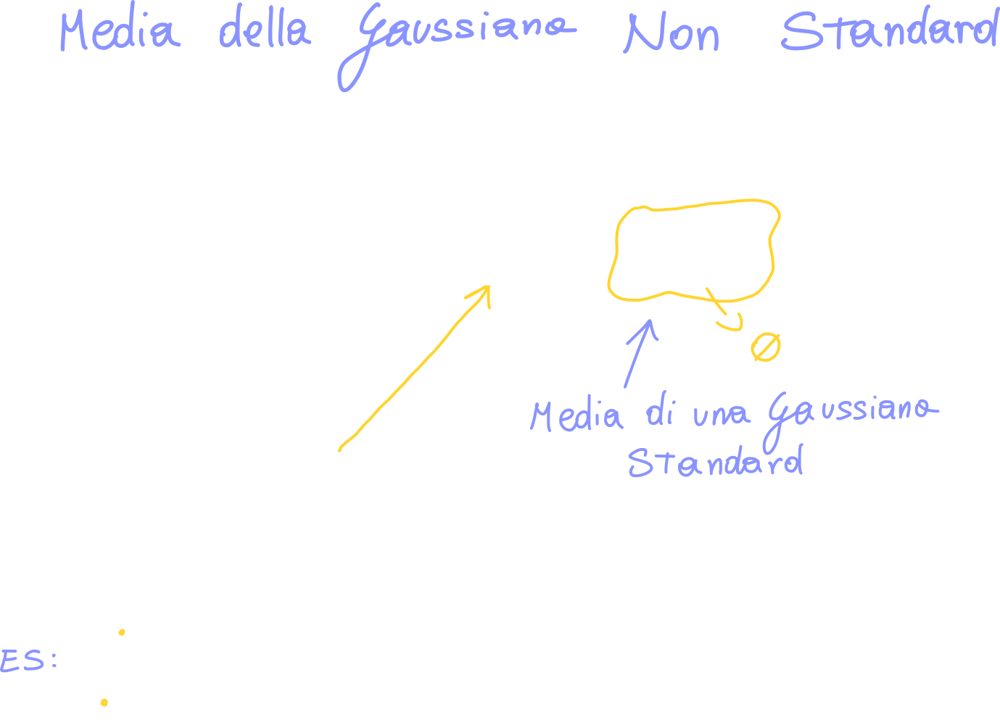

> Dimostriamo quindi che la **media statistica** di una gaussiana Non Standard è proprio pari a μ!
>
> È stato possibile dimostrarlo proprio perchè **abbiamo espresso la gaussiana non standard come quella standard**

#### Gaussiana Non Standard espressa come Gaussiana Standard

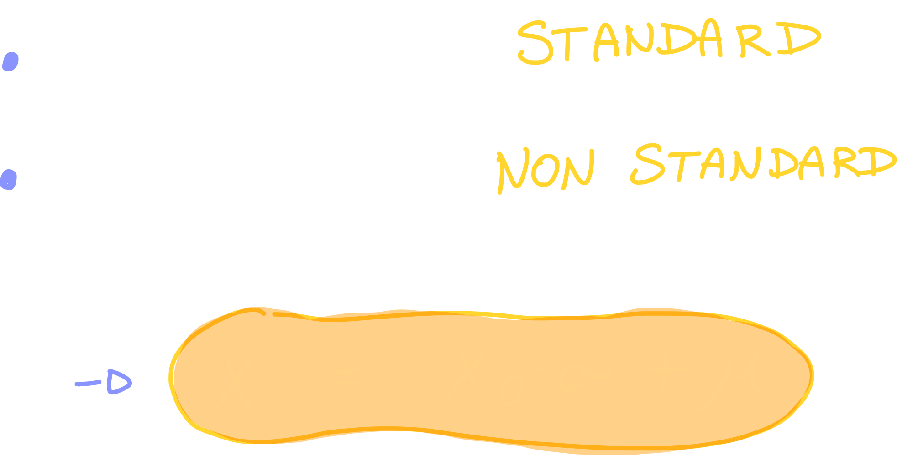

🏁 23:00

**Curiosità**
In statistica oltre alla media statistica esistono anche **Mediana e moda**, che **solo nel caso della Gaussiana**, <u>coincidono proprio a μ</u>.

### Media della Variabile Aleatoria Binomiale

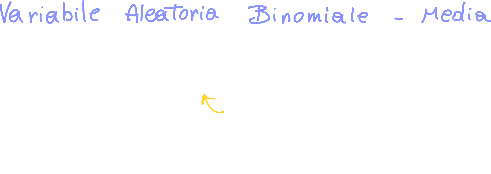

Possiamo però vederla come una sommatoria di variabili Bernoulliane:

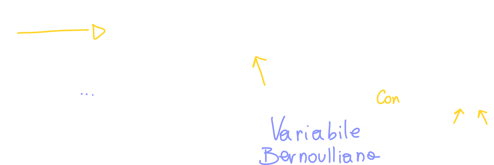

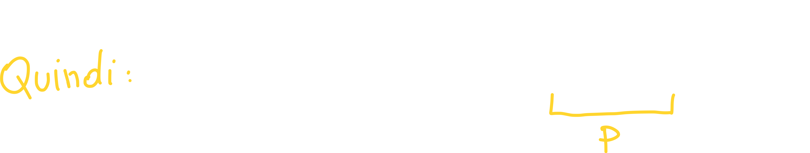

## Teorema Fondamentale Del Calcolo della Media

Sia X una variabile aleatoria con PDF o PMF assegnata; la media di una qualsiasi funzione g(x) può essere calcolata nel seguente modo:

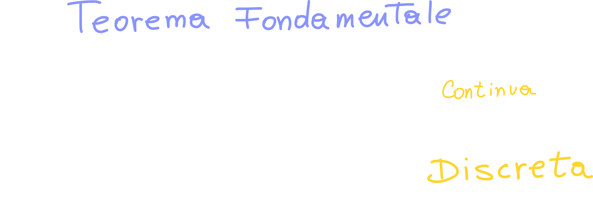

**Quando è utile?**
Ci torna molto utile quando abbiamo una funzione "difficile" di cui conosciamo la PDF: invece di calcolare la PDF della <u>nuova</u> variabile aleatoria (che è una funzione di quella precedente), ci basta integrare (o fare la sommatoria) rispetto alla PDF o PMF della variabile originaria.

**Non c'è bisogno di conoscere la PDF o PMF della funzione ma solo quella della Variabile Aleatoria Originaria.**

### Esempio

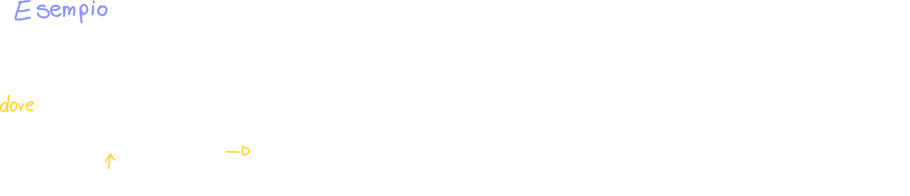

> Grazie a questo teorema, quindi, possiamo calcolare la media di una qualsiasi funzione se siamo a conoscenza della sua PDF o PMF

# Momenti di Una Variabile Aleatoria

La media è anche definita come "momento", ma cosa si intende per "momenti di una variabile aleatoria X" ?

**Si definisce** Momento di **ordine k** della variabile aleatoria X la quantità:

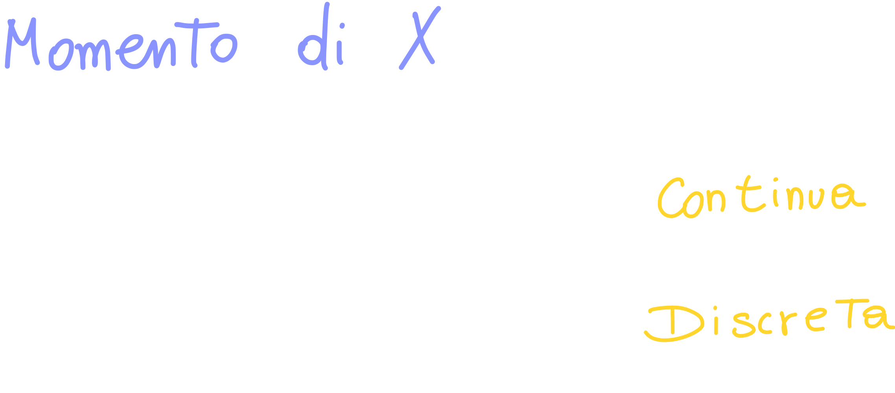

> Stiamo semplicemente elevando a **k** la **X**

# Momenti Centrali di ordine k

**Si definisce Momento Centrale** (detto anche *centrato intorno a μx*)  di ordine **k**, la quantità:

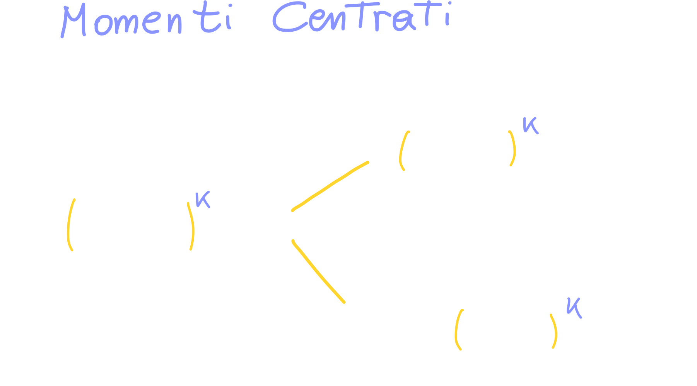

> La media è un **momento non centrato di ordine 1**.

🏁37:00