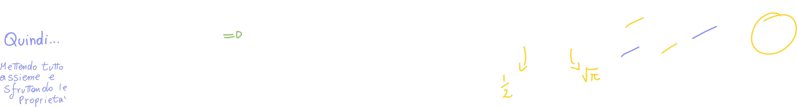

# Media Statistica: Rappresentazione sintetica delle variabili aleatorie

[TOC]

Introduciamo un **numero** che caratterizza la variabile aleatoria che si chiama **Media Statistica**:

> Non Facciamo altro che prendere tutti i valori della variabile aleatoria, li **pesiamo** moltiplicandoli per la **probabilità che la variabile aleatoria assuma quel valore** (fX(x) e FX(x))

> Il "peso" è dato proprio **dalla probabilità che la x assuma proprio quel valore**.

**Perchè si chiama "media del valore atteso?"**
Essenzialmente perchè la media si concentra sui valori che sono **più probabili**!

## La media statistica confrontata a quella aritmentica (esempio discreto)

La media statistica non equivale alla media aritmetica (la media a cui siamo tutti abituati); questo perchè la media aritmetica di N valori (discreti) si calcola nel seguente modo:

> Detto in maniera semplice: "somma di tutti i valori diviso il numero di valori".

Nella media Statistica di N valori (anche in questo caso siamo in ambito discreto) invece, abbiamo che la media viene calcolata nel seguente modo:

> Nel caso  in cui gli elementi sono equiprobabili, il "peso" diventa costante ed è quindi possibile portarlo fuori dalla sommatoria (o integrale nel caso continuo).

## Calcolare la media: Qualche esempio dalle varie variabili aleatorie

### Media della Variabile Bernoulliana - Esempio Variabile Discreta

> Chiamiamo "q" la probabilità di "zero": `q = 1 - p`

Questa variabile aleatoria è di concezione molto semplice, quindi sarà altrettanto semplice calcolarne la media:

### Media della Variabile Aleatoria Esponenziale - Esempio Variabile Continua

Possiamo definire la Variabile Aleatoria Esponenziale con la sua PDF, ma possiamo anche semplicemente dire che **ha una media pari ad 1/λ**

### Media della Variabile Gaussiana Standard - Esempio

In questo caso possiamo dire fin da subito che l'integrale risulta zero perchè, se proviamo a *plottare* la funzione, ci accorgiamo immediatamente che è una funzione **pari**, il che ci dice che l'integrale di questa funzione parti da meno a più infinito, è proprio zero:

### Media della Variabile Gaussiana Non Standard - Esempio

Con la Gaussiana Non Standard ci accorgiamo di una particolarità interessante: se in quella standard abbiamo ottenuto "zero" come media, ci aspetteremo di ottenere il valore (appunto) medio anche in questo caso, che non è più fissato a 0, ma **varia a seconda di μ**!

**La media è un operatore lineare**: la media della somma è la <u>somma delle medie</u>, e la media della costante per la variabile aleatoria è uguale alla <u>costante per la media della variabile aleatoria</u>.

In altre parole μ è proprio questo il valore che assumerà la media, dimostriamolo:

> Dimostriamo quindi che la **media statistica** di una gaussiana Non Standard è proprio pari a μ!
> 
> È stato possibile dimostrarlo proprio perchè **abbiamo espresso la gaussiana non standard come quella standard**

#### Gaussiana Non Standard espressa come Gaussiana Standard

🏁 23:00

**Curiosità**
In statistica oltre alla media statistica esistono anche **Mediana e moda**, che **solo nel caso della Gaussiana**, <u>coincidono proprio a μ</u>.

### Media della Variabile Aleatoria Binomiale

Possiamo però vederla come una sommatoria di variabili Bernoulliane:

## Teorema Fondamentale Del Calcolo della Media

Sia X una variabile aleatoria con PDF o PMF assegnata; la media di una qualsiasi funzione g(x) può essere calcolata nel seguente modo:

**Quando è utile?**
Ci torna molto utile quando abbiamo una funzione "difficile" di cui conosciamo la PDF: invece di calcolare la PDF della <u>nuova</u> variabile aleatoria (che è una funzione di quella precedente), ci basta integrare (o fare la sommatoria) rispetto alla PDF o PMF della variabile originaria.

**Non c'è bisogno di conoscere la PDF o PMF della funzione ma solo quella della Variabile Aleatoria Originaria.**

### Esempio

> Grazie a questo teorema, quindi, possiamo calcolare la media di una qualsiasi funzione se siamo a conoscenza della sua PDF o PMF

# Momenti di Una Variabile Aleatoria

La media è anche definita come "momento", ma cosa si intende per "momenti di una variabile aleatoria X" ?

**Si definisce** Momento di **ordine k** della variabile aleatoria X la quantità:

> Stiamo semplicemente elevando a **k** la **X**

# Momenti Centrali di ordine k

## Momenti centrali di ordine 1

**Si definisce Momento Centrale** (detto anche *centrato intorno a μx*)  di ordine **k**, la quantità:

> La media è un **momento non centrato di ordine 1**.

🏁37:00

# Momenti di Ordine II

Tutti gli esempi di valori (momenti) sono di **Momenti di ordine II**.

## Valore Quadratico Medio - MS

Viene detto anche **Valore MS**, che sta per **Mean Square**, tradotto: **Media Quadratica**.

Come il nome suggerisce, è semplicemente la media, non più di x, ma di x2:

## Valore Root Mean Square - RMS

A volte, invece di usare il valore MS, viene usato il RMS, detto anche **valore efficace**, e non è altro che la **radice dell' MS**:

## Varianza

Possiamo introdurre la varianza con un esempio:

L'altezza media degli studenti di una classe universitaria ci dice solo una parte di come è composta la classe (ci dice, appunto, solo la media delle altezze). Se oltre alla media conosciamo anche un valore che ci dice "più o meno" (rispetto alla media) **quanto variano le altezze**, abbiamo sicuramente una conoscenza nettamente maggiore della composizione della classe:

> Vediamo come la **varianza** non è altro che la **deviazione standard** elevata al quadrato; procediamo quindi alla definizione di deviazione standard.
> 
> **Attenzione!** Quando scriviamo E[(x-μ)2] e poi calcoliamo l'integrale (o la sommatoria), **dobbiamo ricordarci del teorema della media**, che ci dice che la funzione da calcolare va moltiplicata per la **PDF o PMF** della variabile aleatoria in esame!

## Deviazione Standard

Come abbiamo visto nella sezione precedente, la **deviazione standard** non è altro che la **radice della varianza**:

### Varianza di una trasformazione affine di una variabile aleatoria

## Gaussiana

Sappiamo che la Gaussiana non standard è definita come:

Abbiamo visto prima che la varianza di aX+b è pari a (a2 σ2), ed infatti:

Il problema sopraggiunge quando ci accorgiamo di non conoscere la varianza di X0, dobbiamo quindi calcolarla...

## Varianza di una Gaussiana Standard

> Immagine (1)

Giunti a questo punto, "ci ricordiamo" che esiste una funzione chiamata "gamma di Eulero" (Γ(k)) che è proprio uguale a...

> Immagine (2)

Tramite qualche passaggio algebrico, quindi, ci accorgiamo che l'integrale ottenuto nell'immagine (1) è proprio l'integrale ottenuto nella (2) con parametro `(1/2 + 1)`:

Questa è una funzione particolare, e gode della proprietà:

Scopriamo quindi che **la varianza della Gaussiana Standard ha varianza pari ad 1** :

Abbiamo così dimostrato che la gaussiana Standard ha **Media Nulla** e **varianza unitaria**, proprio pari ai parametri della funzione!

Ma non era questo il punto della dimostrazione, infatti il nostro obbiettivo era quello di ricavare la varianza della **Gaussiana Non Standard:**

## Varianza di una Gaussiana Non Standard

Abbiamo così dimostrato che la varianza di una Gaussiana Non Standard **è proprio σ2**! Che corrisponde proprio ad uno dei parametri della funzione:

Deduciamo quindi che i parametri usati nella Gaussiana Non Standard, oltre ad essere dei parametri usati per la **posizione** e **scala** (graficamente), hanno anche un **significato di caratterizzazione sintetica della variabile**!

# Valore quadratico medio (MS), Varianza e Media sono legate tra loro

Se definiamo una variabile aleatoria Gaussiana con una sua media e varianza, seguirà che il valore MS viene calcolato (derivato) da Media e Varianza; lo stesso accade a parti inverse: se sono definiti MS e Varianza, allora la Media viene calcolata dalle altre due.

**Vediamo perchè:**

Possiamo quindi collegare tra loro tutti e 3 i valori:

# Raccolta di esercizi

Fino a 1:35 vengono risolti degli esercizi sui **momenti**.

# Recap della lezione

Abbiamo visto i **momenti**, che non sono altro che dei **numeri**, che in maniera **sintetica** ci caratterizza la variabile aleatoria, **senza l'ausilio della funzione.**

Ad esempio: se abbiamo una gaussiana e ci viene detto che la media "170", sappiamo benissimo che la nostra variabile aleatoria è centrata in μx (ovvero la media) e se ci viene fornita anche la deviazione standard, sappiamo quanto è piatta o quanto è "alta" la Gaussiana.

---

Abbiamo anche introdotto altri "numeri" che ci caratterizzano la variabile aleatoria, che sono i **momenti di ordine altro** (k), introducendo il **momento di secondo ordine**. 

Sono momenti di secondo ordine:

- Valore quadratico medio
- Il valore RMS
- Varianza

Questi sono detti **momenti Centrali**, perchè la varianza (ad esempio) è un **momento del secondo ordine centrato** (ovvero con la **media** sottratta).
