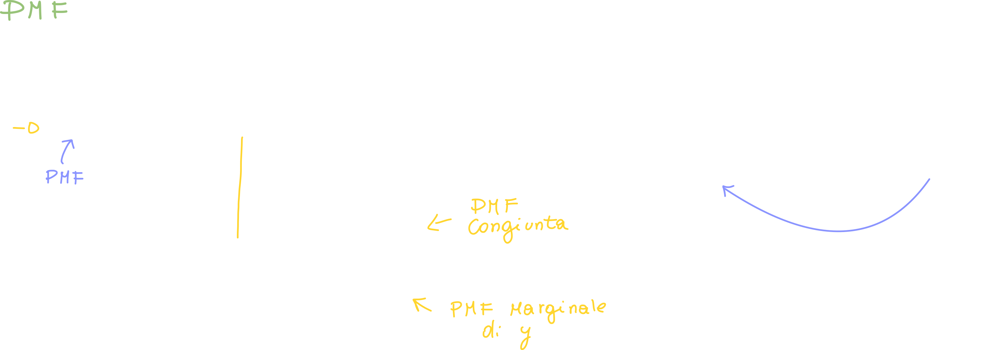

# Raccolta di esercizi

## Esercizio sul calcolo della media di due variabili aleatorie

In questo caso viene usato il calcolo di una variabile di tipo Mixture in modo da calcolare la media di due variabili aleatorie.

# Caratterizzazione congiunta di due variabili aleatorie

Dobbiamo fare un passo indietro: **consideriamo la CDF congiunta di X e Y:**

Pensiamo al caso in cui vogliamo valutare la probabilità che l'altezza sia minore di 160cm ed il peso sia minore di 70kg; quindi cosa stiamo valutando?

> Possiamo considerare un qualsiasi esperimento aleatorio che prenda in considerazione **due aspetti diversi** dello stesso esperimento (ie: altezza e peso)

Attraverso una caratterizzazione congiunta (sia X che Y), dove "arriviamo"?

Non avremo più uno spazio **unidimensionale**, ma ne avremo uno **bidimensionale**, ovvero un asse x ed uno y; data la coppia (x,y) stiamo valutando la probabilità relativa al rettangolo, che corrisponde proprio a:

> La probabilità che X sia minore di x **contemporaneamente** alla probabilità che Y sia minore di y.

Ricordandoci della definizione di **eventi indipendenti** (visti nella lezione) possiamo scrivere la probabilità come:

Non è però detto che l'uguaglianza si verifichi: basti pensare proprio all'esempio di altezza e peso, queste due **non sono indipendenti!**.

Dobbiamo quindi andare a definire le **CDF congiunte** delle nostre variabili aleatorie:

## CDF congiunta

Definiamo la CDF congiunta proprio come una Funzione delle variabili (x,y) definita non più in R ma in R2, la funzione:

## PDF e PMF congiunte

> Ricordiamo che la PMF è una probabilità menter la PDF non lo è;
>
> Inoltre anche le CDF, PMF e PDF <u>congiunte</u> godono delle proprietà viste con le CDF, PMF e PDF.

# Distribuzioni Condizionate ad un EVENTO B

Si definisce CDF condizionata a B:

## PMF condizionata

PDF condizionata

### Esempio - Radar ad impulsi

# Distribuzioni Condizionate ad una VARIABILE ALEATORIA Y

## PMF

## PDF

## Leggi della probabilità per la PDF

# Variabili Aleatorie Statisticamente Indipendenti

## Per variabili aleatorie discrete

## Per variabili aleatorie continue

### PDF generalizzata per v.a. statisticamente indipendenti

# Caratterizzazione congiunta sintetica - Momenti Congiunti di ordine k

È definita allo stesso modo dei momenti di v.a. singole:

Il vantaggio dei momenti congiunti di ordine k è che essi contengono "tutti i momenti", anche di variabili singole:

Se poniamo m = 1 ed r = 1 otteniamo la Correlazione di x ed y

## Correlazione di (x,y) - Media di (x,y)

# Momenti Centrali Congiunti

Anche in questo caso il momento centrale congiunto di ordine k racchiude "tutti i momenti", compresa la varianza, che è proprio un **momento centrale di ordine 2**.

Se poniamo m = 2 ed r = 0 otteniamo proprio la varianza:

## Covarianza

Se poniamo m = 1 ed r = 1 otteniamo la covarianza:

La covarianza è una misura che ci dice **come due variabili cambiano insieme, in altre parole, ci dice se c'è una relazione lineare tra due variabili.**

A seconda del valore della covarianza abbiamo:

- CXY > 0 : **le due variabili x ed y aumentano e diminuiscono insieme**
- CXY < 0 : **quando una variabile aumenta, l'altra diminuisce e viceversa**
- CXY = 0 : **non c'è correlazione tra le due variabili**

Quando la covarianza è zero, vuol dire che non c'è correlazione tra le due variabili, si dicono quindi **incorrelate**.

---

## Esprimere la Correlazione tramite la Covarianza

Possiamo esprimere la correlazione tramite la Covarianza andando ad **esplicitare la media** (facciamo i calcoli e sostituiamo quà e là):

## Cosa succede quando due variabili sono incorrelate?

Quando due variabili sono incorrelate ed andiamo a calcolarne la media (Correlazione) otteniamo il prodotto delle medie delle due variabili.

# Variabili Gaussiane Congiunte

