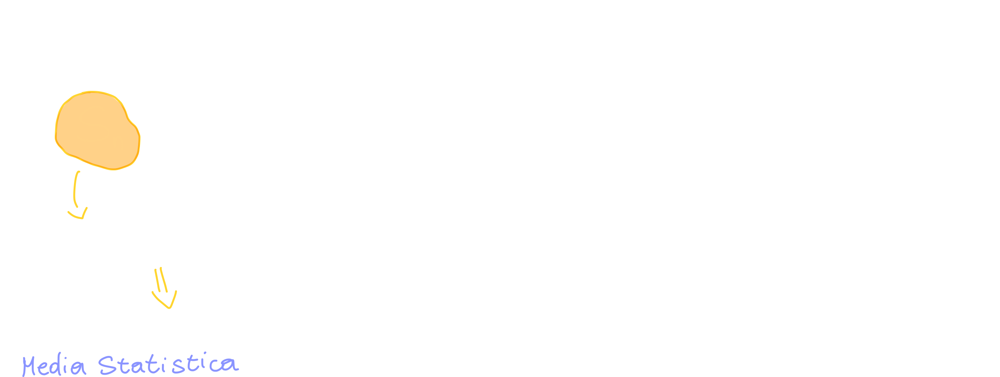
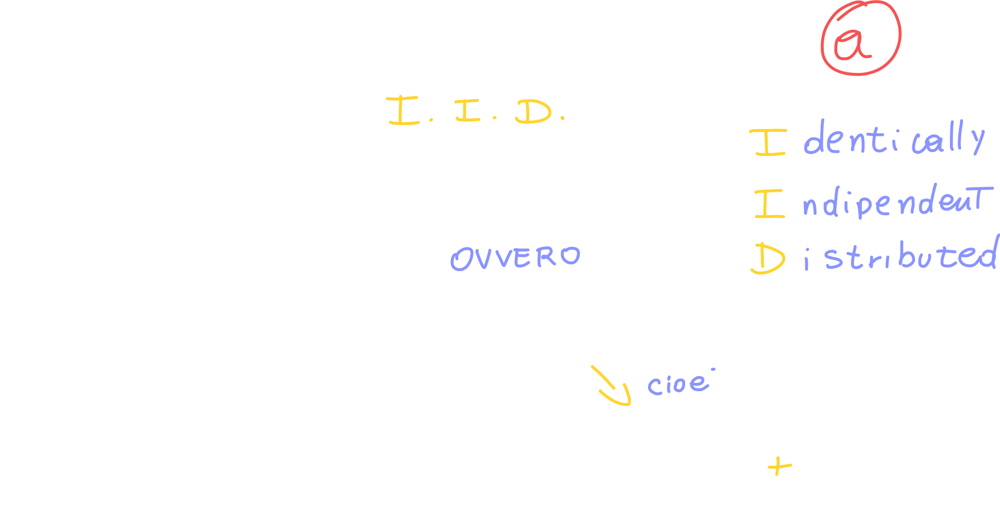
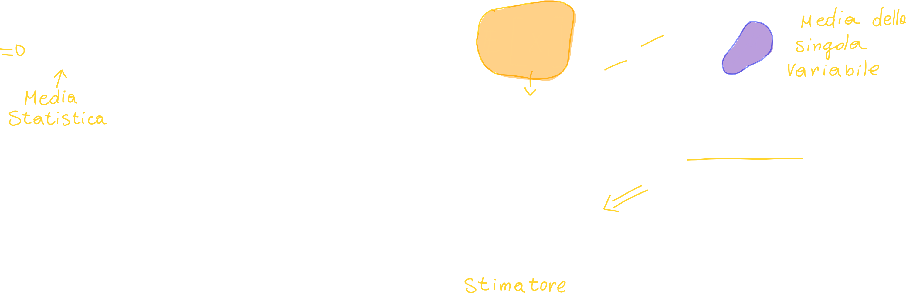
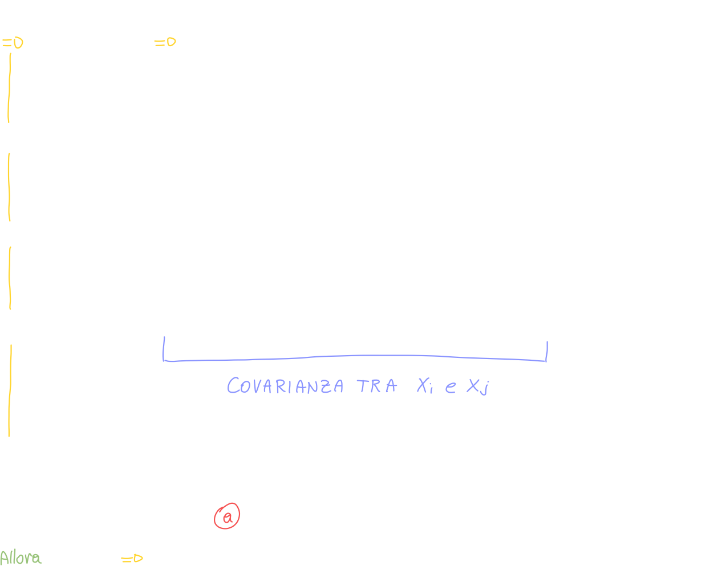
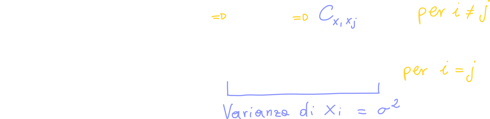
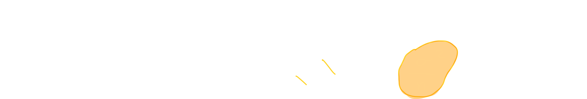
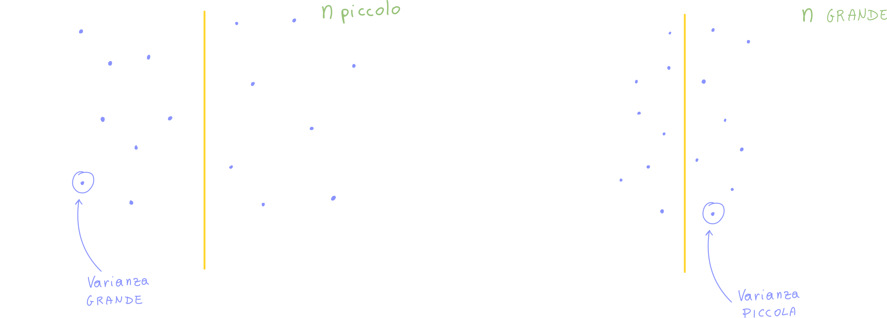
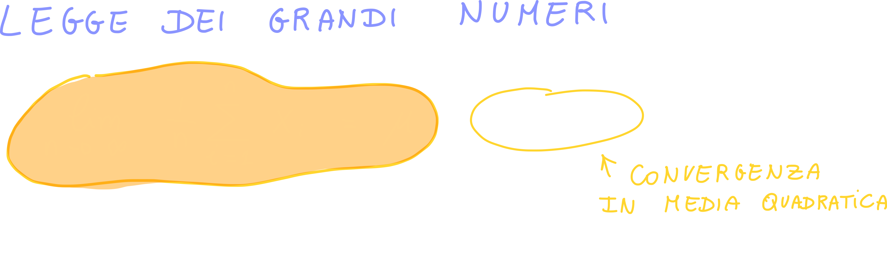

# Variabili Aleatorie Congiuntamente Gaussiane

#ToDo

# Teoria della stima

La teoria della stima ci insegna a trovare la **migliore stima di un valore** specifico a partire da un campione (come potrebbe essere una popolazione); per "stima migliore" intendiamo **trovare la stima quanto più possibile vicina al valore del parametro reale**.

Definiamo la media campionatria o media aritmetica come una nuova **variabile aleatoria** che effettua la media delle diverse variabili aleatorie:

## Media campionaria

Come abbiamo detto, Xn sono le variabili aleatorie du cui effettuare la stima:

## Media statistica della media campionaria

La media statistica è l'operazione di media (che abbiamo utilizzato finora sulle variabili aleatorie) applicata sulla media campionaria:

## Varianza statistica della media campionaria

Calcoliamo la varianza della media campionaria:

Otteniamo che la varianza della media campionaria è

- **Indipendente**, quindi **incorrelata**, **se la covarianza tra le due (o più) variabili è zero**.
- Media campionaria delle varianze delle variabili aleatorie

Se le varianze sono tutte uguali, possiamo semplificare nel seguente modo:

Quello che otteniamo ci dice che **la varianza della media campionaria diminuisce all'aumentare di n** (ovvero degli elementi della distribuzione):

Se traduciamo tutto visualmente:

# Legge dei grandi numeri

Tutto questo ragionamento ci porta alla **legge dei grandi numeri**:

La legge dei grandi numeri nella teoria della probabilità afferma che se ripetiamo un esperimento casuale molte volte, la media dei risultati si avvicina sempre di più al valore atteso del risultato, ovvero alla probabilità di ottenere un certo risultato.

Possiamo tradurre il tutto in formule:

"mu" è proprio il valore atteso.