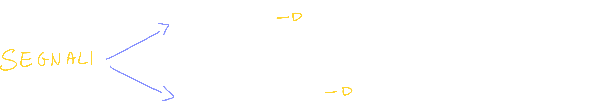
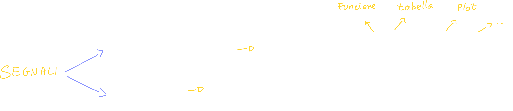

# I Segnali

Ci sono diversi tipi di segnali; i primi due tipi che vediamo sono i... 

## Overview

### Segnali monodimensionali  segnali bidimensionali

### Segnali reali e complessi

### Segnali deterministici ed Aleatori

### La variazione di grandezza del segnale

Il segnale può essere defiito su una variabile spaziale, ma per convenzione definiamo il segnale **al variare del tempo**:

> Tempo Continuo: ad esempio un segnale audio
>
> Tempo Discreto: ci riferiamo ad una sequenza

🏁 1:13

## Trasformazioni dei segnali

Possiamo effettuare diverse operazioni sui segnali; la prima grande distinzione di operazioni è sicuramente quella che divide le **operazioni sull'ampiezza** o sul **tempo** di un segnale:

## Traslazione temporale - Time shifting

La prima operazione che vediamo è la **traslazione temporale**; con questa operazione andiamo a "shiftare" (infatti in inglese viene detta _time shifting_) il segnale in avanti o indietro nel tempo; bisogna notare che questa operazione <u>non modifica il tempo di riferimeto</u>:

### Shift a destra (Ritardo, T0 positivo)

Bisogna notare che anche se vediamo un segno meno nella definizione del segnale y(t), **T0 è positivo!**

### Shift a sinistra (Anticipazione T0 negativo)

## Cambiamento di scala - Time Scaling

Questa operazione va a **modificare il tempo di riferimento**, che si **restringe o dilata** a seconda del fattore moltiplicativo a:

### Come effettuare il cambiamento di scala?

## Riflessione

L'operazione di riflessione, semplicemente riflette il segnale attorno **al suo** centro (non l'origine!)

## Combinazione di più operazioni

Possiamo combinare più operazioni ed applicarle allo stesso segnale:

Ci conviene sempre applicare un'operazione alla volta, rispettando un ordine:

1. Riflessione (se presente)
2. Time scaling (se presente)
3. Time shifting (se presente)

