# Segnali Elementari

[TOC]

## Gradino Unitario

### Gradino a Tempo Continuo


### Gradino a Tempo Discreto


### Tracciare il gradino unitario con MATLAB

```matlab
% il gradino unitario è un segnale particolare che vale zero per valori del tempo negativi e vale 1 per valori del tempo positivi.
clear all
close all
clc


x = [-5: 0.1: 5];
%y = zeros(size(x));
y = [-5: 0.1: 5];

for i = 1:length(x);
    if x(i) < 0
        y(i) = 0;
    else
        y(i) = 1;
    end
end

subplot(2,1,1);
stem(x,y);

subplot(2,1,2);
plot(x,y);
```

Output:

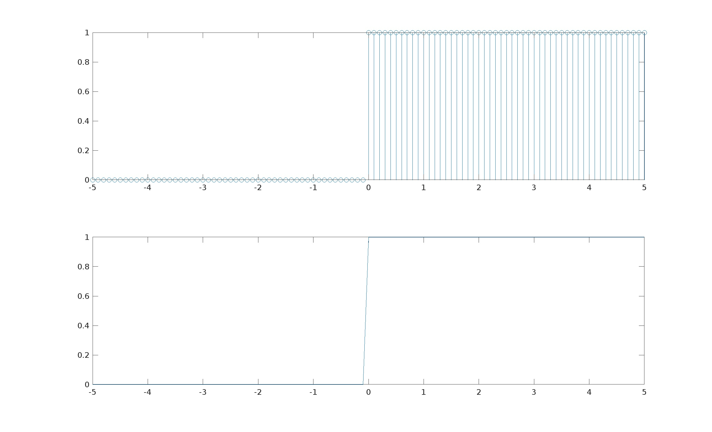

### Finestra rettangolare a partire da due gradini unitari


## Finestra / Impulso Rettangolare

### Finestra a Tempo Continuo

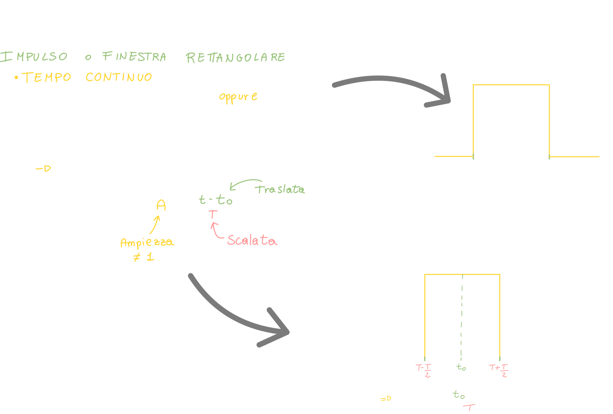

#### Tracciare una finestra 

Questa finestra ha periodo T = 1, è centrata in zero ed ha ampiezza 1

```matlab
clear all;
close all;
clc;

syms x;										% variabile simbolica x
y = piecewise(x<-1/2, 0, x>1/2, 0, 1);	% funzione definita a tratti
x_values = [-2: 0.1: 2];					% creo un array di valori reali

y_numeric = subs(y, x, x_values);			% sostituisco i valori simbolici in reali


fplot(y, [-2 2]);
```

Con un output del tipo:

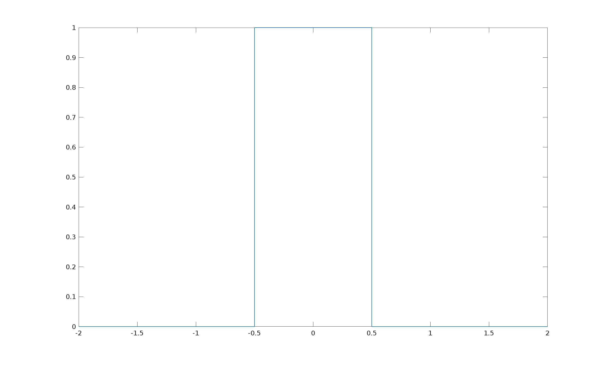

#### Trasformazioni di una finestra

Questa finestra è centrata in t0, ha ampiezza A e periodo T:

```matlab
% finestra centrata in t0, con periodo T ed ampiezza A
syms x;										% variabile simbolica x

t0 = 2;		% centrata in x = 2
T = 3;			% periodo T
A = 2;

y = A * piecewise((x < (t0 + T/2)) & (x > (t0 - T/2)), 1, 0);

fplot(y, [-5 5]);
```

Output:


### Finestra a Tempo Discreto


> **Correzione immagine:** la finestra rettangolare discreta <u>è uno anche in zero</u>, non da n=1
>
> Quindi R<sub>N</sub>[n] = 1 per 0 <= n <= N-1

**Tracciare il segnale discreto con matlab:**

```matlab
clear all;
close all;
clc;

N = 1;
magnitude = 10;

time = -2: 1/magnitude : 2;
signal = zeros(1, length(time));
signal(time >= 0 & time <= N-1/magnitude) = 1;     % finestra

stem(x_values, discrete_window);							% visualizzo il segnale discreto
```

> Funzione discreta tracciata tramite una variabile simbolica x

Output:

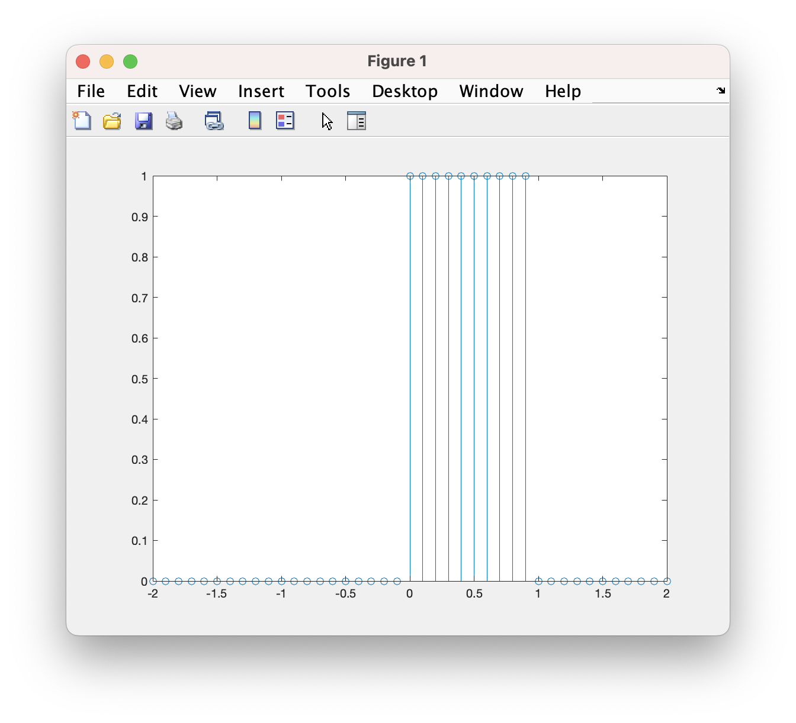

## Finestra Triangolare

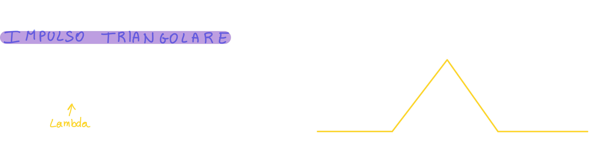

### Tracciare la funzione triangolare con matlab

```matlab
clear all
close all
clc

figure(1);
x_range = 10;
y_range = 2;

x = [-x_range: 0.1: x_range];
y = [-y_range: 1: y_range];

for i = 1:length(x)
    if ((x(i) < 1) & (x(i) > -1))
        y(i) = 1-abs(x(i));
    else
        y(i) = 0;
    end
end

plot(x,y);
```

Output:


## Impulso Discreto Generale

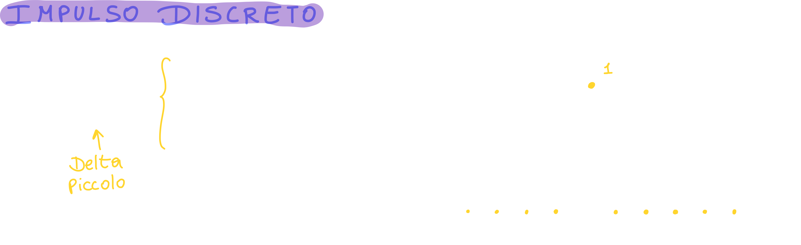

### Proprietà dell'impulso discreto

#### Proprietà I dell'impulso Discreto Generico


#### Proprietà II dell'impulso Discreto Generico


### Tracciare l'Impulso discreto con MATLAB

```matlab
clear all
close all
clc

x = [-5: 1: 5];		% un valore ogni 1
y = [0: 1: 1];		% solo due valori: 0 ed 1

x_value_for_impulse = 0;
figure(1);

subplot(2,1,1);
%stem(x,y);

for j = 1 : 2
    for i=1:length(x)
    	if x(i) == x_value_for_impulse
        y(i) = 1;
    	else
        y(i) = 0;
    	end
    end
    
    x_value_for_impulse = x_value_for_impulse + 1;
    subplot(2,1,j);
    stem(x,y);    
end
```

L'esempio in questione ci mostra due impulsi discreti generico: uno in t = 0 ed un in t = 1:


## Impulso a tempo continuo

L'impulso continuo è utilizzato per prelevare il valore di un secondo segnale in un determinato istante temporale; se effettuiamo l'integrale di un segnale per l'impulso otterremo il valore del segnale **in zero** se zero appartiene all'intervallo (t<sub>1</sub>, t<sub>2</sub>), otterremo zero altrimenti.

Questo si verifica perche l'impulso a tempo continuo (senza shift temporali) vale 1 in t=0 e 0 altrimenti. È quindi evidente che se moltiplichiamo un segnale per la delta, otterremo sempre zero tranne che in t=0, dove otterremo proprio il valore del segnale.

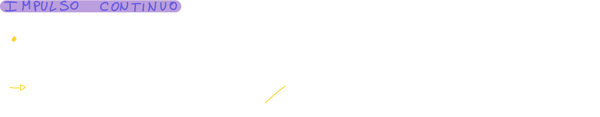

La delta ha delle proprietà importanti:

### 1. Proprietà della Normalizzazione per la delta

L'impulso ha area unitaria:
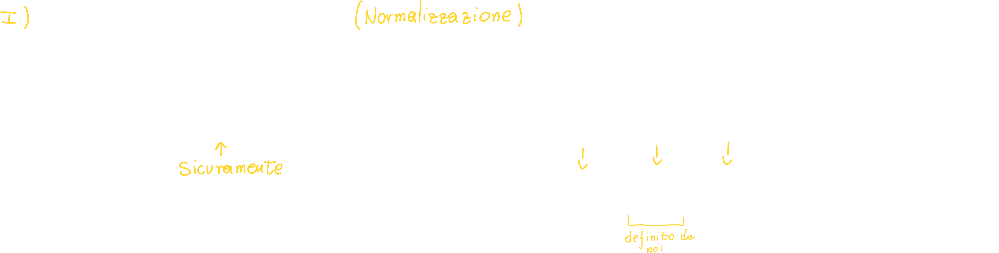

**Attenzione!**
Non è come fare l'integrale di una costante! Infatti se proviamo a fare l'integrale di una costante otteniamo:

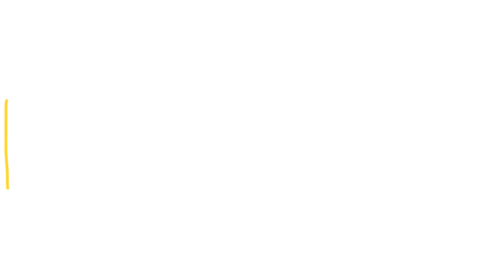

### 2. Proprietà del campionamento per la delta

Abbiamo visto all'inizio di questa sezione che la delta viene usata per il **campionamento** dei segnali; dimostriamo che la delta moltiplicata per un segnale ci restituisce il segnale valutato in zero:

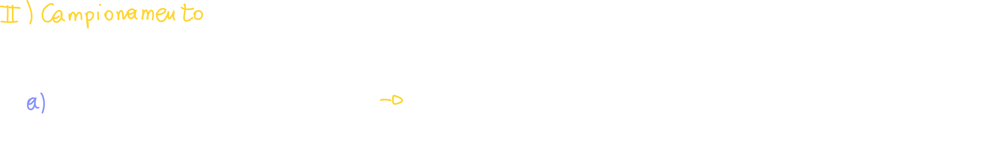

Se consideriamo come x(t) un segnale che è dato dal prodotto di due segnali, otteniamo il prodotto del campionamento di quei due segnali in zero:

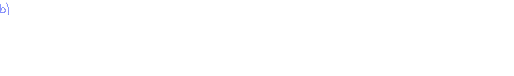

Se a questo punto proviamo ad usare un segnale x(t) dato dal prodotto di due segnali valutati in zero, otteniamo:

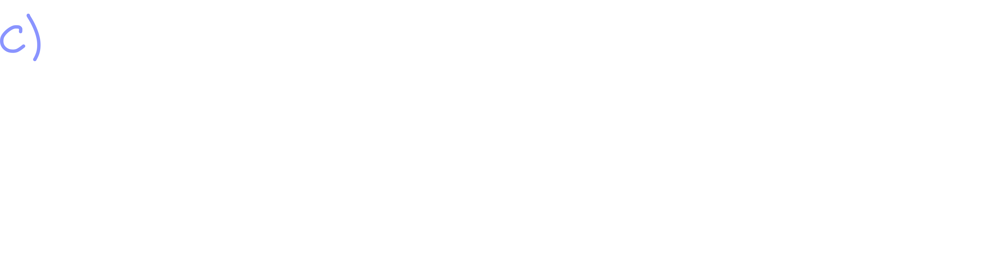

Se ci facciamo caso, **il risultato di (c) è il medesimo del risultato di (a)**, di conseguenza campiamo che:

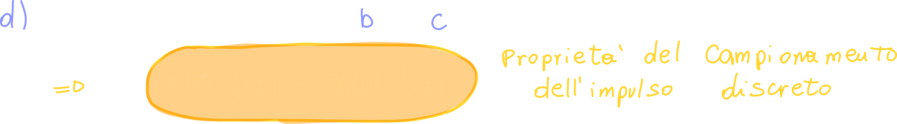

### 3. Proprietà del Cambiamento di scala - Time Scaling della delta

Se proviamo a moltiplicare il tempo della delta per un valore **a**, otteniamo che il prodotto di un segnale x(t) per la delta soggetta a time scaling sarà:

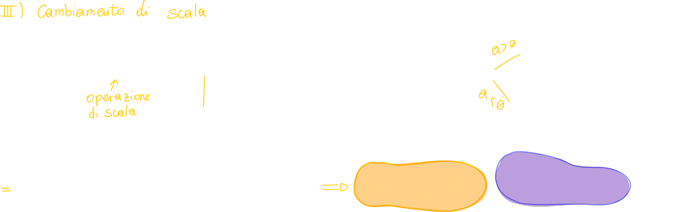

**Che cosa vuol dire?**
Questo ci permette di non fare calcoli inutili, ma portare direttamente la costante moltiplicativa al di fuori del calcolo; questo ci è permesso perchè la delta soggetta a time scaling (per una costante a), è uguale alla delta stessa moltiplicata per **1/|a|**.

Il modulo è utilizzato nel caso in cui abbiamo **a** pari ad un numero complesso; in casi di **a** appartenente ai numeri reali, ci basterà considerare **a** stessa.

**Inoltre**
Questa proprietà ci permette di dimostrare un'altra proprietà: la delta è "immune" al **flip temporale**:

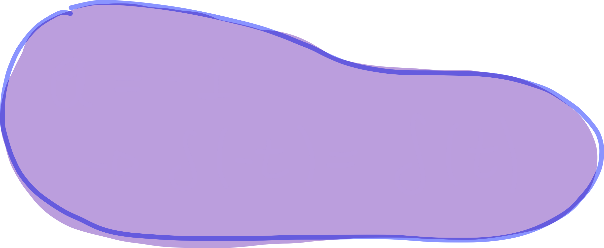

> Il segnale delta flippato temporalmente è uguale al segnale delta iniziale.

### 4. Proprietà di Riproducibilità - Time Shifting della delta

Se consideriamo un segnale x(t) moltiplicato per una delta soggetta a **time shifting**, otteniamo proprio il segnale valutato nell'istante temporale shiftato della delta. 

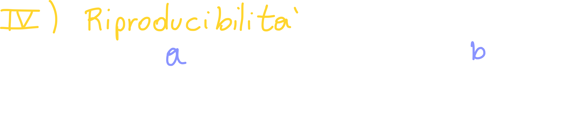

**Dimostriamolo:**

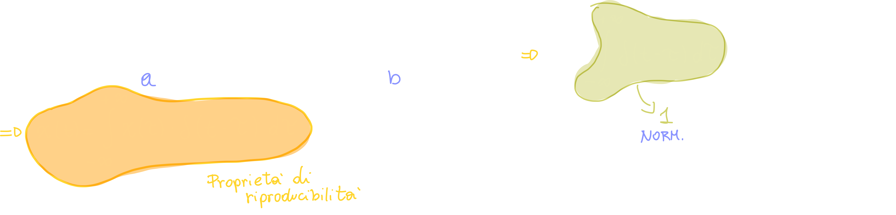

#### Gradino unitario moltiplicato per una delta shiftata

Se moltiplichiamo un segnale gradino unitario per una delta shiftata otteniamo:


#### Codice matlab proprietà campionamento + time shifting della delta per un segnale qualsiasi

Il codice riportato crea un segnale delta di Dirac a partire da un array (tempo) effettuando il **time shift del tempo** .

> NB: il time shifting, come si intuisce dal suo nome (purtroppo non sempre è cosi intuitivo!) effettua uno **shift del tempo**  e **non del segnale!** 
>
> È per questo motivo che quando effettuiamo uno shift temporale per un **valore positivo**, il nostro segnale **si muove verso sinistra, e non verso destra come ci aspetteremmo.**

```matlab
clear all
close all
clc
figure(1);
magnitude = 100;    % la precisione (passo) del grafico finale e del tempo                                           

time = -1 : 1/magnitude : 1;    % definisco il tempo
T0 = 2/5;                        % shift della delta (o meglio del tempo!)
f = 1/2;

[newDelta, newTime]= delta_function(time, T0*magnitude);   % delta shiftata di
x = cos(2*pi*newTime*f);             % dummy function definita per controllare di aver fatto tutto bene

subplot(3,1,1);
stem(newTime, newDelta);         
title('delta shiftata');

subplot(3,1,2);
plot(newTime,x);
title('funzione coseno');
hold on
scatter(-T0, cos(2*pi*T0*f));			% posiziono un punto nelle coordinate di "intersezione" tra la nostra delta ed il valore effettivo del coseno in quel punto

subplot(3,1,3);
stem(newTime, newDelta.*x);
ylim([-1 1]);


function [delta_function, shifted_time] = delta_function(time, timeShift)
    shifted_time = time;
    delta_function = zeros(1, length(shifted_time));
    delta_function(shifted_time == 0) = 1;

    shifted_time = circshift(shifted_time, timeShift);
end

```

Otteniamo quindi:

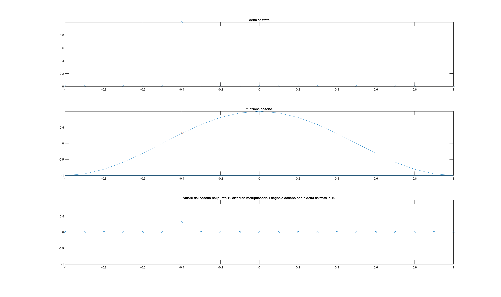

## Fasore a tempo continuo

Il fasore non è altro che la **rappresentazione nel campo complesso di un segnale sinusoidale**; possiamo definirlo anche come **un modo di rappresentare un numero complesso.**

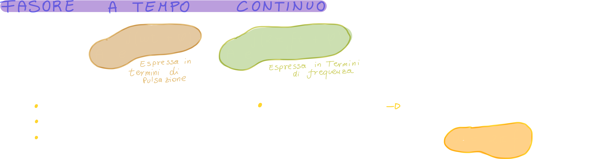

Ci accorgiamo che il fasore rappresenta una sinusoide guardando il grafico:

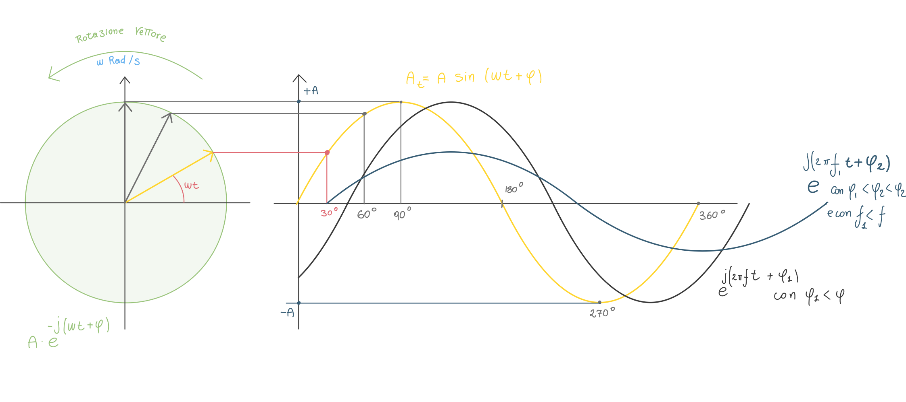

### Come si rappresenta un segnale complesso?

Per rappresentare un segnale complesso dobbiamo conoscere **modulo e fase del segnale**; in alternativa possiamo rappresentarlo in forma fasoriale come **un vettore**:

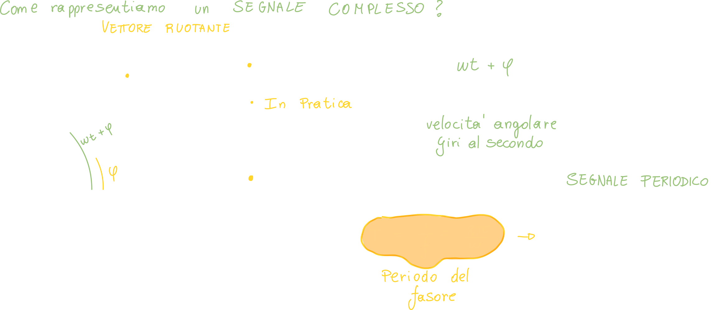

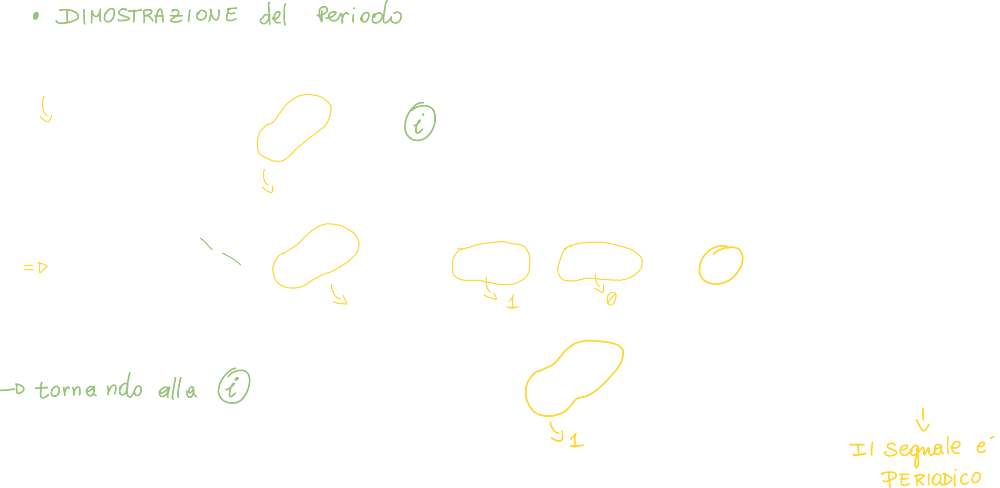

## Fasore a tempo discreto

Il fasore a tepo discreto è apparentemente (nella definizione) molto simile al fasore a tempo continuo:

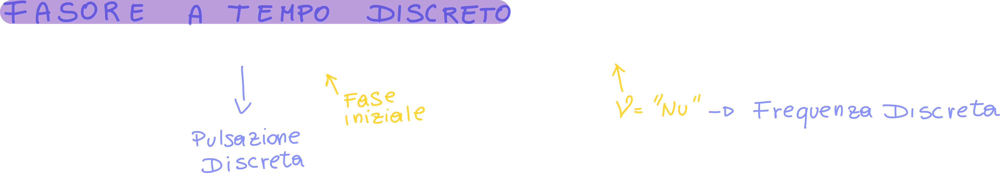

### Il fasore a tempo discreto non è periodico

A differenza del fasore a tempo continuo, il fasore a tempo discreto non è periodico, o perlomeno, non lo è sempre;

Dobbiamo quindi provare a dimostrare che:

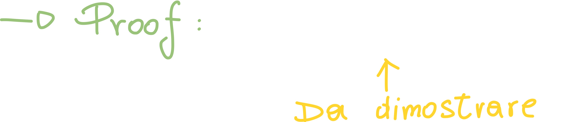


Ci riscriviamo quindi il tutto andando a sostituire ai segnali il nostro fasore; possiamo dividerci il secondo esponenziale e notiamo che affinchè il secondo membro sia uguale al primo, il prodotto dei due exp appena separati deve essere uguale proprio al fasore iniziale e<sup>jθn</sup>: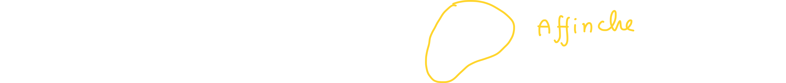

A questo punto dobbiamo porci la domanda: _quando e<sup>jθn</sup> è pari proprio ad 1?_
Ci ricordiamo che possiamo scrivere un fasore come coseno e seno:
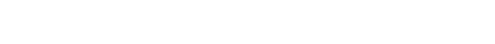

Di conseguenza il coseno è uguale ad 1 a cadenza regolare di periodo **2kπ**, di conseguenza:

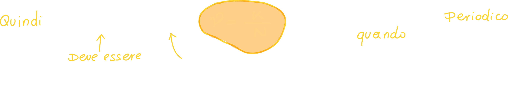

Ci accorgiamo che il fasore a tempo discreto **è periodico solo quando nu è pari a k/N**.

### Il fasore a tempo discreto non fluttua sempre più velocemente al crescere della pulsazione/frequenza

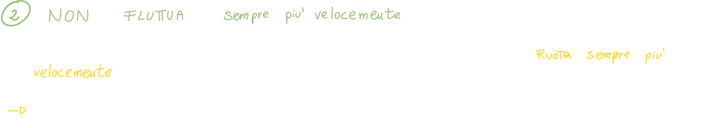

Per convincerci di questo fatto ci basta scrivere un fasore ed un secondo fasore _presumibilmente_ più veloce:

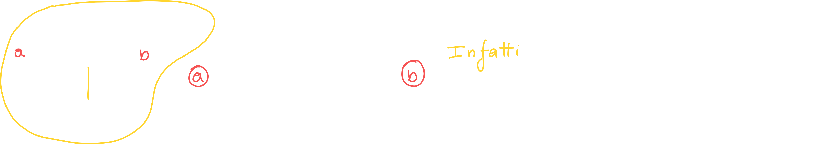

Ci convinceremo velocemente che se aumentiamo la frequenza/pulsazione di uno dei due fasori, questi possono ancora essere uguali nel momento in cui gamma è uguale a 2π!

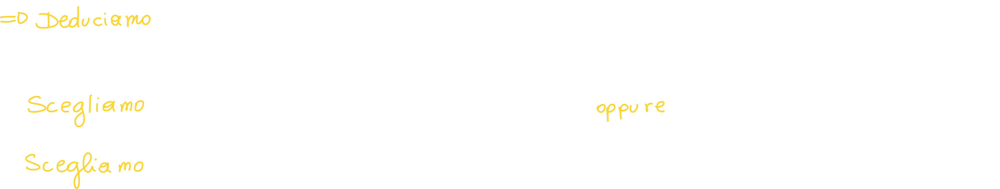

## Segnale sinusoidale a tempo continuo

Il segnale sinusoidale è semplicemente una funzione coseno moltiplicata per un'ampiezza A ed un argomento la pulsazione ed una fase iniziale:

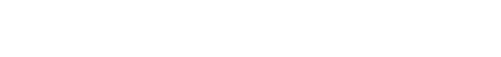

### Rappresentare il segnale sinusoidale come somma di fasori

Possiamo rappresentare il segnale sinusoidale **sotto forma di fasori** usando le formule di Eulero:

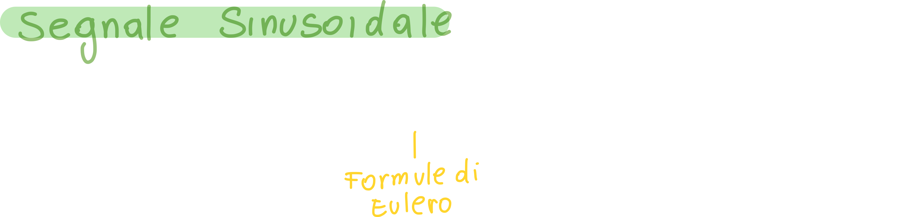

**Dimostriamolo:**

Possiamo scrivere un esponenziale complesso in termini di somma di coseno e seno; sia per un esponente positivo che negativo;

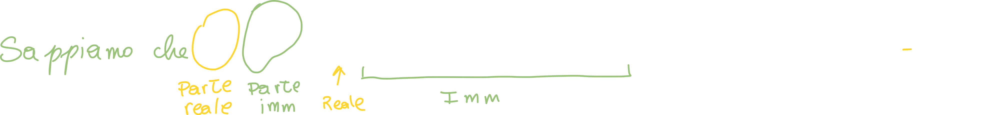

Tenendo a mente questo, possiamo già osservare che il segnale sinusoidale non è altro che **la parte reale di un esponenziale complesso.**

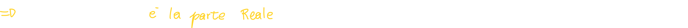

Proviamo quindi  a scrivere il coseno in termini di esponenziale complesso:

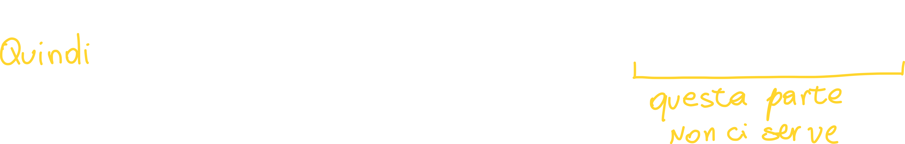

Notiamo però un problema: la parte immaginaria (come abbiamo notato precedentemente, infatti, il coseno è la parte reale dell'exp complesso!) non deve comparire nel segnale finale; per ovviare a questo ci basta scrivere il segnale **come somma di due esponenziali complessi**, uno ad esponente positivo e l'altro ad esponente negativo:

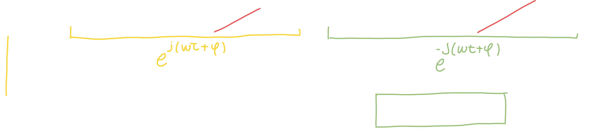

In questo modo, effettuando i calcoli, ci accorgiamo che la parte immaginaria scompare, e rimaniamo con il nostro coseno, ovvero la parte reale.

## Sequenza sinusoidale a tempo discreto

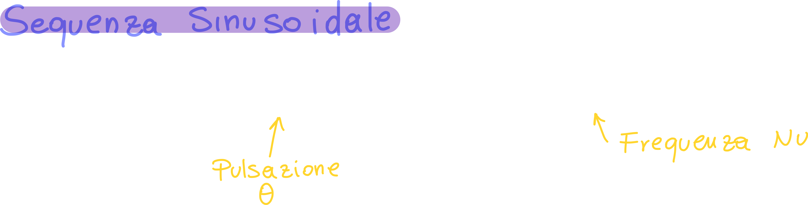

Anche in questo caso la definizione è la medesima del tempo discreto.

## Sequenza esponenziale a tempo discreto

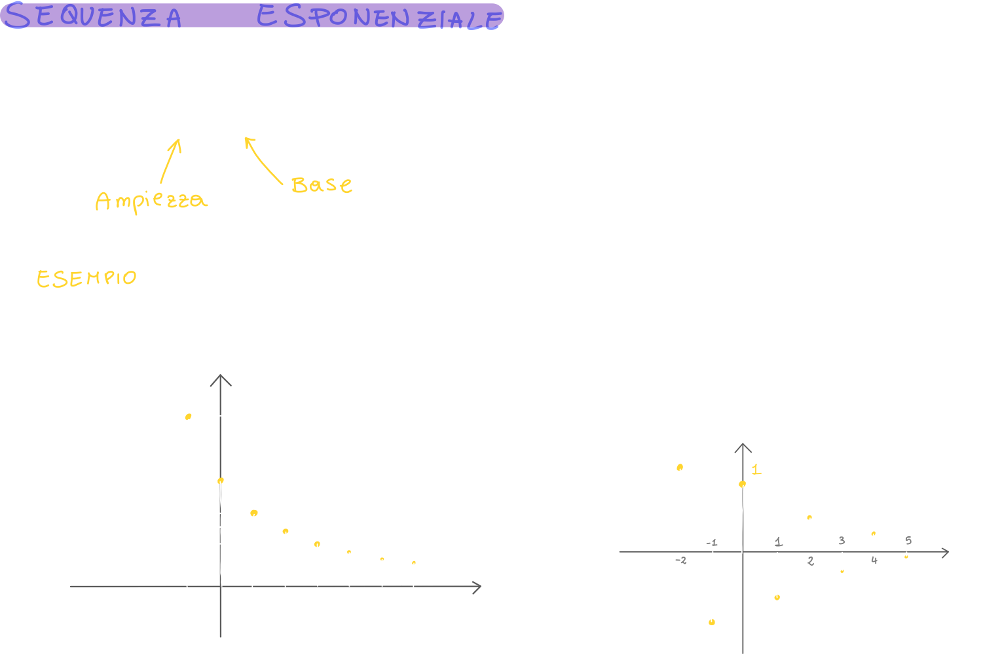

Ci accorgiamo che quando la base dell'esponenziale è un numero a < 0, il valore dei segnali per i diversi istanti di tempo n **si alternano**; questo perché **per esponenti pari il valore è positivo**, mentre **per esponenti dispari il valore è negativo**.

## Segnale SINC

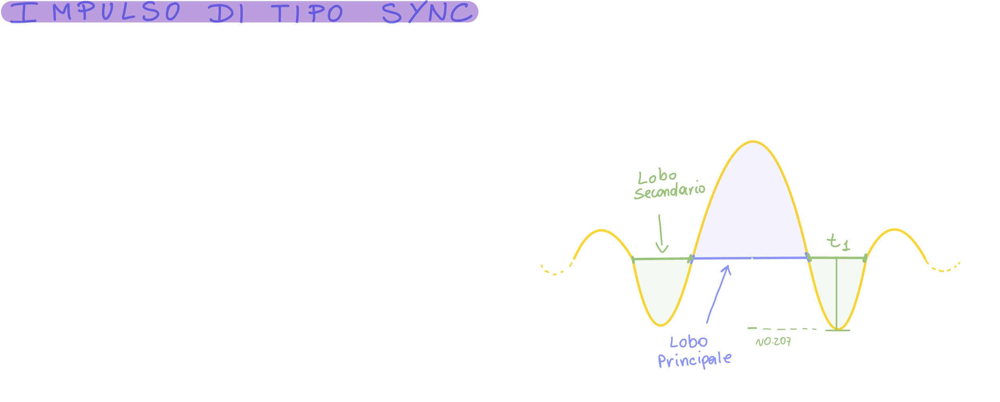

> Il segnale sinc è importante perché viene utilizzato come modello di segnale ideale in molte applicazioni matematiche e tecniche, come la teoria del filtraggio e la comunicazione digitale. Inoltre, viene anche utilizzato come riferimento per valutare la qualità di altri segnali, ad esempio nella valutazione della risoluzione spaziale di un sistema di imaging. In sintesi, il segnale sinc è importante perché fornisce un punto di riferimento e un modello di base per molte analisi tecniche.

### Attenuazione al primo lobo della SINC

Possiamo calcolare quanto vale **l'attenuazione** al primo lobo della sync in modo molto semplice effettuando il calcolo:

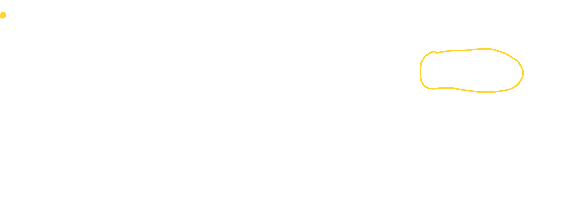

Dobbiamo solo ricordarci di calcolare il valore in modulo! Infatti il punto massimo del primo lobo sarebbe un valore negativo.
_È possibile verificare la posizione di t1 nell'illustrazione della sinc_

