# Caratterizzazione sintetica dei segnali

[TOC]

Per caratterizzare in maniera sintetica i segnali ci avvaleremo dei seguenti strumenti:

- Media temporale
- Energia
- Potenza

## Media Temporale In un intervallo di tempo

La media temporale di un segnale è il primo strumento che andiamo a vedere, proprio perchè è lo strumento **fondamentale** che ci permetterà di capire (e calcolare) gli altri strumenti.

> A che serve la media temporale?
>
> *La media temporale di un segnale viene utilizzata per calcolare il valore medio del segnale nel tempo. Questo può essere utile per eliminare la variazione casuale del segnale e per stabilizzare il suo valore. Inoltre, la media temporale può essere utilizzata per ridurre il rumore presente nel segnale e per migliorare la sua leggibilità.*

La media temporale si indica con `< x(t) >` dove x(t) sarà il segnale di cui verrà calcolata la media:

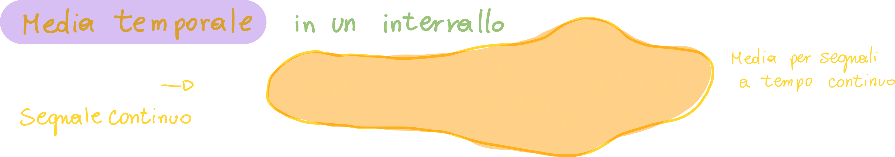

Possiamo calcolare la media di un segnale a tempo discreto nel seguente modo:

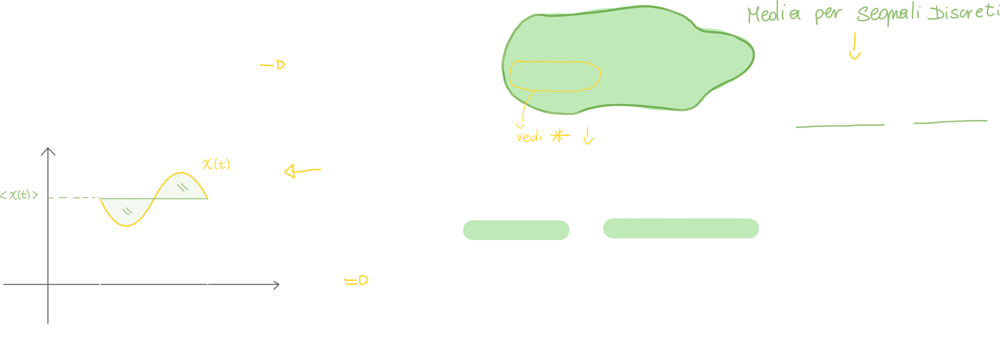

## Media temporale di un segnale

Abbiamo visto la media temporale calcolata in un intervallo preciso di tempo, ma è possibile calcolare la **media di tutto il segnale**, ovvero da -infinito a +infinito:

**Perchè con la media di un segnale discreto dividiamo il tutto per 1/N+1?**

La media temporale ha una serie di proprietà molto utili, che andiamo subito a vedere:

### Proprietà di Linearità della media temporale

Questa proprietà ci dice che la media di un segnale composto da due segnali elementari, è la **somma delle medie dei segnali elementari.**

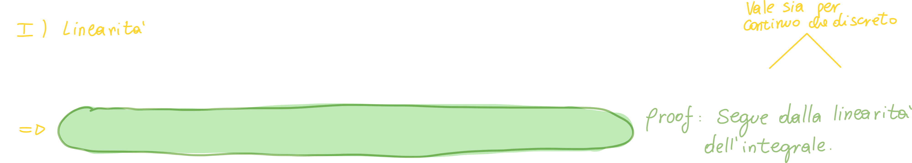

### Proprietà di Invarianza temporale della media temporale

La proprietà di invarianza temporale della media temporale di un segnale afferma che il valore medio del segnale non cambia quando il segnale viene spostato nel tempo. Questo significa che, se il segnale viene ritardato o anticipato di una certa quantità di tempo, il valore medio del segnale rimarrà lo stesso.

#### Dimostrazione della proprietà di invarianza temporale della media temporale

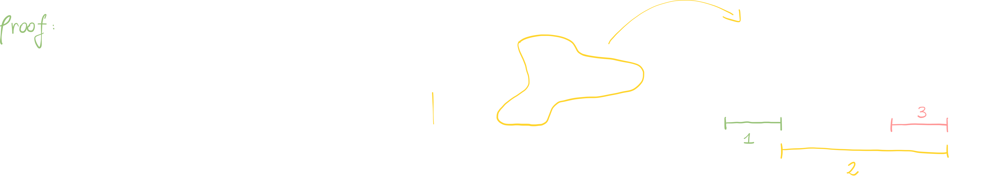

#### Esempio 1 per l'invarianza temporale della media: media di una costante

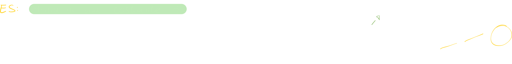

#### Esempio 2 per l'invarianza temporale della media: media della finestra rettangolare

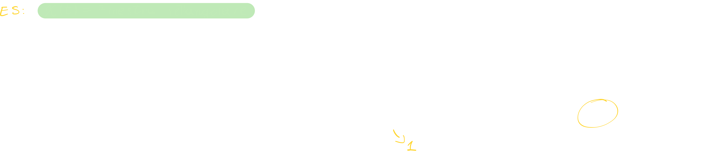

#### Esempio 3 per l'invarianza temporale della media: media della finestra rettangolare

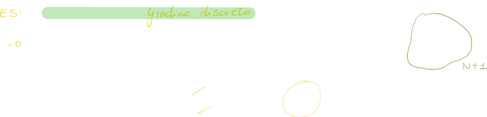

## Potenza di un segnale

La potenza di un segnale è una misura dell'energia del segnale in un dato momento. In termini semplici, si può pensare alla potenza come alla quantità di energia che viene trasportata dal segnale in un determinato lasso di tempo.

> Possiamo definire la potenza di un segnale come la media del quadrato dell'area sottesa di un segnale.

**Come la calcoliamo?**
<u>La potenza di un segnale è definita come la media temporale del segnale in modulo **al quadrato**</u>:

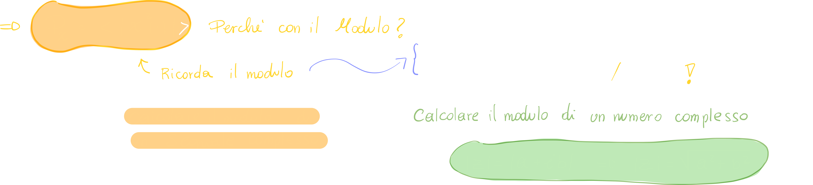

**Perchè la potenza è calcolata attraverso la media?**
La risposta è immediata: la potenza per definizione **misura l'energia di un segnale**, per cui **è un'operazione integrale**.

### Esempio di calcolo di potenza: finestra rettangolare

> La rect è un segnale di **energia**

### Esempio di calcolo di potenza: finestra triangolare

> La finestra triangolare è un **segnale di energia**

### Esempio di calcolo di potenza: Esponenziale decrescente monolatero

> Anche l'esponenziale decrescente monolatero è un segnale di energia

### Esempio di calcolo di potenza diversa da zero: segnale costante

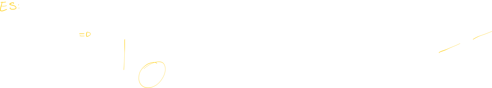

Beh, potevamo aspettarcelo! 
Siccome un segnale costante, effettivamente, **non è un segnale limitato**, **la sua potenza è proprio il quadrato della sua media**, ovvero A2.

### Esempio di calcolo di potenza diversa da zero: Segnale gradino unitario

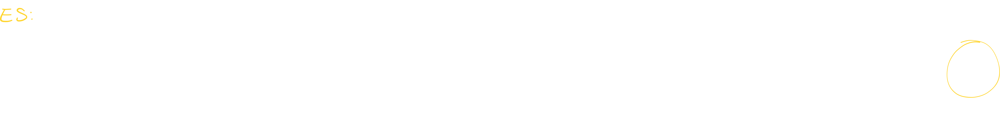

Anche in questo caso il risultato poteva essere previsto:
Siccome la media del gradino, che è zero per t<0 e pari ad 1 per t>0, è 1/2 (basta fare il semplice calcolo (0+1)/2 = 1/2), la sua potenza non sarà nulla.

### Morale della favola per il calcolo della potenza di un segnale

Quando ci ritroviamo con un **segnale limitato** come la finestra rettangolare o triangolare, **la sua energia sarà sempre zero**.

Questo è intuibile anche se pensiamo alla <u>definizione di calcolo di potenza</u>: la potenza viene calcolata attraverso alla media di quel segnale, di conseguenza **se la media di un segnale è zero, anche la sua potenza sarà zero!**.

**Perchè avviene questo?**
Semplicemente perchè se "spalmiamo" (distribuiamo) un valore finito (ovvero l'area al quadrato di un segnale limitato) su di un intervallo infinito, il risultato sarà zero!
Da un punto di vista matematico, la cosa che ci fa convincere della veridicità di questa affermazione è il limite:

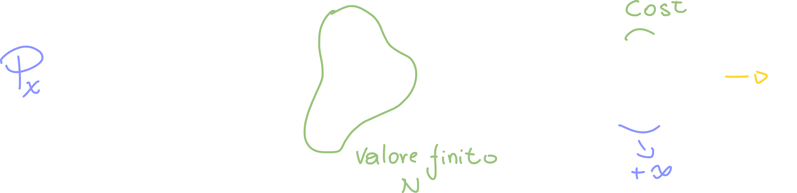

### Notazione per la potenza di un segnale: DC ed AC

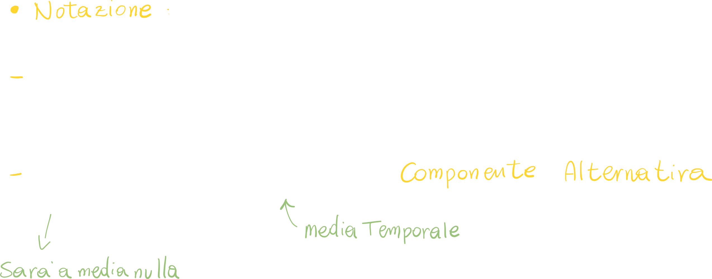

Possiamo indicare con xdc la media del segnale x, e **con xac il segnale privo di media**.

## Energia di un segnale

La sostanziale differenza tra **potenza** ed **energia di un segnale** è che _per definizione_ **l'energia di un segnale non è calcolata attraverso la media, ma solo tramite un calcolo integrale.**

Da questo capiamo che **non dobbiamo calcolare alcun limite**, e cosa più importante, **una quantità finita non deve essere _spalmata_ in un intervallo infinito**, come accadeva con media e potenza.

Deduciamo quindi che i segnali che abbiamo visto finora (in particolare quelli a potenza nulla) si comporteranno diversamente.

> Intuitivamente, l'energia di un segnale può essere definita come l'area sottesa dal grafico del segnale al quadrato nel tempo. Più l'area è grande, più energia c'è nel segnale. In altre parole, se il grafico del segnale è molto ampio e lungo, significa che il segnale ha molte oscillazioni e quindi un'alta quantità di energia. Se il grafico è più piccolo e breve, il segnale ha meno oscillazioni e quindi un'energia minore.
>
> **Deduciamo due cose:**
>
> - I segnali limitati hanno energia finita.
> - I segnali illimitati e/o periodici hanno energia infinita.

**Dopo questa lunga introduzione, passiamo alle formule per l'energia di un segnale:**

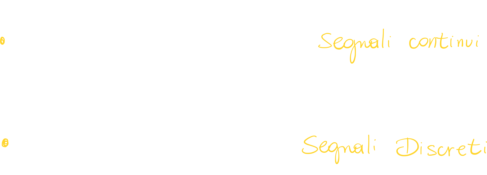

Il calcolo dell'energia è un calcolo semplice, ci basta effettuare il modulo quadro del segnale e poi integrare da -inf a +inf; ovviamente per segnali definiti in un intervallo di tempo ben preciso dovremo integrare solo in quell'intervallo; in altre parole ci basta calcolare l'area al quadrato del segnale.

### Esempio di calcolo di energia diversa da zero: finestra rettangolare

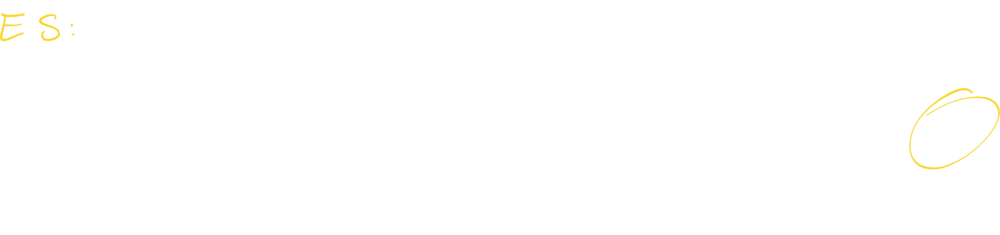

Il risultato era prevedibile: la finestra rettangolare di periodo 1 ed ampiezza 1 ha area proprio pari ad 1; se effettuiamo il quadrato otterremo 1.

### Esempio di calcolo di energia diversa da zero: Finestra triangolare

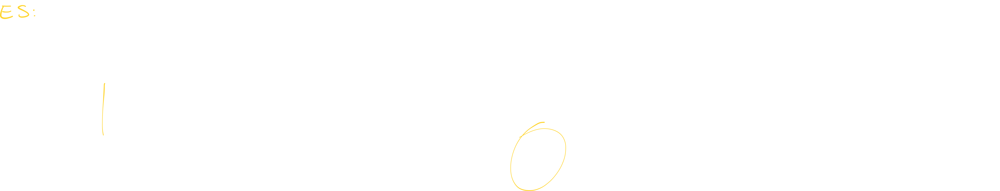

### Esempio di calcolo di energia diversa da zero: Esponenziale decrescente monolatero

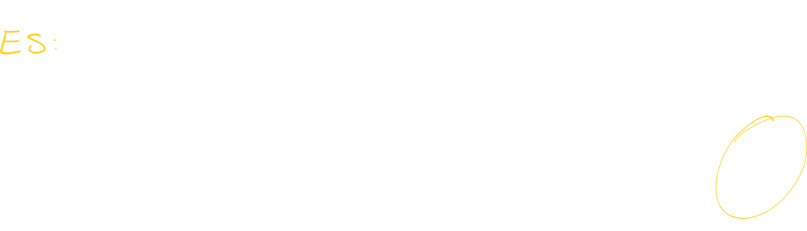

## Differenze tra segnali di potenza e segnali di energia

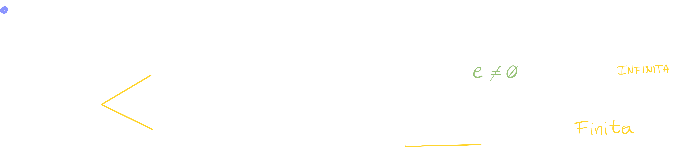

### Esempi di segnali di Potenza

I segnali di potenza sono quei segnali **che sono limitati in un qualche modo**; questo perchè i segnali limitati (o periodici) hanno una quantità di energia infinita.

- Segnali periodici
- Gradino unitario (P = 1/2)

### Esempi di segnali di Energia

I segnali di energia sono detti tali se e solo se hanno una quantità di energia finita; Un esempio di questo tipo di segnali sono sicuramente i segnali limitati:

- Segnali limitati
- Finestra triangolare
- Finestra Rettangolare
- Esponenziale decrescente monolatero

# Segnali periodici

I segnali periodici sono segnali che si ripetono costantemente nel tempo con una determinata frequenza e fase. In altre parole, un segnale periodico ha una forma che si ripete identica a se stessa per intervalli regolari di tempo. Ad esempio, una sinusoide è un segnale periodico poiché la sua forma ciclica si ripete con una determinata frequenza.

## Media di un segnale periodico

Come abbiamo accennato, **i segnali periodici sono per definizione dei segnali di potenza**; Possiamo calcolare la media di un segnale periodico **calcolando solo la media del segnale in un ciclo (o periodo) T0:**

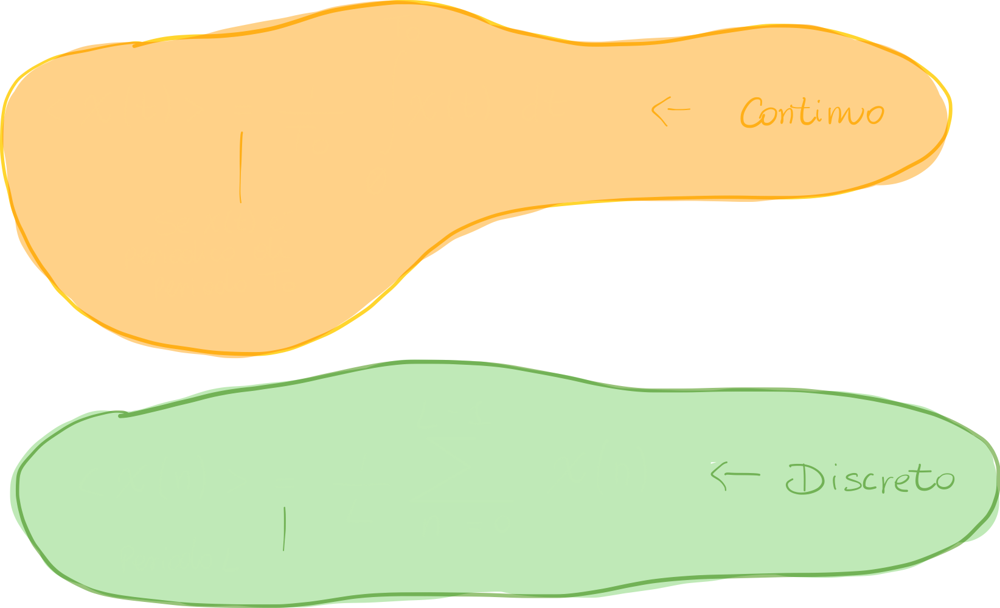

**Perchè è possibile fare ciò?** Intuitivamente è facilmente immaginabile, ma matematicamente è da dimostrare:

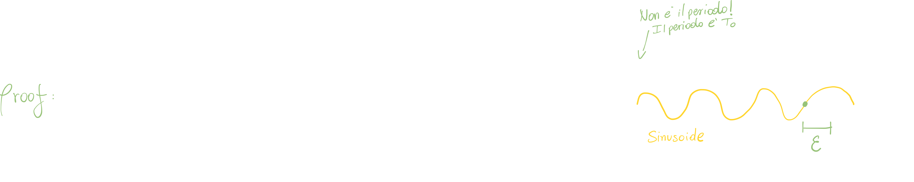

Chiamiamo epsilon quella porzione di tempo "che avanza", come se fosse il resto della divisione per un valore intero (nell'esempio il periodo è diviso per 3).

Possiamo quindi scrivere l'integrale come "n volte" moltiplicato per il periodo T:

 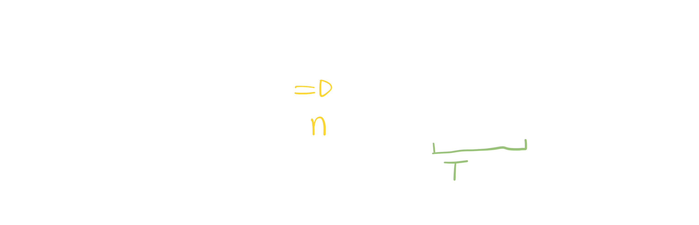

A questo punto ci riscriviamo l'integrale in una "strana maniera"; lo schema ci aiuterà a capire:

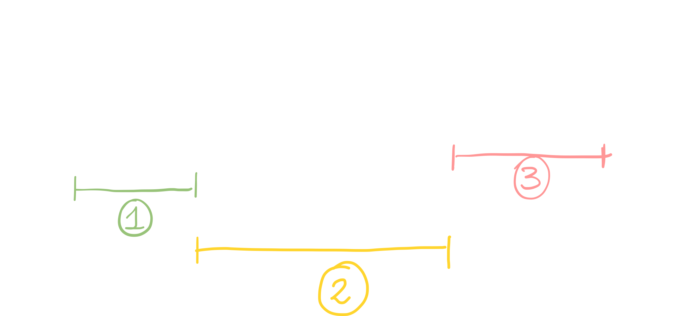

Abbiamo che un periodo va da (-nT0ε) a (nT0ε); possiamo dividerci questo periodo in 3 sottoperiodi:

- (-nT0 + ε) --> (-nT0)
- (-nT0) --> (nT0) 
- (nT0) --> (nT0 + ε) 

Possiamo quindi scriverci l'integrale come la somma di tre integrali calcolati su 3 intervalli diversi:

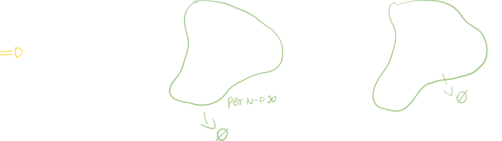

Siccome il primo e terzo integrale è pari a zero, otteniamo:

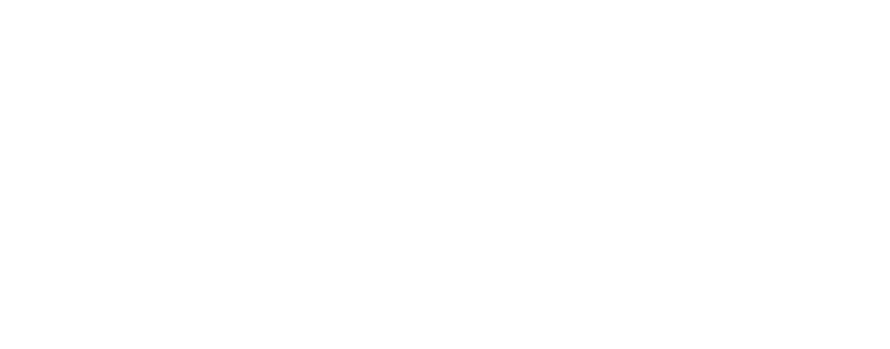

Siccome il segnale **è periodico**, possiamo calcolarlo su un singolo ciclo T0, e moltiplicare l'integrale calcolato per n volte:

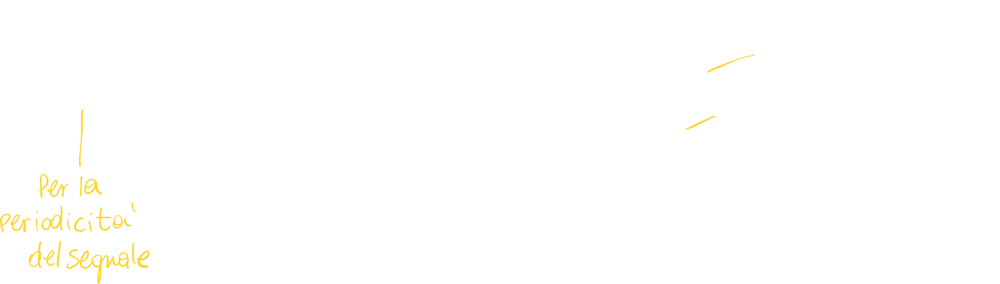

Facendo i conti otteniamo:

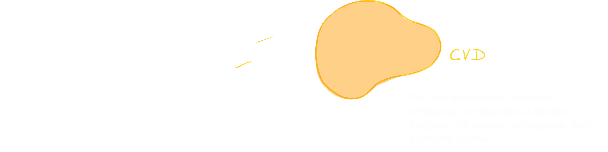

**Arriviamo quindi alla conclusione:**
Per segnali periodici la media temporale corrisponde al calcolo integrale sul periodo del segnale **diviso il periodo stesso**.

## Esercizi su segnali periodici

### Esercizio 1 sui segnali periodici: il fasore

#### Componente continua / media del fasore

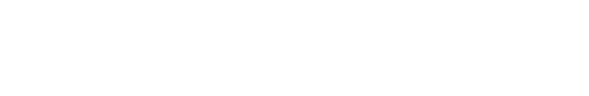

Quando ci viene chiesto di **calcolare la componente continua** di un segnale, non dobbiamo fare altro che **calcolare la media del segnale**:

> 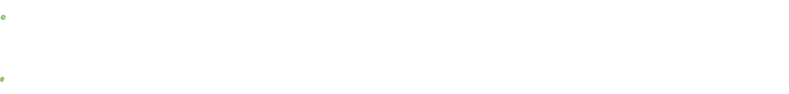

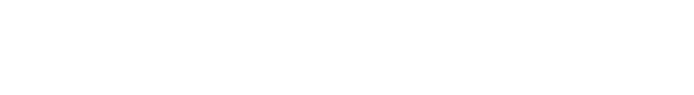

A questo punto non ci resta altro che calcolare la primitiva del segnale in modo da ottenere:

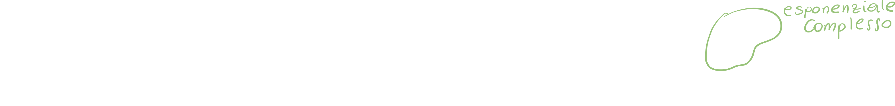

Abbiamo quindi un fasore, che possiamo scivere sottoforma di cos(-)+sin(-):

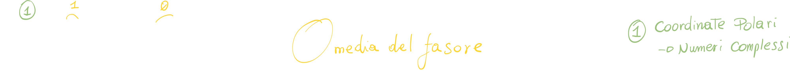

#### Potenza del fasore

Come abbiamo visto in precedenza, la potenza di un segnale viene calcolata attraverso la media del segnale in modulo quadro;
In questo caso **il fasore è un segnale complesso**, quindi dovremo calcolarne il modulo:

> Il modulo di un numero complesso in forma esponenziale è dato dalla costante moltiplicativa dell'esponenziale.

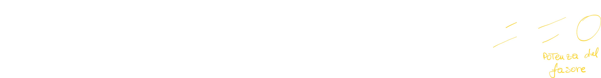

### Esercizio 2 sui segnali periodici: la sinusoide

Il segnale sinusoidale in funzione del tempo è:

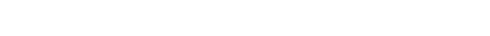

#### Media del segnale sinusoidale

Possiamo riscriverci il segnale come somma di due fasori (dimostrazione [qui](https://github.com/follen99/Fondamenti-Di-Telecomunicazioni/blob/main/AppuntiMD/3.02%20-%20Segnali%20Ordinari.md#rappresentare-il-segnale-sinusoidale-come-somma-di-fasori)):

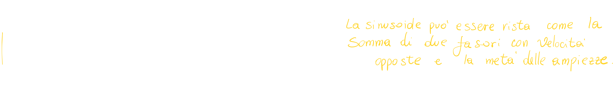

A questo punto possiamo procedere e calcolare la media del segnale (o meglio dei due segnali!):

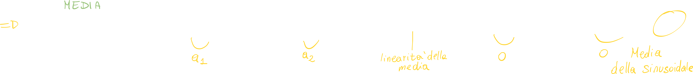

Ci siamo ridotti a calcolare la media di due fasori (uno ad exp positivo e l'altro ad exp negativo), che come abbiamo visto nella sezione precedente, è zero.

#### Potenza del segnale sinusoidale

In questo caso il segnale sinusoidale non ha una parte complessa, quindi **il segnale sinusoidale è un segnale reale**. Di conseguenza, la potenza è calcolata nel seguente modo:

> Piccola correzione: la media di un segnale periodico non è sempre zero; è la media del coseno/seno che sono periodiche; la media di un segnale periodico sarà uguale a zero solo nel momento in cui il segnale è simmetrico al valore medio.