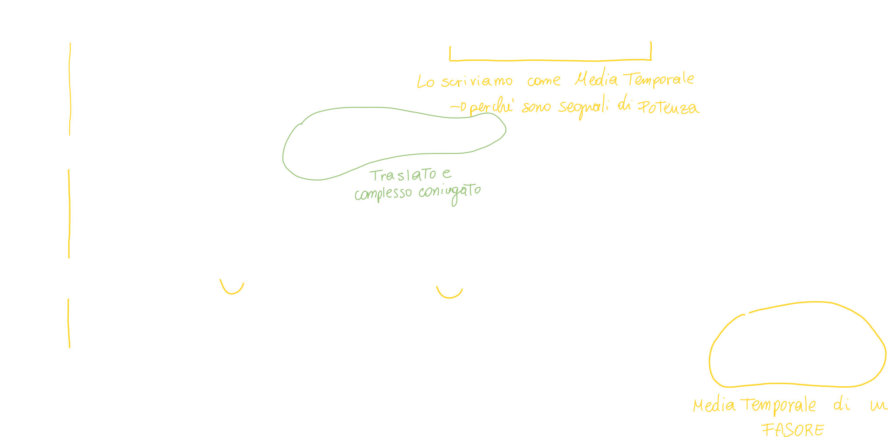
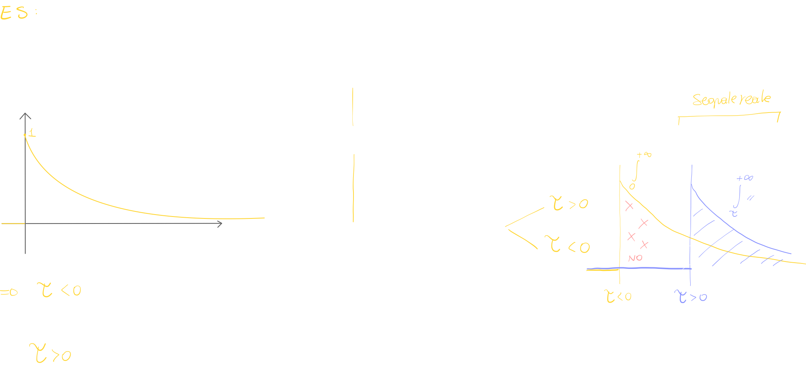
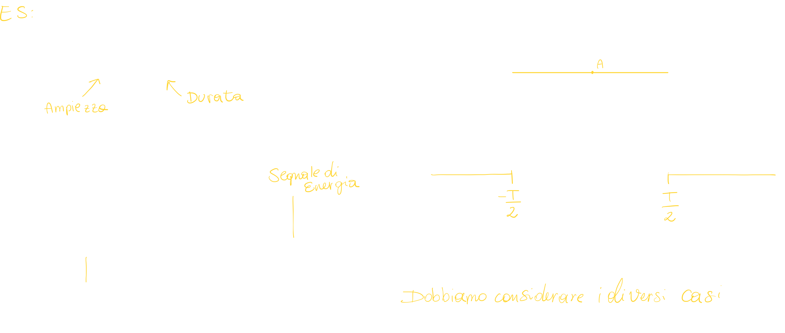
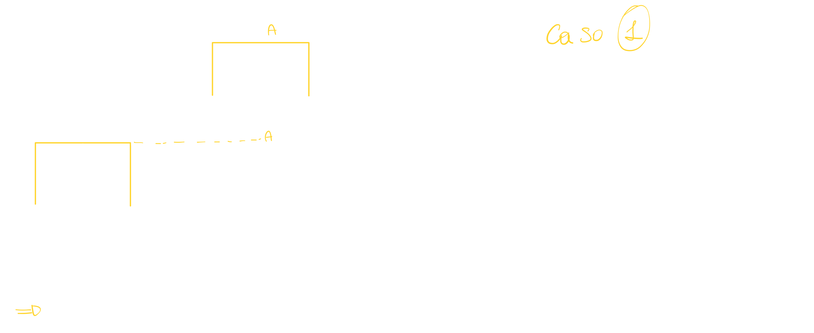
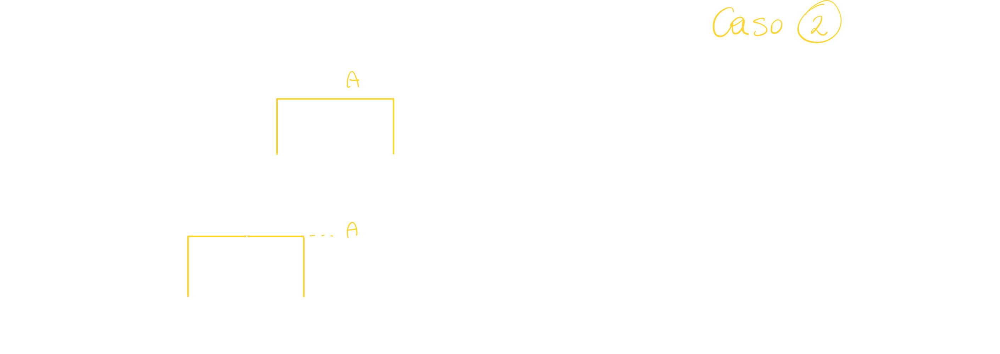
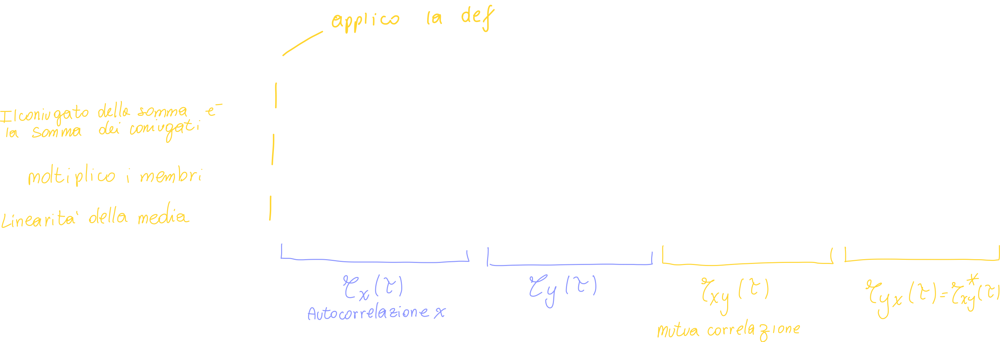

#### Recap numeri complessi

Prima di addentrarci negli argomenti di questa lezione, dobbiamo prima fare un *recap* dei numeri complessi, proprio perchè verranno utilizzati molto per le dimostrazioni che andremo a vedere. Per un approfondimento si può visitare il link della [repository di Analisi 1 e 2 dove ho trattato i numeri complessi](https://github.com/follen99/Analisi-Matematica/tree/main/Appunti/1.03%20-%20Numeri%20Complessi).

## Modulo quadro di un numero complesso z

Il modulo quadro di un numero complesso, per definizione è il numero complesso moltiplicato per la sua versione coniugata; la sua versione coniugata non è altro che il numero complesso con la parte immaginaria cambiata di segno.

Se svolgiamo le operazioni ci accorgiamo che il modulo quadro di un numero complesso non è altro che la somma della parte reale al quadrato più la parte immaginaria al quadrato.

# Potenze Mutue

La potenza mutua viene calcolata per risolvere un problema che ci troviamo davanti nel momento in cui proviamo a calcolare la potenza della somma di due segnali; infatti, vedremo come nel calcolo della potenza della somma di due segnali, ci ritroveremo due termini a noi ignoti, ovvero la potenza mutua tra x ed y, ed il suo coniugato.

## Potenza della somma di due segnali

Consideriamo il segnale z composto da due segnali x ed y:

> Notiamo che la potenza di zeta, che è uguale alla potenza di x+y, **non è uguale** alla somma delle potenze di x ed y.

Perché? Dimostriamolo:
La potenza (vista nella scorsa lezione assieme alla media temporale), è calcolata a partire dalla **media temporale del modulo quadro di un segnale**:

Svolgendo tutte le operazioni, ci accorgiamo di avere 2 termini "in più" (quelli in verde), che prendono proprio il nome di **potenza mutua di x ed y**, ed il suo coniugato; andiamo quindi a definire la potenza mutua.

A questo punto siamo pronti a vedere le formule per calcolare la **potenza mutua tra i segnali x ed y**:

## Potenza mutua tra due segnali

> Anche in questo caso definiammo a tempo continuo ed a tempo discreto.

Vediamo come la potenza mutua di due segnali non è altro che la media temporale di un segnale per il coniugato dell'altro, che andremo ad indicare con Pxy;

e Pyx? Dimostriamo che è semplicemente l'inverso di Pxy (ovvero <x*( - )y( - )>):

Possiamo scrivere la **potenza della somma** come:

### Potenza mutua di due segnali ortogonali

Quando due segnali sono ortogonali?

- Due segnali sono ortogonali quando il loro **prodotto scalare** (ovvero la moltiplicazione membro a membro degli elementi di un vettore) è **pari a zero**.
- Dire che due segnali sono ortogonali significa dire che i due segnali non hanno alcuna componente in comune e sono completamente indipendenti l'uno dall'altro.

Quando due segnali sono ortogonali, il la **potenza mutua tra di loro** si annulla, e quindi la potenza di un segnale composto da un segnale x(-) ed un segnale y(-) è calcolata semplicemente come la Potenza di x più la potenza di y:

#### Esempio di potenza mutua tra due segnali ortogonali generali

Per definizione **la componente continua e la componente alternata di un segnale sono ortogonali tra loro**, quindi:

Siccome la componente continua di un segnale è costante (corrisponde al segnale privato della sua media), possiamo portarlo fuori dall'integrale; ci accorgiamo però di essere rimasti con un integrale ed un limite che non sono altro che la **media temporale del segnale iniziale**:

La media della componente continua di un segnale è pari a zero proprio perchè **la componente continua di un segnale è il segnale privato della sua media.**

> In elettronica e in altri campi, la componente alternata è spesso utilizzata per trasmettere informazioni, mentre **la componente continua viene rimossa per evitare distorsioni nella trasmissione.**

#### Esempio di potenza mutua tra due segnali ortogonali generali: Cos() - Sin()

**Il coseno e seno aventi la stessa frequenza sono due segnali ortogonali.**

## Come esprimere la potenza di un segnale

La potenza di un segnale è espressa in **deciBel (dB)**:

### Il valore RMS

Il valore RMS (Root Mean Square) è una misura del livello di un segnale alternato e serve a descrivere la quantità di energia trasmessa da un segnale. 

Il valore RMS è definito come la radice quadrata della media del segnale:

È espresso nel seguente modo:

# Energie Mutue

Anche in questo caso l'energia mutua viene calcolata per risolvere un problema che ci troviamo davanti quando proviamo a calcolare l'energia della somma tra due segnali; anche questa volta ci troveremo due termini a noi sconosciuti: l'energia mutua ed il suo coniugato.

## Energia della somma di due segnali

## Energia mutua tra due segnali

**Il coniugato dell'energia mutua tra x ed y è semplicemente l'energia mutua tra y ed x**, quindi possiamo scrivere l'energia della somma di due segnali come:

### Energia di due segnali ortogonali

Se proviamo a calcolare l'energia di due segnali ortogonali otterremo zero; quindi opssiamo scrivere **l'energia della somma di due segnali ortogonali** come:

# Spazio dei segnali

Possiamo rappresentare i segnali all'interno dello **spazio dei segnali**; questo spazio **è chiuso rispetto alla somma** *tra due segnali* **e moltiplicazione** *di un segnale per uno scalare*.

Possiamo quindi definire **quattro spazi lineari**:

## Prodotto scalare tra due segnali

-- Ometto questa parte --

# Funzioni di Correlazione

La funzione di correlazione tra due segnali serve a misurare la similitudine tra i due segnali. In altre parole, la funzione di correlazione determina quanto i due segnali sono simili tra loro, in termini di forma e di tempo di arrivo.

La correlazione tra due segnali si calcola senza fare altro che la media tra i due segnali, con l'accortezza che **il secondo segnale deve essere ritardato di τ**; bisogna notare che tau non sarà una costante, ma varierà: partirà da un valore tale da permettere al secondo segnale di essere completamente esterno al primo, ed arriverà ad un valore tale da permettere al secondo segnale di "entrare all'interno" del primo e "trapassarlo" per, in fine, "fuoriuscire" dal primo segnale; tutto questo sarà più chiaro dopo aver visto un esempio di (auto)correlazione.

## Funzione di correlazione a tempo continuo

Siccome la media di un segnale di energia è calcolata differentemente dalla media di un segnale di potenza, distinguiamo anche la correlazione di segnali di energia da quelli di potenza:

### Esempio di calcolo di correlazione tra due fasori

Sappiamo che i fasori sono **segnali complesso a tempo continuo **, quindi calcoliamo la correlazione nel seguente modo:

Otteniamo dei valori costanti rispetto al tempo, che saranno quindi "l'ampiezza" moltiplicata per quella che non è altro che la media di un fasore; abbiamo visto nelle precedenti lezioni che la media di un fasore non è altro che la sua ampiezza nel momento in cui l'esponente è zero (questo avviene quando la velocità angolare o la frequenza è pari a zero):

Di conseguenza la correlazione tra due fasori non è altro che la potenza muta del fasore; calcoliamola:

Inoltre, se poniamo le ampiezze e fasi iniziali dei due fasori possiamo calcolare **l'autocorrelazione di un fasore**:

## Funzione di correlazione a tempo discreto

A tempo discreto il calcolo è molto simile; basta ricordare che si tratta di una sommatoria invece di un calcolo integrale.

## Funzione di Autocorrelazione

La funzione di **autocorrelazione** fornisce informazioni sulla **similitudine** tra un segnale <u>e la sua copia spostata di una certa quantità di tempo</u>.
In altre parole, misura la correlazione tra due punti del segnale (o facendo tendere T o N ad infinito).

Quando un segnale ha un'alta autocorrelazione significa che ci sono **parti simili** del segnale **che si ripetono frequentemente**, mentre un segnale avente un'autocorrelazione bassa significa che questo segnale è abbastanza "randomico", e quindi non prevedibile.

### Come interpretare l'autocorrelazione

Gli output possibili dell'autocorrelazione sono compresi **tra 0 ed 1**, quindi:

- rx = 0: bassa autocorrelazione --> il segnale non si ripete
- 0+ < rx < 1-: media autocorrelazione --> il segnale si ripete (a seconda del valore capiamo quanto)
- rx = 1: alta autocorrelazione --> il segnale si ripete sempre

### Applicazioni dell'autocorrelazione

#### Autocorrelazione del Segnale costante

Se proviamo a calcolare l'autocorrelazione del segnale costante x(t) = A, ci accorgeremo che la sua autocorrelazione è alta, infatti il segnale costante riproduce sempre la stessa "parte":

#### Autocorrelazione del Segnale esponenziale monolatero 

> Dobbiamo distinguere tra τ > 0 e τ < 0, perchè per τ > 0 dobbiamo calcolare l'integrale solo da τ in poi (vedi grafico in basso a sx).

> Notiamo che ci viene una quantità positiva quando τ < 0, mentre una quantità negativa quando τ > 0, che è l'esatto opposto del concetto di valore assoluto; possiamo quindi scrivere -|τ|.
>
> N.B. il grafico è della funzione rx = A2/2 * exp(-|x|)

Notiamo inoltre che nell'origine il segnale vale A2/2, ovvero proprio la sua **energia** (calcolata nella lezione precedente).

Infine, notiamo che il segnale (particolarità delle funzioni di autocorrelazione) è **pari** (ovvero simmetrica all'asse y).

#### Autocorrelazione di un impulso rettangolare (finestra)

Per calcolare l'autocorrelazione di una rect procediamo nel seguente modo:

##### Caso 1

In questo caso le due rect sono "separate" e quindi non condividono alcun valore, di conseguenza l'autocorrelazione è zero:

##### Caso 2

In questo caso le due rect iniziano ad essere sovrapposte, ma non completamente; questo vuol dire che la rect ritardata ha "un pezzettino" che "avanza" dalla rect iniziale, e quindi non dobbiamo calcolarlo; calcoliamo infatti da -T/2 fino alla fine della rect ritardata, ovvero τ+T/2

##### Caso 3

È il caso analogo al precedente, ma il "pezzettino fuori" è quello superiore (ovvero nell'intorno di τ+T/2), quindi non dobbiamo calcolarlo:

##### Caso 4

Questo è il caso analogo al <u>caso 1</u>, ovvero la rect ritardata è completamente "fuori" da quella iniziale, di conseguenza le due non condividono valori:

### Autocorrelazione della somma di due segnali

Quindi l'autocorrelazione della somma di due segnali è la somma tra:

- Autocorrelazione del primo segnale
- Autocorrelazione del secondo segnale
- Mutua correlazione tra x ed y
- Coniugato della mutua correlazione tra x ed y, ovvero la correlazione tra y ed x

Inoltre, se ci troviamo nel caso in cui la mutua correlazione tra x ed y vale zero, vale l'additività, quindi l'autocorrelazione della somma di due segnali è pari alla somma tra l'autocorrelazione del primo più l'autocorrelazione del secondo:

### Differenza tra segnali incoerenti e segnali ortogonali

Due segnali sono ortogonali se la loro mutua correlazione **in un punto ** è pari a zero.

Quindi **Ortogonalità non implica l'incoerenza**.
