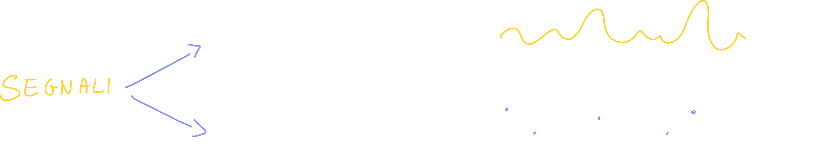
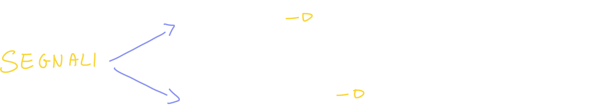
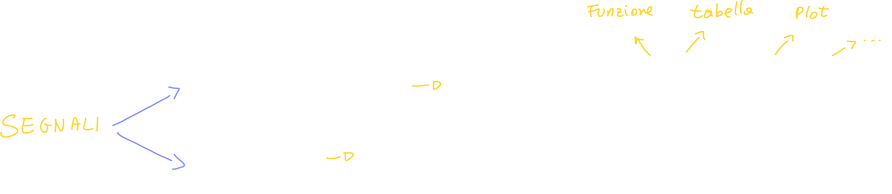
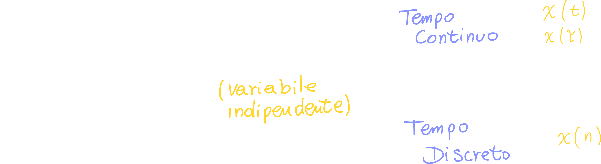

# I Segnali

Ci sono diversi tipi di segnali; i primi due tipi che vediamo sono i... 

## Segnali monodimensionali  segnali bidimensionali

## Segnali reali e complessi

## Segnali deterministici ed Aleatori

## La variazione di grandezza del segnale

Il segnale può essere defiito su una variabile spaziale, ma per convenzione definiamo il segnale **al variare del tempo**:

> Tempo Continuo: ad esempio un segnale audio
>
> Tempo Discreto: ci riferiamo ad una sequenza

🏁 1:13