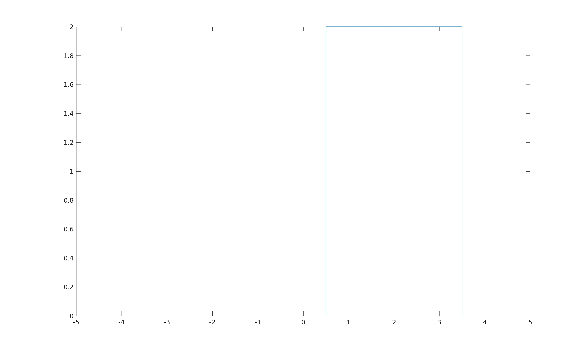

# Segnali Elementari

[TOC]

## Gradino Unitario

### Gradino a Tempo Continuo


### Gradino a Tempo Discreto


### Tracciare il gradino unitario con MATLAB

```matlab
% il gradino unitario è un segnale particolare che vale zero per valori del tempo negativi e vale 1 per valori del tempo positivi.
clear all
close all
clc


x = [-5: 0.1: 5];
%y = zeros(size(x));
y = [-5: 0.1: 5];

for i = 1:length(x);
    if x(i) < 0
        y(i) = 0;
    else
        y(i) = 1;
    end
end

subplot(2,1,1);
stem(x,y);

subplot(2,1,2);
plot(x,y);
```

Output:


### Finestra rettangolare a partire da due gradini unitari


## Finestra / Impulso Rettangolare

### Finestra a Tempo Continuo


#### Tracciare una finestra 

Questa finestra ha periodo T = 1, è centrata in zero ed ha ampiezza 1

```matlab
clear all;
close all;
clc;

syms x;										% variabile simbolica x
y = piecewise(x<-1/2, 0, x>1/2, 0, 1);	% funzione definita a tratti
x_values = [-2: 0.1: 2];					% creo un array di valori reali

y_numeric = subs(y, x, x_values);			% sostituisco i valori simbolici in reali


fplot(y, [-2 2]);
```

Con un output del tipo:


#### Trasformazioni di una finestra

Questa finestra è centrata in t0, ha ampiezza A e periodo T:

```matlab
% finestra centrata in t0, con periodo T ed ampiezza A
syms x;										% variabile simbolica x

t0 = 2;		% centrata in x = 2
T = 3;			% periodo T
A = 2;

y = A * piecewise((x < (t0 + T/2)) & (x > (t0 - T/2)), 1, 0);

fplot(y, [-5 5]);
```

Output:



### Finestra a Tempo Discreto


**Tracciare il segnale discreto con matlab:**

```matlab
clear all;
close all;
clc;

syms x;																	% variabile simbolica x
y = piecewise(x<-1/2, 0, x>1/2, 0, 1);	% funzione definita a tratti
x_values = [-2: 0.1: 2];								% creo un array di valori reali

y_numeric = subs(y, x, x_values);				% sostituisco i valori simbolici in reali

stem(x_values, y_numeric);							% visualizzo il segnale discreto
```

> Funzione discreta tracciata tramite una variabile simbolica x

Output:


## Finestra Triangolare


### Tracciare la funzione triangolare con matlab

```matlab
clear all
close all
clc

figure(1);
x_range = 10;
y_range = 2;

x = [-x_range: 0.1: x_range];
y = [-y_range: 1: y_range];

for i = 1:length(x)
    if ((x(i) < 1) & (x(i) > -1))
        y(i) = 1-abs(x(i));
    else
        y(i) = 0;
    end
end

plot(x,y);
```

Output:


## Impulso Discreto Generale


### Proprietà dell'impulso discreto

#### Proprietà I dell'impulso Discreto Generico


#### Proprietà II dell'impulso Discreto Generico


### Tracciare l'Impulso discreto con MATLAB

```matlab
clear all
close all
clc

x = [-5: 1: 5];		% un valore ogni 1
y = [0: 1: 1];		% solo due valori: 0 ed 1

x_value_for_impulse = 0;
figure(1);

subplot(2,1,1);
%stem(x,y);

for j = 1 : 2
    for i=1:length(x)
    	if x(i) == x_value_for_impulse
        y(i) = 1;
    	else
        y(i) = 0;
    	end
    end
    
    x_value_for_impulse = x_value_for_impulse + 1;
    subplot(2,1,j);
    stem(x,y);    
end
```

L'esempio in questione ci mostra due impulsi discreti generico: uno in t = 0 ed un in t = 1:

