# Caratterizzazione sintetica dei segnali

[TOC]

Per caratterizzare in maniera sintetica i segnali ci avvaleremo dei seguenti strumenti:

- Media temporale
- Energia
- Potenza

## Media Temporale In un intervallo di tempo

La media temporale di un segnale è il primo strumento che andiamo a vedere, proprio perchè è lo strumento **fondamentale** che ci permetterà di capire (e calcolare) gli altri strumenti.

> A che serve la media temporale?
>
> *La media temporale di un segnale viene utilizzata per calcolare il valore medio del segnale nel tempo. Questo può essere utile per eliminare la variazione casuale del segnale e per stabilizzare il suo valore. Inoltre, la media temporale può essere utilizzata per ridurre il rumore presente nel segnale e per migliorare la sua leggibilità.*

La media temporale si indica con `< x(t) >` dove x(t) sarà il segnale di cui verrà calcolata la media:

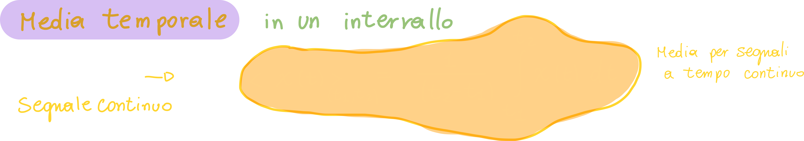

Possiamo calcolare la media di un segnale a tempo discreto nel seguente modo:

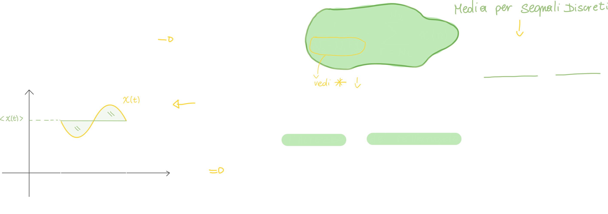

## Media temporale di un segnale

Abbiamo visto la media temporale calcolata in un intervallo preciso di tempo, ma è possibile calcolare la **media di tutto il segnale**, ovvero da -infinito a +infinito:

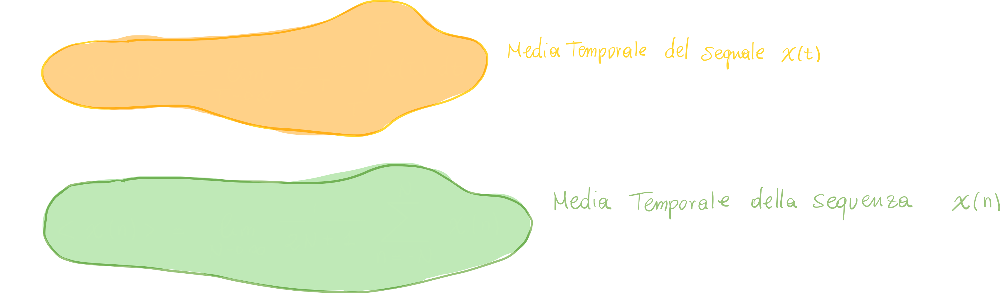

**Perchè con la media di un segnale discreto dividiamo il tutto per 1/N+1?**

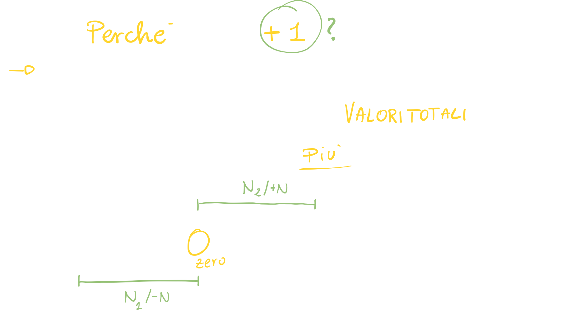

La media temporale ha una serie di proprietà molto utili, che andiamo subito a vedere:

### Proprietà di Linearità della media temporale

Questa proprietà ci dice che la media di un segnale composto da due segnali elementari, è la **somma delle medie dei segnali elementari.**

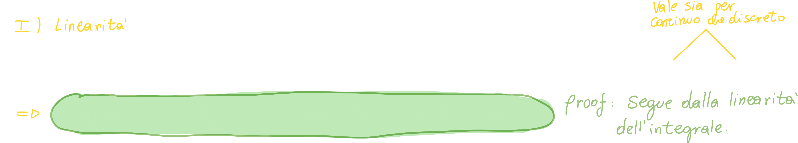

### Proprietà di Invarianza temporale della media temporale

La proprietà di invarianza temporale della media temporale di un segnale afferma che il valore medio del segnale non cambia quando il segnale viene spostato nel tempo. Questo significa che, se il segnale viene ritardato o anticipato di una certa quantità di tempo, il valore medio del segnale rimarrà lo stesso.

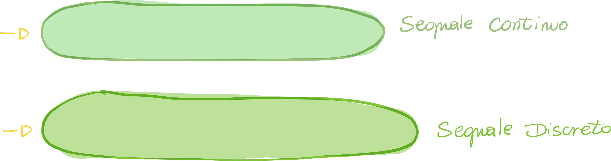

#### Dimostrazione della proprietà di invarianza temporale della media temporale

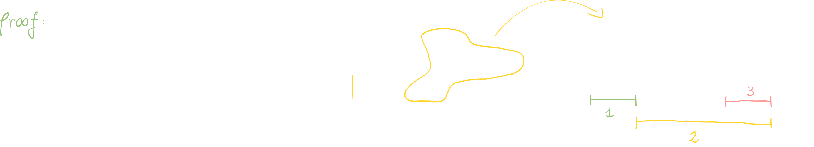

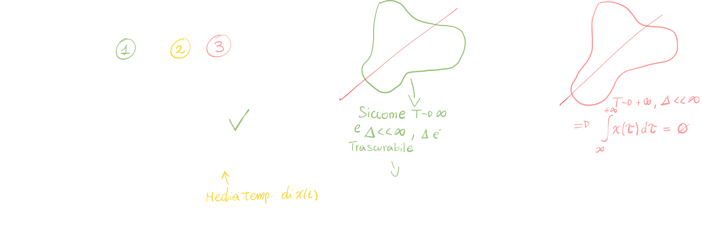

#### Esempio 1 per l'invarianza temporale della media: media di una costante

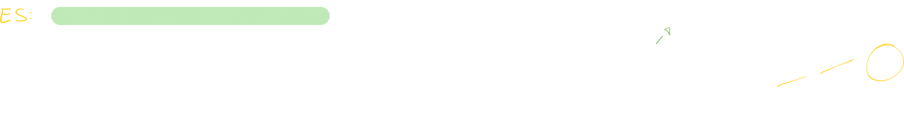

#### Esempio 2 per l'invarianza temporale della media: media della finestra rettangolare

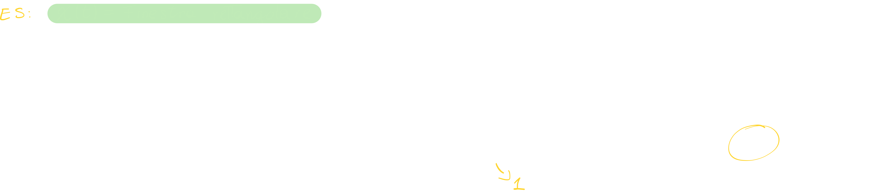

#### Esempio 3 per l'invarianza temporale della media: media della finestra rettangolare

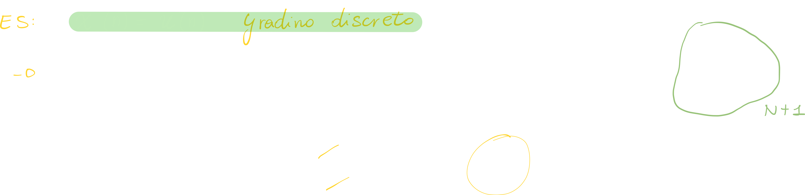

## Potenza di un segnale

La potenza di un segnale è una misura dell'energia del segnale in un dato momento. In termini semplici, si può pensare alla potenza come alla quantità di energia che viene trasportata dal segnale in un determinato lasso di tempo.

> Possiamo definire la potenza di un segnale come la media del quadrato dell'area sottesa di un segnale.

**Come la calcoliamo?**
<u>La potenza di un segnale è definita come la media temporale del segnale in modulo **al quadrato**</u>:

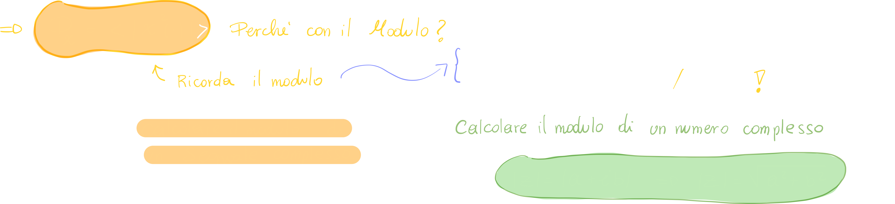

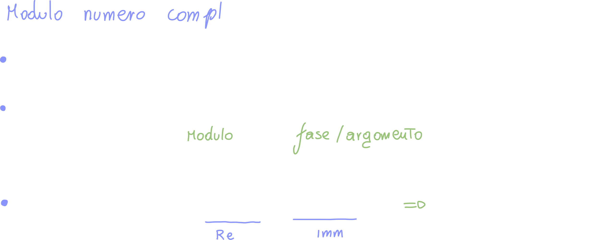

**Perchè la potenza è calcolata attraverso la media?**
La risposta è immediata: la potenza per definizione **misura l'energia di un segnale**, per cui **è un'operazione integrale**.

### Esempio di calcolo di potenza: finestra rettangolare

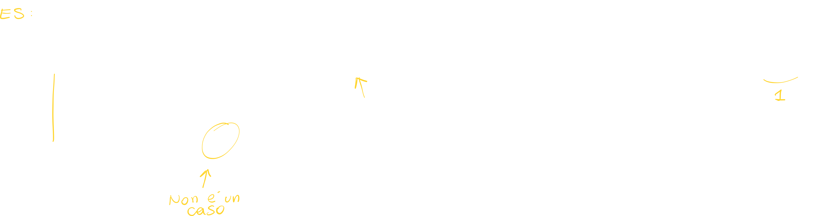

> La rect è un segnale di **energia**

### Esempio di calcolo di potenza: finestra triangolare

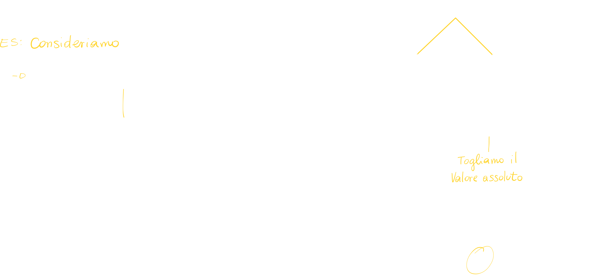

> La finestra triangolare è un **segnale di energia**

### Esempio di calcolo di potenza: Esponenziale decrescente monolatero

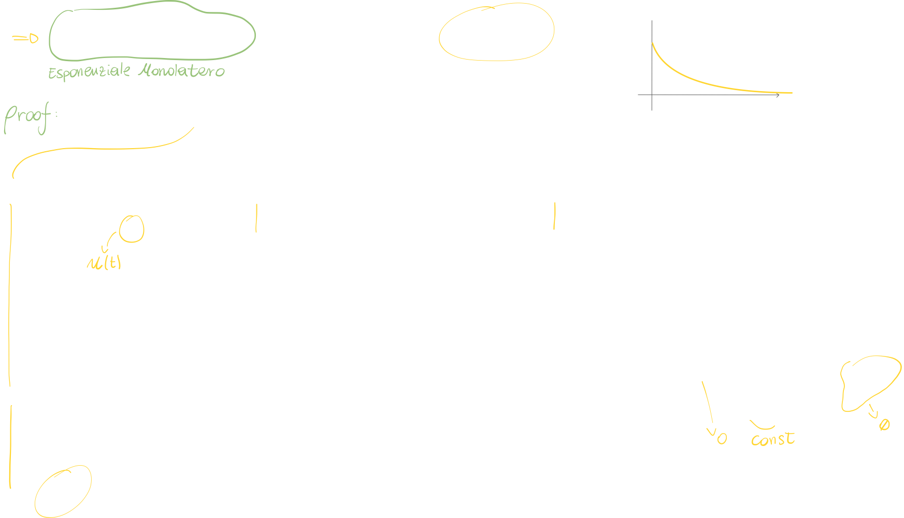

> Anche l'esponenziale decrescente monolatero è un segnale di energia

### Esempio di calcolo di potenza diversa da zero: segnale costante

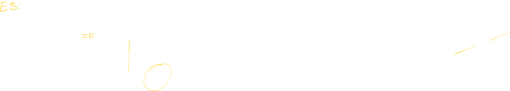

Beh, potevamo aspettarcelo! 
Siccome un segnale costante, effettivamente, **non è un segnale limitato**, **la sua potenza è proprio il quadrato della sua media**, ovvero A2.

### Esempio di calcolo di potenza diversa da zero: Segnale gradino unitario

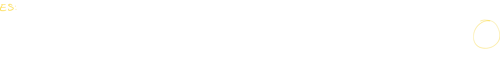

Anche in questo caso il risultato poteva essere previsto:
Siccome la media del gradino, che è zero per t<0 e pari ad 1 per t>0, è 1/2 (basta fare il semplice calcolo (0+1)/2 = 1/2), la sua potenza non sarà nulla.

### Morale della favola per il calcolo della potenza di un segnale

Quando ci ritroviamo con un **segnale limitato** come la finestra rettangolare o triangolare, **la sua energia sarà sempre zero**.

Questo è intuibile anche se pensiamo alla <u>definizione di calcolo di potenza</u>: la potenza viene calcolata attraverso alla media di quel segnale, di conseguenza **se la media di un segnale è zero, anche la sua potenza sarà zero!**.

**Perchè avviene questo?**
Semplicemente perchè se "spalmiamo" (distribuiamo) un valore finito (ovvero l'area al quadrato di un segnale limitato) su di un intervallo infinito, il risultato sarà zero!
Da un punto di vista matematico, la cosa che ci fa convincere della veridicità di questa affermazione è il limite:

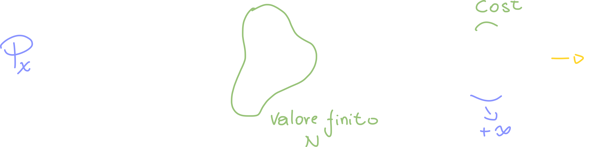

### Notazione per la potenza di un segnale: DC ed AC

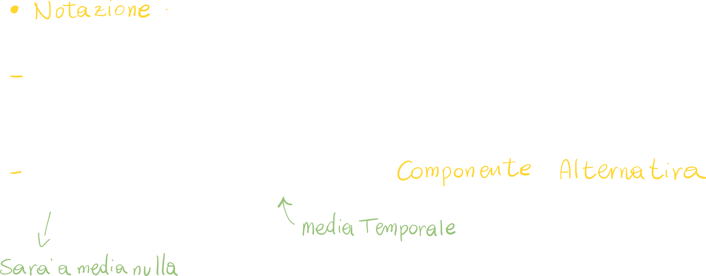

Possiamo indicare con xdc la media del segnale x, e **con xac il segnale privo di media**.

## Energia di un segnale

