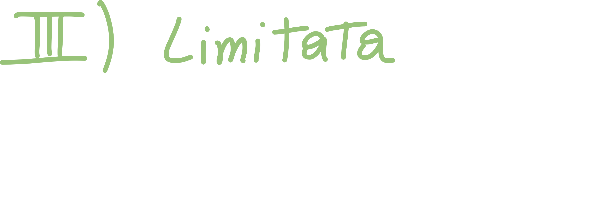
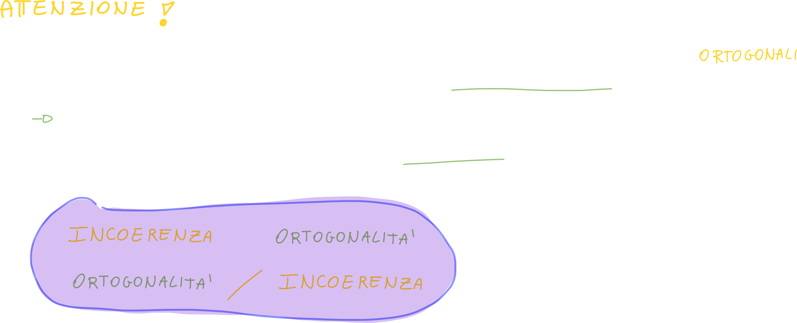

# Applicazione di Media e Potenza

## Mutua Correlazione tra due fasori

# Proprietà della Funzione di Correlazione

## I - Valore nell'origine della correlazione

Il valore nell'origine della mutua correlazione di x ed y è proprio il prodotto scalare tra x ed y, in altre parole **l'energia tra x ed y** se si tratta di <u>segnali di energia</u> o **potenza tra x ed y** se si tratta di <u>segnali di potenza</u>:

## II - Simmetria Coniugata

La mutua correlazione di x ed y corrisponde alla correlazione coniugata (quindi di y ed x) "**ribaltata**", quindi cambiata di segno:

### Dimostrazione Simmetria coniugata

## III - La funzione di mutua correlazione è limitata

### Dimostrazione della limitazione della mutua correlazione

> Sfruttiamo la disuguaglianza di Shwartz (vista anche in [analisi](https://github.com/follen99/Analisi-Matematica))

Il **vantaggio** di rappresentare i segnali come **vettori** sta anche nell'ereditare tutte le proprietà di essi; infatti **l'invarianza della norma**, ereditata dai <u>vettori</u> ci dice che:

> Se un sistema è in uno stato di norma in un determinato momento, rimarrà in uno stato di norma in qualsiasi momento successivo. Ciò è legato alla conservazione dell'energia e del momento angolare nel sistema.

# Proprietà della Funzione di autocorrelazione

## I - Valore nell'origine dell'autocorrelazione

## II - Simmetria coniugata dell'autocorrelazione

Nel caso in cui i segnali sono reali, anche la funzione di autocorrelazione risulterà reale; questo vuol dire che **il coniugato non opera**, e che quindi **il segnale x è pari**.

 

## III - Autocorrelazione Limitata superiormente

Che ci dice questo?

Innanzitutto ci dice che il segnale sarà massimo in zero.
Inoltre, risponde alla domanda: "Se confrontiamo un segnale con se stesso, quando sarà massima la similitudine?" --> quando τ = 0.

Questo perchè quando abbiamo calcolato il valore in zero (proprietà I), abbiamo visto come in zero, l'autocorrelazione vale proprio la norma al quadrato di x.

# Somma dei segnali

## Correlazione della somma di due segnali

Notiamo che la correlazione della somma di due segnali, non è la somma della correlazione dei due segnali, ma **è la somma della correlazione dei due segnali** (in viola)  **<u>più</u> i due termini di mutua correlazione** (in giallo).

**Inoltre** quando la mutua correlazione di x ed y **vale zero** (vale l'additività):

### Icoerenza VS Ortogonalità

### Esempio: Due fasori con frequenze/pulsazioni diverse

Se abbiamo due fasori aventi frequenze/pulsazioni diverse, **sicuramente** i due fasori saranno **incoerenti**:

Questo ovviamente implica che essi **saranno anche ortogonali**.
