# Sistemi nel dominio del tempo

I sistemi nel dominio del tempo sono sistemi che possono essere descritti in base al tempo in cui i loro segnali o input cambiano. Questi sistemi possono essere analizzati e descritti utilizzando le equazioni del tempo che mostrano come i loro segnali di input si traducono in segnali di uscita.

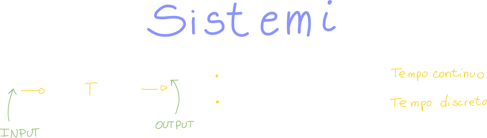

Sostanzialmente i sistemi sono delle **black box** che dato un input restituiscono un output.

## Esempi di sistemi

### Esempio di sistema continuo: Partitore Resistivo

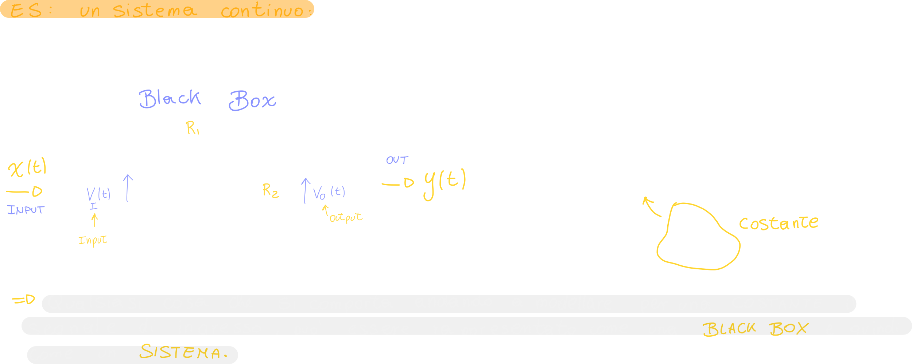

### Esempio di sistema discreto: Ritardo elementare

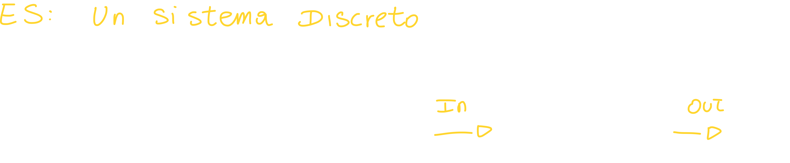

## Disposizioni di sistemi

### Sistemi connessi in cascata

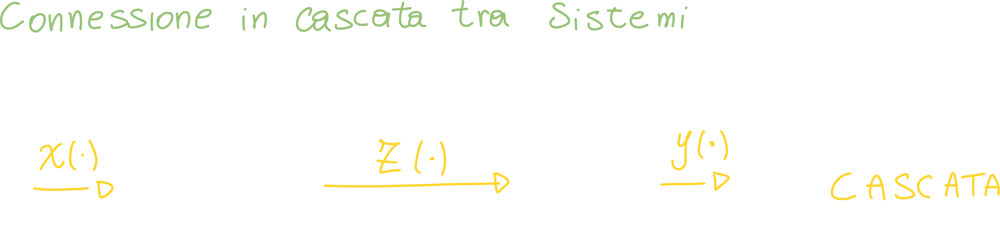

### Sistemi connessi in parallelo

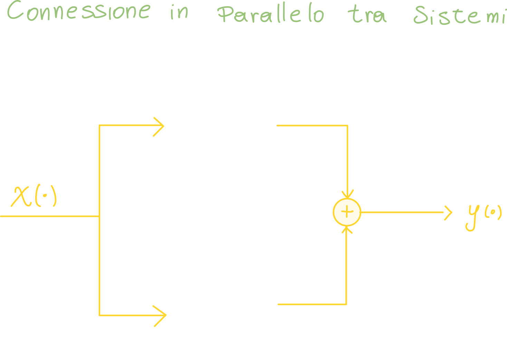

### Sistemi connessi in retroazione

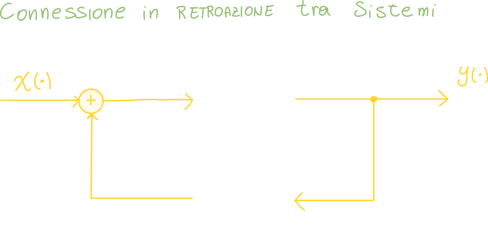

#### Esempio di sistemi connessi in parallelo: filtro MA - Moving Average

Il filtro MA non fa altro che prendere gli ultimi n input e calcolarne la media; il valore risultante verrà poi trasmesso in output.
L'utilità di questo filtro risiede nel fatto che **smussa** in modo direttamente proporzionale al valore di N; questo vuol dire che **di più elementi è calcolata la media ad ogni iterazione, più smussato sarà l'output risultante.**

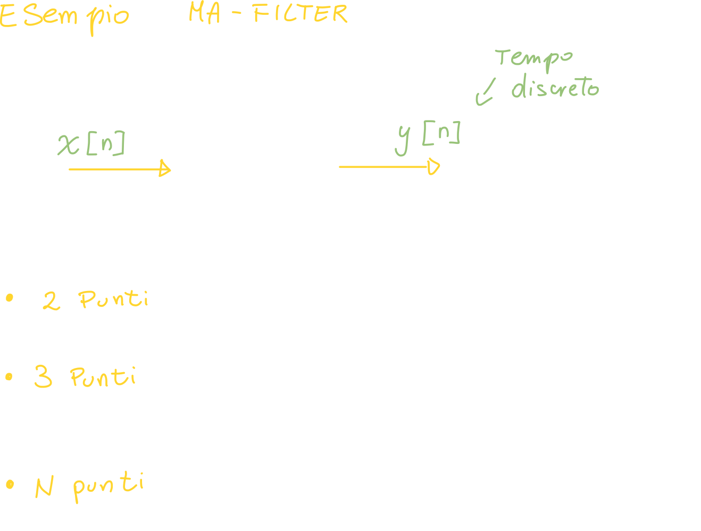

**Codice matlab per il filtro MA**

```matlab
function filtered_signal = getFilteredSignal(originalSignal, magnitude)
    filtered_signal = zeros(1, length(originalSignal));
    for n = 1:length(originalSignal)
        j = n;
        times = 0;
        sum = 0;

        while (times < magnitude && j > 1)                
            sum = sum + originalSignal(j);
            j = j-1;
            times = times + 1;
        end

        filtered_signal(n) = sum/magnitude;
    end
end
```

Questa funzione riceve in ingresso due parametri:

- Segnale da filtrare
- il numero di elementi di cui fare la media

Il codice si serve di due loop:

- Loop foor
  Questo loop serve ad iterare su tutti gli elementi dell'array, in modo da visitare tutti gli elementi del segnale e calcolarne la media mobile.
  Alla fine di ogni ciclo viene calcolata la media degli ultimi m elementi in input; la media viene posta alla posizione corrente di un nuovo array (segnale filtrato).
- Loop While
  Questo loop serve a calcolare la media degli m elementi (magnitude)

Alla fine delle varie operazioni la funzione restituisce un nuovo segnale filtrato:

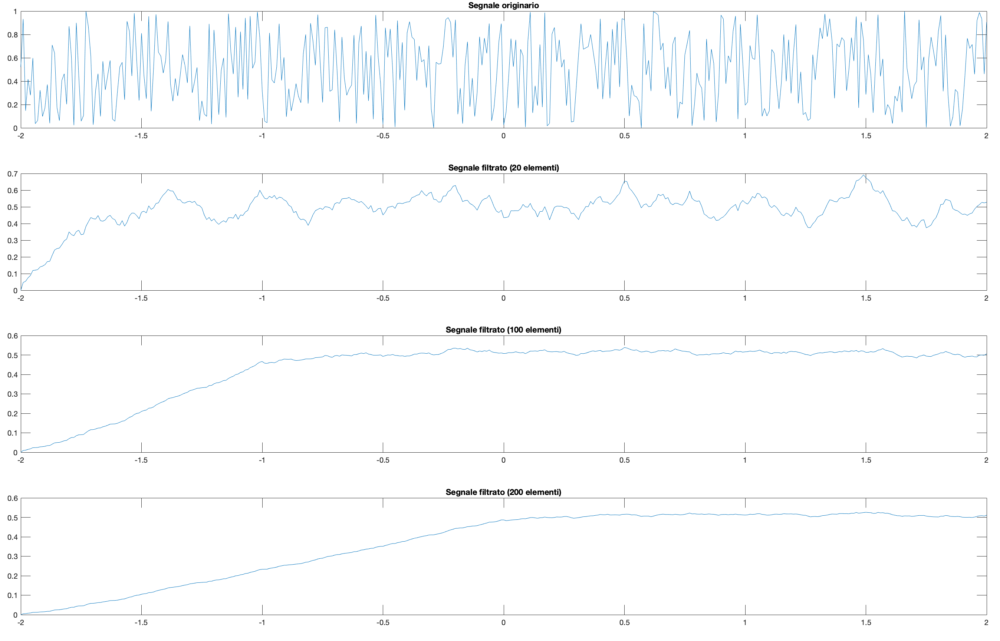

> Nella parte iniziale c'è una "rampa" proprio perchè la media deve "accumularsi" fino a cui magnitude = n elementi arrivati in input.
>
> Se ad esempio decidiamo di fare la media di 50 elementi, e ne sono arrivati 20 è ovvio che la media non sarà completa.

## Proprietà dei sistemi

### Proprietà 1 dei sistemi: Sistemi Dispersivi / Sistemi con memoria

Un sistema è dispersivo **o con memoria** nel momento in cui **l'uscita in un istante di tempo dipende anche da valori precedenti del tempo**:

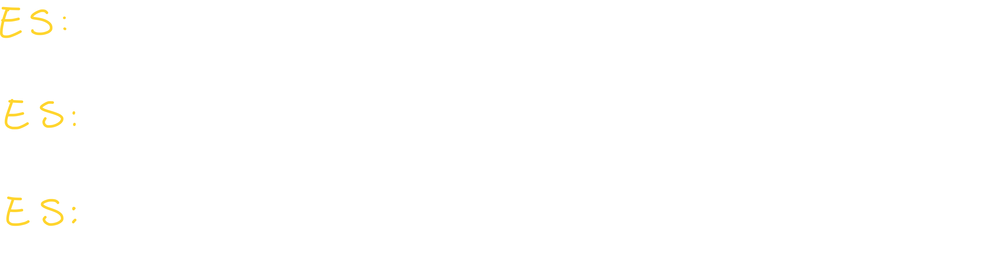

> Il filtro MA visto prima ne è un esempio lampante: il segnale in output dipende proprio dalla media degli m valori precedenti all'istante di tempo corrente.

### Proprietà 2 dei sistemi: Sistemi Causali

La definizione di sistema causale è, se vogliamo, molto simile a quella dei sistemi non dispersivi; infatti un sistema causale è un sistema il cui segnale in uscita dipende solo dai valori del segnale in input **dello stesso istante di tempo o al massimo a valori del segnale per istanti di tempo precedenti a quello corrente.**

**--> In un sistema causale l'output non dipende da valori futuri dell'input, rispetto all'istante di tempo corrente.**

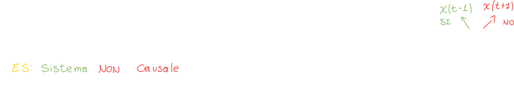

### Proprietà 3 dei sistemi: Sistemi invertibili

**Un sistema è invartibile se esiste un sistema, detto sistema inverso, che in uscita restituisca l'ingresso del primo sistema.**

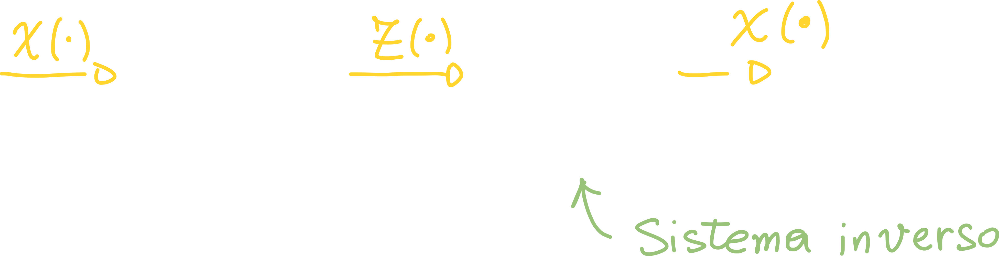

#### Esempio di sistema non invertibile: elevazione al quadrato

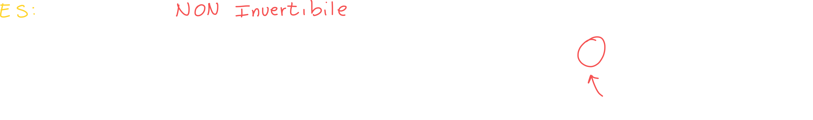

#### Esempio di sistema invertibile: Accumulatore ed invertitore

L'accumulatore è un sistema che somma il valore corrente con quelli precedenti; quindi l'elemento n varrà la somma di tutti gli input fino all'input n;

Deduciamo (dopo qualche ragionamento) che il valore di input all'istante n, è uguale alla somma di tutti i valori fino all'istante n, **meno la somma di tutti i valori fino all'istante n-1**, ovvero:

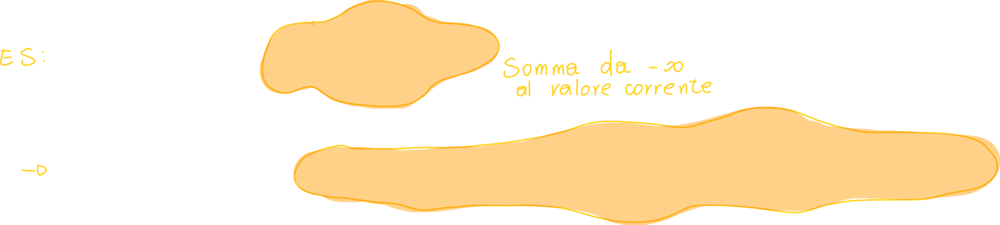

Possiamo convincerci di questa cosa andando a riprodurre il tutto su matlab:

```matlab
% funzione che funge da sistema accumulatore
function accumulated_signal = getAccumulatedSignal(starting_signal)
    accumulated_signal = zeros(1, length(starting_signal));

    for n = 1:length(starting_signal)
        acc_value = 0;
        for j = 1:n
            acc_value = acc_value + starting_signal(j);
        end
        accumulated_signal(n) = acc_value;
    end
end

% funzione che funge da sistema inverso: invertitore
function original_signal = getOriginalSignal(accumulated_signal)
    original_signal = zeros(1, length(accumulated_signal));
    original_signal(1) = accumulated_signal(1);
    
    for n = 2:length(accumulated_signal)
        original_signal(n) = accumulated_signal(n) - accumulated_signal(n-1);	% where the magic happens
    end
end
```

Le due funzioni sono molto semplici:

1. La prima funzione (di accumulazione) somma tutti gli elementi fino all'elemento corrente e posiziona la somma nella posizione equivalente alla corrente di un nuovo array.
2. La seconda funzione (di inversione) sottrae all'elemento corrente la somma degli elementi dell'elemento precedente:
   `original_signal(n) = accumulated_signal(n) - accumulated_signal(n-1);`.

Otteniamo quindi il seguente output:

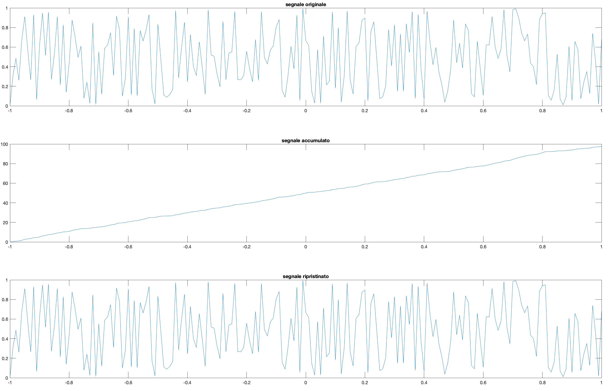


