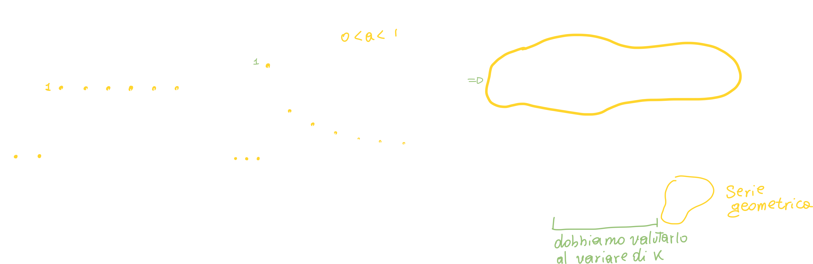
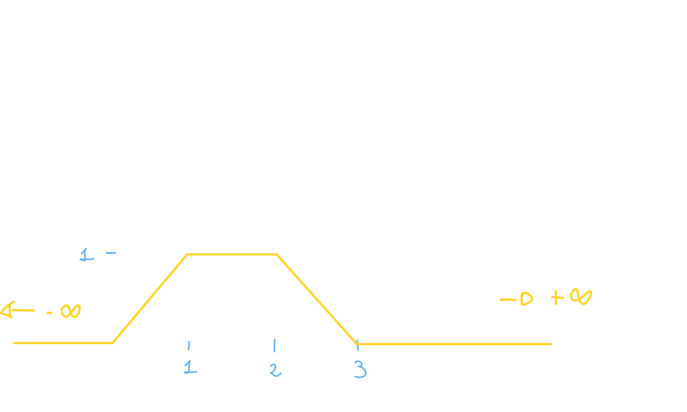
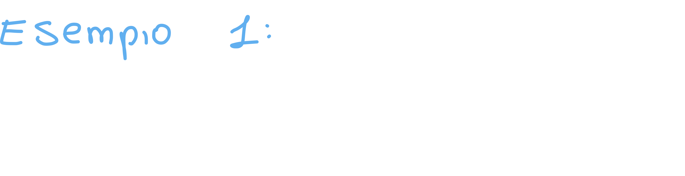

# Sistemi LTI - Linear Time Invariant

Un sistema si dice LTI quando rispetta sia la **proprietà di linearità**  che la **proprietà di tempo invarianza**;

# Impulse Response e Convoluzione

Per arrivare alla definizione di convoluzione dobbiamo seguire 3 passaggi:

## Passaggio 1: Proprietà di Riproducibilità

Abbiamo visto nelle proprietà della delta (nella lezione 3.02 - Segnali Ordinari) la **proprietà di riproducibilità (time shifting) della delta:**

> La proprietà di riproducibilità della delta ci dice che se moltiplichiamo una delta shiftata temporalmente per un segnale x(t), avremo come risultato il segnale x(t) valutato nel time shift della delta, moltiplicato per la delta stessa.

Se sfruttiamo questa proprietà possiamo decomporre tutto il segnale in entrata, facendo una sommatoria:

## Passaggio 2: Impulse Response

**L'impulse response è la risposta di un sistema LTI quando in input viene fornito un segnale di tipo delta, ovvero un impulso di Dirac:**

Siccome abbiamo a che fare con dei sistemi LTI, questi rispetteranno le proprietà di **linearità e tempo invarianza:**

## Passaggio 3: Convoluzione a tempo discreto

Come ultimo passaggio ci basta sostituire il nostro nuovo **impulse response** alla delta nella proprietà di riproducibilità, in modo da ottenere:

**Possiamo quindi scrivere l'uscita di un sistema LTI come convoluzione dell'ingresso al sistema, ed il suo impulse response.**

Capiamo quindi che l'operazione di convoluzione è molto simile all'operazione di **correlazione**, dove il primo segnale resta fermo ed il secondo viene traslato al di sopra del primo; in questo caso avviene la stessa cosa:

**Nella convoluzione il segnale in input resta fermo mentre l'impulse response trasla al di sopra dell'input.**

# Convoluzione a tempo continuo

La convoluzione a tempo continuo è la medesima operazione ma con l'utilizzo degli integrali invece che della sommatoria:

### Esempio 1 per la convoluzione: sistema differenza prima

Conosciamo il legame ingresso/uscita di alcuni sistemi, come ad esempio il <u>sistema differenza prima</u>.

Il sistema differenza prima non fa altro che sottrarre all'elemento corrente di un segnale, il suo elemento precedente.

Prima di procedere con l'esempio, però, dobbiamo assicurarci che il sistema sia LTI:

#### Il sistema differenza prima è LTI?

Per prima cosa verifichiamo la **linearità** del sistema:

Dopo aver dimostrato che il sistema è lineare, dobbiamo dimostrare che è anche **tempo invariante**:

Per dimostrare che un sistema è tempo invariante ci basta effettuare due sostituzioni e calcolare l'uscita del sistema:

1. Sostituiamo al segnale di ingresso un segnale ritardato di ritardo m.
   Calcoliamo l'uscita y(n).
2. Sostituiamo **all'uscita** y(n) **l'uscita ritardata y(n-m)**.
   Calcoliamo l'uscita y(n-m).

Se le due uscite sono uguali, allora il sistema è tempo invariante.

---

#### Calcoliamo la risposta impulsiva del sistema differenza prima

Torniamo al legame ingresso - uscita del sistema differenza prima; per definizione la risposta impulsiva di un sistema è la risposta del sistema quando viene sollecitato da un impulso:

Ci basta quindi sostituire all'ingresso del sistema una delta per ottenere la risposta impulsiva del sistema; se effettuiamo la convoluzione tra un segnale input qualsiasi e la risposta inpulsiva, otterremo l'output del sistema.

##### Output del sistema differenza prima: gradino unitario discreto in input

Dopo aver trovato la risposta impulsiva di un sistema, riusciamo a prevedere l'output del sistema dato in input un segnale qualsiasi; ci basta effettuare la convoluzione tra un input scelto da noi (in questo caso un gradino unitario a tempo discreto):

In questo caso la convoluzione ci ha portati al risultato y[n] = u[k] - u[k-1]; il risultato grafico è di semplice interpretazione: per definizione gradino unitario ha ampiezza costante 1, quindi solo il primo valore sarà diverso da zero:

##### Output del sistema differenza prima: finestra discreta in input

Possiamo fare lo stesso ragionamento ponendo in input il segnale finestra discreta:

Anche in questo caso possiamo verificare con matlab:

> Il segnale negativo si verifica quando k=N

# Esempi di Convoluzione tra segnali

## Convoluzione tra un gradino ed una sequenza esponenziale monolatera

In questo esempio ci viene chiesto di **calcolare l'uscita** per un sistema che ha risposta impulsiva h(n) quando in ingresso è posto un segnale gradino unitario:

### Step 1 per la convoluzione: Ribaltamento

La prima cosa da fare è **ribaltare il secondo segnale**, proprio perchè la convoluzione, a differenza della correlazione, prevede che il secondo segnale venga ribaltato:

### Step 2 per la convoluzione: Traslazione

Dopo aver ribaltato il segnale, dobbiamo far traslare il secondo segnale; questa traslazione può avvenire per valori di Tau positivi o per valori negativi (il segnale shifta verso sinistra o verso destra).

È ovvio che è inutile far traslare il segnale verso una direzione che non prevede intersezione tra i due segnali, producendo come convoluzione zero:

In questo caso, per valori di n negativi la convoluzione non produce alcun risultato "interessante", di conseguenza ci conviene far traslare il segnale verso destra;

Per valori positivi il secondo segnale trasla a destra ed "incontra" il primo segnale, producendo un valore della  convoluzione diverso da zero.

### Step 3 per la convoluzione: risoluzione della sommatoria/integrale

A questo punto risolviamo la sommatoria/integrale usando come estremi quelli che abbiamo trovato graficamente:

Risolvendo il tutto troviamo l'equazione della convoluzione:

Se grafichiamo questa equazione troveremo:

## Convoluzione visuale tra due impulsi rettangolari

Un altro metodo per effettuare la convoluzione tra due segnali è quello di riportare in un array i valori di entrambi i segnali per ogni istante di tempo (discreto!); anche in questo caso **dobbiamo ricordarci di effettuare la riflesisone del secondo segnale.**

### Step 1: ribaltamento

Ribaltiamo quindi il secondo segnale; in questo esempio trattandosi di un segnale rettangolare non noteremo il ribaltamento, che è più evidente per segnali con ampiezze diverse a seconda dell'istante di tempo.

### Step 2: Moltiplicazione

È tutto pronto: possiamo scrivere i nostri array e moltiplichiamo membro a membro ed addizioniamo i risultati di ogni prodotto; la somma dei prodotti membro a membro è la convoluzione per quello specifico istante di tempo:

È importante notare che la convoluzione va calcolata **per tutti i valori** di intersezione (che producano una convoluzione diversa da zero!) del primo e del secondo segnale. Questo è importante, perchè nel caso dell'autocorrelazione, era sufficiente effettuare **solo metà dei calcoli**, perchè quando i due segnali sono lo stesso segnale, la correlazione (autocorrelazione) è **specchiata**.

### Step 3: moltiplicazione dei coefficienti per la delta

In questo passaggio andiamo a moltiplicare i coefficienti ottenuti (convoluzione per ogni istante di tempo) per un segnale delta; questo passaggio è facoltativo, visto che potremmo semplicemente inserire i valori della convoluzione istante per istante all'interno di un array:

Oppure possiamo semplicamente graficare il tutto:

## Convoluzione tra due segnali rettangolari di durata diversa a tempo continuo

In questo esempio vediamo come calcolare la convoluzione tra due segnali di durata diversa a tempo continuo:

### Step 1: riflessione

Anche in questo caso la prima cosa da fare è flippare il secondo segnale; il secondo segnale sarà quello che shifterà temporalmente, quindi verrà centrato in **Tau**.

### Step 2: Time shift

Anche in questo caso è inutile shiftare il segnale in una direzione che non produce intersezione diversa da zero con l'altro segnale; in questo caso ci conviene shiftare verso destra.

### Step 3: analisi della convoluzione

In questo passaggio andiamo ad analizzare l'effettiva convoluzione tra i due segnali; ovvero andiamo a vedere **nei diversi casi di Tau** che cosa succede alla convoluzione:

#### Caso 1: No overlap

In questo caso ci troviamo, appunto, con i due segnali che producono un'intersezione nulla, e quindi in questo intervallo temporale (-inf, t<0) la convoluzione è nulla:

#### Caso 2: Overlap 1

In questo caso il secondo segnale viene shiftato verso destra, e di conseguenza produce una sovrapposizione diversa da zero; siccome il secondo segnale "entra" nel secondo ci aspetteremo una convoluzione crescente.

Dobbiamo però vedere due cose:

- In che intervallo una precisa sovrapposizione si verifica?
- A quanto è uguale la sovrapposizione (convoluzione)?

La sovrapposizione (convoluzione) si trova andando a calcolare l'integrale della moltiplicazione dei due segnali (applicando la definizione di convoluzione) con gli estremi del caso corrente (caso 2):

#### Caso 3: Overlap 2:

Anche in questo caso c'è una sovrapposizione tra i due segnali, ma siccome **il secondo segnale è ha una durata inferiore al primo** ci aspettiamo che esso **entri completamente** all'interno del secondo, rendendo la convoluzione costante:

#### Caso 4: Overlap 3

Anche in questo caso c'è una sovrapposizione, ma in questo caso specifico il secondo segnale "esce" dal primo, e di conseguenza ci aspetteremo che la convoluzione sarà **decrescente**:

#### Caso 5: No overlap 2

Questo caso è analogo al primo, essenzialmente i due segnali non si sovrappongono e la convoluzione è zero.

### Step 4: Tiriamo le somme

Abbiamo quindi calcolato la convoluzione per ogni intervallo significativo, riportiamo il tutto in un sistema:

Possiamo anche riportare il sistema su di un grafico, visualizzando la convoluzione tra i due segnali:

## Convoluzione tra due array

Otteniamo quindi la convoluzione sottoforma di array:

## Componente continua dell'uscita

Vogliamo calcolare la componente continua dell'uscita; la CC è essenzialmente **la media del segnale**, mentre la componente alternata è il segnale privato della sua media:

Effettuiamo quindi la media scrivendo l'uscita come la convoluzione tra entrata e risposta impulsiva:

## Convoluzione tra un segnale rettangolare ed una rampa

Sappiamo che i due segnali hanno una **durata diversa**, e che il segnale rampa dura meno del segnale rettangolare; **ci conviene far scorrere il segnale rettangolare e mantenere fisso il segnale rampa** (meno casi), ma per esercizio facciamo il contrario:

N.B. gli intervalli di integrazione potrebbero essere errati ma in linea generale l'esercizio è esplicativo.

Anche in questo caso suddividiamo i diversi casi:

### Caso 1: nessuna intersezione significativa

### Caso 2: 

In questo caso il segnale rampa si trova "mezzo fuori e mezzo dentro":

### Caso 3: 

In questo caso, siccome il segnale rampa dura meno del segnale triangolare, esso si trova completamente al di sopra del segnale rettangolare:

Se andiamo a calcolare l'integrale otteniamo:

### Caso 4:

Questo caso è simile al caso 2, ovvero il secondo segnale "esce" dal primo:

## Convoluzione discreta

Stiamo attenti ad effettuare **"il flip"** del secondo segnale, in questo caso h(n):

Dopo aver effettuato il flip, il processo è il medesimo della correlazione!

# Proprietà della convoluzione

L'operazione di convoluzione ha delle proprietà molto importanti che ci permettono di velocizzare di molto i calcoli degli esercizi.

## (1) Proprietà commutativa

Questa proprietà ci permette di dire che scambiando l'ordine di convoluzione il risultato non cambia.

### A cosa ci serve?

È una proprietà molto utile: possiamo sfrittarla per scambiare l'ordine dei segnali nel momento in cui dobbiamo calcolarne la convoluzione; porremo come segnale "mobile" (il secondo) quello che ci permette di effettuare meno calcoli possibile!

## (2) Proprietà associativa

Questa proprietà ci permettere di associare 2 o più termini in un'operazione di convoluzione:

### A cosa ci serve?

È molto utile nel momento in cui si hanno più sistemi **in cascata**:

## (3) Proprietà distributiva

Questa proprietà ci permette di distribuire dei termini, proprio come potremmo fare quando troviamo un termine in evidenza nella moltiplicazione.

## (4) Proprietà dell'Elemento unitario

Questa è una delle proprietà più importanti della delta! Ci permette di semplificare di molto alcune operazioni:

Quando la delta ha un'ampiezza, questa viene semplicemente moltiplicata per il segnale risultate:

### A cosa ci serve?

Torna molto utile nel calcolo degli esercizi: ad esempio abbiamo un segnale moltiplicato per una delta shiftata temporalmente:

E se abbiamo sia il segnale iniziale che la delta shiftati temporalmente? Effettuiamo la somma tra i due ritardi:

## (5) Proprietà della derivata 

## (6) Proprietà dell'integrale

Questa proprietà ci dice che l'integrale della derivata di un segnale, è il segnale stesso!

Possiamo dimostrarlo nel seguente modo:

## (7) Invarianza temporale

Anche questa proprietà è molto importante, perchè ci dice che se applichiamo un ritardo a due segnali, e poi ne calcoliamo la convoluzione, il ritardo verrà conservato anche nel risultato della convoluzione:

### A cosa ci serve?

È molto utile proprio perchè possiamo applicare un ritardo sia al segnale in ingresso che alla risposta impulsiva, e facendone la convoluzione, il segnale in uscita y(t) sarà soggetto al time shift:

## (8) Time Scaling

Questa proprietà ci dice che se abbiamo entrambi i segnali soggetti all'operazione di convoluzione aventi il tempo moltiplicato per una costante (time scaling), questa costante verrà riportata anche nel risultato della convoluzione, sia moltiplicata per il tempo del segnale, sia moltiplicata per il segnale stesso, ma al denominatore ed in modulo:

### A cosa ci serve?

## (9) Proprietà della durata

Questa proprietà ci dice che se effettuiamo la convoluzione tra due segnali di durata diversa, e che sopratutto hanno inizio e fine completamente diversi, il risultato della convoluzione avrà degli estremi ben precisi:

