# Legami Ingresso Uscita in termini di Correlazione

[TOC]

Possiamo scriverci l'uscita di un sistema tramite l'operazione di **correlazione**:

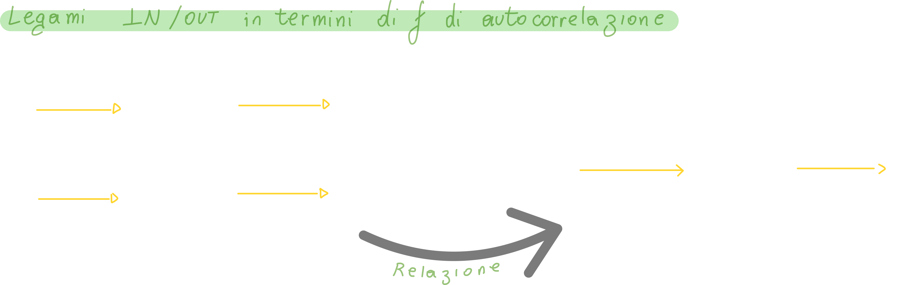

Questa relazione, sostanzialmente, ci dice che dati due sistemi separati, la correlazione delle uscite dei sistemi può essere scritta come **convoluzione** delle **correlazioni** degli ingressi e delle risposte impulsive dei due sistemi:

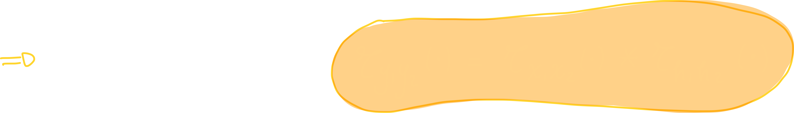

## Dimostrazione del legame ingresso uscita in termini di correlazione

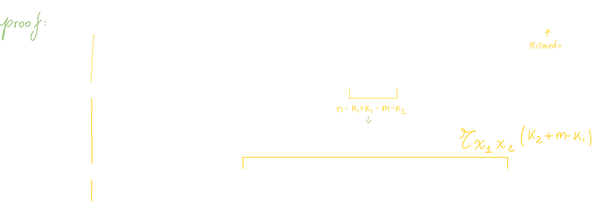

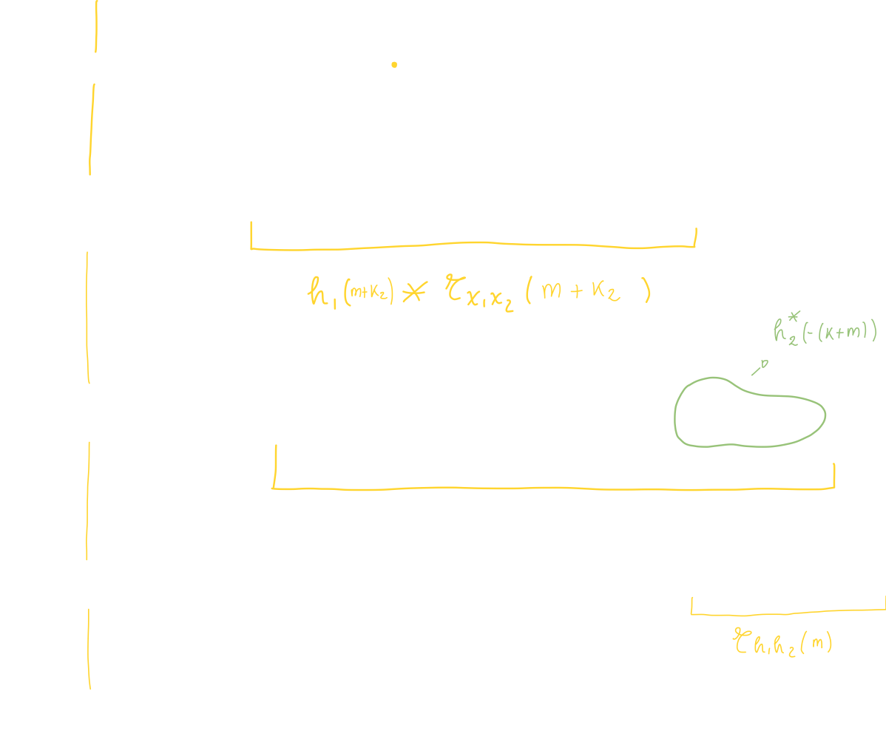

## Differenze tra correlazione e convoluzione

Ci sono principalmente 2 differenze:

1. Nella convoluzione non è presente il coniugato, mentre nella correlazione si.
2. Nella convoluzione il risultato viene ribaltato, mentre nella correlazione viene lasciato così com'è.

All'atto pratico, quindi, entrambe le operazioni vanno a far scorrere uno dei due segnali al di sopra dell'altro (solitamente il segnale più corto scorre su quello più lungo); la differenza risiede nel fatto che quando effettuiamo la correlazione, il secondo segnale non viene ribaltato.

Quindi, la <u>convoluzione</u> **serve per calcolare l'effetto di un segnale sull'altro**, mentre la <u>correlazione</u> **serve per misurare la similitudine tra i due segnali**.

Da questa sostanziale differenza capiamo che se il secondo segnale è simmetrico, **sia la convoluzione che la correlazione producono lo stesso risultato!**

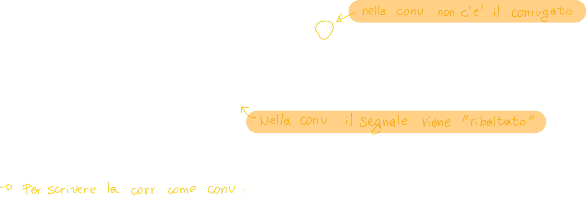

## Casi particolari dei legami input-output

Questi casi particolari ci torneranno **molto utili** quando parleremo di [legami I/O per densità spettrale](https://github.com/follen99/Fondamenti-Di-Telecomunicazioni/blob/main/AppuntiMD/3.2.7%20-%20AI%20-%20Legami%20ingresso%20uscita%20per%20densità%20spettrali.md).

### Caso particolare 1: Autocorrelazione

Possiamo fare lo stesso ragionamento usando **l'autocorrelazione invece della correlazione tra due segnali**:

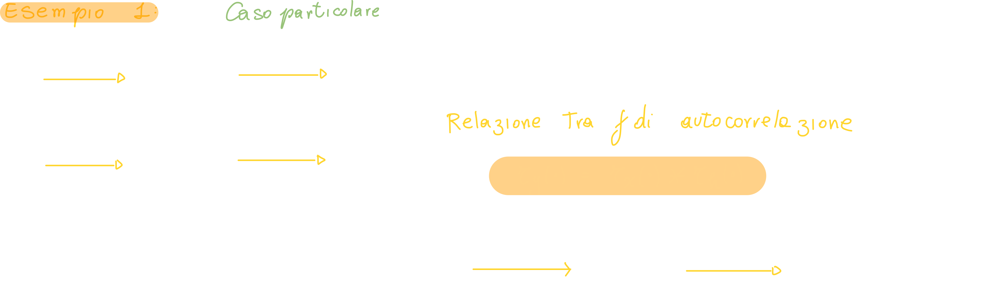

A cosa serve sapere questo?

### Caso particolare 2:

### Caso particolare 3:

## Esempi di applicazioni

### Multipath

Un segnale può arrivare a destinazione seguendo diversi percorsi; a seconda del percorso seguito il segnale arriverà più o meno ritardato; 
Il problema da risolvere è il seguente: siccome in ricezione abbiamo un unico segnale (sommatoria dei diversi segnali) come facciamo a capire il ritardo ed attenuazione del segnale?

Usiamo la **tecnica del calcolo della funzione di mutua correlazione** anche detta **cross correlation**:

Durante ogni trasmissione, viene prima trasmesso un **segnale pilota** avente un andamento noto; solo successivamente viene trasmesso il segnale "non noto". 
Dopo la ricezione di entrambi i segnali, questi vengono **confrontati** (tramite la correlazione); questo permette di **capire il ritardo tra i due segnali** e quindi capire il ritardo del segnale non noto.

#### Processo della cross correlation

Ci scriviamo y(t) come **sommatoria** di diversi segnali in ingresso, ciascuno avente un'ampiezza ed un ritardo **non noti**:

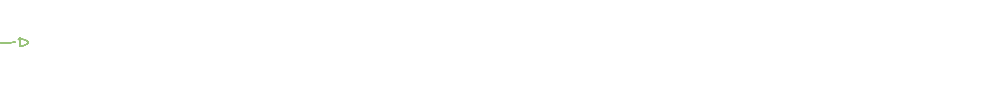

Esplicitiamo l'operazione di **correlazione**; ovviamente sia i coefficienti di attenuazione che la somma non vengono influenzati dall'integrale, quindi possiamo portarli fuori:

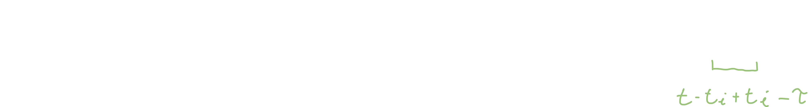

Ci riscriviamo il ritardo aggiungendo e sottraendo **ti**, in modo da far comparire l'autocorrelazione:

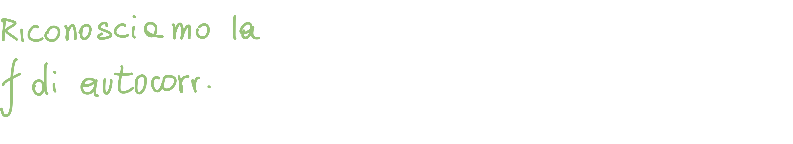

Possiamo quindi scriverci la correlazione tra x ed y come la somma dei prodotti delle diverse autocorrelazioni di x moltiplicate per l'ampiezza corrente.

### Zero order Filtro interpolante

Più avanti nelle lezioni vedremo in cosa consiste **il processo di campionamento** di un segnale; essenzialmente un segnale **a tempo continuo** viene trasformato in una **serie di segnali delta** che vengono poi trasmessi; 

Il filtro interpolante **ha il compito di ricostruire il segnale continuo a partire da un segnale campionato**.

Questo filtro **è composto da un certo ritardo T che viene sottratto al segnale**:

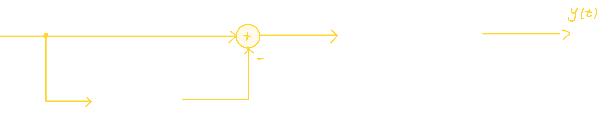

Ovvero: sottrale al segnale x(t) una sua versione ritardata; se proviamo a scrivere il tutto sottoforma di formule:

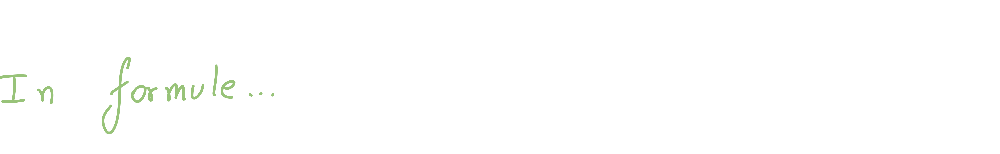

---

Proviamo a calcolare l'uscita quando in ingresso al filtro abbiamo un segnale rettangolare:

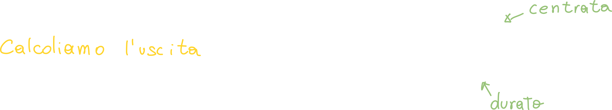

#### Step 1: troviamo l'impulse response del filtro

Per farlo ci basta applicare la definizione della risposta impulsiva:

> La risposta impulsiva di un sistema è la risposta del sistema quando viene sollecitato da un impulso.

Quindi ci basta porre x(t) = impulso di Dirac:

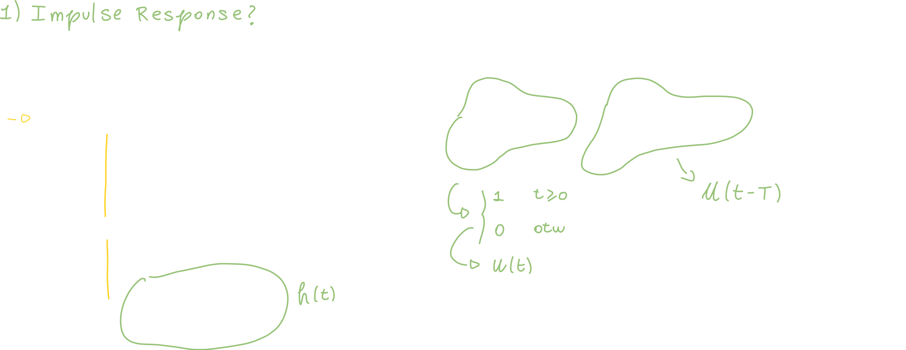

#### Step 2: Calcolare l'uscita come convoluzione tra x(t) ed h(t):

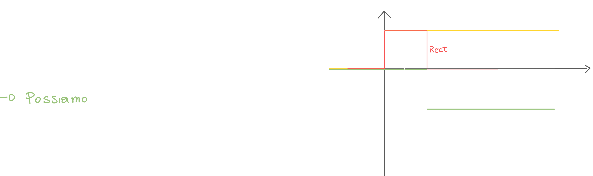

A questo punto ci basta calcolare la convoluzione suddividendo i vari casi come abbiamo imparato a fare nelle scorse lezioni:

- Caso 1:

  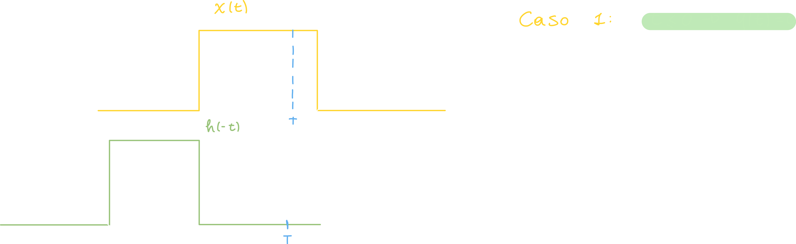

- Caso 2:
  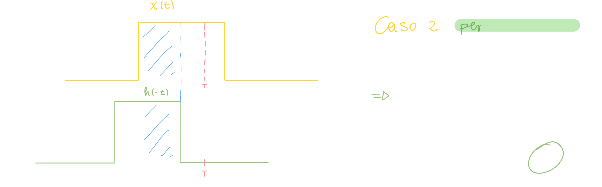

- Caso 3:
  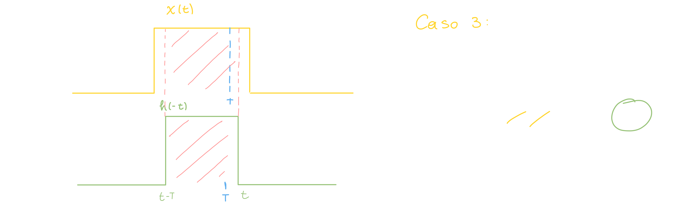

- Caso 4:
  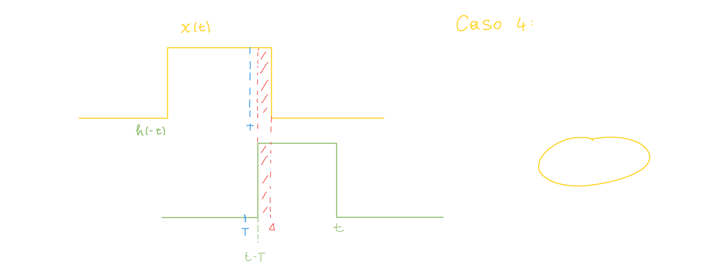

- Caso 5:
  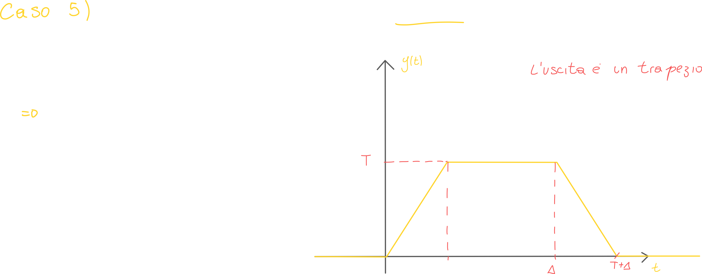

Siccome i due segnali x(t) ed h(t) sono due segnali rettangolari la convoluzione tra i due sarà un trapezio; qualora avessero avuto la stessa durata, la convoluzione avrebbe prodotto un segnale triangolare.

