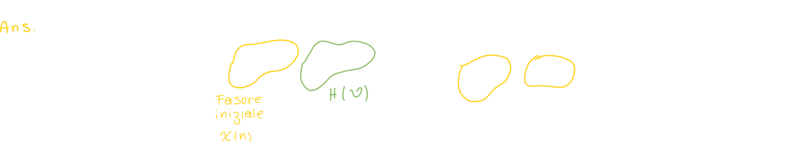
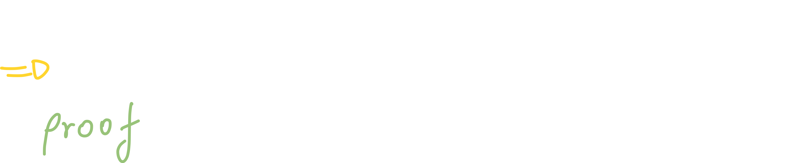
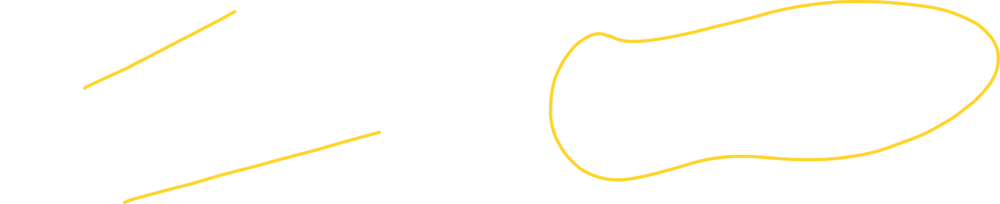
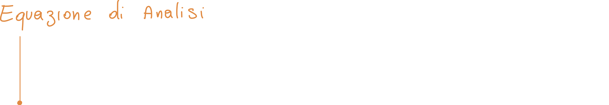
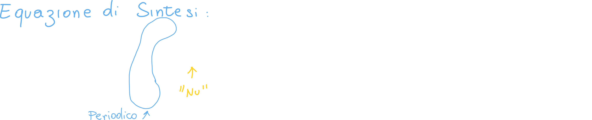
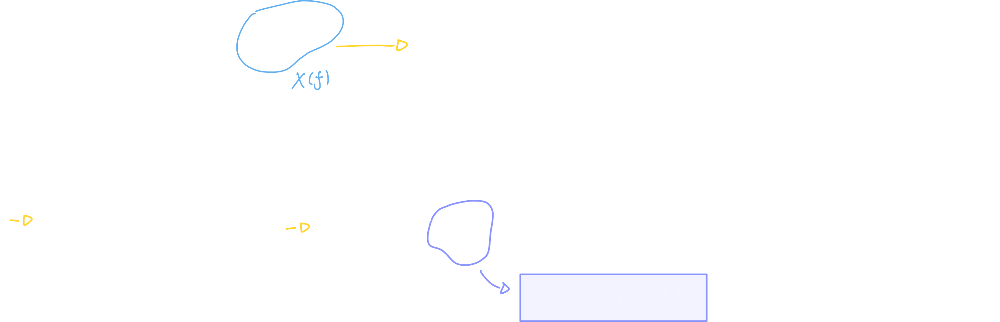
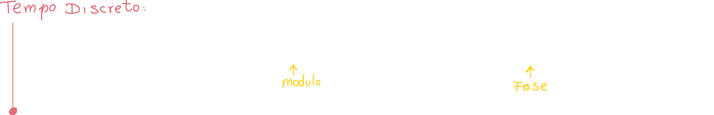

# Indice

[TOC]

# Risposta in Frequenza di un sistema LTI

Se poniamo come ingresso un segnale **fasoriale** (fasore), possiamo dimostrare che in uscita avremo la **risposta in frequenza** **H(ejw)** che non dipende dal tempo, moltiplicato per il fasore iniziale:

## Risposta in frequenza a tempo continuo

Scrivendo il tutto in formule otteniamo:

Ci accorgiamo che il fasore in frequenza non dipende dal tempo e possiamo quindi portarlo fuori:

Battezziamo quindi l'integrale come "**risposta in frequenza**" del sistema:

Se scriviamo il segnale di output come numero complesso (quale esso è!) con modulo e fase otteniamo:

## Risposta in frequenza a tempo Discreto

La stessa cosa può essere applicata a tempo discreto:

Ci scriviamo quindi y(n) come convoluzione tra input e risposta impulsiva:

Anche in questo caso battezziamo la sommatoria come **Risposta in frequenza** ed otteniamo:

## Esempi di applicazione 

### Esempio 1: trovare la risposta impulsiva avendo solo l'output

Se ci troviamo un problema che ci chiede di trovare la risposta impulsiva avendo a disposizione solo l'output, possiamo risolverlo nel seguente modo:

La prima cosa da fare è **sollecitare il sistema con un fasore** (in questo caso a tempo discreto):

Dividiamo l'esponenziale e riconosciamo il fasore con cui abbiamo sollecitato il sistema (in ingresso), di conseguenza lo rinominiamo x(n).

Riconosciamo anche la risposta in frequenza del sistema, di conseguenza la rinominiamo H(ni).

A questo punto rinominiamo l'uscita y(n) come ci era stata presentata inizialmente, ovvero come ritardo di 1 del segnale in ingresso (y(n) = x(n-1)); isoliamo H(ni) ed otteniamo:

A questo punto separiamo l'esponenziale e semplifichiamo; otteniamo finalmente:

La risposta in frequenza del sistema è proprio un fasore in frequenza.

## Differenza tra input ed output

La differenza tra il segnale in input (fasore) ed il segnale in output (y(-)) sono principalmente due:

- Il segnale in output **ha ampiezza pari al modulo della risposta in frequenza**
- il segnale in output avrà una **fase modificata**, pari proprio alla **fase della risposta in frequenza**.

Capiamo quindi che **possiamo prevedere l'output** se conosciamo la risposta in frequenza H(-)!

Se poniamo in input una sinusoide complessa (**fasore**), questa in output **verrà amplificata** (moltiplicata per la risposta in frequenza) oltre ad essere **shiftata o sfasata** in base alla **risposta in fase**.

## Relazione tra uscita e risposta impulsiva

Proviamo a scriverci la risposta come convoluzione tra risposta impulsiva ed ingresso:

Abbiamo poi detto di porre in input un fasore, quindi sostituiamo ejωn al segnale di ingresso x(n):

Moltiplichiamo l'argomento dell'esponenziale e successivamente lo scriviamo come moltiplicazione di due exp:

Siccome una parte dell'exp è costante, possiamo portarla fuori:

Possiamo "battezzare" la sommatoria H(ejω), che non è altro che la **trasformata di fourier a tempo discreto**, quindi:

# Trasformata di Fourier

La trasformata di Fourier è uno strumento matematico che usiamo per analizzare i segnali nel **dominio della frequenza**.

La trasformata è nota anche come "Rappresentazione nel dominio della frequenza" del segnale originale.

## Overview

### Per quali tipi di segnali è possibile calcolare la trasformata?

- Segnali di energia
- Segnali di potenza
  - Per ottenere la trasformata di questi segnali **dobbiamo usare le proprietà** perchè la formula della trasformata è applicabile solo a **segnali assolutamente integrabili**, ovvero per un segnale il quale integrale può essere calcolato per tutti i valori del tempo.
- Segnali correlati ad impulsi
  - Questi ultimi non sono ne segnali di energia ne segnali di potenza; c'è infatti un'eccezione per questo tipo di segnali.

### Rappresentazione della trasformata di Fourier

La trasformata di Fourier è un **numero complesso**, avrà quindi **un modulo (magnitute)** ed un **angolo o fase**:

## Formule per la trasformata a tempo continuo

### Tempo ➔ Frequenza

La prima formula (**Trasformata di Fourier**) è usata per trasformare il segnale dal dominio del tempo al dominio della frequenza:

### Frequenza ➔ Tempo

Questa formula (**Trasformata inversa di Fourier**) è usata per tornare al dominio del tempo dal dominio della frequenza:

## Formule per la trasformata a tempo discreto

### Tempo ➔ Frequenza

### Frequenza ➔ Tempo

Lo spettro è periodico, di conseguenza ci basta integrare solo da -1/2 a +1/2

## Modi di rappresentare la trasformata

Possiamo rappresentare la trasformata in diversi modi: 

Un altro modo è quello di usare la **notazione in modulo e fase**:

## Condizioni di esistenza della Trasformata Di Fourier

1. Il segnale deve avere un **numero finito di massimi e minimi** in un **intervallo finito qualsiasi**.
   "intervallo finito" ➔ La FT esiste anche per segnali non periodici, e quindi il "periodo di tempo" in questo caso non è definito.
2. Il segnale deve avere un numero finito di **discontinuità**  in un qualsiasi intervallo finito.
3. Il segnale deve essere **assolutamente integrabile**, ovvero:
   
   Se L'integrale del modulo del segnale ci restituisce un valore n diverso da infinito, allora il segnale è assolutamente integrabile.
   1. I **Segnali di energia** sono assolutamente integrabili (ad esempio la finestra .
   2. Gli **impulse related signals** sono assolutamente integrabili (segnali associati o generati da impulsi).
   3. I **Segnali di potenza** non sono assolutamente integrabili (ad esempio il gradino u(t) è un segnale di potenza).
   4. **I segnali nè di potenza nè di energia non sono assolutamente integrabili.**

## Legami ingresso uscita nel dominio della frequenza

Come nella lezione precedente abbiamo visto che l'uscita di un sistema LTI può essere scritta come convoluzione tra ingresso e risposta impulsiva, anche nel dominio possiamo fare qualcosa di simile:

Per quanto riguarda il tempo discreto, possiamo scrivere le seguenti uguaglianze:

Ovvero:

- Il modulo dell'uscita è uguale al modulo dello spettro in entrata **moltiplicato** per il modulo della risposta impulsiva
- La fase dell'uscita è uguale alla fase dello spettro in entrata **addizionata** per lo spettro della risposta impulsiva

#### La trasformata del gradino unitario

Possiamo però ottenere la trasformata se ricaviamo il segnale gradino unitario a partire da una delta:

