# Indice dei contenuti

[TOC]

# Recap lezione precedente

## Cambiare Dominio

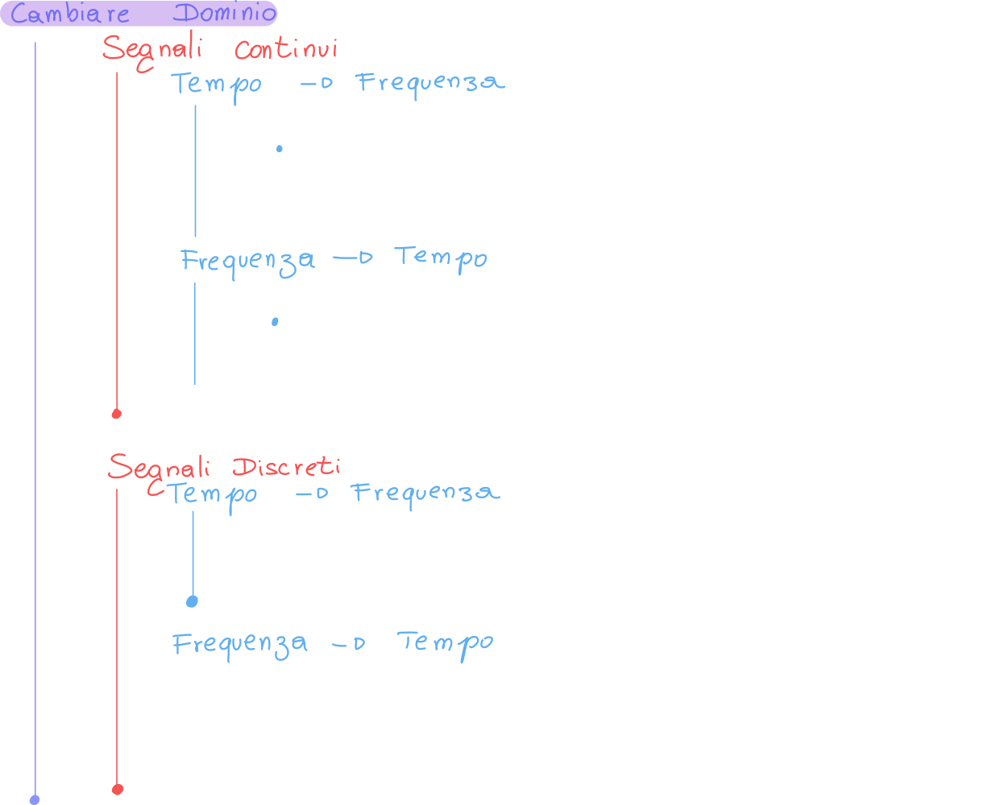

## Legame ingresso  uscita

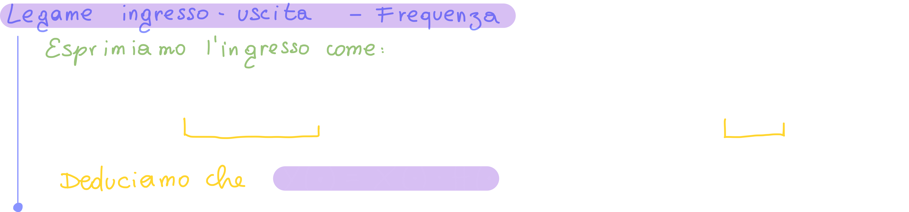

# Trasformate Notevoli

## Proprietà dei segnali reali

Quando abbiamo un segnale reale, avremo la seguente proprietà:

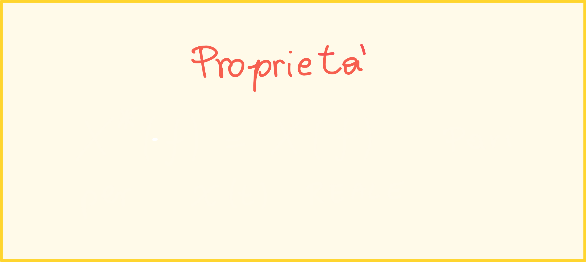

In poche parole, avremo che lo spettro del coniugato riflesso di un segnale **reale** sarà uguale allo spettro del segnale iniziale; questo vuol dire che **i segnali reali sono pari**.

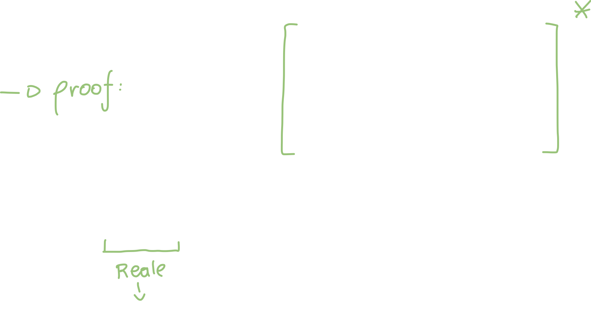

Possiamo seguire il seguente schema:

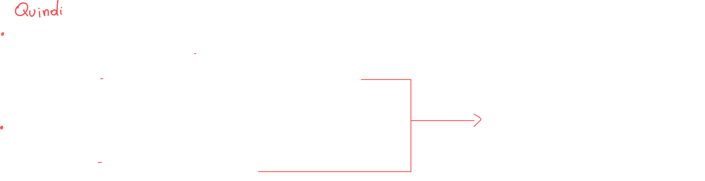

## Trasformata dell'esponenziale monolatero a tempo continuo

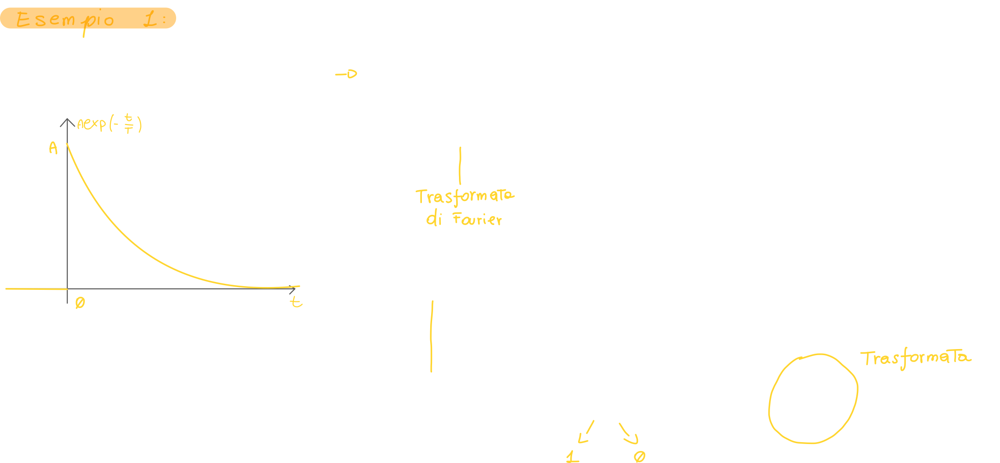

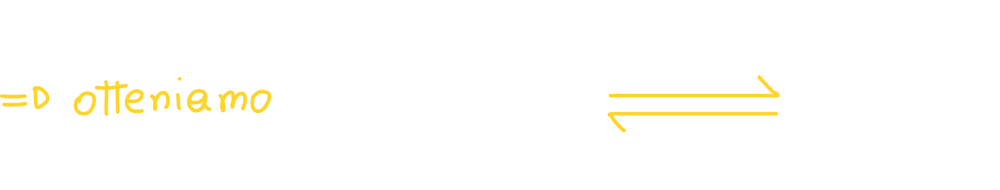

### Rappresentare la trasformata dell'esponenziale monolatero

Per rappresentare la trasformata di un segnale, che è **un numero complesso**, ci serve sapere **il modulo e la fase dello spettro**:

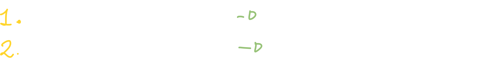

#### Troviamo il modulo dello spettro del segnale exp monolatero

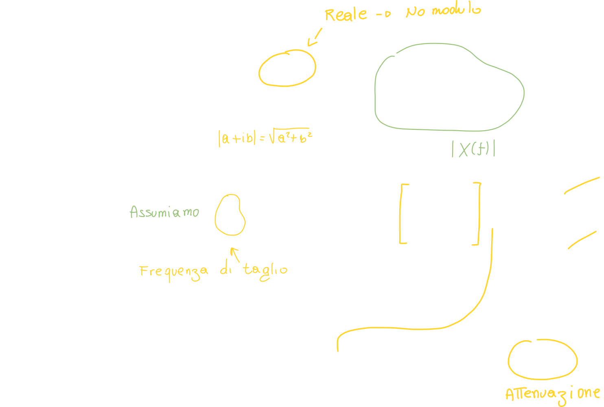

Possiamo quindi graficare il modulo dello spettro:

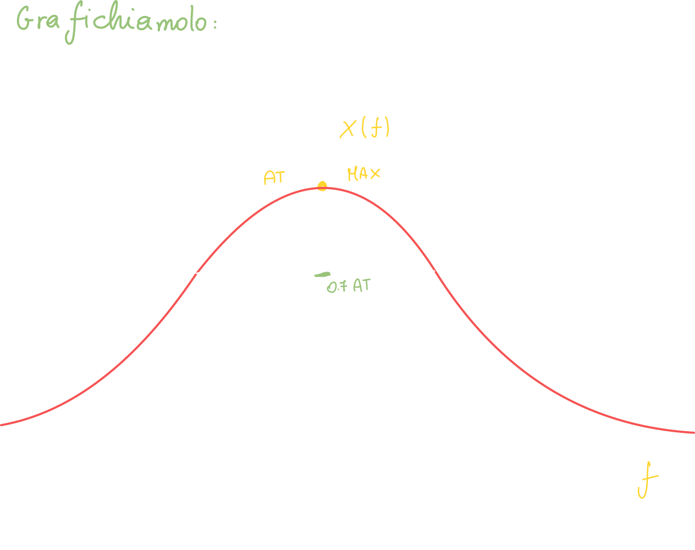

#### Troviamo la fase dello spettro del segnale exp monolatero:

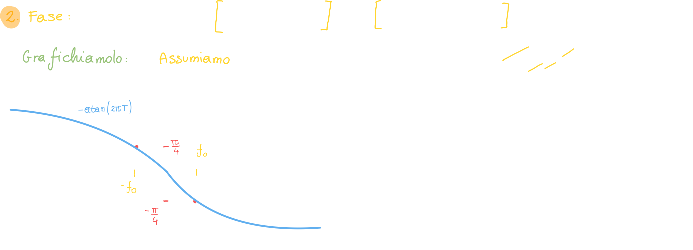

