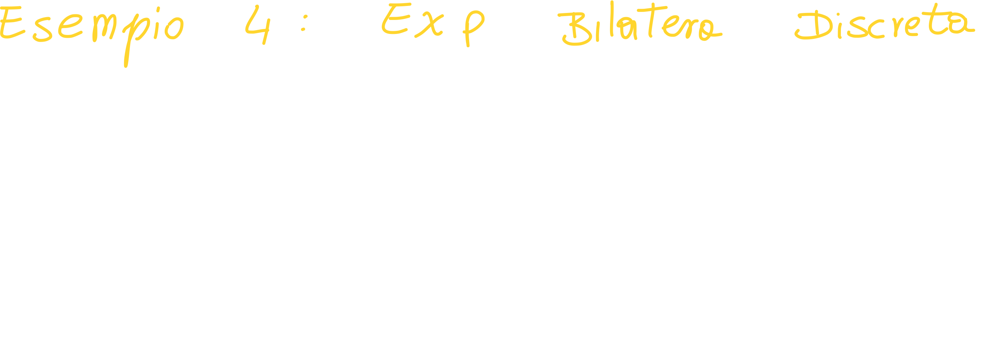

# Indice dei contenuti

[TOC]

# Recap lezione precedente

## Cambiare Dominio


## Legame ingresso  uscita


# Trasformate Notevoli

## Proprietà dei segnali reali

Quando abbiamo un segnale reale, avremo la seguente proprietà:


In poche parole, avremo che lo spettro del coniugato riflesso di un segnale **reale** sarà uguale allo spettro del segnale iniziale; questo vuol dire che **i segnali reali sono pari**.


Possiamo seguire il seguente schema:


## Trasformata dell'esponenziale monolatero a tempo continuo


### Rappresentare la trasformata dell'esponenziale monolatero

Per rappresentare la trasformata di un segnale, che è **un numero complesso**, ci serve sapere **il modulo e la fase dello spettro**:


#### Troviamo il modulo dello spettro del segnale exp monolatero


Possiamo quindi graficare il modulo dello spettro:


#### Troviamo la fase dello spettro del segnale exp monolatero:


## Trasformata dell'esponenziale bilatero a tempo continuo


Applichiamo la definizione di Trasformata di Fourier a tempo continuo ed otteniamo:


Proseguiamo unendo gli esponenziali e mettendo in evidenza il tempo:


A questo punto calcoliamo le primitive:


Ci basta fare il minimo comune multiplo per trovare finalmente la trasformata:


**Attenzione!** 
Lo spettro non contiene una parte immaginaria! Di conseguenza **è uno spettro reale**.

Possiamo facilmente convincerci della veridicità dell'affermazione facendo i calcoli del mcm:


> La parte immaginaria se ne va moltiplicando i due denominatori

### Rappresentare la trasformata dell'esponenziale bilatero

Siccome lo spettro è un segnale reale non abbiamo bisogno di trovare modulo e fase; ci basterà semplicemente fissare una **frequenza di taglio**. 

Definiamo la frequenza di taglio come:

> La frequenza di taglio separa la banda di frequenza passante, in cui le informazioni vengono trasmesse senza distorsione, da quella di frequenza che viene bloccata o attenuata. In questo modo, la frequenza di taglio aiuta a ridurre le interferenze e a migliorare la qualità del segnale.


## Trasformata della sequenza esponenziale monolatera a tempo discreto

Tendenzialmente i calcoli sono gli stessi dei casi precedenti:


Otteniamo quindi che la relazione tempo -> frequenza della sequenza monolatera è:


### Rappresentare la trasformata della  sequenza monolatera a tempo discreto

In questo caso nello spettro abbiamo `j`, il che vuol dire che lo spettro è complesso; per rappresentarlo dobbiamo quindi trovarne modulo e fase:


#### Codice MATLAB Per la sequenza esponenziale monolatera

```matlab
a_pos = 1/2; a_neg = -1/2;  % se a_neg > 0 --> passa alto, se a_neg < 0 --> passa basso.

ni = [-1 : 0.01 : 1];       % un passo fitto per simulare la continuità

X_ni = 1./(1-a_neg * exp(-1i*2*pi*ni));   % usiamo './' perchè abbiamo un vettore

figure(1);

subplot(2,1,1);
plot(ni, abs(X_ni));        % 'abs' calcola il modulo di un numero cmplx
title('Grafico con a positiva');
xlabel('frequenza (ni)');

hold on                     % per verificare di aver calcolato bene

plot(ni, angle(X_ni));


% plottiamo a positivo
X_ni_pos = 1./(1-a_pos * exp(-1i * 2 * pi * ni));

subplot(2,1,2);
plot(ni, abs(X_ni_pos));        % 'abs' calcola il modulo di un numero cmplx
title('Grafico con a negativa');
xlabel('frequenza (ni)');

hold on                     % per verificare di aver calcolato bene

plot(ni, angle(X_ni_pos));
```

Otteniamo il seguente plot:


> Dobbiamo sempre tenere conto che lo spettro è periodico, quindi dobbiamo considerare solo un certo intorno di ni=0;

## Trasformata di una sequenza esponenziale bilatera



> È importante notare come abbiamo definito a compresa tra -1 ed 1; questo ci tornerà più avanti nei calcoli per ricondurci a delle serie geometriche.

In questo caso il nostro obbiettivo è quello di **giungere ad una serie geometrica**, di cui conosciamo la convergenza:

Per trovarla quindi spezziamo la sommatoria, **stando attenti a non contare lo zero due volte**, in modo da avere due sommatorie:


A questo punto ci riscriviamo l sommatorie mettendo insieme l'esponenziale e la `a`:


Possiamo quindi ridurre le due sommatorie a due serie geometriche, che convergono rispettivamente a :


Le scriviamo quindi come:


A questo punto ci riscriviamo gli esponenziali come due **cos(-)**:


Ottenendo quindi:


Riscrivendo meglio abbiamo che **lo spettro di una sequenza bilatera è**:


> Notiamo come anche in questo caso sia assente la parte immaginaria; questo vuol dire che lo spettro non solo è **reale**, ma anche **simmetrico**.


#### Codice MATLAB per la sequenza esponenziale bilatera

```matlab
a = 1/2;  % se a_neg > 0 --> passa alto, se a_neg < 0 --> passa basso.
figure(1);
ni = -1 : 0.01 : 1;       % un passo fitto per simulare la continuità

X_ni = (1-a^2)./(1 - 2*a*cos(2*pi*ni)+a^2);   % usiamo './' perchè abbiamo un vettore

for n = 2:10
    hold on;
    plot(ni, abs(X_ni));        % 'abs' calcola il modulo di un numero cmplx

    a = 1/n;
    X_ni = (1-a^2)./(1 - 2*a*cos(2*pi*ni)+a^2);
    pause(0.1);
end
```

## Trasformata dell'impulso rettangolare (tempo continuo)


Anche in questo caso i calcoli sono molto simili alle trasformate precedenti; l'unica differenza sta nel fatto che invece di ridurre i fasori al coseno, in questo caso ci troviamo un sin(-).

Lo spettro della rect risultante, è molto simile alla sinc!

Siccome la rect ha una **durata T** (cosa che la sinc non ha!), possiamo aggiungerlo allo spettro finale semplicemente moltiplicando e dividendo per T/T:


> Possiamo quindi scrivere rect(t/T) --> ATsinc(fT)

### Rappresentare la trasformata dell'impulso rettangolare

Per prima cosaci accorgiamo che anche in questo caso **lo spettro della trasformata della rect è reale**, quindi pari; ma sopratutto non ci serve trovare modulo e fase per rappresentarlo.

Per rappresentarlo ci basta trovare dei **"punti di riferimento"**:

- La sinc ha valore massimo **in zero**, dove vale proprio **A*T**.
- Si annulla in più valori di f, con cadenza k/T, con K appartenente ai numeri numerabili (1, 2, ..., N).
  Il primo valore di f per cui la sinc si annulla è proprio 1/T:
  

### Domanda sulla trasformata dell'impulso rettangolare

`Quanto si attenua il lobbo principale rispetto ai secondari?`

Per rispondere a questa domanda ci basta considerare **il modulo dello spettro della rect**, ovvero **il modulo della sinc**, ovvero ovunque ci sono valori negativi dell'asse delle ordinate, questi diventeranno positivi:


Adesso consideriamo la differenza di "altezza" del lobo principale e del primo lobo secondario; chiamiamo le due altezze rispettivamente **b** ed **a**.

Adesso per trovare la risposta ci basta **effettuare il rapporto tra i due lobi**:

Per trovare il rapporto, dobbiamo prima trovare f<sub>SL</sub>, ovvero la frequenza alla quale si ha il valore massimo del primo lobo secondario; in questo caso è:


A questo punto **per trovare l'attenuazione in f<sub>SL</sub>** ci basta effettuare il rapporto tra il valore dello spettro in zero ed il valore dello spettro nel picco del secondo lobo in una scala logaritmica:


`A cosa ci serve trovare l'attenuazione al primo lobo?`

Potrebbe tornarci utile nel momento in cui scegliamo la **banda di un sistema caratterizzato da uno spettro come quello appena visto**, pari a 1/T, siamo sicuri che l'attenuazione sarà maggiore a 13dB:


**Concetto di banda**
La banda di un segnale può essere definita come l'insieme di frequenze occupate dalle componenti significative dello spettro.
Se consideriamo un **opportuno multiplo della frequenza di taglio a 3dB**, se poniamo B = 10f<sub>0</sub> risulta che **le componenti esterne all'intervallo (-B, B) sono attenuate di almeno 23 dB rispetto a quella di centrobanda**.

Scrivendo il tutto negli stessi termini usati per l'attenuazione della sinc appena calcolata abbiamo che:


## Trasformata di una sequenza rettangolare discreta

In questo caso i calcoli non sono molto differenti ai calcoli fatti precedentemente; l'unica differenza sta nel fatto che **l'impulso rettangolare a tempo discreto parte da zero, e non da -(1/2) * T!**:


> Dal grafico dell'impulso retangolare discreto possiamo notare come questo parta da zero, e non sia simmetrico rispetto all'asse delle ordinate; 
>
> questo ci dice che **lo spettro del segnale sarà complesso!**

Applichiamo la definizione di trasformata ed otteniamo:


Anche in questo caso ci riconduciamo ad una serie geometrica, di cui conosciamo la convergenza.
A questo punto **mettiamo in evidenza il fasore ad esponente negativo** sia al numeratore che al denominatore; questo ci permette di scrivere i due fasori come sin(-):


Riscrivendo il tutto in modo più pulito otteniamo:

