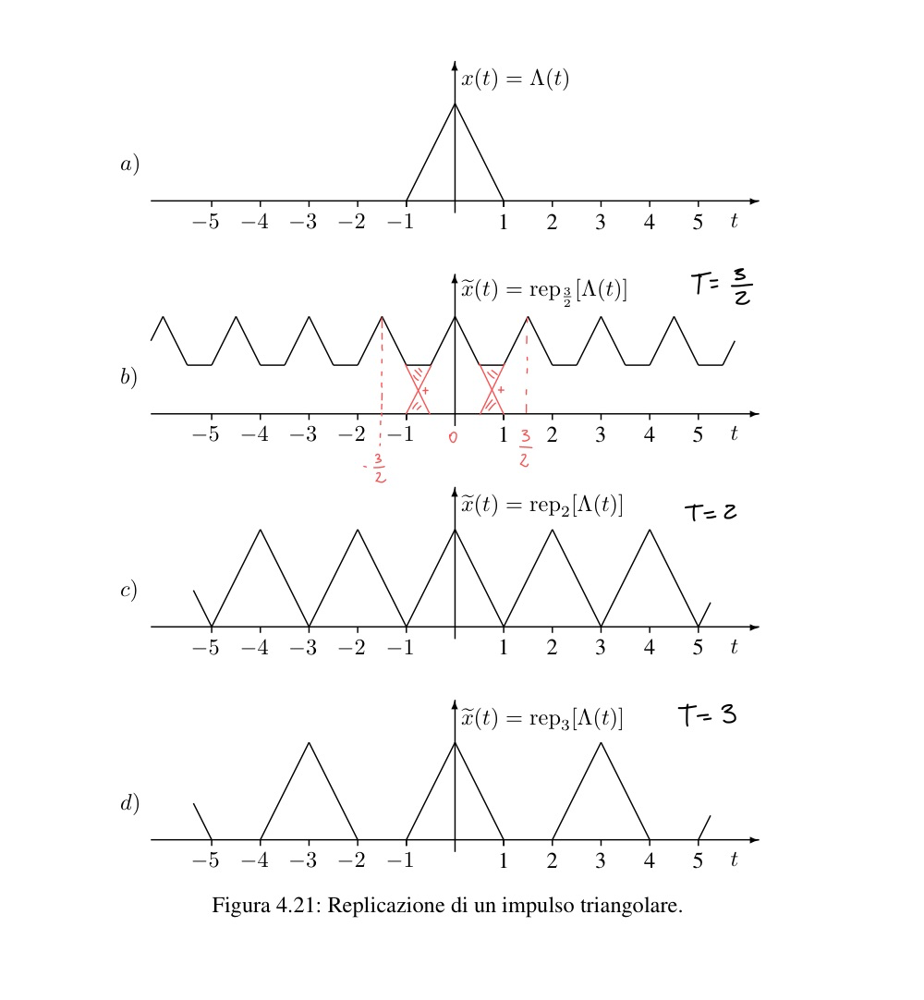
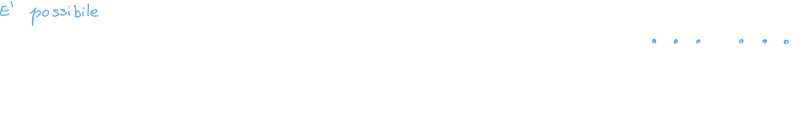
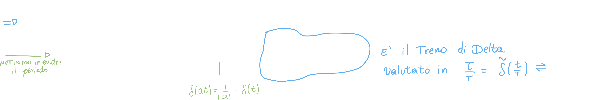
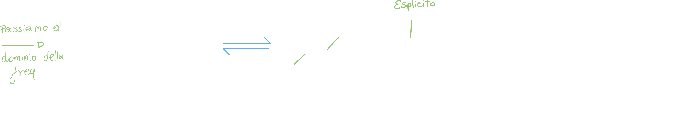
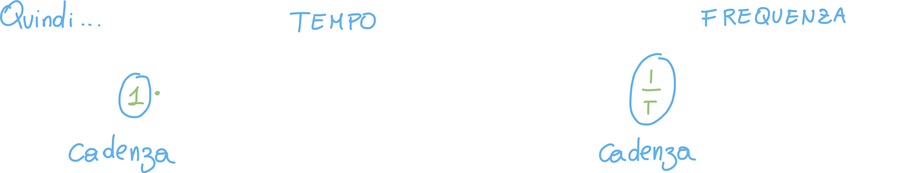
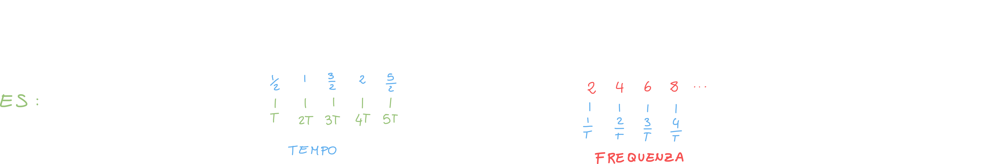

# Proprietà della trasformata di Fourier

## 1. Linearità

Questa proprietà ci dice che se abbiamo delle costanti moltiplicative moltiplicate per i segnali nel dominio del tempo, queste costanti verranno riportate **uguali** nel dominio della frequenza:

## 2.A Dualità

Questa proprietà ci dice che ad una riflessione nel tempo corrisponde, allo stesso modo, una riflessione nel dominio della frequenza, **e viceversa**:

La proprietà di dualità ci dice proprio che se possiamo passare dal tempo alla frequenza in un determinato modo, possiamo farlo anche dalla frequenza al tempo.

## 3. Trasformate degli impulsi

La trasformata di un impulso in corrisponde corrisponde all'ampiezza dell'impulso (costante) nell'altro dominio:

## 4.A Simmetria

Questa proprietà ci dice che **se un segnale viene riflesso in un dominio, verrà riflesso anche nell'altro**:

Inoltre, se abbiamo **una coniugazione** in un dominio, nell'altro dominio **corrisponde una coniugazione più una riflessione**:

## 4.B Coniugato

Sappiamo che se un segnale **è reale e pari** nè il coniugato nè la riflessione avranno effetto:

## 5. Time scaling

Questa proprietà l'abbiamo incontrata anche nelle lezioni precedenti; essenzialmente ci dice che se in un dominio abbiamo una costante moltiplicata per il tempo (o la frequenza), nell'altro dominio questa costante verrà divisa per la frequenza (o il tempo) e moltiplicata inversamente per l'intero segnale:

Possiamo fissare meglio il concetto con qualche esempio:

## 6. Traslazione Temporale nel dominio del tempo

Ad un **ritardo** in un dominio corrisponde **uno sfasamento** nell'altro dominio:

### Dimostrazione proprietà di traslazione temporale

Per dimostrare questa proprietà ci basta effettuare la trasformazione di un segnale generico con ritardo T:

## 7. Replicazione e campionamento

Prima di spiegare la proprietà vediamo cosa si intende per **replicazione e campionamento**:

### Replicazione

La replicazione di un segnale è essenzialmente il segnale ritardato di kT posto all'interno di una sommatoria che cicla su k; **T è il periodo di replicazione** :

#### A cosa serve la replicazione?

La replicazione serve per <u>*replicare*</u> un segnale in modo **periodico**; ovvero "fotocopiare" il singolo segnale infinite volte, a distanza T dall'ultima "fotocopia":

#### Teorema di Nyquist-Shannon

Questo teorema ci mette in chiaro le **condizioni affinchè la replicazione di un segnale produca un segnale ricostruibile;** in altre parole:

> Questo teorema stabilisce le condizioni affinchè si possa ricostruire completamente un segnale continuo a partire dalle sue ripetizioni (o campioni).

Qualora questa condizione non venisse rispettata, ci si potrebbe imbattere in un fenomeno noto come **aliasing**, che è illustrato nel punto **(b)** della figura precedente.

La condizione è la seguente:

#### Tempo

Il **periodo di replicazione** deve essere almeno pari alla durata del segnale.

##### Frequenza

La **frequenza di campionamento** deve essere almeno il doppio della frequenza dello spettro.

### Campionamento

Cosa succede se **usiamo, nella replicazione, la delta di Dirac come Segnale Generatore**?

Otteniamo il **treno campionatore** o **treno di delta**:

#### A cosa serve il treno campionatore?

Se ci ricordiamo le proprietà della delta, sapremo che se moltiplichiamo per la delta un qualsiasi segnale, il risultato del prodotto sarà il segnale **valutato nel valore in cui è centrata la delta!**

Come risultato otterremo una serie di valori (che possiamo mettere in un array) che corrispondono proprio al **valore del segnale nei punti KT**:

#### Intervallo di campionamento

Possiamo scegliere un **intervallo di campionamento**, ovvero "ogni quanto" campionare il segnale:

Se effettuiamo l'operazione di replicazione con un segnale di tipo delta otteniamo:

se passiamo al periodo della frequenza otteniamo...

Ci accorgiamo di una cosa interessante: siamo partiti con una replicazione nel periodo del tempo, per arrivare nel periodo della frequenza con un campionamento!

Inoltre, se nel dominio del tempo il segnale viene replicato con **periodo T**, nel dominio della frequenza il segnale viene campionato con **frequenza 1/T**:

Aiutiamoci a capire con un esempio:

## 8. Traslazione temporale nel dominio della frequenza

Analoga alla traslazione temporale nel dominio del tempo; in questo caso ad uno sfasamento nel dominio del tempo corrisponde un ritardo nel dominio della frequenza:

## 9. Modulazione

Questa proprietà è molto importante perchè ci permette di "spostare" lo spettro di un segnale, e così, renderci in grado di filtrarlo in un determinato modo o selezionare solo alcune componenti spettrali di interesse.

Quando **moltiplichiamo un segnale per una sinusoide** (coseno) nel dominio del tempo, in frequenza **lo spettro si "sdoppierà";** la prima parte sarà **ritardata** a seconda della frequenza del coseno (quello inizialmente moltiplicato per il segnale) mentre la seconda parte sarà **anticipata** sempre a seconda della frequenza del coseno:

Nel momento in cui è presente uno sfasamento Phi nel coseno, questo verrà moltiplicato per i due "pezzi" di spettro in frequenza; inoltre, se il segnale iniziale è moltiplicato per due, non ci sarà bisogno di moltiplicare per A/2 in frequenza:

### Esempio di modulazione: Modulatore

Il modulatore viene moltiplicato per un coseno di una determinata frequenza fc; questo tipo di modulazione è detta di ampiezza: **la frequenza resta stabile**, mentre **l'ampiezza viene modulata** a seconda dell'informazione che si vuole trasmettere:

Se traduciamo il tutto in formule otteniamo:

Se andiamo a trasformare il tutto in frequenza (senza usare la proprietà) otteniamo:

Questa può essere usata come **dimostrazione della proprietà della modulazione**, utilizzando la proprietà della traslazione nel dominio della frequenza.

### Demodulatore Coerente

Abbiamo visto cosa accade durante la **modulazione**; essenzialmente il segnale viene "splittato" in due bande ben precise; successivamente verrà trasmesso.

In ricezione il compito del demodulatore sarà quello di **ricostruire il segnale** in modo coerente:

La demodulazione si articola in diversi passaggi:

1. Moltiplicaione per una cosinusoide
2. Trasformaione dal dominio del tempo al dominio della frequenza 
3. Applichiamo un filtro passa basso (vedremo il perché tra poco)
4. Trasformazione inversa dal dominio della frequenza al dominio del tempo

Vediamo la motivazione di tutti questi passaggi:

#### Passaggio 1: Moltiplicazione per una cosinusoide

Conoscendo la proprietà di modulazione, e guardando il segnale ottenuto dopo la moltiplicazione per il coseno, ci aspettiamo di avere non più 2 "riproduzioni" del segnale x(t) in frequenza, ma tre!

Infatti:

#### Passaggio 2: Trasformazione in frequenza

Questo passaggio ci serve sia per far "saltare fuori" il terzo spettro che ci interessa centrato in zero, sia perchè nel passaggio 3 andremo ad applicare un filtro, e per farlo ci conviene farlo in frequenza!

#### Passaggio 3: Applicazione del filtro

Andiamo ad applicare il filtro passa basso:

#### Passaggio 4: Trasformazione inversa 

A questo punto visto che abbiamo ottenuto lo spettro del segnale che ci interessava (quello iniziale che è stato modulato) non ci resta che trovare il segnale stesso, e lo facciamo tramite una **trasformata inversa di fourier:**

