# Proprietà della trasformata di Fourier

## 1. Linearità

Questa proprietà ci dice che se abbiamo delle costanti moltiplicative moltiplicate per i segnali nel dominio del tempo, queste costanti verranno riportate **uguali** nel dominio della frequenza:

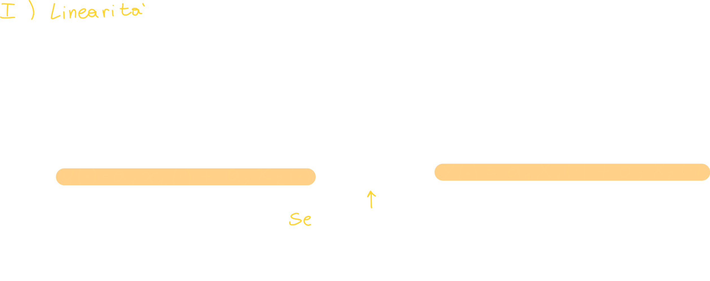

## 2.A Dualità

Questa proprietà ci dice che ad una riflessione nel tempo corrisponde, allo stesso modo, una riflessione nel dominio della frequenza, **e viceversa**:

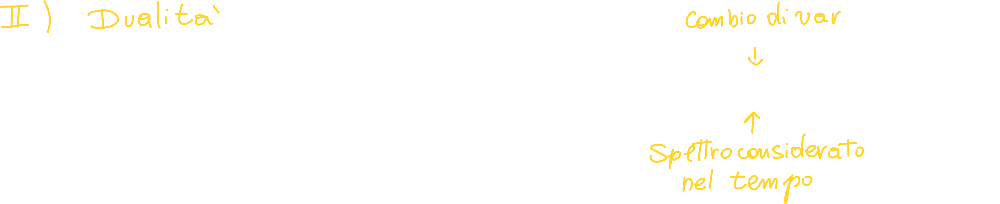

La proprietà di dualità ci dice proprio che se possiamo passare dal tempo alla frequenza in un determinato modo, possiamo farlo anche dalla frequenza al tempo.

## 3. Trasformate degli impulsi

La trasformata di un impulso in corrisponde corrisponde all'ampiezza dell'impulso (costante) nell'altro dominio:

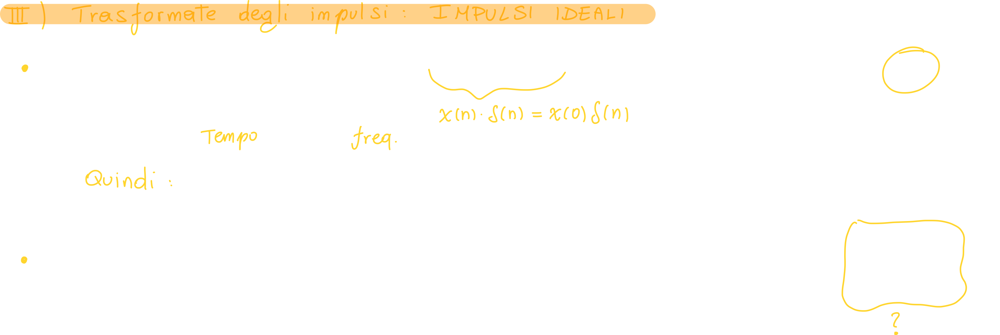

## 4.A Simmetria

Questa proprietà ci dice che **se un segnale viene riflesso in un dominio, verrà riflesso anche nell'altro**:

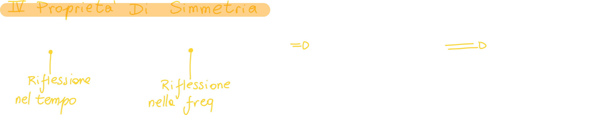

Inoltre, se abbiamo **una coniugazione** in un dominio, nell'altro dominio **corrisponde una coniugazione più una riflessione**:

## 4.B Coniugato

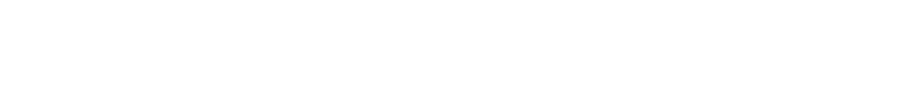

Sappiamo che se un segnale **è reale e pari** nè il coniugato nè la riflessione avranno effetto:

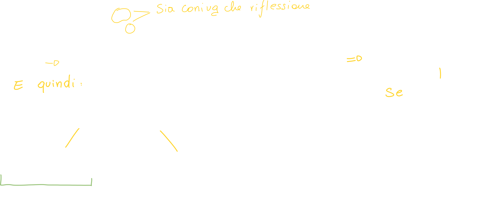

## 5. Time scaling

Questa proprietà l'abbiamo incontrata anche nelle lezioni precedenti; essenzialmente ci dice che se in un dominio abbiamo una costante moltiplicata per il tempo (o la frequenza), nell'altro dominio questa costante verrà divisa per la frequenza (o il tempo) e moltiplicata inversamente per l'intero segnale:

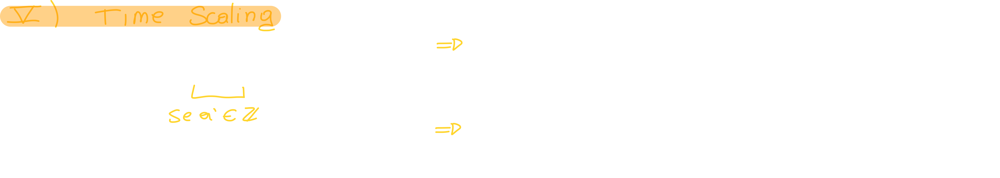

Possiamo fissare meglio il concetto con qualche esempio:

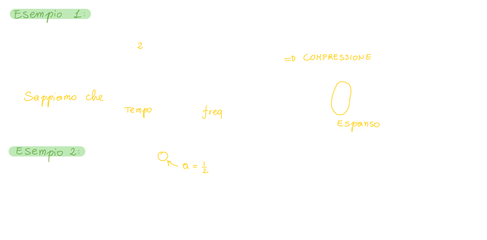

## 6. Traslazione Temporale nel dominio del tempo

Ad un **ritardo** in un dominio corrisponde **uno sfasamento** nell'altro dominio:

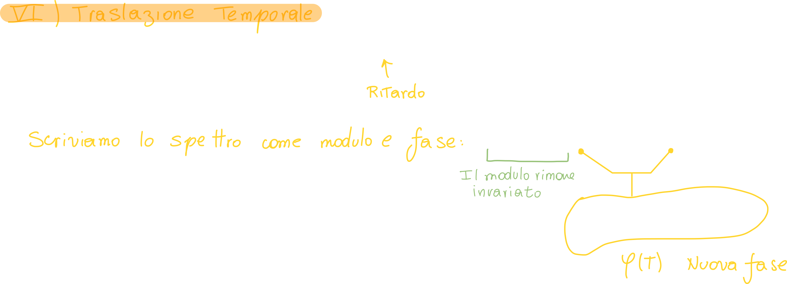

### Dimostrazione proprietà di traslazione temporale

Per dimostrare questa proprietà ci basta effettuare la trasformazione di un segnale generico con ritardo T:

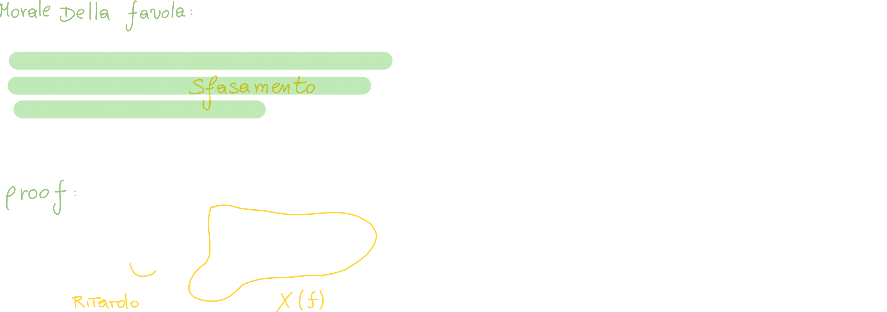

## 7.1 Replicazione e campionamento

Prima di spiegare la proprietà vediamo cosa si intende per **replicazione e campionamento**:

### Replicazione

La replicazione di un segnale è essenzialmente il segnale ritardato di kT posto all'interno di una sommatoria che cicla su k; **T è il periodo di replicazione** :

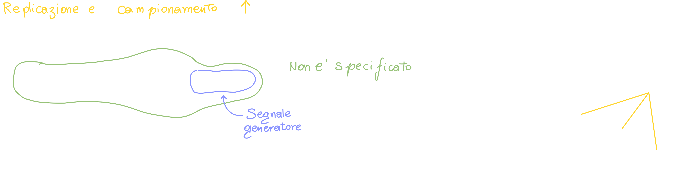

#### A cosa serve la replicazione?

La replicazione serve per <u>*replicare*</u> un segnale in modo **periodico**; ovvero "fotocopiare" il singolo segnale infinite volte, a distanza T dall'ultima "fotocopia":

#### Come effettuare la replicazione?

Partiamo dal segnale iniziale, in questo caso un segnale triangolare:

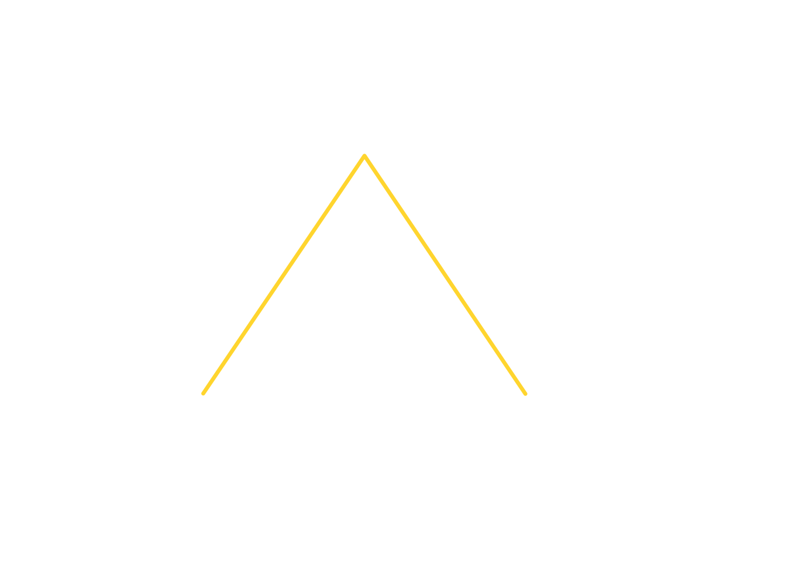

Se scegliamo come periodo di replicazione T **uguale** alla durata della finestra otterremo:

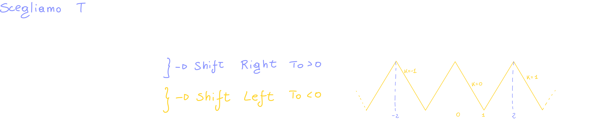

Se scegliamo come periodo di replicazione T **maggiore** della durata della finestra otterremo:

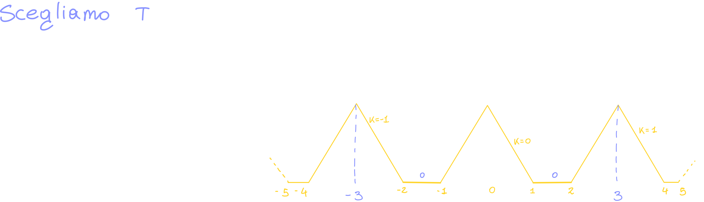

I problemi arrivano quando scegliamo come periodo di replicazione T **inferiore** alla durata della finestra:

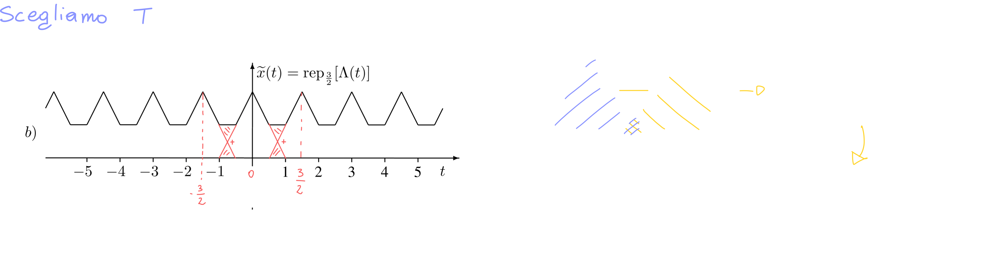

Questo fenomeno è noto come **aliasing**, di cui parleremo subito.

#### Teorema di Nyquist-Shannon

Questo teorema ci mette in chiaro le **condizioni affinchè la replicazione di un segnale produca un segnale ricostruibile;** in altre parole:

> Questo teorema stabilisce le condizioni affinchè si possa ricostruire completamente un segnale continuo a partire dalle sue ripetizioni (o campioni).

Qualora questa condizione non venisse rispettata, ci si potrebbe imbattere in un fenomeno noto come **aliasing**, che è illustrato nel punto **(b)** della figura precedente.

La condizione è la seguente:

#### Tempo

Il **periodo di replicazione** deve essere almeno pari alla durata del segnale.

##### Frequenza

La **frequenza di campionamento** deve essere almeno il doppio della frequenza dello spettro.

### Campionamento

Cosa succede se **usiamo, nella replicazione, la delta di Dirac come Segnale Generatore**?

Otteniamo il **treno campionatore** o **treno di delta**:

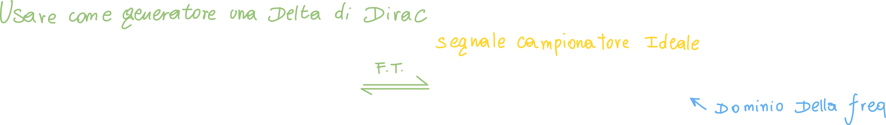

#### A cosa serve il treno campionatore?

Se ci ricordiamo le proprietà della delta, sapremo che se moltiplichiamo per la delta un qualsiasi segnale, il risultato del prodotto sarà il segnale **valutato nel valore in cui è centrata la delta!**

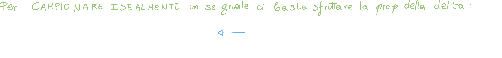

Come risultato otterremo una serie di valori (che possiamo mettere in un array) che corrispondono proprio al **valore del segnale nei punti KT**:

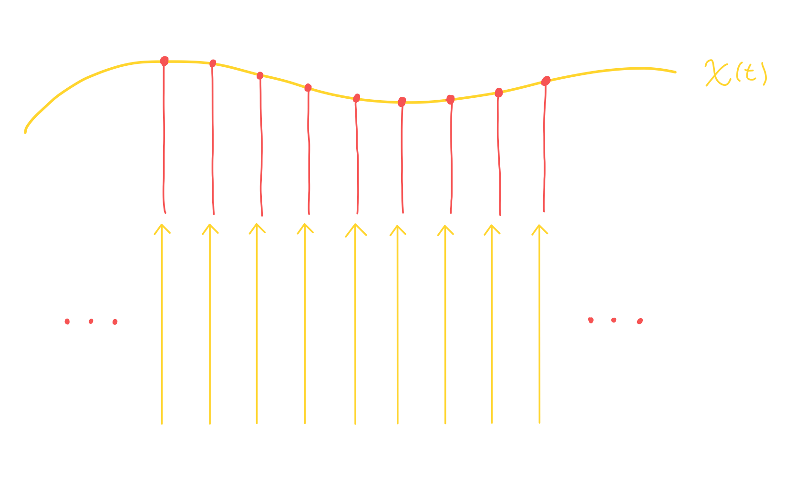

## 7.2 Ad una replicazione nel tempo corrisponde un campionamento in frequenza

> Questa dimostrazione è stata vista nella lezione 3.2.5

Sappiamo che la replicazione nel dominio del tempo può essere esplicitata nel seguente modo:

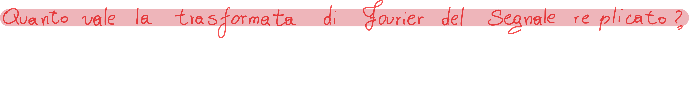

### Passaggio 1: 

Ci riscriviamo il segnale ritardato **come convoluzione per una delta ritardata:**

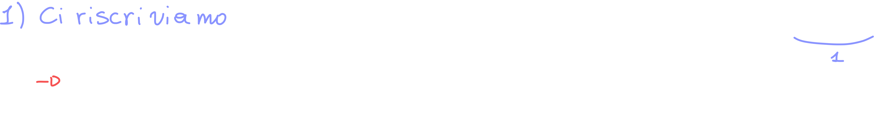

### Passaggio 2:

A questo punto "portiamo fuori" il segnale x(t) che non dipende dall'indice della sommatoria:

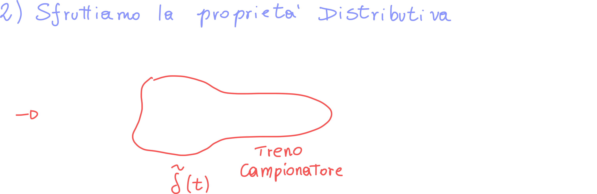

Notiamo come "salta fuori" il treno campionatore.

### Passaggio 3:

Conosciamo la trasformata del **treno campionatore**, quindi:

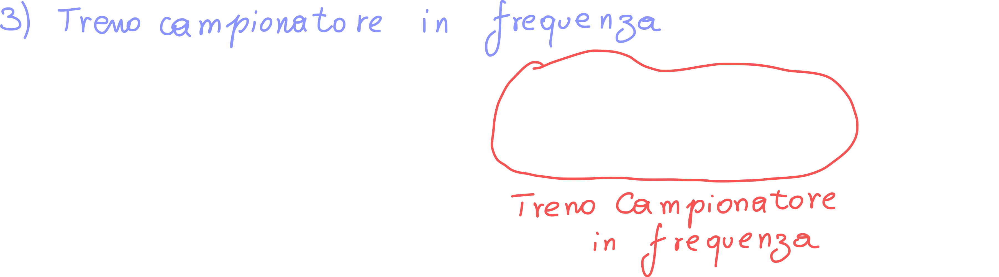

### Passaggio 4:

Siccome nel tempo avevamo una convoluzione tra il segnale ed il treno campionatore, in frequenza avremo i rispettivi spettri moltiplicati tra loro:

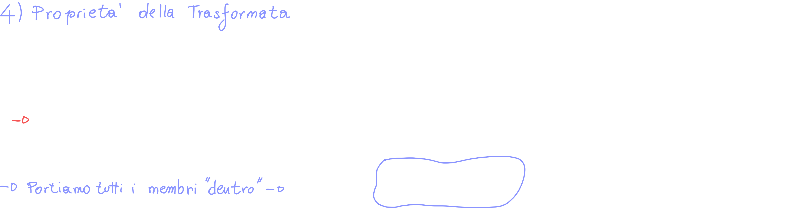

### Morale della favola

Possiamo trarre la seguente conclusione: ad una replicazione nel dominio del tempo corrisponde un campionamento in frequenza!

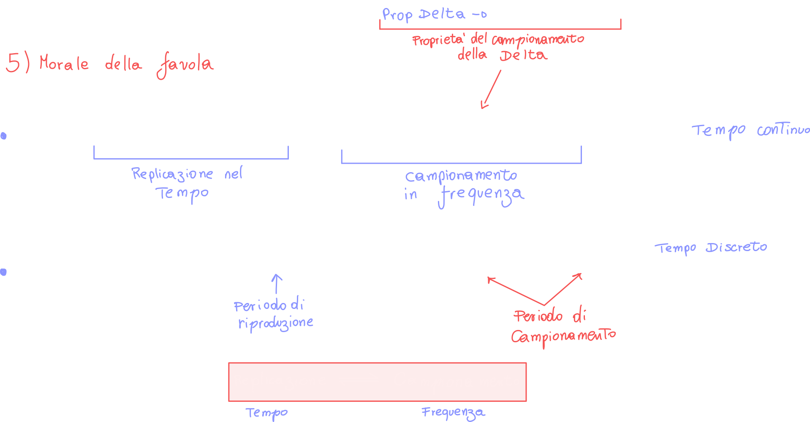

Il discorso è analogo sia per segnali a tempo continuo che discreto.

### Dimostrazione campionamento (t) -> riproduzione (f)

Vogliamo dimostrare che anche a tempo discreto un campionamento nel dominio del tempo corrisponde ad una riproduzione nel dominio della frequenza:

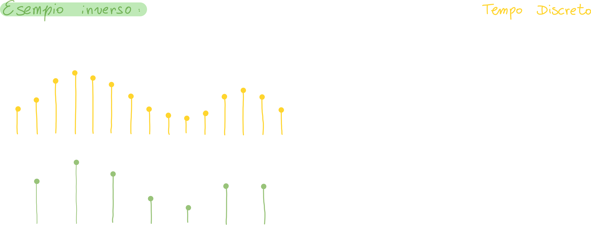

Saltiamo qualche passaggio (visto nella dimostrazione alla sezione 7.3) e ci scriviamo la riproduzione come il segnale moltiplicato per il treno campionatore:

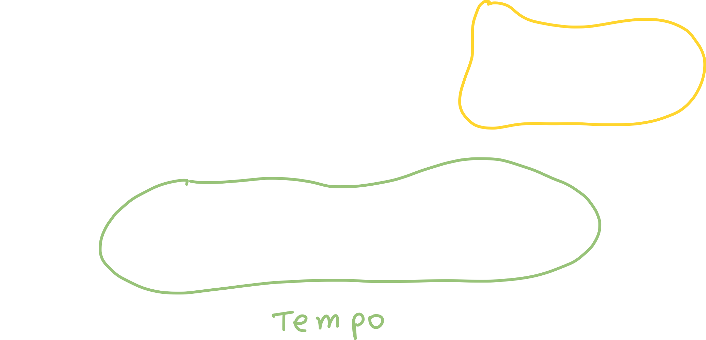

A questo punto sappiamo che ad una moltiplicazione in un dominio corrisponde una convoluzione nell'altro, e quindi ci scriviamo il prodotto come:

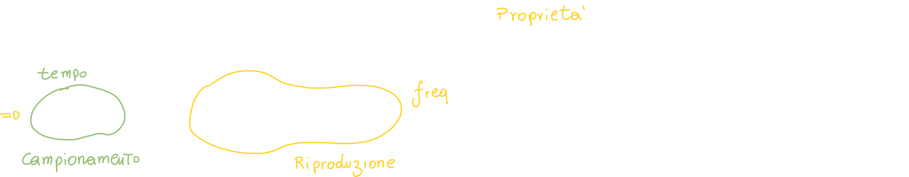

Sfruttiamo la proprietà di convoluzione della delta ed otteniammo finalmente la replicazione nel dominio della frequenza.

### Esempio a tempo continuo - Rep (t)->camp(f)

Abbiamo come segnale iniziale un **treno di impulsi rettangolari**, ovvero una **replicazione di un segnale rettangolare**:

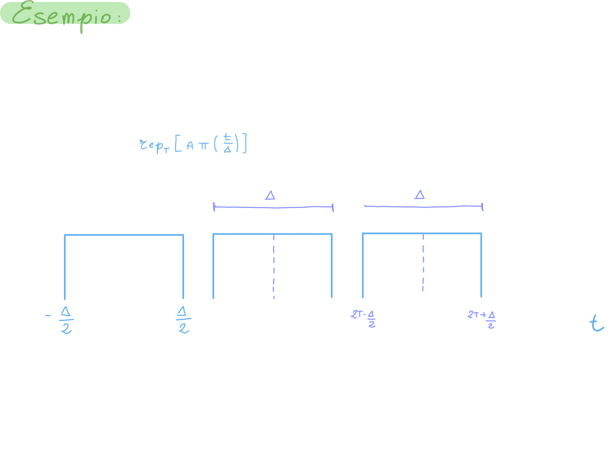

Sappiamo che ad una replicazione corrisponde un campionamento, ed il periodo di replicazione corrisponde alla <u>frequenza</u> di campionamento:

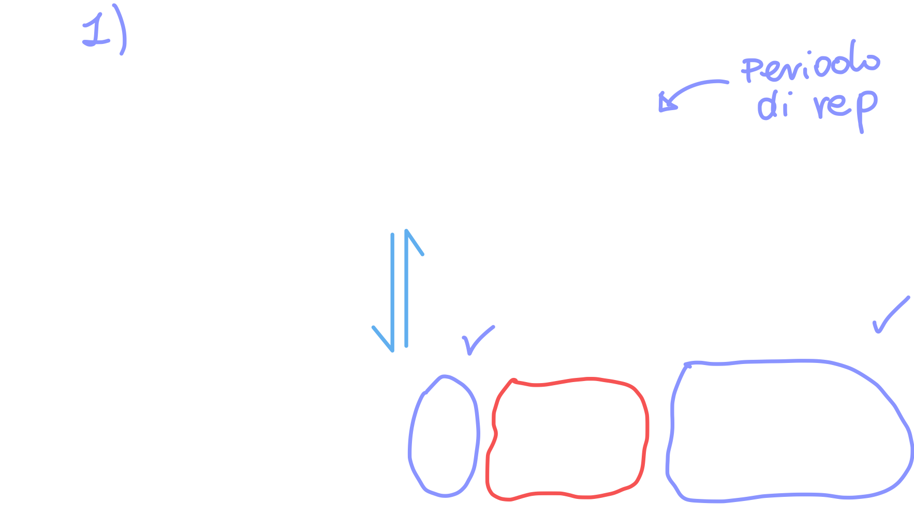

Passiamo quindi a trasformare il segnale rettangolare; come abbiamo imparato la sua trasformata è un segnale di tipo sinc:

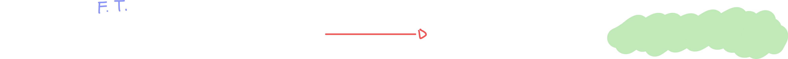

A questo punto ci basta sostituire lo spettro del segnale all'interno della formula:

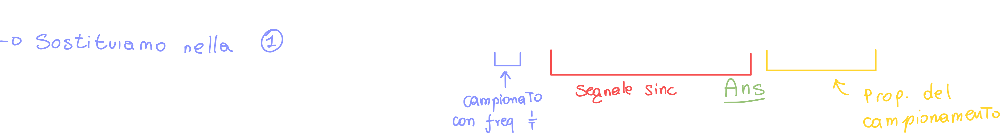

Per farci un'idea di cosa sta accadendo in frequenza, facciamo un grafico:

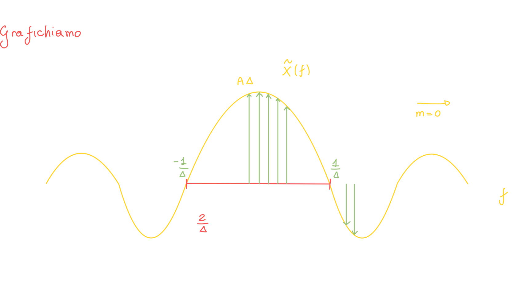

> Il campionamento appare come una sequenza di **stems** di ampiezza pari all'ampiezza del segnale campionato in quell'istante di tempo.

### Esempio a tempo discreto  - Rep (n)->camp(*V*)

In questo caso abbiamo una riproduzione di segnali rettangolari **discreti**:

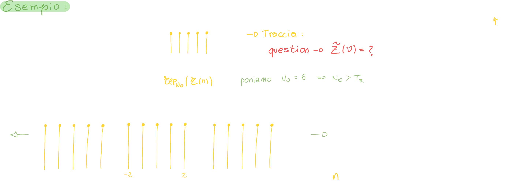

La prima cosa da fare è **la trasformata del segnale generatore;** siccome la replicazione aggiunge un time shift al segnale, la sua trasformata non è proprio immediata, arriviamoci gradualmente:

- Come prima cosa ci ricordiamo della trasformata a tempo discreto del segnale rettangolare centrato in zero (parte da zero) e di durata generica N:
  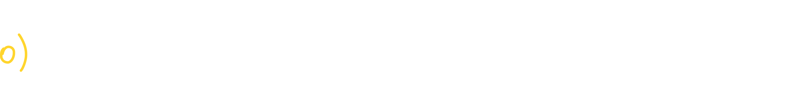
- Se rendiamo questo segnale di durata (non più generica) 5, la sua trasformata diventa:
  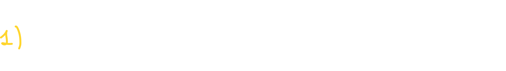
- A questo punto aggiungiamo anche il ritardo generico T0:
  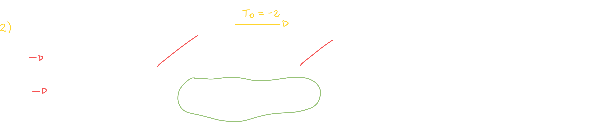

Ora che abbiamo la trasformata del segnale generatore, possiamo trasformare la replicazione:

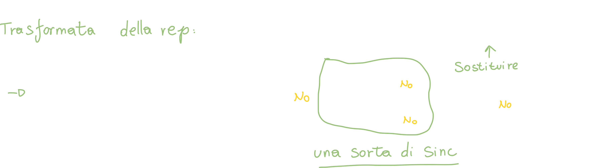

### Esercizio

Abbiamo un segnale composto da un altro segnale convoluto ad una riproduzione di un altro segnale ancora; capiamo quindi che non è un esercizio banale:

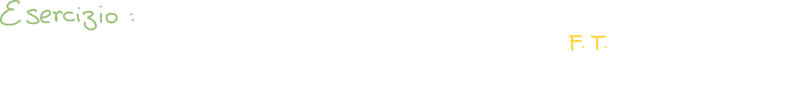

#### Passaggio 1:

La prima cosa da fare è ricordarci che una convoluzione nel tempo è un prodotto nella frequenza:

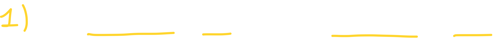

#### Passaggio 2: Trasformata del segnale sinc2 (sinc quadro)

Successivamente passiamo a trasformare i vari segnali presenti; partiamo dalla sinc; possiamo vederla come la moltiplicazione di due sinc:

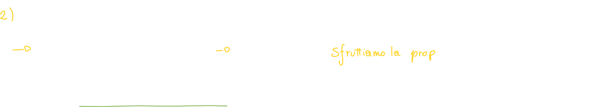

Se una sinc si trasforma in un segnale rettangolare, allora una sinc quadro viene trasformata come la **convoluzione** tra due segnali rettangolari di pari durata, che come sappiamo danno un segnale triangolare:

Ovviamente da questo momento in poi possiamo risparmiare tempo e scrivere direttamente (se lo ricorderemo!) che la trasformata di un segnale sinc quadro è pari ad un segnale rettangolare!

#### Passaggio 3: Trasformata della replicazione del segnale esponenziale decrescente 

Ormai siamo bravi, riusciamo a trasformare una replicazione senza problemi:

 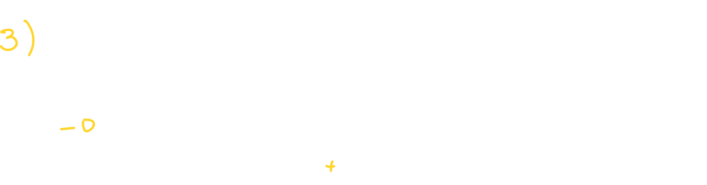

Applichiamo la "trasformata notevole" ed otteniamo che la trasformata della replicazione corrisponde a...

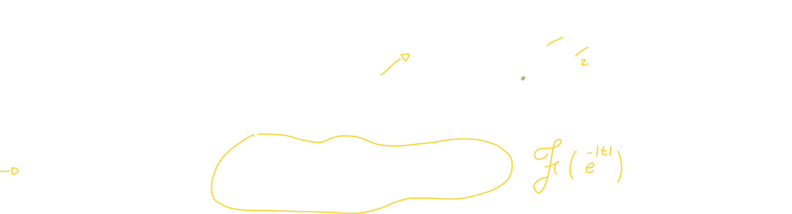

#### Passaggio 4: esplicitiamo la trasformata

Possiamo finalmente scrivere il campionamento (trasformata della replicazione) moltiplicata (trasformata della convoluzione) per il segnale triangolare (trasformata del sinc quadro):

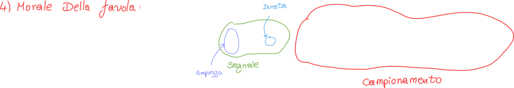

#### Morale della favola

Abbiamo visto come **suddividendo** il problema in sottoproblemi, la trasformata diventa relativamente semplice; grafichiamo il segnale in frequenza!

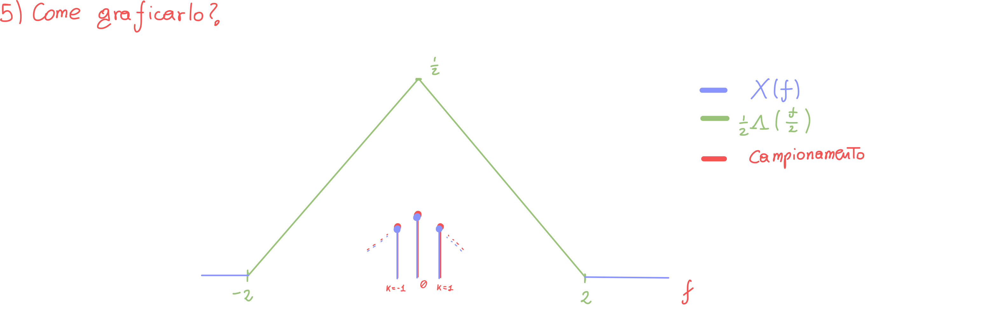

## 7.3 Ad un campionamento nel tempo corrisponde una replicazione in frequenza

> Questa dimostrazione è stata vista nella lezione 3.2.5

### Dimostrazione a tempo continuo

Abbiamo un segnale campionato e dobbiamo trasformarlo; ci aspettiamo una replicazione nel dominio del tempo:

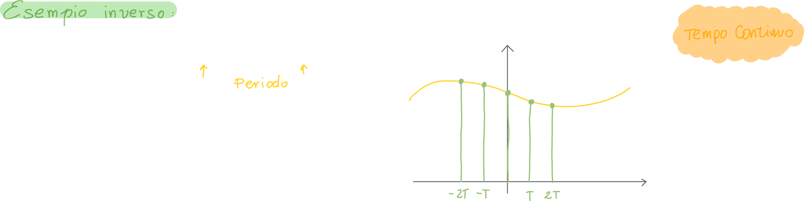

A questo punto facciamo i passaggi inversi che abbiamo fatto nella sezione 7.2: ci scriviamo la riproduzione come moltiplicazione per la delta (sfruttiamo la proprietà della delta al contrario) in modo da ottenere un segnale indipendente dall'indice della sommatoria, per poterlo portare fuori:

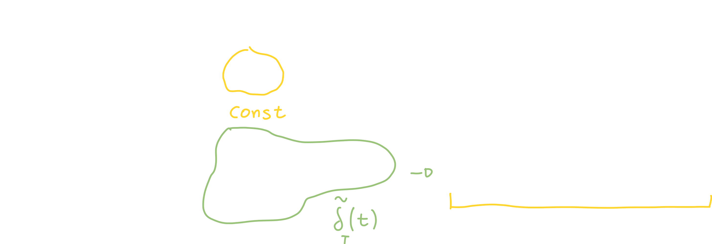

Otteniamo essenzialmente il **segnale generatore moltiplicato per un treno di delta**;

Sappiamo che ad una moltiplicazione nella frequenza corrisponde una convoluzione nel tempo, ed inoltre conosciamo anche la trasformata del treno campionatore, quindi otteniamo:

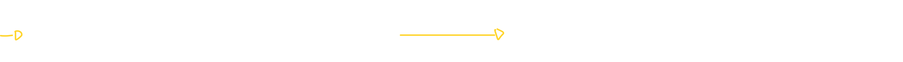

A questo punto portiamo lo spettro all'interno della sommatoria, in operazione di convoluzione con la delta; sfruttiamo poi la proprietà della delta (convoluzione) per ottenere lo spettro valutato in...

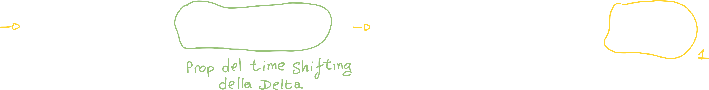

Possiamo omettere la delta (che in moltiplicazione è uguale ad 1) per ottenere finalmente la replicazione nel dominio del tempo:

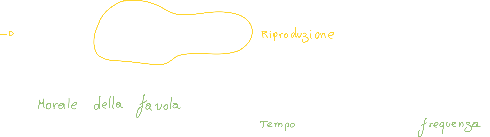

## 8. Traslazione temporale nel dominio della frequenza

Analoga alla traslazione temporale nel dominio del tempo; in questo caso ad uno sfasamento nel dominio del tempo corrisponde un ritardo nel dominio della frequenza:

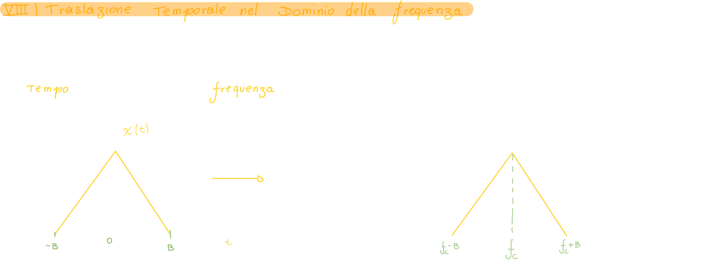

## 9. Modulazione

Questa proprietà è molto importante perchè ci permette di "spostare" lo spettro di un segnale, e così, renderci in grado di filtrarlo in un determinato modo o selezionare solo alcune componenti spettrali di interesse.

Quando **moltiplichiamo un segnale per una sinusoide** (coseno) nel dominio del tempo, in frequenza **lo spettro si "sdoppierà";** la prima parte sarà **ritardata** a seconda della frequenza del coseno (quello inizialmente moltiplicato per il segnale) mentre la seconda parte sarà **anticipata** sempre a seconda della frequenza del coseno:

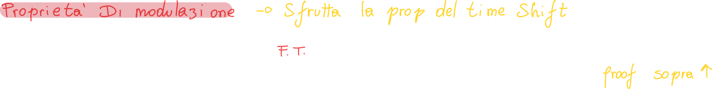

Nel momento in cui è presente uno sfasamento Phi nel coseno, questo verrà moltiplicato per i due "pezzi" di spettro in frequenza; inoltre, se il segnale iniziale è moltiplicato per due, non ci sarà bisogno di moltiplicare per A/2 in frequenza:

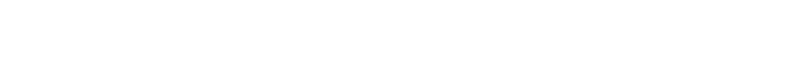

### Esempio di modulazione: Modulatore

Il modulatore viene moltiplicato per un coseno di una determinata frequenza fc; questo tipo di modulazione è detta di ampiezza: **la frequenza resta stabile**, mentre **l'ampiezza viene modulata** a seconda dell'informazione che si vuole trasmettere:

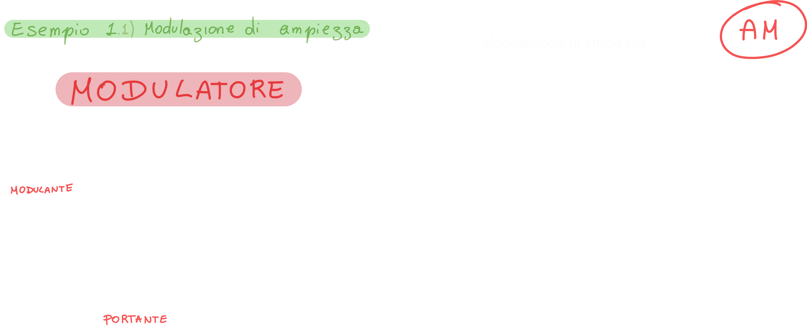

Se traduciamo il tutto in formule otteniamo:

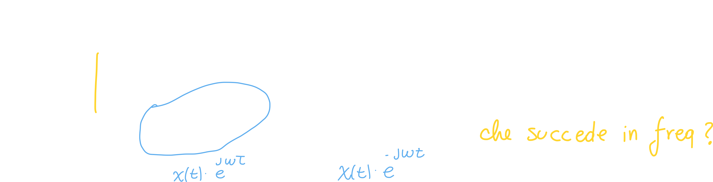

Se andiamo a trasformare il tutto in frequenza (senza usare la proprietà) otteniamo:

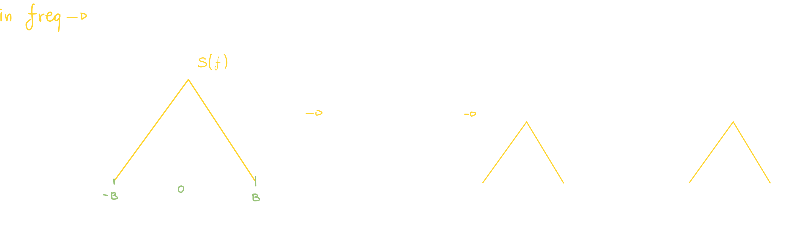

Questa può essere usata come **dimostrazione della proprietà della modulazione**, utilizzando la proprietà della traslazione nel dominio della frequenza.

### Esempio di modulazione: Demodulatore Coerente

Abbiamo visto cosa accade durante la **modulazione**; essenzialmente il segnale viene "splittato" in due bande ben precise; successivamente verrà trasmesso.

In ricezione il compito del demodulatore sarà quello di **ricostruire il segnale** in modo coerente:

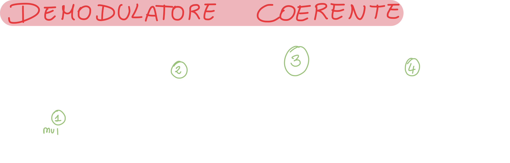

La demodulazione si articola in diversi passaggi:

1. Moltiplicaione per una cosinusoide
2. Trasformaione dal dominio del tempo al dominio della frequenza 
3. Applichiamo un filtro passa basso (vedremo il perché tra poco)
4. Trasformazione inversa dal dominio della frequenza al dominio del tempo

Vediamo la motivazione di tutti questi passaggi:

#### Passaggio 1: Moltiplicazione per una cosinusoide

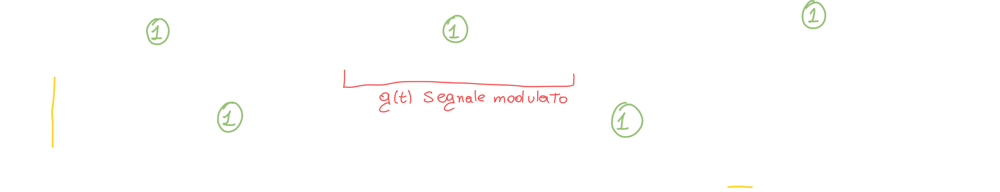

Conoscendo la proprietà di modulazione, e guardando il segnale ottenuto dopo la moltiplicazione per il coseno, ci aspettiamo di avere non più 2 "riproduzioni" del segnale x(t) in frequenza, ma tre!

Infatti:

#### Passaggio 2: Trasformazione in frequenza

Questo passaggio ci serve sia per far "saltare fuori" il terzo spettro che ci interessa centrato in zero, sia perchè nel passaggio 3 andremo ad applicare un filtro, e per farlo ci conviene farlo in frequenza!

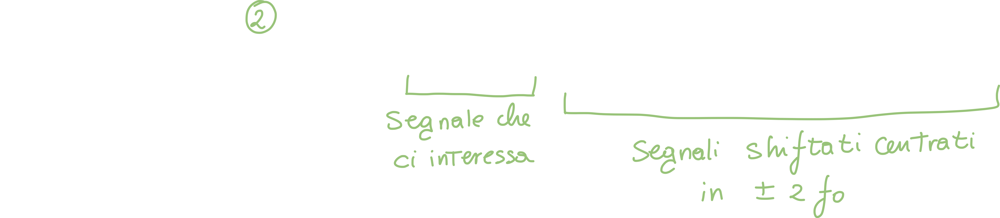

#### Passaggio 3: Applicazione del filtro

Andiamo ad applicare il filtro passa basso:

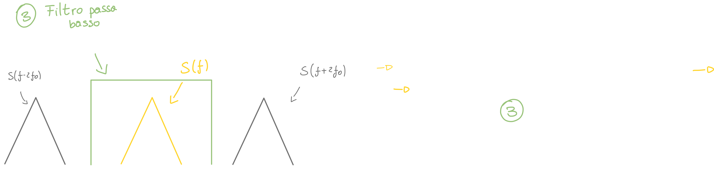

#### Passaggio 4: Trasformazione inversa 

A questo punto visto che abbiamo ottenuto lo spettro del segnale che ci interessava (quello iniziale che è stato modulato) non ci resta che trovare il segnale stesso, e lo facciamo tramite una **trasformata inversa di fourier:**

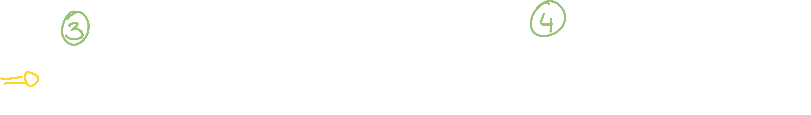

### Esempio di modulazione: Finestra modulata

Cosa succede se proviamo a modulare una segnale finestra?

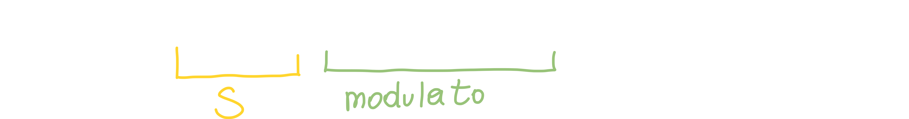

La trasformata ci risulta molto semplice se applichiamo la proprietà di modulazione:

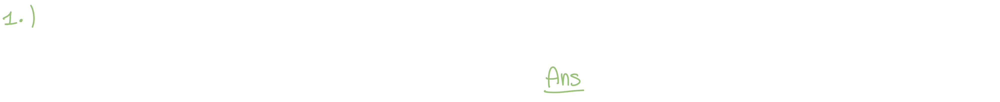

### Esempio di modulazione: Impulso RF

Questo esempio è molto simile a quello che abbiamo appena visto, l'unica differenza sta nella forma del coseno:

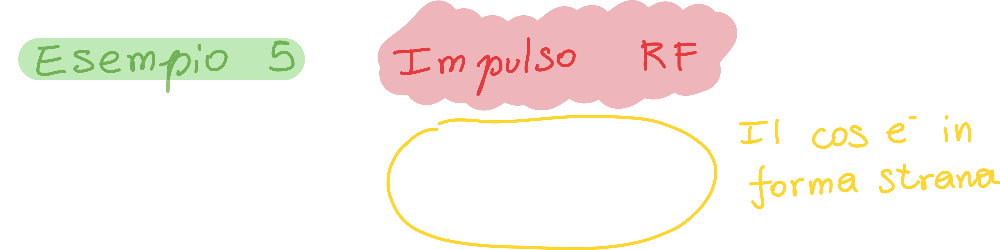

Cosa manca? Manca fc che è fondamentale per poter applicare la proprietà di modulazione; ci basta però dire che fc = 1/2\*T, in modo da far uscire cos(2\*Pi\*fc\*t):

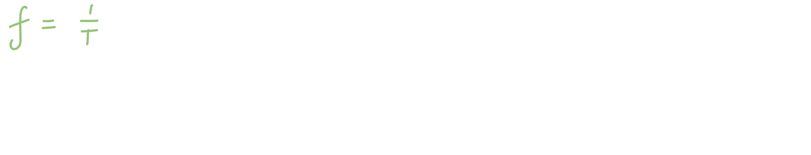

Guardando lo spettro ci aspettiamo di vedere due sinc centrate a -fc e +fc.

---

Le proprietà da questo momento in poi sono state viste nella lezione 3.2.4

## 10. Convoluzione

La proprietà di convoluzione ci dice una cosa molto semplice: ad una convoluzione nel dominio del tempo corrisponde una moltiplicazione nel dominio della frequenza:

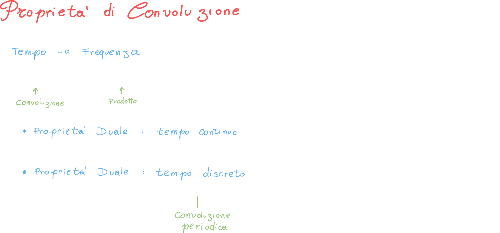

### A cosa serve la proprietà di convoluzione?

Questa proprietà è forse la più utile di tutte, perchè ci permette di risparmiare moltissimo tempo quando ci troviamo davanti ad una convoluzione; 

Se l'operazione di convoluzione è più difficile (o più lunga) della trasformazione dei segnali, moltiplicazione e trasformazione inversa allora questa proprietà ci torna molto utile:

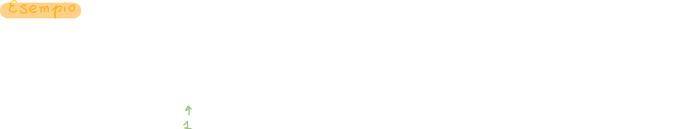

Sappiamo che la convoluzione tra due segnali rettangolari uguali produce un segnale triangolare, vediamo se trasformando in frequenza e moltiplicando funziona...

Ci basta moltiplicare due sinc uguali, ottenendo una sinc al quadrato, che trasformata dalla frequenza al tempo ci restituisce un segnale...

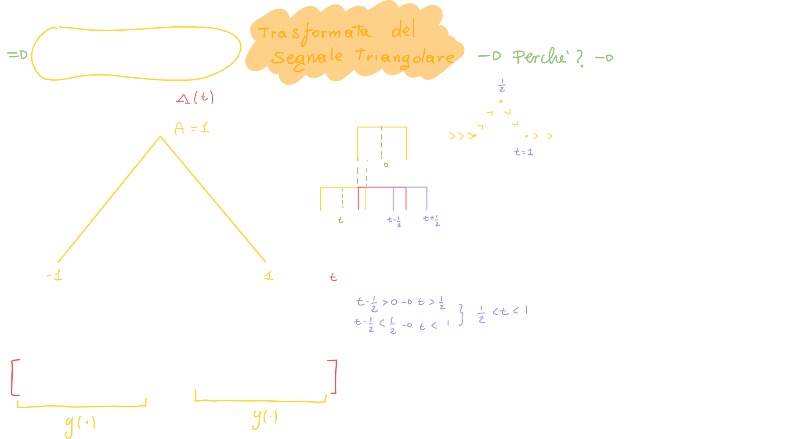

Ecco che otteniamo il segnale triangolare! Quindi questa proprietà funziona, wow.

## 11. Valore nell'origine

Se proviamo a calcolare la trasformata di un segnale nel punto dove la frequenza (continua o discreta) vale zero (ovvero in origine) otteniamo il seguente risultato:

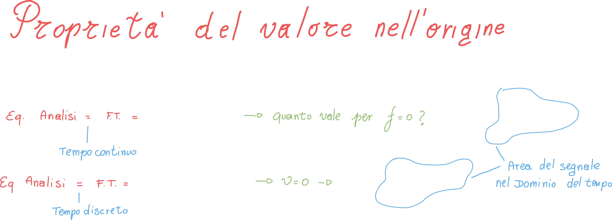

Siccome e0=1 l'unica cosa a rimanere nell'integrale è il segnale stesso, e di conseguenza possiamo affermare che:

> Lo spettro di un segnale calcolato nell'origine equivale a calcolare l'area sottesa al segnale nel dominio del tempo.

### A cosa serve la proprietà del valore nell'origine?

Questa proprietà ci torna utile quando dobbiamo calcolare la media di un segnale ed abbiamo a disposizione solo il suo spettro e non vogliamo calcolare la trasformata inversa.

---

La stessa cosa vale per il dominio del tempo; ovvero, se calcoliamo il segnale in zero otterremo l'area sottesa allo spettro!

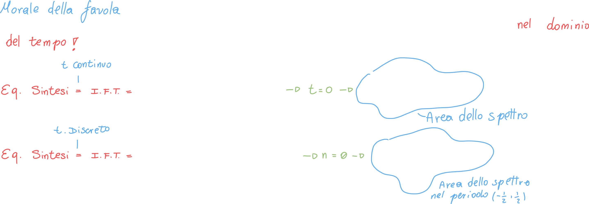

## 12. Derivazione nel dominio del tempo

Se abbiamo un determinato segnale, che **corrisponde alla derivata di un altro segnale** possiamo trovare la sua trasformata nel seguente modo:

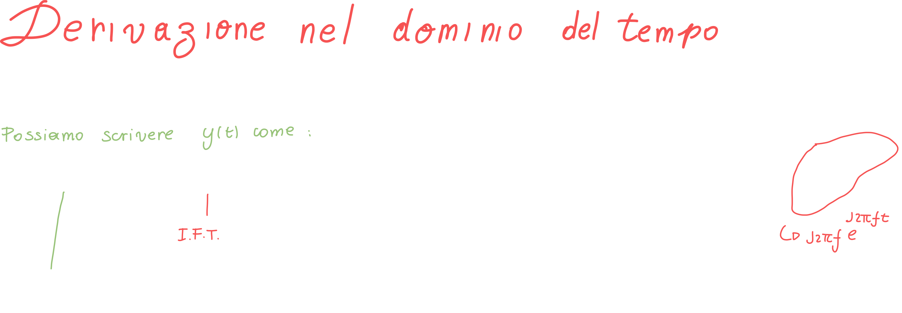

Siccome possiamo scrivere il segnale y(t) anche nel seguente modo:

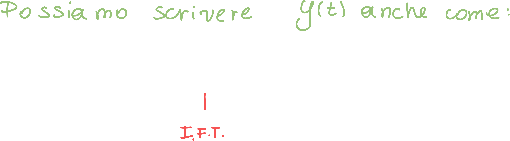

Quando andiamo ad eguagliare le due espressioni troviamo:

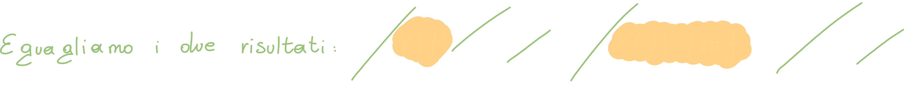

È quindi evidente che il "contenuto" degli integrali può essere eguagliato, e che quindi lo spettro del segnale di partenza è uguale allo spettro del segnale derivato moltiplicato per j2Pit:

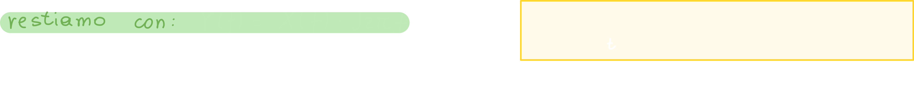

Questa dimostrazione vale per la derivata prima, ma possiamoe stendere il concetto per la derivata n-esima:

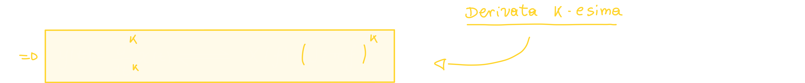

**<u>ATTENZIONE</u>**
Dobbiamo fissare bene questo concetto: "abbiamo *un segnale y che è la derivata di un altro segnale x*" vuol dire che se vogliamo applicare questa proprietà **dobbiamo integrare il segnale y per trovare il segnale x del quale il segnale y è la derivata!**

Solo dopo possiamo applicare la proprietà...

### Esempio di derivazione di un segnale

Fissiamo il concetto facendo un esercizio:

Abbiamo un segnale triangolare; dobbiamo trovarne la derivata

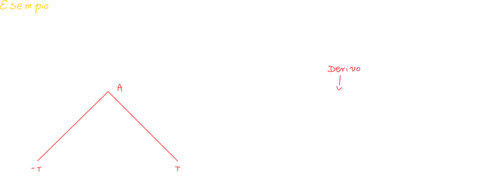

Il grafico del segnale derivato è il seguente:

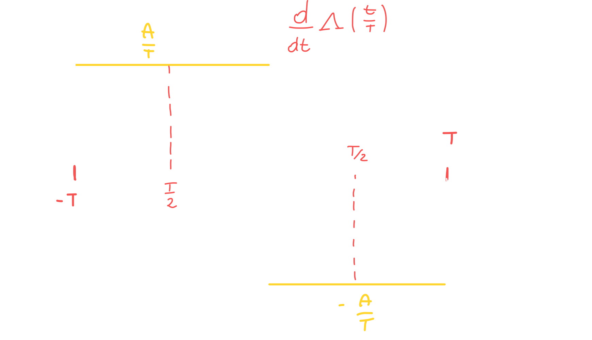

Ci andiamo a riscrivere quindi la derivata del segnale triangolare come la somma di due rect, una positiva anticipata e l'altra negativa ritardata:

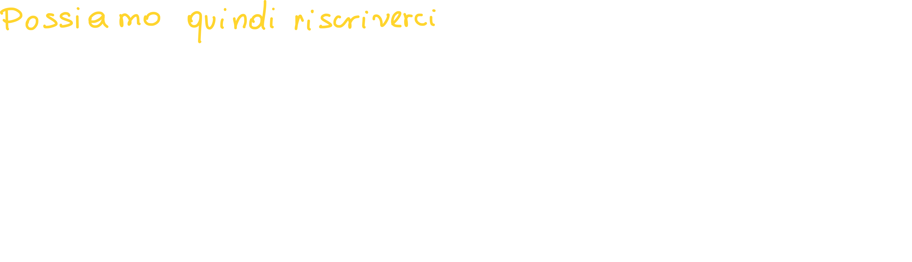

### Esempio di applicazione della proprietà di derivazione

Passiamo ora ad un esempio della proprietà in sé; abbiamo un segnale composto dalla somma di due segnali rettangolari (sì, quello appena trovato!), e sappiamo per certo (perchè l'abbiamo appena calcolato!) che è la derivata di un segnale triangolare, di conseguenza possiamo applicare la proprietà:

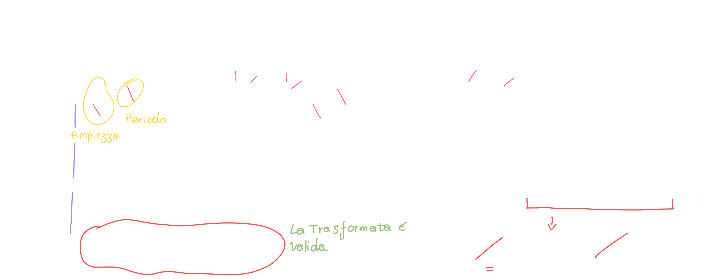

Per convincerci che la trasformata della derivata di un segnale triangolare è proprio una sinc al quadrato, moltiplichiamo e dividiamo per pi\*f\*T:

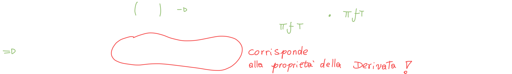

Ecco trovato che la trasformata della derivata di un segnale triangolare è proprio lo spettro del segnale triangolare moltiplicato per j\*2\*pi\*f, confermando la proprietà!

---

Le proprietà da questo momento in poi sono state viste nella lezione 3.2.5

## 13. Derivazione nel dominio della frequenza

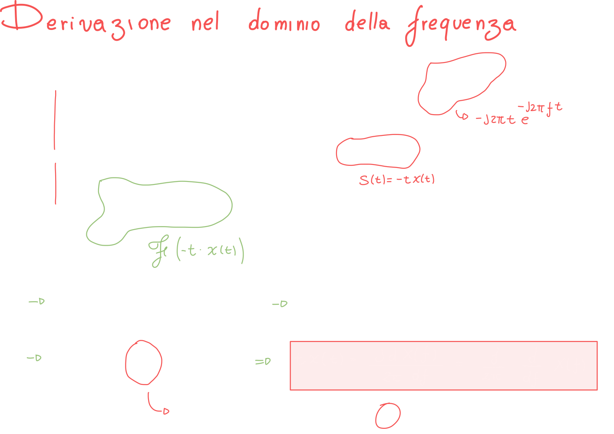
