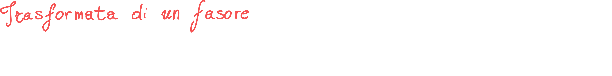
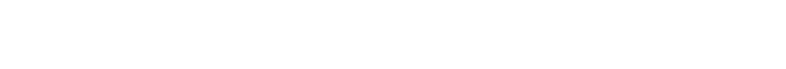
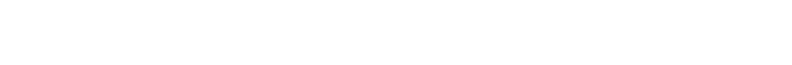
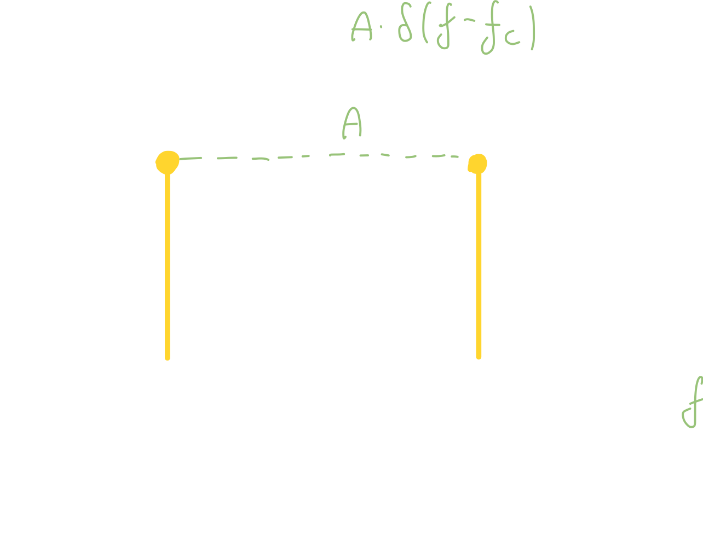
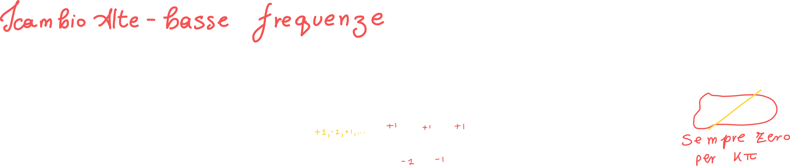
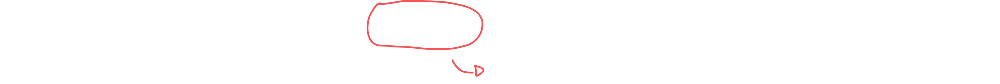
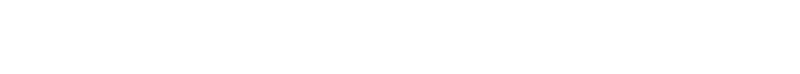
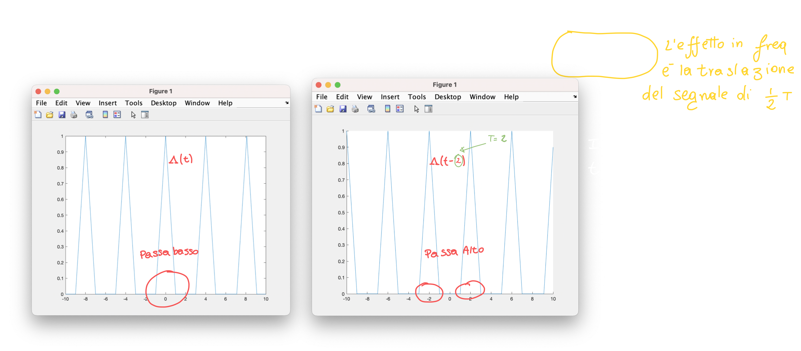

# Proprietà della trasformata 2

Tutte le proprietà viste in questa lezione sono riportate nel file 3.2.3 - Proprietà della trasformata

# Trasformata di un fasore

Proviamo ad effettuare la trasformata di Fourier di un fasore:

Sappiamo che un qualsiasi segnale moltiplicato per un fasore di frequenza fc, trasformato, in frequenza sarà composto dallo spettro del segnale (quello moltiplicato per il fasore) **shiftato temporalmente**; possiamo sfruttare questa proprietà proclamando l'ampiezza del fasore **segnale a tutti gli effetti** (segnale costante), e quindi:

La trasformata del segnale costante è proprio un segnale delta di Dirac di ampiezza A:

Otteniamo che **la trasformata del fasore è proprio una delta di dirac, di ampiezza A e <u>centrata</u> in fc!**

Andando a graficare otteniamo:

# Scambio alte-basse frequenze

Quando abbiamo l'espressione (-1)n possiamo scriverlo come **cos(π n)**, perchè?

Semplicemente perchè il coseno assume proprio valori {1, -1, 1, -1, ...} per valori di **π n**!

Se dividiamo 'n' per 'T' (periodo) possiamo "decidere" ogni quanti valori di Pi il segnale deve ripetersi:

Se poniamo la frequenza discreta Ni come 1/2T otteniamo:

Conosciamo la proprietà di modulazione del coseno, quindi quando trasformiamo un segnale moltiplicato per un coseno, avremo lo sdoppiamento degli spettri del segnale:

Possiamo creare un filtro passa alto o passa basso a seconda del **periodo** della finestra!

