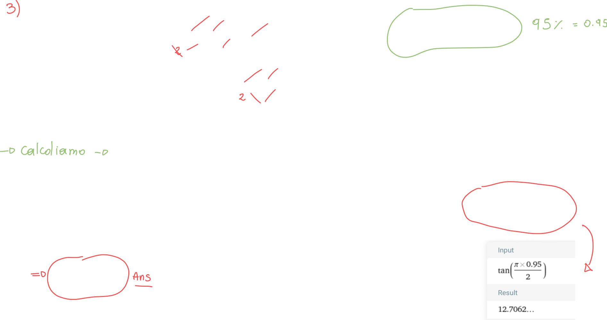

# Relazione di Parseval

[TOC]

La relazione di Parseval è una **teoria matematica** che afferma che **l'energia di un segnale** può essere calcolata sia integrando il modulo quadro del segnale nel dominio del tempo, sia integrando il modulo quadro **dello spettro** nel dominio della frequenza!

Vediamo perchè:

La prima cosa da fare è scriverci la formula dell'energia, esplicitiamo il modulo quadro e successivamente cerchiamo di calcolare la trasformata inversa di Fourier applicando la definizione:

Sostituiamo quindi al segnale x la sua forma scritta in termini di trasformata inversa:

Otteniamo un integrale all'interno dell'integrale iniziale; siccome è un segnale di energia possiamo scambiare l'ordine degli elementi all'interno degli integrali:

Ma notiamo che (ponendo il segnale all'interno del secondo integrale ed il suo spettro fuori), "salta fuori" proprio lo spettro del segnale (non coniugato!
Scriviamoci questo integrale come lo spettro del segnale x:

Notiamo che Lo spettro di x moltiplicato per lo spettro di x coniugato **non è altro che il modulo quadro dello spettro di x!**

## Morale della favola

Abbiamo capito quindi che possiamo scrivere l'energia di un segnale sia come l'integrazione del suo segnale in modulo quadro, sia come integrazione del **suo spettro** in modulo quadro; questo è molto importante, perchè ci dice che **l'energia viene conservata** indipendentemente dal dominio in cui ci troviamo!

# Densità spettrali

## Densità spettrale di energia

Definiamo la densità spettrale di energia per **segnali di energia** (segnali limitati come le finestre) ed è proprio il modulo quadro dello spettro del segnale:

### Proprietà della densità spettrale di energia

1. Per segnali reali, la densità spettrale di energia sarà **pari**:
   
2. La densità spettrale di energia **è invariante temporalmente**; questa proprietà ci dice che il **modulo** del segnale non varia quando effettuiamo la trasformata:
   
3. Funzione di trasferimento di energia: questa funzione corrisponde alla "densità spettrale" della risposta impulsiva:
   

## La banda

La banda è essenzialmente un "range di frequenze" a cui si fa riferimento quando si parla di segnali nel dominio della frequenza:

### Esempio: calcolare la percentuale di energia conservata in una data banda

Prendiamo come esempio un impulso rettangolare, che in frequenza corrisponde ad una sinc:

Il prossimo passaggio è quello di trovare la densità spettrale di energia del segnale:

Dopo aver trovato Sx(f) possiamo proseguire a calcolare la percentuale di energia che si conserva in un dato intervallo (banda):

Abbiamo scelto gli estremi come (-K/T, K/T) perchè corrispondono ai primi "zeri" della sinc:

A questo punto non ci resta che rispolvere l'integrale normalmente:

Poniamo K={1,2,...N} e controlliamo per quale valore di K (e quindi per quale banda) si conserva almeno il 99% dell'energia:

Notiamo che solo per K=10 otteniamo una conservazione dell'energia pari al 99%; questo vuol dire che la banda che ci consente di racchiudere il 99% dell'energia è data dall'intervallo: (-10/T, 10/T)

### Esempio: Calcolare la banda che consente di conservare il 95% dell'energia

Il segnale in questione questa volta è l'esponenziale monolatero decrescente:

Teniamo pronte la trasformata del segnale e la sua energia; la prima cosa da fare è trovare la densità spettrale:

Siccome conosciamo la formula dell'energia, cerchiamo di isolarla dalla densità spettrale in modo da facilitare i calcoli successivamente. A questo punto non ci resta che calcolare l'energia in un intervallo generico (banda):

Abbiamo i due "pezzi" che ci servivano, procediamo a calcolare la frazione ponendo il tutto uguale all'energia richiesta, ovvero 95%:

Ci viene fuori che la banda richiesta affinchè si conservi il 95% dell'energia del segnale iniziale è 12.7/T.

## Densità spettrale di potenza

Quando abbiamo ricavato la densità spettrale di energia, abbiamo sfruttato l'uguaglianza di Parseval; non possiamo fare lo stesso anche con i segnali di potenza perchè l'uguaglianza di Parseval si applica **solo a segnali di energia**, mentre i segnali di potenza hanno energia infinita.

Possiamo però sfruttare un "trucco" per applicare l'uguaglianza anche in questo caso: ci basta ricordare la definizione di potenza e, ovviamente, l'uguaglianza di Parseval:

A questo punto possiamo **finestrare il segnale di potenza** con un segnale finestra rettangolare, e sapremo che la trasformata di questo segnale sarà lo spettro del segnale di potenza **di periodo T**:

Andiamo a calcolare la potenza di questo segnale; solo a questo punto **applichiamo l'uguaglianza di parseval**, scrivendo:

A questo punto ci basta solo portare il limite all'interno dell'integrale per vincere:

 

Siccome <u>per definizione</u> **la densità spettrale è quella quantità che integrata ci dà l'energia**, possiamo battezzare il limite appena ottenuto **densità spettrale di potenza**:

# Densità spettrali mutue

Come abbiamo visto che esiste la **mutua correlazione**, esistono anche le densità spettrali mutue.

## Densità spettrale di mutua energia

Possiamo rispolverare la definizione di energia, sia per segnali a tempo continuo che a tempo discreto; usiamo poi Parseval per trasformare il tutto in frequenza:

Ancora una volta per il discorso usato nella densità spettrale di potenza, la densità spettrale è quella quantità che integrata ci restituisce l'energia, quindi:

## Densità spettrale di mutua potenza

Ancora una volta dobbiamo ricorrere ad un "trick" per poterci calcolare la densità spettrale di mutua potenza, siccome non possiamo usare Parseval direttamente:

Andiamo ad applicare un filtro e successivamente integriamo:

Anche in questo caso portiamo il limite dentro l'integrale e lo battezziamo densità spettrale di mutua potenza:

Possiamo fare lo stesso ragionamento per segnali di potenza **a tempo discreto**:

# Relazione tra Mutua Correlazione e Densità Spettrale Mutua - Teorema di Wiener-Kintchin

Abbiamo una relazione molto importante tra queste due quantità:

Oppure, in formule (più semplicemente):

La dimostrazione comprende degli integrali doppi e sopratutto **non è argomento di esame**, e per questo motivo, ce la saltiamo.

