# Legami input - output per densità spettrali

[TOC]

Questo discorso sarà molto simile a quello fatto per la **correlazione** nella lezione `3.1.3 - Legami Input Output correlazione`, infatti:

Possiamo scrivere la relazione in/out tra due sistemi separati in termini di mutua correlazione:

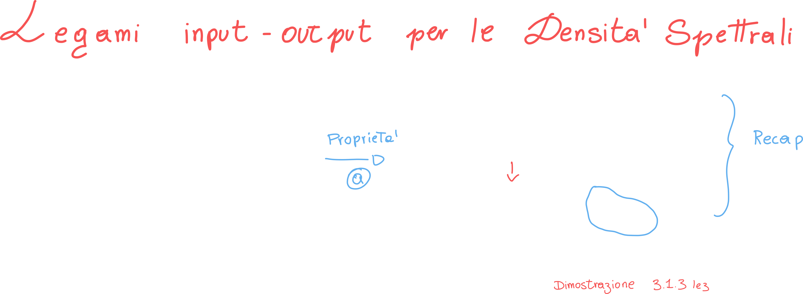

Tutte le relazioni viste in termini di correlazione, possono essere scritte in termini di **densità spettrale**:

## Densità spettrale mutua dell'uscita

La densità spettrale dell'uscita è uguale alla **funzione di trasferimento mutua** (ovvero il corrispettivo della risposta in frequenza mutua per la densità spettrale -> modulo del prodotto delle risposte in frequenza) moltiplicata per la densità spettrale del segnale in ingresso:

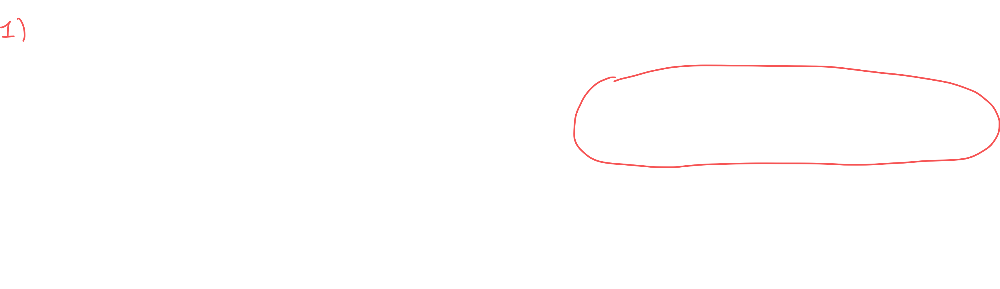

## Densità spettrale dell'uscita

In questo caso l'output è più semplice, la funzione di trasferimento non è più mutua, e quindi possiamo "riassumerla" nella risposta in frequenza **in modulo quadro**, moltiplicata per la densità spettrale del segnale in ingresso:

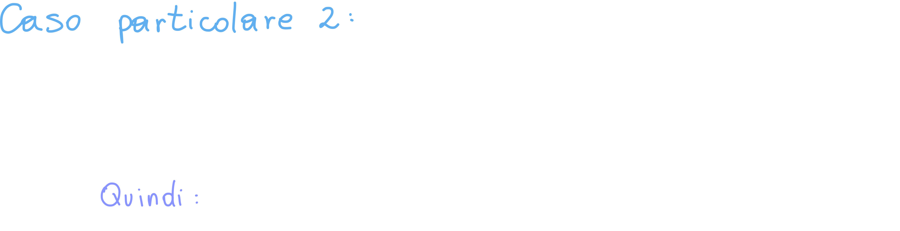

## Densità spettrali mutue

In questo caso abbiamo in uscita una densità spettrale **mutua**

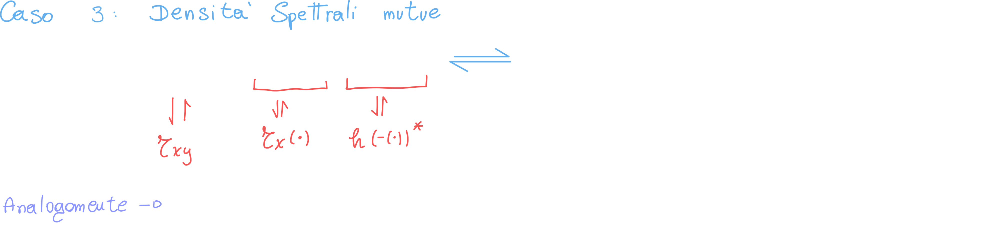

## Esempio: Rumore Termico

Si dice che il rumore termico abbia uno **spettro bianco**, proprio perchè la distribuzione di ampiezza del segnale **uniforme su tutte le frequenze**; questo si traduce nel fatto che **la densità spettrale di potenza del rumore termico è costante su tutte le frequenze**.

Possiamo dire che **lo spettro del rumore termico** dipende dalla costante di Boltzmann e dalla **temperatura**:

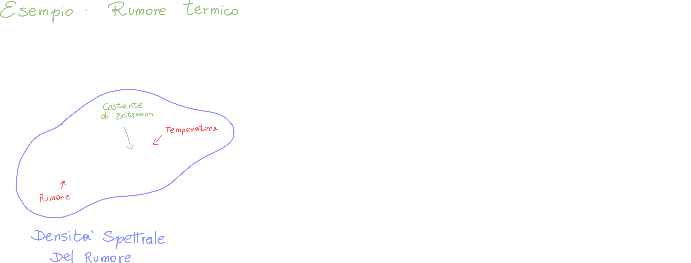

Siccome la densità spettrale del rumore termico è costante, possiamo dire che anche il suo spettro lo è (per alcune frequenze):

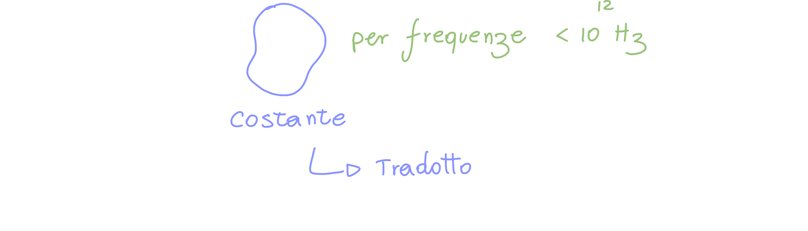

### Autocorrelazione del rumore termico

Proviamo a calcolare l'autocorrelazione del segnale "rumore termico" usando l'uguaglianza di Wiener-Kintchine:

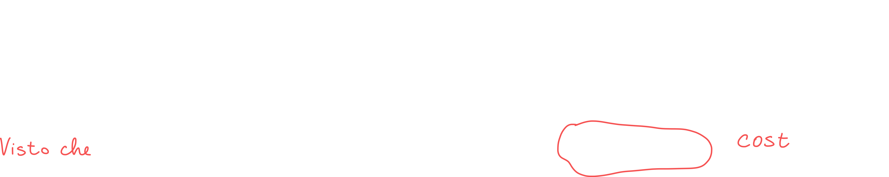

Sappiamo che la trasformata di un segnale costante è una delta di ampiezza pari a quella del segnale:

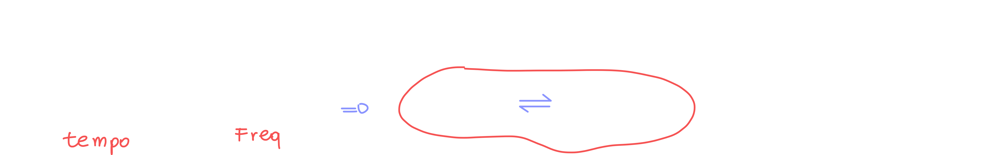

### Potenza in uscita ad un sistema avente risposta in frequenza H(f)

Il setup è il seguente: abbiamo in ingresso il rumore termico; questo viene moltiplicato per la risposta in frequenza del sistema per ottenere in uscita il segnale x(t):

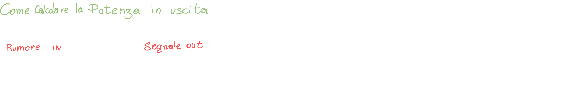

Possiamo sfruttare le uguaglianze scoperte finora per trovarci l'autocorrelazione del segnale in uscita; sappiamo che l'autocorrelazione di un segnata valutata in zero ci restituisce l'energia/potenza del segnale:

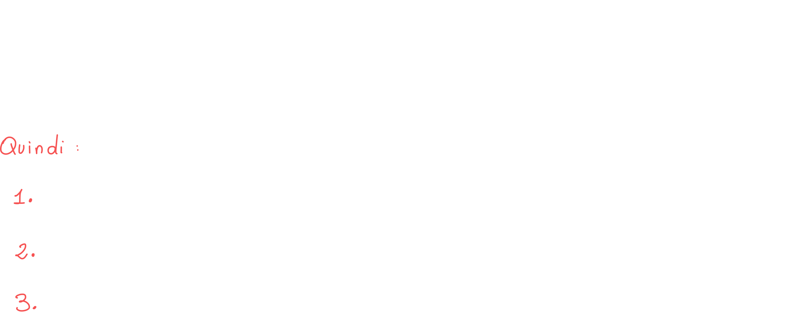

Abbiamo visto che la densità spettrale di potenza del rumore è una costante, quindi:

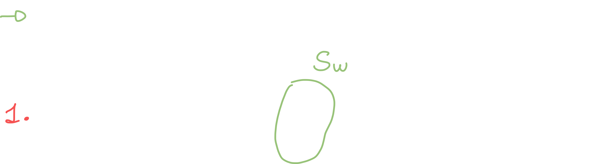

A questo punto spolveriamo Wiener-Kintchine che ci dice che la densità spettrale di un segnale trasformata corrisponde all'autocorrelazione; ci basta trasformare per ottenere:

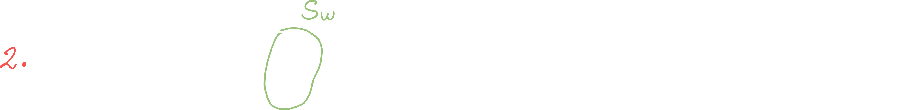

Prima di risolvere l'integrale (non vedevi l'ora eh?), semplifichiamoci la vita e poniamo subito Tau = 0 (per calcolare la potenza):

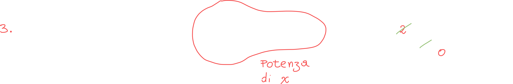

### Banda Di Rumore

La banda di rumore è essenzialmente il range di frequenze in cui si trova **il rumore termico**. Di conseguenza il segnale sarà disturbato dal rumore in quella determinata banda.

La banda di rumore **monolatera** può essere scritta come:

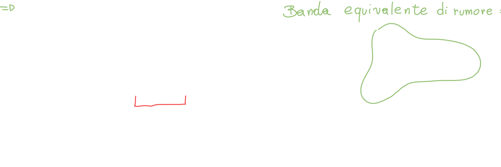

Ci accorgiamo che la banda equivalente di rumore e la nostra potenza condividono lo stesso integrale; la banda, però, è divisa per il modulo quadro della risposta in frequenza valutata in f0; ci basta quindi moltiplicare per questo valore per sostituire la banda equivalente di rumore all'interno della potenza:

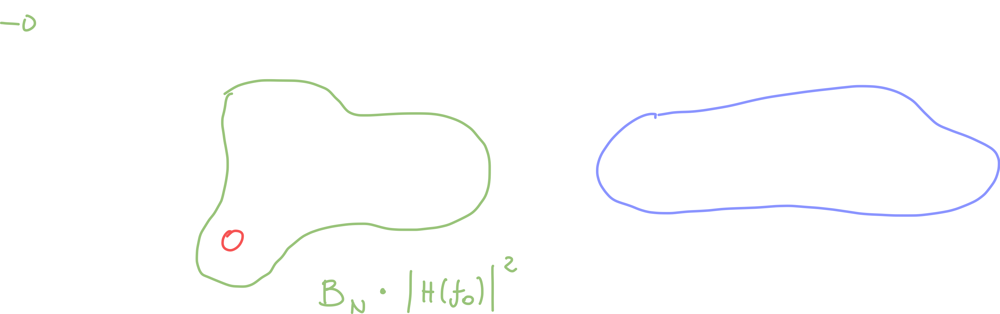

Capiamo che la banda di rumore è proprio la **banda del filtro ideale avente lo stesso guadagno H(f0**) di centro banda e la cui funzione di trasferimento dell'energia sottende la stessa area.

Nella pratica abbiamo:

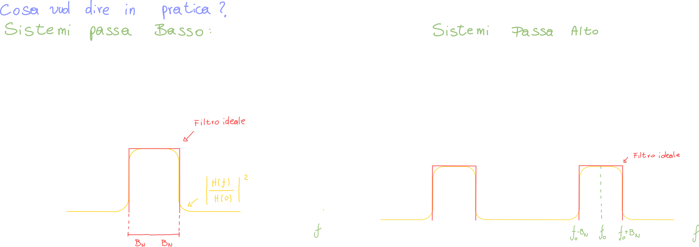

#### Banda di rumore a partire dalla risposta impulsiva

Possiamo scriverci la banda di rumore sottoforma di risposta impulsiva, visto che la risposta in frequenza non è altro che la trasformata della risposta impulsiva:

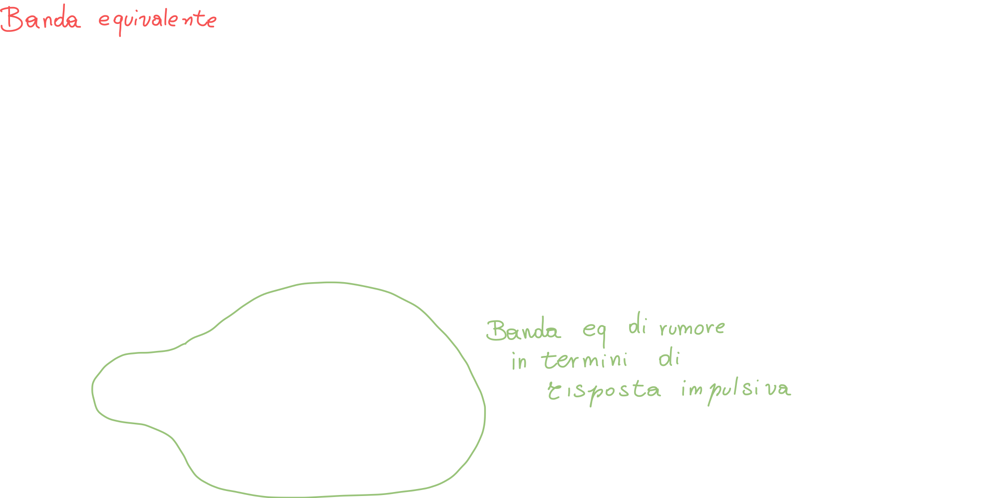