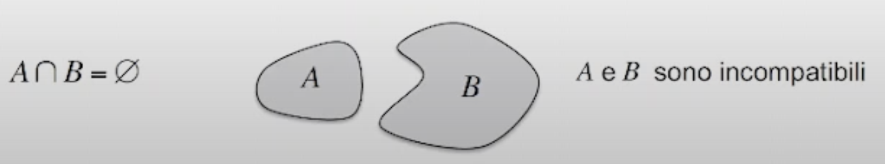
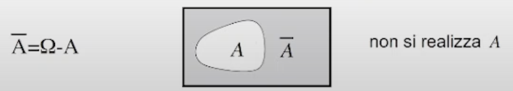
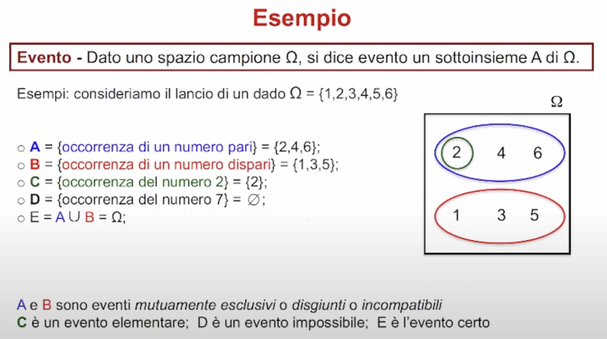
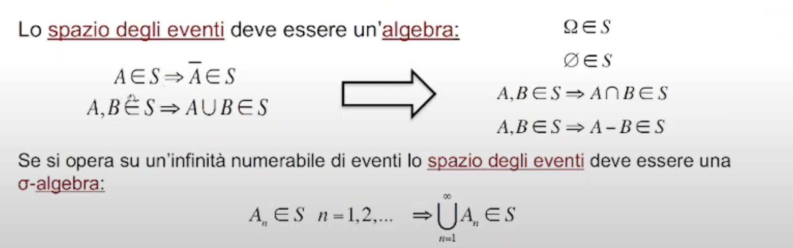
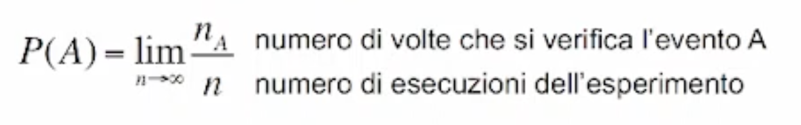

# Recap Generale

## Fenomeni aleatori

Tutti i fenomeni che non sono prevedibili in maniera deterministica, sono detti fenomeni aleatori.

Sono esempi di fenomeni aleatori:

- Lancio di una moneta
- Fluido gassoso
- Arrivo di utenti ad uno sportello

L'esperimento aleatorio è una procedura sperimentale con una serie di possibili **uscite** dell'esperimento che **non sono prevedibili**.
Si va quindi a definire un **modello matematico**:

### Spazio campione

lo spazio campione è un insieme omega (finito o infinito) di tutti i possibili risultati omega di un esperimento aleatorio; ad esempio, lo spazio campione dell'esperimento aleatorio "lancio di una moneta" sarà: omega = {T, C}.

### Evento

L'evento è "quella frase" su cui poi andiamo a calcolare la probabilità; ad esempio possiamo dire che un'uscita sperimentale **realizza un evento** A, quando essa appartiene al sottoinsieme dello spazio dei campioni:

Inoltre se A è incluso in B, vuol dire che A implica B:

Quando due eventi non hanno intersezione si dicono **incompatibili**:

Un concetto molto importante è **il concetto di negato di un evento:** il negato di A è l'insieme dei campioni meno l'insieme A:

### Esercizio di esempio sui fenomeni aleatori

> L'evento C viene detto **evento elementare** perchè è costituito da una sola uscita elementare.
>
> L'evento D viene detto **evento impossibile**, perchè 7 non appartiene alle uscite possibili.
>
> L'evento E viene detto **evento certo** perchè costituisce tutto lo spazio dei campioni.

### Spazio degli eventi

Lo spazio degli eventi è una classe **S** (collezione di insiemi) di tutti gli eventi di interesse; abbiamo le seguenti implicazioni:

## Legge di probabilità

Abbiamo 3 modi per definire la probabilità:

### Approccio classico

È un approccio intuitivo:

In un dado abbiamo 6 possibili uscite elementari possibili; definiamo la probabilità che un evento si verifichi andando a contare i casi favorevoli diviso il numero totali di risultati possibili.

Quando facciamo questa operazione facciamo delle ipotesi impliciti:

- Le uscite sono **equiprobabili**
- Le uscite sono **finite**

Queste assunzioni sono proprio  gli **aspetti negativi di questo approccio**, ovvero:

- Si applica  solo a fenomeni con risultati equiprobabili
- presuppone un numero finito di risultati possibili
- la definizione è circolare perchè utilizza la nozione di probabilità per definire la probabilità stessa

### Approccio frequentista

Impossibile da realizzare nella realtà: non possiamo realizzare un esperimento infinite volte.

### Approccio Assiomatico

Definiamo una funzione P

