# Guida MATLAB

In questo file vengono coperte tutte le nozioni basilari necessarie ad utilizzare MATLAB per visualizzare/operare i segnali.

[TOC]


## Comandi base

### Dichiarazione di variabili e stampa a video

```matlab
a = 1;				% dichiarazione di una variabile
b = 2;

c = a + b;		% una variabile può essere dichiarata anche a partire da altre due (o più) variabili

c	 						% stampa il valore di c
disp(c);			% stampa il valore di c


```

### Il comando clc

Il comando `clc` serve a pulire l'output:

```matlab
clc						% pulisce l'output

disp(c);			% stampa il valore di c
```

> Anche se puliamo l'output, il valore delle variabili non viene pulito; questo vuol dire che se proviamo a stampare il valore di c (dopo averlo inizializzato prima del comando clc), questo sarà ancora presente.

### Il comando clear all

Il comando `clear all` serve a "pulire" tutte le variabili:

```matlab
a = 2;
a							% stampa il valore di a: >> a = 2

clear all			% ripulisce le variabili

a							% >> Undefined function or variable 'a'.
```

### Il comando figure

Il comando `figure` serve a creare una finestra di visualizzazione:

```matlab
figure(1);		% crea una finestra di visualizzazione
```

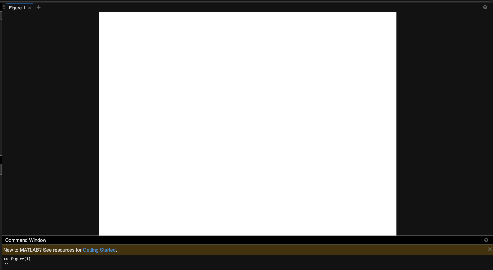

### Il comando close all

Il comando `close all` serve a chiudere <u>tutte</u> le finestre.

```matlab
close all
```

### Dichiarare un array

Un array può essere dichiarato in diversi modi

```matlab
arr = [1 2 3];		% >> arr = 1 2 3
```

> Dichiarazione di un array in modo esplicito

```matlab
arr = 1:10				% >> arr = 1 2 3 4 5 6 7 8 9 10
```

> Dichiarazione di un array con un range

```matlab
arr = 1 : 2 : 10	% >> arr = 1 3 5 7 9
```

> Dichiarazione di un array con un range specificando lo "step"

### Il comando stem

Il comando `stem` è usato per **tracciare un segnale a sequenza discreta**.

```matlab
stem(asse_x, asse_y);
```

### Il comando (funzione) elevazione a potenza

Quando vogliamo elevare un numero alla potenza n, ci basta scrivere `a^n;`, ma solo se a **<u>è un numero</u>**.

Se a è un <u>array</u>, dobbiamo elevare **<u>ogni elemento di a alla potenza</u>**, quindi ci basterà usare il carattere `.`:

```matlab
a = 2;
a = a^2;
disp(a);			% >> 4

arr = [1 2 3];
arr = arr^2;		% >> ERROR!

arr = arr.^;		
disp(arr);			% >> [1 4 9]
```

### Funzione definita a tratti - piecewise function

Per definire una funzione continua a tratti possiamo passare per diverse strade:

#### Vettori

```matlab
clear all;
close all;
clc;

x1 = [-5: 0.1 : -3];
y1 = 2 * ones(size(x1));

x2 = [-3 : 0.1: 1];
y2 = exp(-x2);

x3 = [1: 0.1 : 5];
y3 = 3 * ones(size(x3));

x = [x1 x2 x3];
y = [y1 y2 y3];

plot(x, y);
```

Output:

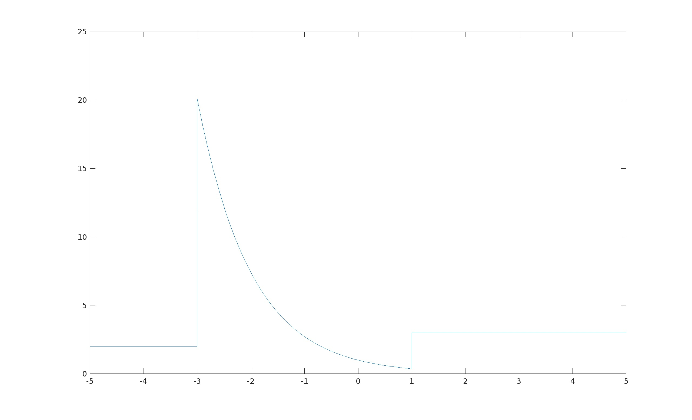

#### Con Syms e Piecewise

**Syms:** è usata per creare variabili simboliche scalari per funzioni e variabili simboliche vettoriali/matriciali per funzioni.

`syms x` definisce la variabile simbolica x.

**Piecewise:** è usata proprio per definire delle funzioni costanti a tratti:

`piecewise(cond1, funct1, cond2, funct2, ... , condn, functn);`

Esempio: `piecewise(x < 0, -1, x > 0, 1);`

```matlab
syms x
y = piecewise(x < 0, -1, x > 0, 1);
y_const = 0;
fplot(y);
hold on
fplot(y_const);
```

output:

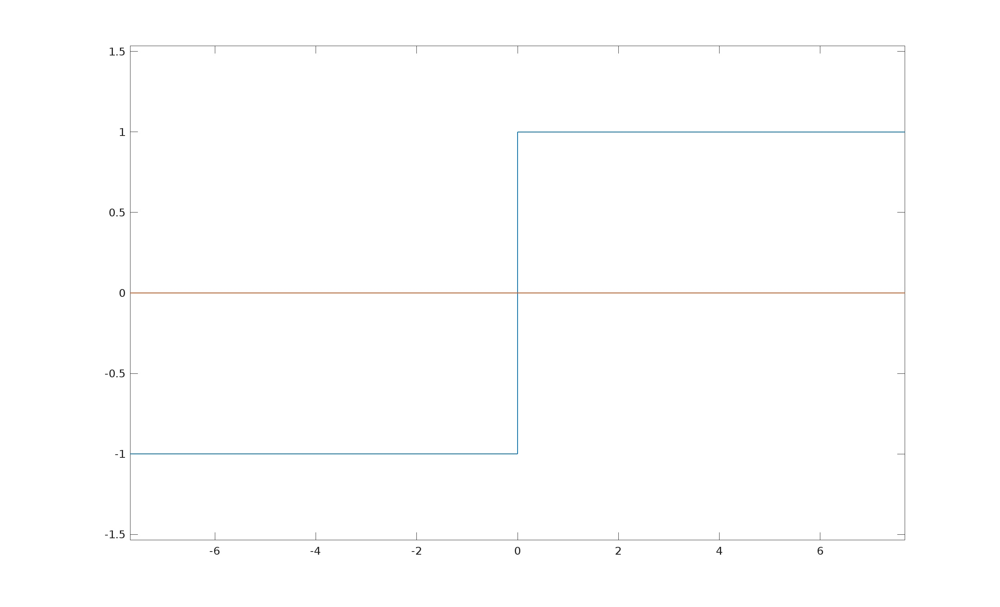


## Tracciare un segnale a tempo discreto

`esercizio_101`

```matlab
close all			% chiude le finestre

x = [1 -2 4 5];
n = [0 1 2 3];

figure(1);			% finestra vuota

stem(n, x)			% sequenza discreta
```

Output:

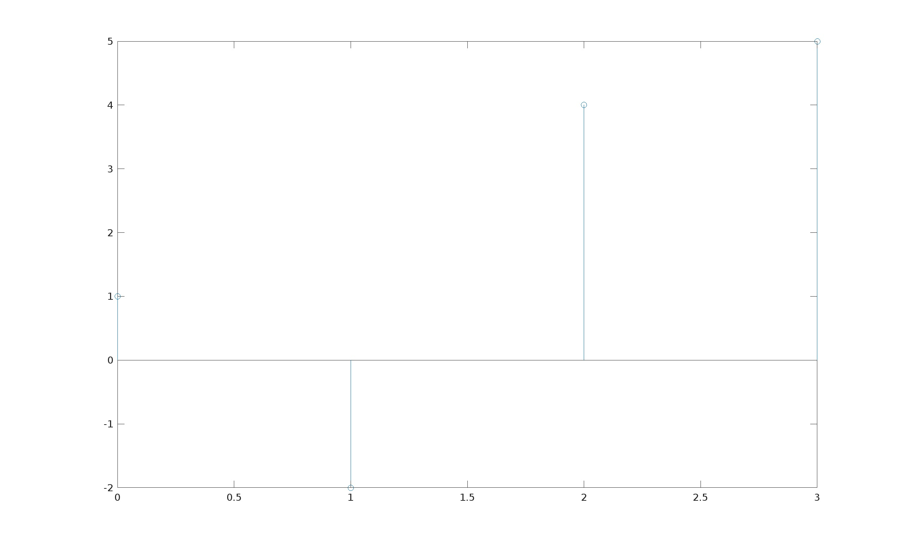

`esercizio_102`

```matlab
clear all

x = [1 2 3 4 5 3 4 5];
n = [3 4 5 6 7 8 9 10];

figure(1);

stem(n, x);
```

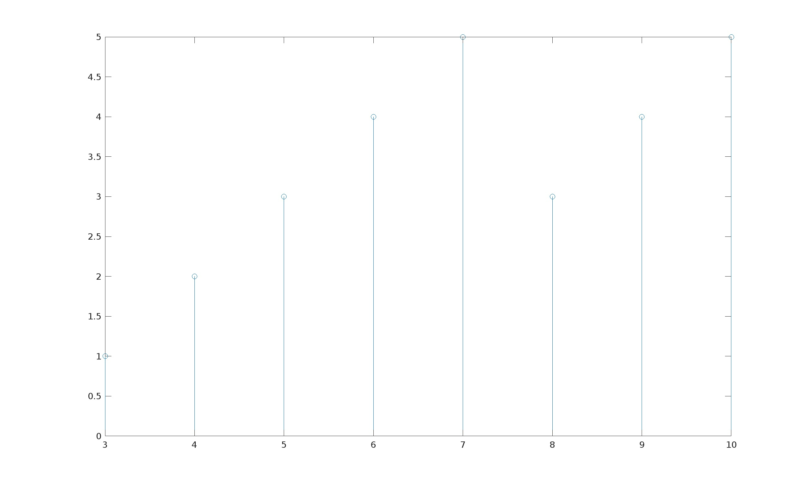

## Tracciare più di un segnale in una singola finestra (figure)

`esercizio_103`			**visualizzare due segnali sovrapposti**

```matlab
clear all
clc
figure(1);

x1 = [1 -2 3 4 5 6];
n = [0 1 2 3 4 5];

stem(n, x1);				% traccio il primo segnale

hold on

x2 = [1 3 5 7 9 3];

stem(n, x2);
```

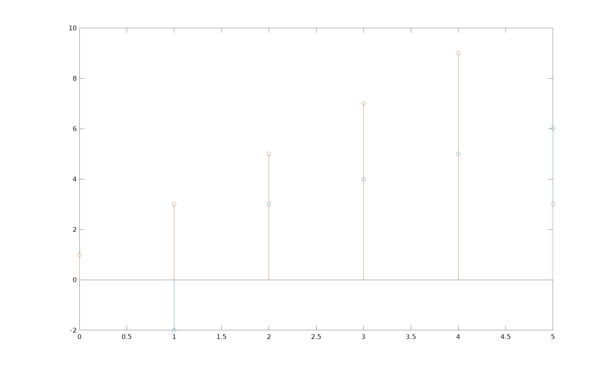

`esercizio_104`		**visualizzare due grafici in un'unica finestra**

```matlab
clear all
clc
figure(1);

x1 = [1 -2 3 4 5 6];
n = [0 1 2 3 4 5];

x2 = [1 3 5 7 9 3];

subplot(2, 1, 1);
stem(n, x1);

subplot(2, 1, 2);
stem(n, x2);
```

> Usando il comando `subplot(rows, columns, figure_number)`
>
> Questo comando permette di "dividere" la figure (finestra) in **righe e colonne** specificate dagli argomenti. Permette inoltre di posizionare un determinato grafico in una posizione data dal terzo argomento

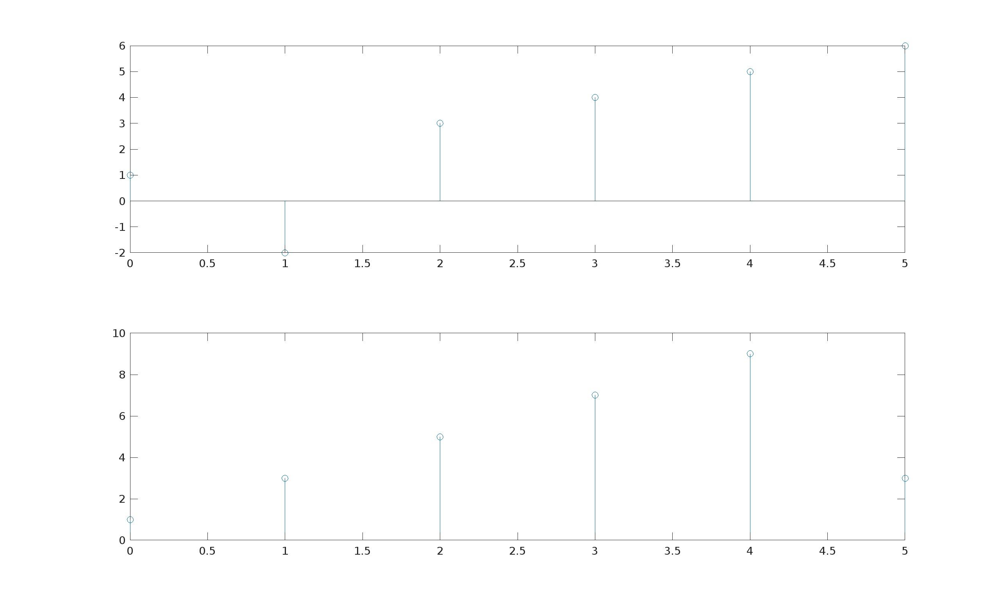

> Finestra divisa in 2 spazi (2x1)

Quindi il codice:

```matlab
subplot(2, 2, 1);
stem(n, x1);

subplot(2, 2, 4);
stem(n, x2);
```

ci permette di dividere la finestra in **4 spazi**, e di posizionare due grafici nella prima e quarta posizione, ottenendo:

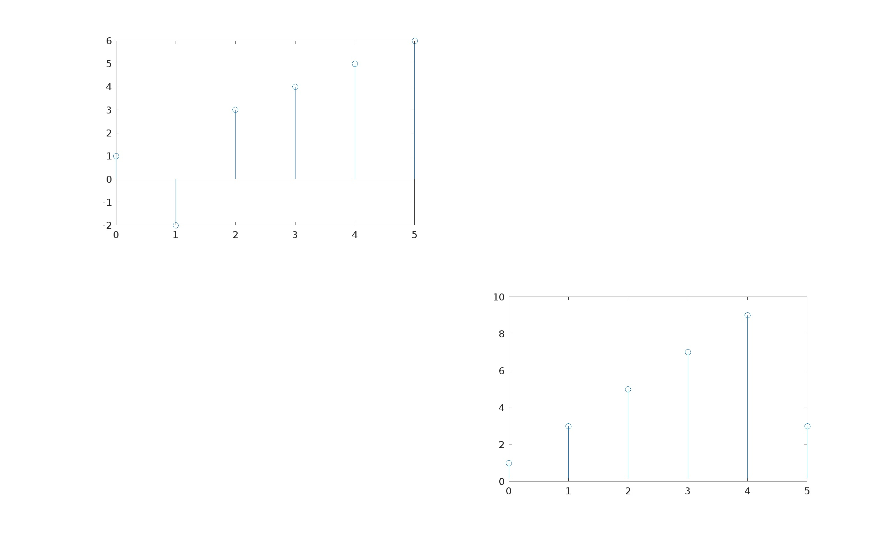

> Finestra divisa in 4 spazi (2x2)

## Tracciare una sinusoidale

Per tracciare un un qualsiasi segnale abbiamo bisogno di due variabili:

- Variabile dipendente
- Variabile indipendente 

Diamo un'occhiata a x(t), ovvero la variabile indipendente:

`x(t) = A * sin(2 * pi * f * t)` 

- A: ampiezza
- f: frequenza
- t: tempo --> capiamo che x(t) è una funzione del tempo, infatti il valore di x(t) dipende proprio dal tempo.

 ```matlab
 % tracciare la sinusoidale
 clc
 clear all
 close all
 
 A = 2;
 f = 3;
 t = 0 : 0.01 : 1;			% >> array da 0 a 1 con incrementi di 0.01
 
 x_t = A * sin(2 * pi * f * t)
 
 figure(1);
 
 subplot(2,1,1);
 stem(t, x_t);
 title('Segnale discreto di una sinusoide');
 xlabel('asse del tempo');
 
 subplot(2,1,2);
 plot(t, x_t);
 title('Segnale continuo di una sinusoide'); 
 xlabel('asse del tempo');
 ```

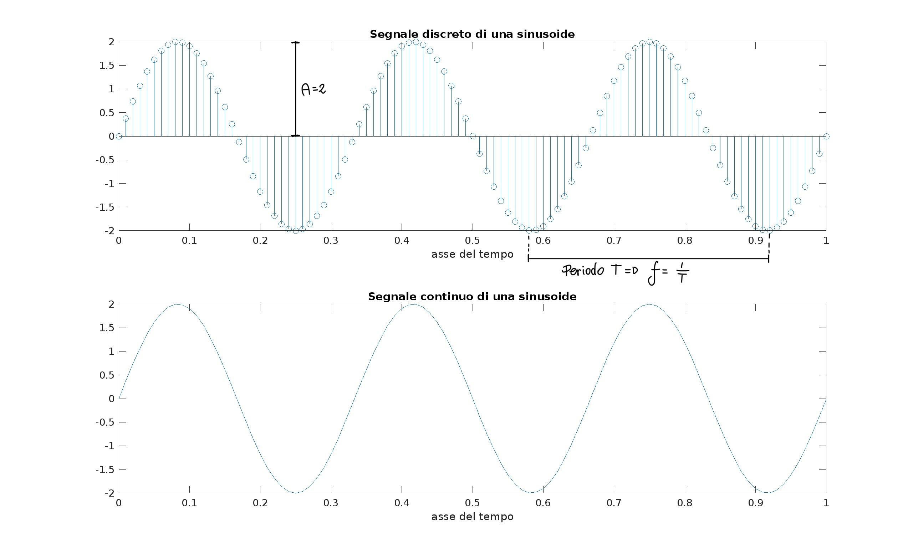

> Output


## Tracciare un segnale composto

Un segnale composto è un Segnale S ottenuto dalla somma di più segnali <u>SingleTone</u>:

- S = S<sub>1</sub> + S<sub>2</sub> + ... + S<sub>n</sub>

```matlab
clc
clear all
close all

figure(1);

% definizione del segnale composto

t = 0 : 0.001 : 1;							% tempo con incremento di 0.001

a1 = 2;
a2 = 3;											% ampiezze
a3 = 4;

f1 = 3; 										
f2 = 10;										% frequenze in Hz
f3 = 100;

x_1 = a1*sin(2 * pi * f1 * t);
x_2 = a2*sin(2 * pi * f2 * t);
x_3 = a3*sin(2 * pi * f3 * t);

x_compositeSignal = x_1 + x_2 + x_3;		% il segnale composto è definito come la somma di diversi segnali

subplot(4,1,1);
plot(t, x_1);
title('segnale single tone S1');

subplot(4,1,2);
plot(t, x_3);
title('segnale single tone S2');

subplot(4,1,3);
plot(t, x_2); 
title('segnale single tone S3');

subplot(4,1,4);
plot(t, x_compositeSignal);
title('Segnale composto da S1 + S2 + S3');
```

`esercizio_106`

Avremo come output:

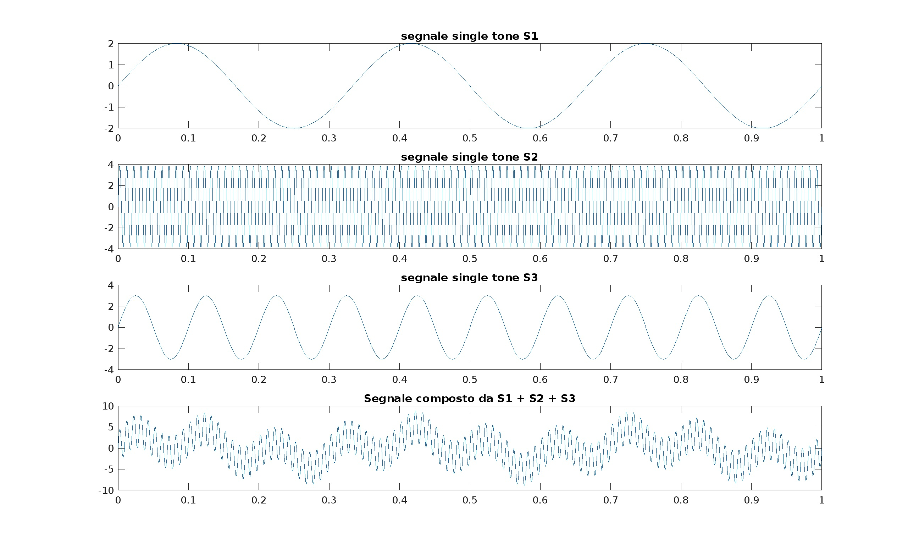

### Analizziamo il segnale composto

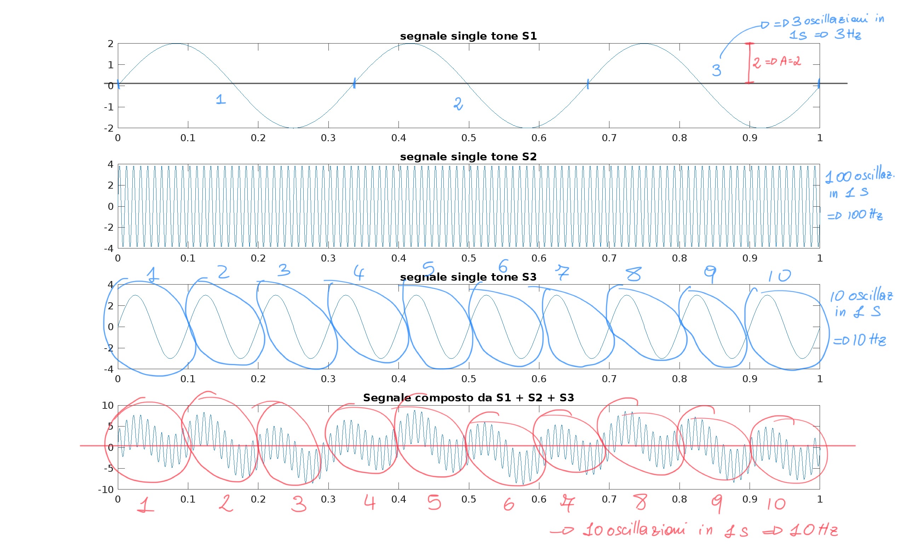

> Il secondo segnale è stato invertito con il terzo.

Dal codice abbiamo visto che i primi tre segnali sono composti dalla stessa ampiezza ma frequenze diverse:

- S<sub>1</sub> : 3 Hz
- S<sub>2</sub> : 10 Hz
- S<sub>3</sub> : 100 Hz

Notiamo che il primo segnale oscilla un totale di 3 volte in 1 secondo, il che lo rende un segnale avente una frequenza di 3Hz.

Il secondo oscilla 10 volte in un secondo-> 10Hz

Il terzo oscilla 100 volte in un secondo -> 100 Hz

Quindi il segnale risultante avrà:

- Frequenza "bassa" di 3Hz
- Frequenza "media" di 10Hz
- Frequenza "alta" di 100Hz


## Tracciare un segnale esponenziale

`esercizio_107`

```matlab
clc
clear all
close all

n = -100:100;			% siccome non possiamo usare 'infinito' usiamo 100, con uno step di 1
alpha = 0.9;			% se alpha > 1 il segnale è esponenzialmente crescente; se 0 < alpha < 1 il segnale è esponenzialmente decrescente

xn = alpha.^n;

figure(1);
stem(n, xn);
```

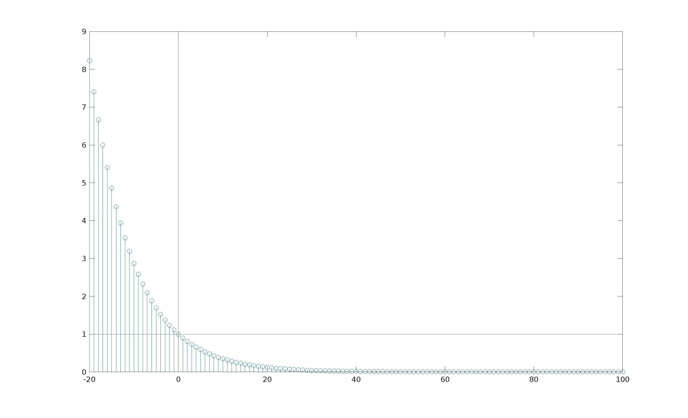

> Come possiamo vedere, il segnale in 0 vale 1.
>
> 0 < a < 1

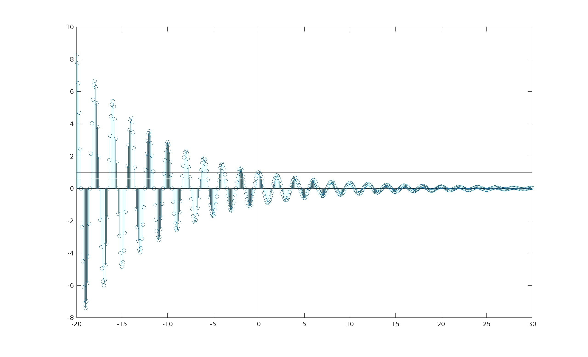

> Per valori di a < 0, il segnale oscilla
